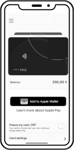
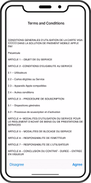
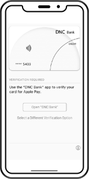
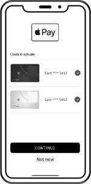
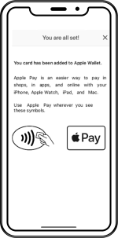
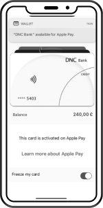
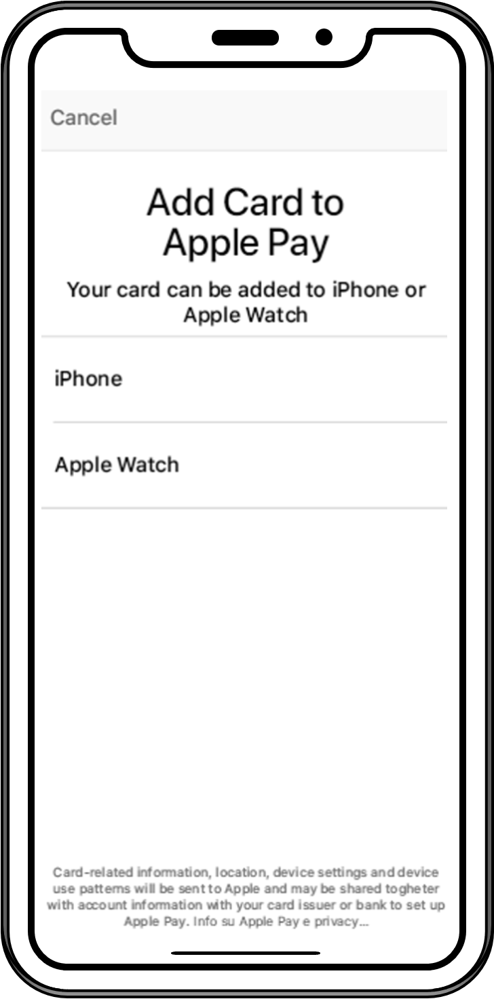
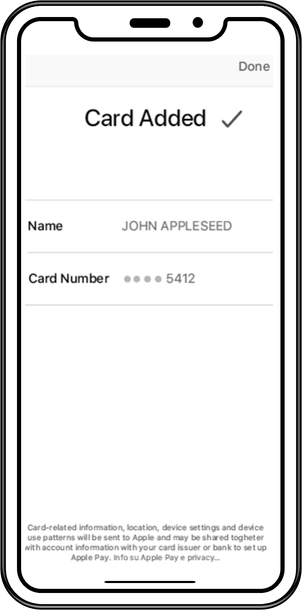

<!-- markdownlint-disable MD045-->
import Image from '@theme/Image';
import Highlight from '@theme/Highlight';
import Endpoint from "@theme/Endpoint"
import Cta from '@theme/Cta'

# X-Pay

## Flow 1: Enrollment from X-Pay wallet

This flow starts **from the digital wallet app**. The cardholder starts enrollment by scanning or entering the card information.

### Green path vs. Yellow path

At the start of the enrollment, Apple assesses the cardholder risk.
This risk level trigers these paths:

* <span style={{color: 'green'}}> ■</span> green path (a.k.a green flow): Apple approves the provisioning request autonomously
* <span style={{color: 'yellow'}}>■</span> yellow path (a.k.a yellow flow): Apple asks the partner for a strong customer authentication
* <span style={{color: 'orange'}}>■</span> orange path (a.k.a orange flow): Xpollens declines the provisioning request
* <span style={{color: 'red'}}>   ■</span> red path (a.k.a red flow): Apple declines the provisioning request

Only green and yellow paths are described below.

### User journey

|<span style={{color: 'green'}}>■</span><span style={{color: 'yellow'}}>■</span>green and yellow paths <br /> [](iOS_IAP_01_add_to_apple_wallet.png) <br /> 1. Scan or enter card number|<span style={{color: 'green'}}>■</span><span style={{color: 'yellow'}}>■</span>green and yellow paths <br /> [](iOS_IAV_02_exp_cvv.png) <br /> 2. Enter expiry date and CVV | <span style={{color: 'green'}}>■</span><span style={{color: 'yellow'}}>■</span>green and yellow paths <br /> [](iOS_IAV_03_read_accept_T&C.png) <br /> 3. Read and accept T&C<sup> [1](./CGU%20Apple%20Pay.pdf) [2](CGU%20Google%20Wallet.pdf) [3](CGU%20Samsung%20Wallet.pdf)</sup>|
|:---|:---|:---|
| <span style={{color: 'yellow'}}>■</span> yellow path only <br /> [](iOS_IAV_04_choose_verification_method.png) <br /> **4. Choose verification method <br /> (call center, in-app, OTP SMS)** | <span style={{color: 'yellow'}}>■</span> yellow path only <br /> [](iOS_IAV_05_open_partner_app.png) <br /> **5. Open partner app** | <span style={{color: 'yellow'}}>■</span> yellow path only <br /> [](iOS_IAV_06_log_in_partner_app.png) <br /> **6. Log in to the partner app** |
|<span style={{color: 'yellow'}}>■</span> yellow path only <br /> [](iOS_IAV_07_choose_which_cards_to_activate.png) <br /> **7. Choose which card(s) to verify** |<span style={{color: 'yellow'}}>■</span> yellow path only <br /> [](iOS_IAV_08_confirmation_message.png) <br /> **8. Apple-Pay Enrollment confirmation message** |<span style={{color: 'green'}}>■</span><span style={{color: 'yellow'}}>■</span>green and yellow paths <br /> [](iOS_IAV_09_confirmation_notification.png) <br /> **9. Apple-Pay Enrollment confirmation notification** |

Please note that step 4. must include in-app and OTP SMS (partner must implement an SMS server).

### Sequence diagram (green path)

[](https://mermaid.live/edit#pako:eNp1ks1q3DAQx19l0GkD3m3srO1YlIXQ5FhYaElD8GVszSYitqToI8Rd9iH6BL30AfsIldfOYUmqg5DmP_zmc89aLYhx5ug5kGrpWuKDxb5WGLxWoW_I1griMWi9bKVB5eHv719_4EaJZXAfyXfLLQ5grH6R4kPd6K4j5d4r2_hWZBcNtk9LUuLs_y5XxszqdJ_ktNxsTpPg0GJPFsG1qEBb6FEF7EAqEzzoXZStAEEeZefgc2M_bWAxlZ8AvRppBxDoKYEvt7dz3NMIY8i5Lg7b0eikVkqqhxEHI09ocqA0yN5g64HmZKHBDmPr3Rt3xkTiu35w-EHNo9ZP8H0wBFkOC-fRBwdXrZcvFBEsYbHSHqWIY92PyJr5R-qpZjw-Be0wdL5mtTpE12DGsm6E9Noy7m2ghI2j_zao9u0_-cybwfgOOxetcRqM79kr4-t0VVQXVX6epRdpVhRlwgbG07JardOsvFyv08uqiNohYT-1joR0lZV5WVRFXqR5mRbFkXZ_1KaQdEzo67SbxxU9_AOWHuTq)

### Sequence diagram (yellow path)

[](https://mermaid.live/edit#pako:eNrNVNuK2zAQ_ZVBTyk4WzmXxmvKQkiXdqGFwG63peRlYk02IrakSnJYd8lH9Av60g_sJ1S-ZGlIAvtYg43kGZ05c2Y0TyzTgljKHH0vSWX0TuKDxWKhsPRalcWS7EJBeAxaLzNpUHn48-vnb7hWol-6U-av_TlWYKzeSnHSbnSek3LHlnlYK7K9JWabPinx6rzL1JjO2n4POPWvrg5JpJBhQRbBZahAWyhQlZiDVKb0oFfBbAUI8ihzB2-X9vUV9Nr0I6BHI20FAj1FMLu_7-IeRqhDdnmlMK9_OqmVkuqhhoMaT2hyoDTIwmDmgTqysMQcg_Ruj9vBBMQjPVL4Qsu11hu4qwzBYAw959GXDm5UwJRbOkfuX91SuJ1NwYaSS0sCemjMRyxVtv5s8-78UeSD_N6TB8xz8HoT9rCsWv26RGdryjYO5Ar8miwBhld29PZHvIYtWbmqTlfvkO1srWVGz2UKZxuwUI9DsrX3adVuVD8Y4b4OKTP0oTQwbTHC8iUpvwRhz-pcHz9X9jTJD3d3cxhwHjVAWs3C1QTOz7E7lqkWx5Whk9yqzPMKUAhq5Dp1I_-v9p3um5dFLFzUAqUIU-mphlyw0EYFLVgaloJWWOZ-wRZqF1xLU9_KayG9tiz1tqSI1ZPrtlLZft_6dIONpSvMXfgbhglLn9gjSxN-kQyHg8nlOOacj_g4YhVLR5cXg1HMk8skmfDRaJDsIvZD6wAQX8RJPI6HfBLzNzxO-KRB-9YY25DUEPrUjtZmwu7-At0z1DU)

Step 7 (In-App Verification Activation) and step 12 (Webhook Type 25) are described below.


### In-App Verification Activation

This endpoint is useful only for Yellow flow. It must be called by the partner back end only if the user is strongly authenticated and approves the process.

```POST /api/v2.0/token/{cardExternalRef}/XPayInAppVerifActivation```

Request Body:

```json
{
"tokenReferenceID": "string",
"tokenRequestorID": "string"
}
```

Read more about In-App Verification Activation here: [API Reference - Cards - Xpay](https://docs.xpollens.com/api/Xpay)

---
<Cta
  context="doc"
  ui="button"
  link="/api/Xpay"
  label="Try it out"
/>

---

## Flow 2: Enrollment from partner app

### User journey

This flow starts **from the partner app**. The cardholder clicks on a button and no further interaction is needed from them. Xpollens recommends you implement this method for partners ordering virtual cards.

| [](iOS_IAP_01_add_to_apple_wallet.png) <br /> 1. Add card to Apple Wallet | [](iOS_IAP_02_choose_device_type.png) <br /> 2. Choose device type <br /> (only iPhone or Apple Watch are supported) | [](iOS_IAP_03_confirm_add_to_apple_wallet.png) <br /> 3. Confirm add card to Apple Wallet | [](iOS_IAP_04_read_accept_T&C.png) <br /> 4. Read and accept T&C<sup> [1](CGU%20Apple%20Pay.pdf) [2](CGU%20Google%20Wallet.pdf) [3](CGU%20Samsung%20Wallet.pdf)</sup>| [](iOS_IAP_05_card_added_to_apple_wallet.png) <br /> 5. Card added to Apple Wallet |
|:---|:---|:---|:---|:---|

[](https://mermaid.live/edit#pako:eNp1k9Fu2jAUhl_lyFdUIjSBpGTWhMTWXqAJDYlJrabcOPGBWiS259jVGOIh9gS72QPuEeYE0oa184Vl-5zz-fev4wMpFEdCSY3fHMoCbwXbGlZlkjmrpKtyNJkEPzQzVhRCM2nhz6-fv-FO8sDVXXjVCzdriWYgPq9hrvXVa8CDVmWJsob17af_R9-KsP3r0-6-nBW7ACU_X3iaL7QGs9m_4ih8LEWxAyUhI3POwarmvES4Z16FzcjLA_t1HtV_BW0m2DhZWOFRha-F97m5nsF6uZivPjjr7VwyybadY_3qHoyCkAHTGrRRT6L2MCnk9sx6KVp4GQsZeCWw6hKbvGdDG6susKs3eAOusAapLIhKs8ICno2CnJXMt0N9dSm2Z-Cz2_Qe80eldvBlrxHGCQxqy6yrYe69eEJPIENSoamY4L7TDg0xI_YRK8wI9UuOG-bK1umjT3WaM4t3XFhlCLXG4ZA03bjey6Lbn3LOzUrohpW1P_XdQOiBfCd0Mh1NozROwjSJ4yhO4yHZExrdJKPkJk4naTiZhmEcjo9D8kMpT4hGYTvGkzSO0mT6rqV9bWOnK7EVtDx9l_bXHP8CBzsVBA)

Please note that Step1 is done with an SDK (software Development Kit) provided by Xpollens. See the related documentation [here](SDK-provisionning)

---

### Get all tokens by card

This endpoint retrieves the list of tokens for a specific card.

It must be requested in Flow 2 (enrollment from partner app), see sequence diagram above, message number 5.

```GET /api/v2.0/token/card/{cardExternalRef}```

Response Body:

```json
[
    {
        "tokenValue": "4642353030722754",
        "tokenReferenceId": "DNITHE382003555876588856",
        "tokenRequestorId": "40010030273",
        "tokenExpiryDate": "11-2023",
        "tokenState": "ACTIVATED",
        "tokenType": "SECURE_ELEMENT",
        "tokenDeactivationDate": null,
        "tokenUpdateDate": "2020-12-28T16:54:50.6544932",
        "deviceInformation": {
            "secureElementId": null,
            "deviceType": null,
            "deviceNumber": null
        }
    },
    {
        "tokenValue": "4642353030898951",
        "tokenReferenceId": "DNITHE382003555876588857",
        "tokenRequestorId": "40010030273",
        "tokenExpiryDate": "10-2023",
        "tokenState": "INACTIVE",
        "tokenType": "SECURE_ELEMENT",
        "tokenDeactivationDate": null,
        "tokenUpdateDate": "2020-12-28T16:56:46.0778228",
        "deviceInformation": {
            "secureElementId": null,
            "deviceType": null,
            "deviceNumber": null
        }
    }
]
```

Partners should check the response body: for `"tokenState": "ACTIVATED"`.

Then filter out only tokens having `"tokenType": "SECURE_ELEMENT"` (Apple Pay) or `"tokenType": "HCE"` (Samsung Wallet, Google Wallet)

Partners should display the push provisionning button (see below) only if there are no active Xpay token associated with the card.


More information regarding this endpoint in the [API reference](/api/Xpay)

<Endpoint apiUrl="/v2.0/cardxpay" path="/api/v2.0/token/card/{cardExternalRef]" method="post"/>

<Cta
  context="doc"
  ui="button"
  link="/api/Xpay"
  label="Try it out"
/>
<br/>

## Webhook Type 25

This Webhook is useful for all flows.

Xpollens sends this Webhook to partners in case of a token status change.
Partners should act upon ``"status": "A"`` and ignore any other values.

```json
"id": "integer",              // internal Id, e.g. 637877811699419000
"reference": "string",        // card reference, a.k.a cardExternalRef or appCardId
"type": "integer",            // Webhook type, always equals to 25
"secureElementId": "string",  // deviceID, e.g. "44125A3342A80014272043036932204E3F73BB08847E90B"
"tokenValue": "string",       // token value (internal use only), e.g. "4642353030549437"
"tokenReferenceID": "string", // token unique Id, e.g. "DNITHE382003555876588856"
"tokenRequestorID": "string", // indicates the X-Pay provider: 
                              // * "40010030273" (Apple Pay)
                              // * "40010043095" (Samsung Wallet)
                              // * "40010075001" (Google Wallet)
"status": "string",           // token status:
                              // * "I" (Inactive)
                              // * "A" (Active)
                              // * "S" (Suspended)
                              // * "D" (Deactivated)
"messageReasonCode": "string",// useless for partners, e.g. null or "1400" (token created)
```

Read more about Webhooks here: [Callbacks OpenAPI](https://docs.xpollens.com/api/Callbacks)
