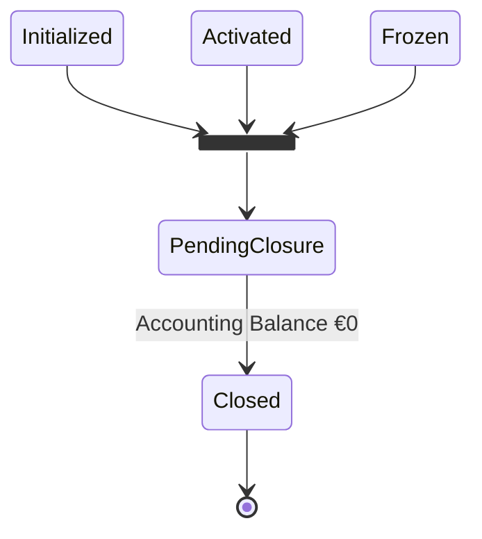
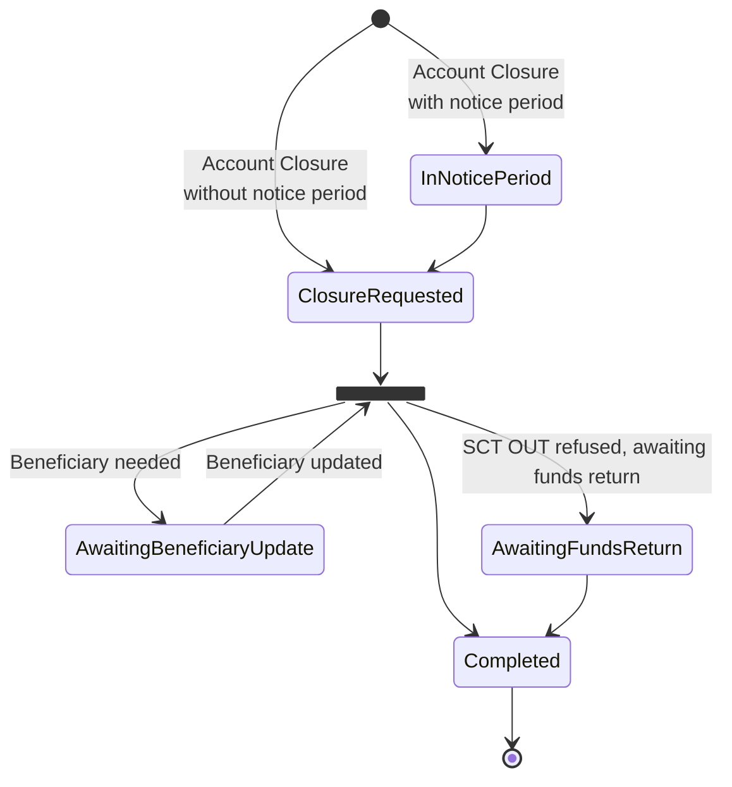
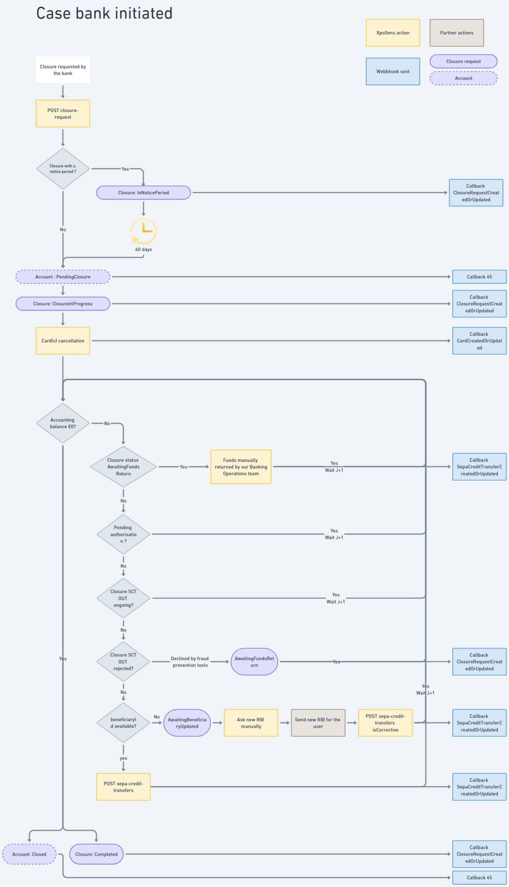
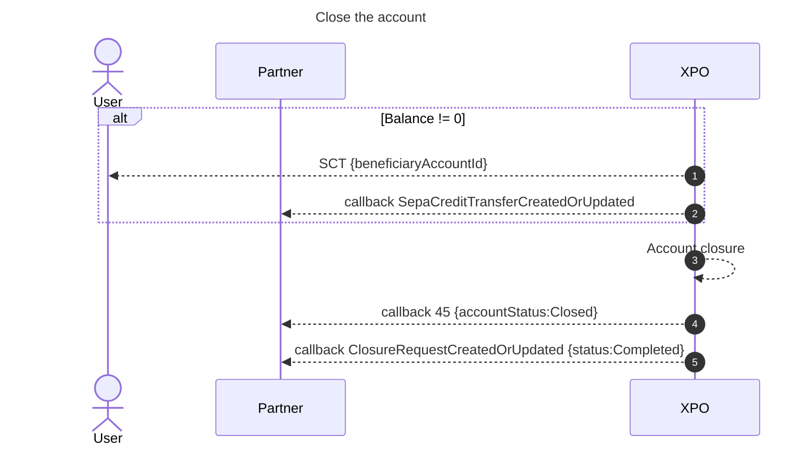
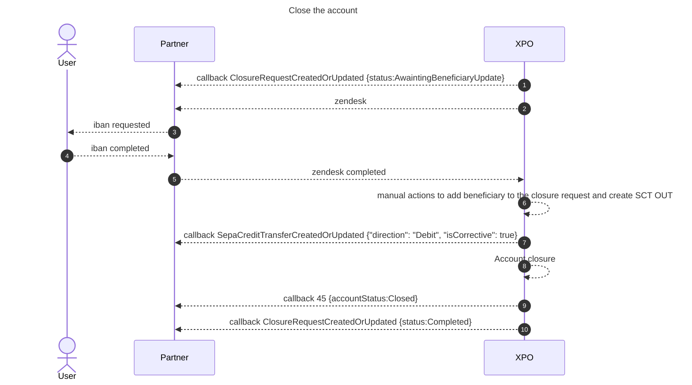
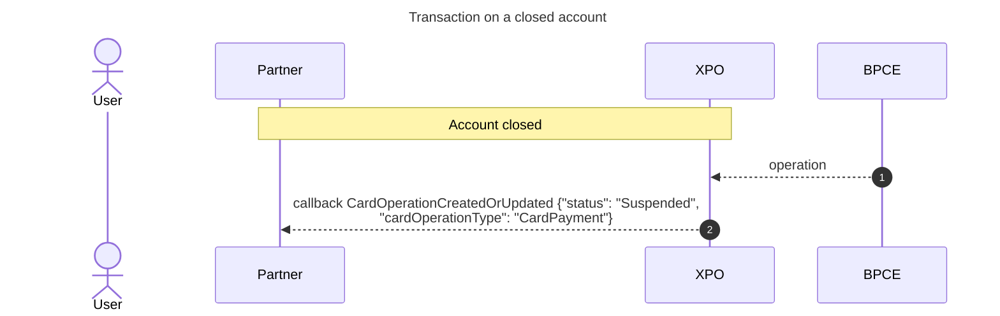

# Account closure
The closure of Xpollens accounts may occur in the following use cases:

* Account closure during an ongoing relationship
* End of relationship with a client (closure of all the client’s accounts)
* At the client’s initiative (e.g. changing banks)
* At the bank’s initiative (e.g. in the context of fraud detection)
* Closure of a single account without ending the relationship, at the client’s initiative (e.g. in the case of multiple accounts)


:::warning  Important
A request to close an account is irreversible. 
:::

* * *
## State diagram of the account in the context of account closure



<br/>

* * *

## State diagram of the closure request



<br/><br/>

* * *
## Account closure initiated by enduser
### Overview
The account is closed as soon as:
* the balance is €0
* all operations have a final status 


<br/>

### Best practise
In the case where the end user requests an account closure, make sure the user has no outstanding debts before sending the API request.
On Xpollens’ side, there is no condition related to the existence of debts before closing the account.

<br/><br/>

* * *
## Account closure initiated by the bank, with or without a notice period

### Overview

In this case, the account remains available for 60 days. After this "notice period", the closure process starts.
Please note that this case does not apply when the account is closed due to fraud.


The account is closed after a minimum of 60 calendar days, as soon as one of the following conditions is met:
* the balance is €0
* all operations have a final status 




<br/>

### Notice period

| Motif | Description | Notice period | 
| ---- | ---- | ----------- |
| KycUpdate  | Failure to update KYC (Know Your Customer) information | Yes |
| KycEconomicDocument | Failure to provide satisfactory justification for transactions carried out or planned on the account, despite repeated requests from the bank (An economic document is needed for customers collecting more than 1500€ over 2 rolling months) | Yes |
| InactiveClient | No activity on account and no contact between the bank and the client | No |
| DeceasedClient | The client is deceased | No | 
| Fraud | The client has confirmed fraudulent behaviour | No |
| ClientNotCompliantToY | Client not compliant with Xpollens Terms Of Use | Yes |


<br/><br/>

* * *


## Closure condition
### Case: account balance is 0 or beneficiaryAccountId available  
As soon as the balance is €0, and all operations have a final status, the account is closed.

If the holder's balance has been credited during this period, all funds are automatically sent to the  `beneficiaryAccountId`  indicated in the request made for the closure-request.



<br/><br/>

### Case: missing beneficiaryAccountId and non-zero balance during account closure request

When the closure is requested, but the `beneficiaryAccountId` is either not available or not provided, and the account still has a non-zero balance, it becomes impossible to execute the SCT OUT.

The affected account IDs are included in a specific report, listing all accounts that cannot be closed due to missing IBAN information.

Then next steps are manual: 
- A Zendesk ticket is created and sent to you, containing the list of accounts requiring the IBAN.
- As a partner, you contact your end users to request the necessary IBAN information.
- Once retrieved, you update the Zendesk ticket with the required IBANs.
- The banking team modifies the closure request, and then processes a corrective SCT to transfer the remaining balance.




:::note
Corrective SCT operations are only available for Xpollens teams.
:::

<br/><br/>

* * *

## Transaction accepted or refused 
### During the PendingClosure period


| **Type of transaction** | **Acceptation** |
| --- | --- |
| SCT OUT | Refused |
| SCT IN | Refused |
| Recall SCT OUT | Accepted |
| Recall SCT IN | Refused |
| IP IN | Refused |
| IP OUT | Refused  |
| Recall IP IN | Refused |
| Recall IP OUT | Refused |
| SDD IN | Refused  |
| SDD OUT | Refused |
| Top-up | Refused |
| Refund Top-up | Refused |
| Top-up contestation | Accepted |
| Card out authorisation | Refused |
| Card out settlement | Accepted |
| Card out offline | Accepted |
| Card in (card out refund) | Accepted |
| Card out contestation | Accepted |
| P2P | Refused |
| Debt | Accepted |
| Corrective operation (internal XPO) | Accepted |

<br/>

:::note
If charges are to be levied, it is important to do so before the account closure request
:::

<br/>

* * *

### As soon as the account is closed
<br/>

| **Type of transaction** | **Acceptation** |
| --- | --- |
| SCT OUT | Refused |
| SCT IN | Refused |
| Recall SCT OUT | Refused |
| Recall SCT IN | Refused |
| IP IN | Refused |
| IP OUT | Refused  |
| Recall IP IN | Refused |
| Recall IP OUT | Refused |
| SDD IN | Refused  |
| SDD OUT | Refused |
| Top-up | Refused |
| Refund Top-up | Refused |
| Top-up contestation | Charged to the Xpollens's holding account |
| Card out authorisation | Refused |
| Late card out settlement | Charged to the Xpollens's holding account |
| Card out offline |Charged to the Xpollens's holding account |
| Card in (card out refund) | Charged to the Xpollens's holding account|
| Card out contestation | Charged to the Xpollens's holding account |
| P2P | Refused |
| Debt | Charged to the Xpollens's outstanding account |
| Corrective operation (internal XPO) | Accepted |

<br/>

:::note
Operations credited in the Xpollens's outstanding account are refunded manually to the enduser.
:::

<br/><br/>

* * *

## Suspended operations
In the event of receiving a credit or debit transaction on a closed account, the transaction is created with a "Suspended" status. The end user's account is not debited or credited; instead, the partner's suspense account is impacted.



<br/><br/>


* * *
## Technical items
### Closure request
[POST /api/v3.0/accounts/{accountId}/closure-request](https://docs.xpollens.com/api/Accounts#post-/api/v3.0/accounts/-accountId-/closure-request)

:::warning  **Important Note**
> - if the end user is a prospect, with no funds in their bank account: you can use the API without the `beneficiaryAccountId` .
> 
> - if the  enduser's account is validated or has funds, the request must include the `beneficiaryAccountId` . Without this, the account can never be closed, as the account balance will never be €0. 
:::

<br/>
In the case that the external account used to receive the funds is frozen / blocked / closed / ..., the funds cannot be returned.
In this case, a manual intervention by Xpollens will be necessary to return the accounts to another account. 

<br/>

### Callback ClosureRequestCreatedOrUpdated
```json
    "Payload": {
        "type": "ClosureRequestCreatedOrUpdated",
        "partnerCode": "oney",
        "closureRequestId": "5a6e23fe-38e2-4e40-bba8-38d53c55adea",
        "accountId": "7tidihh3np",
        "reason": "KycEconomicDocument",
        "initiative": "Bank",
        "status": "InNoticePeriod",
        "noticeEndDate": "2025-07-02T14:04:29.1829217Z",
        "beneficiaryId": "a3b13f91-96a4-471b-a310-034dc228c490"
    }
```

* * *
## Best pratices

### Collect debts before closing the account 
Commission cannot be taken out once the account has been closed.
It is therefore essential to collect debts before closing the account. 

### Remove the charges taken from these accounts in the batches
Commission cannot be taken out once the account has been closed.
It is therefore essential that accounts in ClosureRequested, Pendingclosure and Closed status are **removed from the fee-taking batches**.

<br/>

* * *
## FAQ

### FAQ1: What should your application do when a customer requests account closure?
When a customer initiates an account closure request, your application should immediately restrict access to the following functionalities:

- SEPA Transfers: Block both standard SEPA Credit Transfers (SCT) and Instant Payments (IP).
- Card Creation: Disable the ability to request or issue new cards
- Mandate & SDD Creation: Prevent the creation of new mandates and SEPA Direct Debits (SDD).

If a request is made to any of these functionalities after the account closure request, a 40x error will be returned.

<br/>

### FAQ2: When is the latest account statement available?
The last account statement is generated in the first few days after the account status is changed to Closed.

### FAQ3: how to test
:::note
To allow testing, the closing delay time in sandbox is immediate. As a consequence, the `expectedCloseDate`  is set to the date of the closure request.  
<br/>

>To achieve "Closed" status, the following prerequisites must be met:
>- All operations must have a final status (i.e., all card authorizations are either completed or expired).
>- The account balance must be €0, both in terms of authorization balance and accounting balance.
:::
