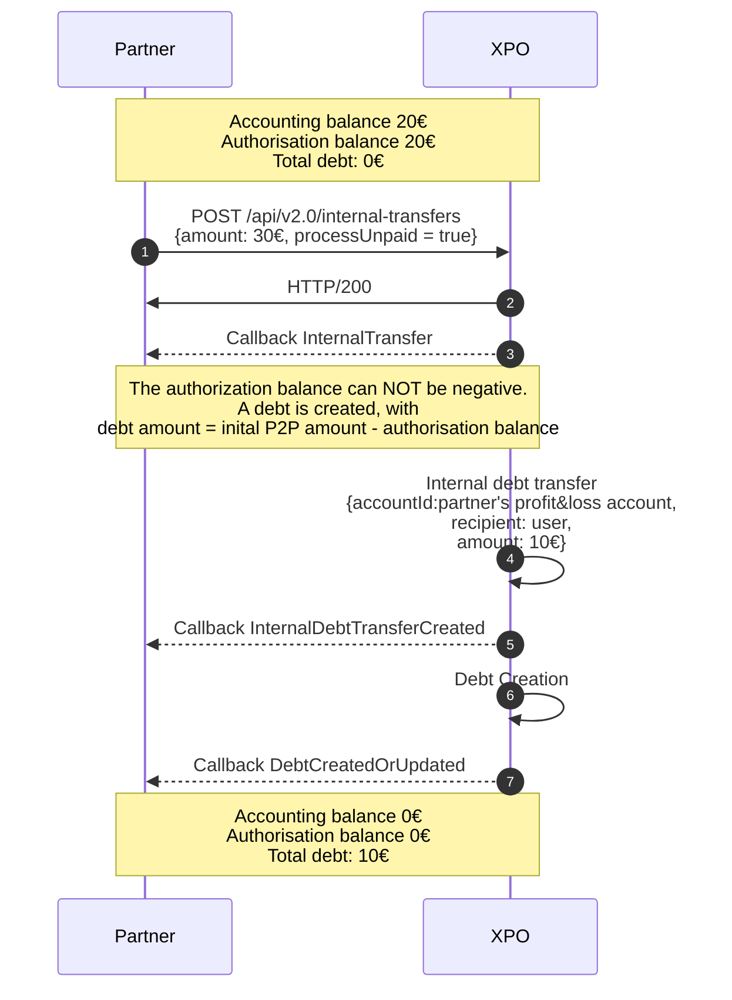
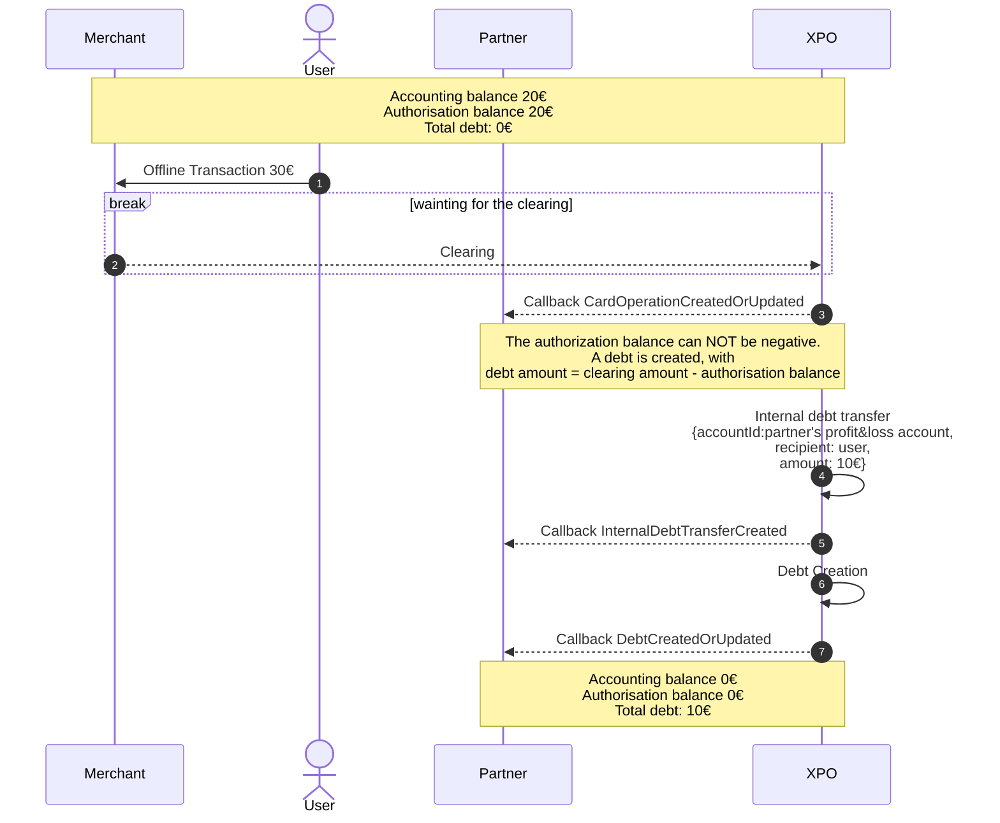
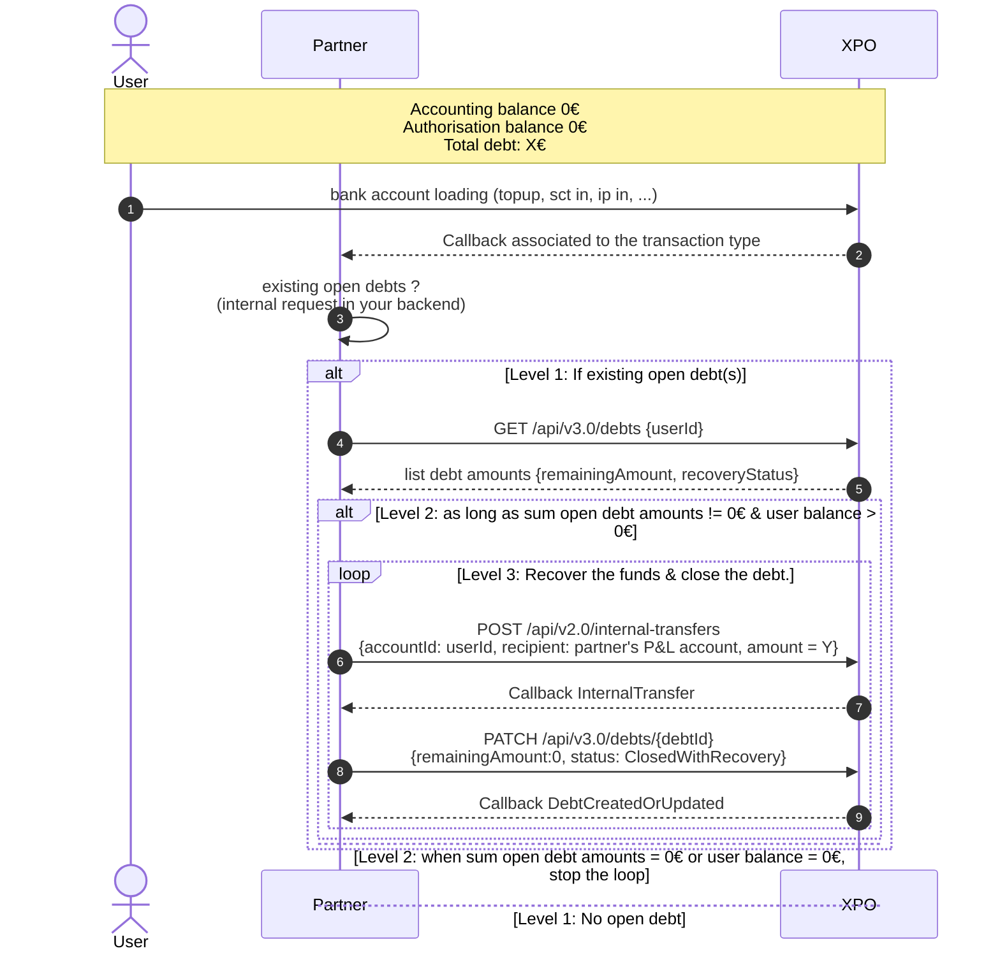
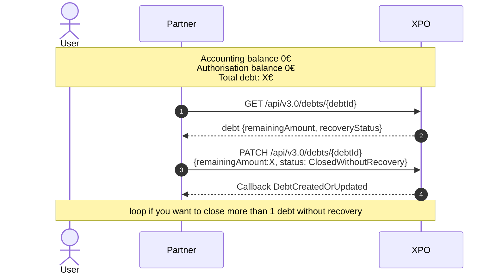
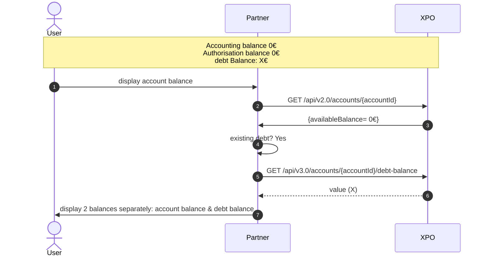

# Debt Management
A debt is created as soon as the authorization balance goes negative. As a consequence, debts can only be created on offline transaction and P2P.

:::warning  It is important to note that the debt carries two concepts:

- the creation of an internal transfert **completed** to cover the balance shortfall
- and the notion of debt owed by the end user to the partner, with its own status.  
    <br/>
:::

* * *
## Attibute definition

The `DebtCreatedOrUpdated` callback is received in 2 cases:  

1- a debt was created  
2- an existing debt changed  
  The `remainingAmount` or/and the `recoveryStatus` changed.

<br/>  

The `internalDebtTransfer` is dedicated to the internal transfer created from the P&L account to the enduser's account to cover the balance shortfall.

* * *
## Debt operation in the webdesk
A line labeled "Debt" is created when the debt is initiated. This line simultaneously represents the InternalDebtTransfer and the current status of the debt.

The operation status is "Completed" even if the debt status (visible in the Webdesk) initially shows as "In Progress."

  
<br/>

* * *
## Debt creation use cases

### Internal transfer

When the `processUnpaid` attribute is set to true, if the amount of the internal transfer exceeds the account balance, a debt is created.

Example:



 <br/>


* * *

### Offline operations



### Note about offline operation (refer to the dedicated topic for more details)

#### Card X0X

X0X cards have **almost** systematic authorisation.  
Exceptions are made in certain cases:

- parking
- toll
- aircraft

In these cases, if the tpe does not request authorisation, the transactions will still be accepted.

#### Card X2X

X2X cards are systematic authorisation cards. This information is written directly onto the chip. It will therefore be impossible to make payments on tpe that do not require authorisation.

#### Forced operation on the TPE

Despite this feature of the chip, there are POS terminals that allow you to force the operation offline.  
In this case, no preventive action is possible on the Xpollens side: the transaction is carried out, the compensation is received and deducted from the enduser's account.

* * *

### R-transactions

#### Recall SDD OUT during the first 8 weeks afer the payment date

If an SDD credited to the Xpollens account is recalled by the debtor bank within 8 weeks, Xpollens is obliged to return the funds regardless of the account balance. This can therefore create a debt.

 <br/>  

* * *

## Debt recovery

The management of debt collection is entirely up to you. You can debit the account, adjust the remaining balance, or update the debt status as needed. Xpollens does not take any action.

It is important to note that debts must be closed **transaction by transaction** (debt by debt).

### Debt recovery: as soon as the account balance is positive, recovered with fund recovery

Here is a proposed debt recovering sequence:

- As soon as funds are deposited into the account
- Review the outstanding debts
- Recover as much as possible while there are funds available

<br/>



<br/>

The debt must be recorded in the partner's accounts.

* * *
### Transaction in to monitor to recover debt

- Top-up card
- SCT IN & IP IN
- SCT OUT cancellation
- Refund SCT OUT & IP OUT
- SDD OUT
- SDD IN refund
- SDD OUT cancellation
- Card operation IN
- Card authorisation expiration

* * *

### Debt recovery: recovey without fund recovery

You can decide to close the debt without recovering the funds. The losses will then be your responsibility.



  <br/>
 

* * *

## Technical information

### Internal Debt transfer

The payload is essentially the same as for internal transfer.

In the doc.xpollens, go to Accounts > Accounts statements > v3.0  
[GET /api/v3.0/internal-debt-transfers/{id}](https://docs.xpollens.com/api/AccountStatements#get-/api/v3.0/internal-debt-transfers/-id-)

About the callback  
[InternalDebtTransferCreated](https://docs.xpollens.com/api/Callbacks#post-/-InternalDebtTransferCreated-)

### Debt

In the doc.xpollens, go to Accounts > Accounts Management > v3.0 > Debt

Get a debt by a debt public Id  
[GET /api/v3.0/debts/{debtId}](https://docs.xpollens.com/api/Accounts#get-/api/v3.0/debts/-debtId-)

Get a partial list of debts  
[GET /api/v3.0/debts](https://docs.xpollens.com/api/Accounts#get-/api/v3.0/debts)

Modify a debt  
[PATCH /api/v3.0/debts/{debtId}](https://docs.xpollens.com/api/Accounts#patch-/api/v3.0/debts/-debtId-)

* * *
## Best pratice: how to display debt in your app

### Display a debt balance in addition to the account balance



   <br/>


* * *

## Debt displayed on account statements

The amount of the debt is not shown on the account statement.

The InternalDebtTransfer as the InternalTransfer are marked "Paiement" in the bank statement.

* * *
## How to test

### Create a debt with a P2P - example Account management fees

1- GET /api/v3.0/accounts/{accountId}

```json
{
    [...]
    "authorizationBalance": "authorizationBalance",
    [...]
}

```

2- Create a P2P that respects the limits, with an amount greater than the balance

POST /api/v2.0/internal-transfers

```json
"Payload": {
  "internalTransferId": "ExternalP2PRef",
  "accountId": {accountId},
  "amount": {
    "value": authorizationBalance+1,
    "currency": "EUR"
  },
  "recipient": {
    "accountId": "Profit_and_lost_accountId"
  },
  "extraDatas": {
    "description": "Custom description",
    "label1": "Label",
    "label2": "SubLabel",
    "label3": "Tag"
  },
  "processUnpaid": true,
    
}
```

3- You receive the callback

```json
{
  "type": "DebtCreatedOrUpdated",
  "data": {
    "debtId": debtId,
    "originTransactionId": "ExternalP2PRef",
    "accountId": {accountId},
    "accountHolderId": {appuserId},
    "creationDate": "YYYY-MM-DDTHH:MM:SS.000Z",
    "amount": {
      "value": "1.00",
      "currency": "EUR"
    },
    "remainingAmount": {
      "value": "1.00",
      "currency": "EUR"
    },
    "recoveryStatus": "InProgress"
  }
}
```

* * *
### Create a debt with an offline operation

1- GET /api/v3.0/accounts/{accountId}

```json
{
    [...]
    "authorizationBalance": "authorizationBalance",
    [...]
}

```

2- Create an offline operation that respects the limits, with an amount greater than the balance  
POST {{URLT}}/v2.0/card-operations/simulate-offline-settlement

```json
{
  "cardId": {{cardId}},
  "amount": {
    "value": authorizationBalance+1,
    "currency": "EUR"
  },
  "operationDate": "2024-07-02T07:23:36.915Z",
  "direction": "Debit", // Debit Credit
  "merchantName": "Discraft Disc",
  "merchantCategoryCode": "5941"
}
```

3- You receive the callback

```json
{
  "type": "DebtCreatedOrUpdated",
  "data": {
    "debtId": debtId,
    "originTransactionId": "x",
    "accountId": {accountId},
    "accountHolderId": {appuserId},
    "creationDate": "YYYY-MM-DDTHH:MM:SS.000Z",
    "amount": {
      "value": "1.00",
      "currency": "EUR"
    },
    "remainingAmount": {
      "value": "1.00",
      "currency": "EUR"
    },
    "recoveryStatus": "InProgress"
  }
}
```

* * *
## FAQ