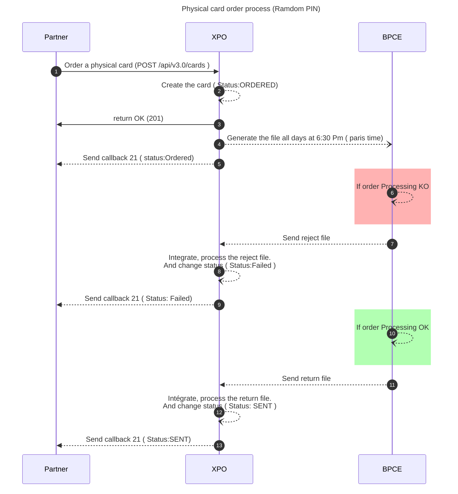
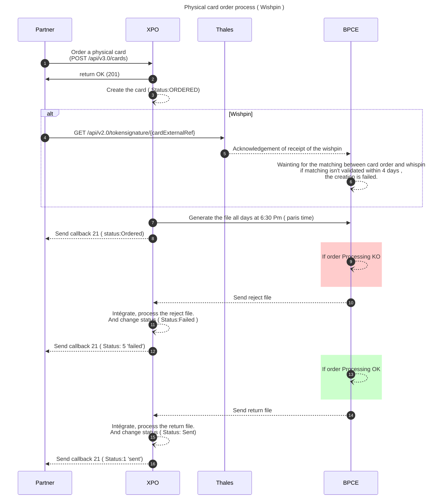
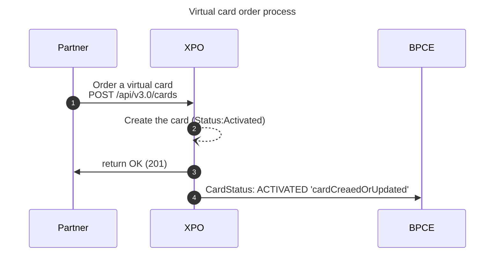
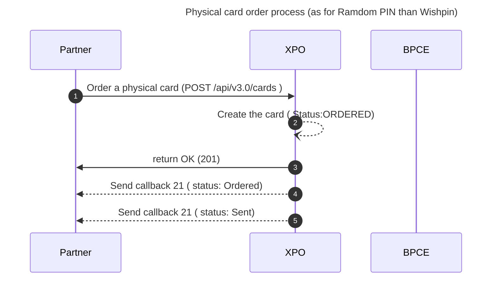
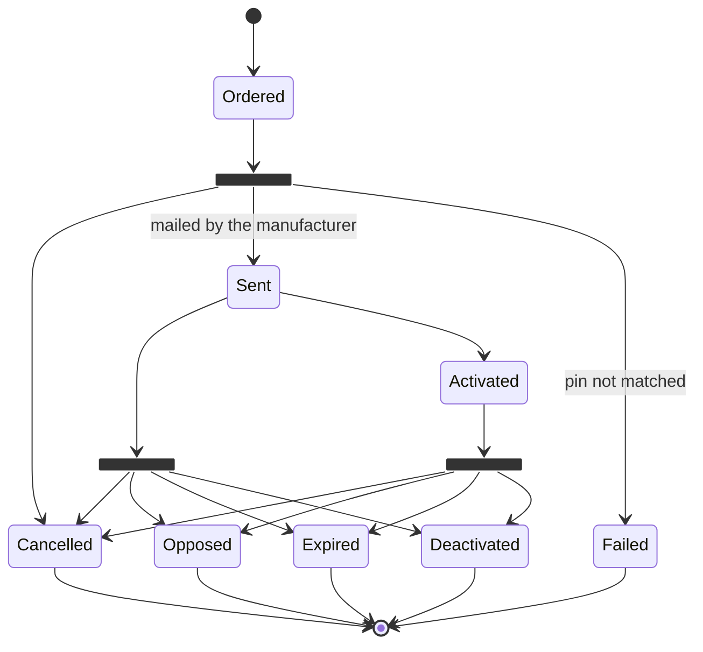
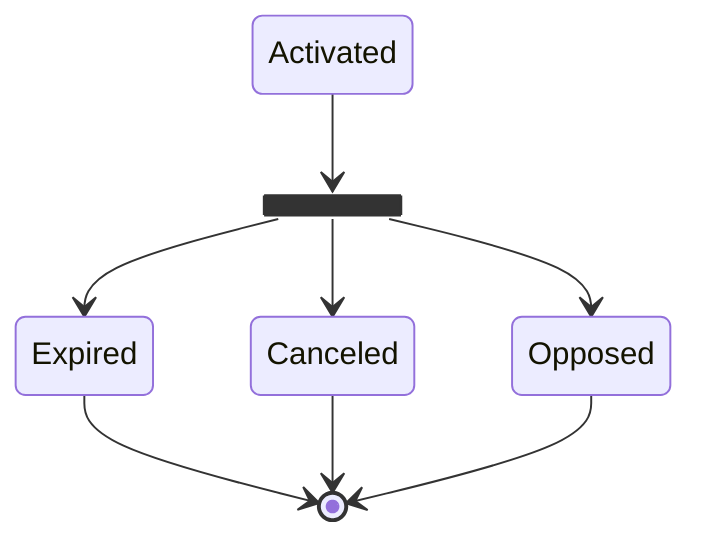

# Cards Issuing
This document applies for **Physical and Vitual cards Order **.
* * *
## Prerequisites
The prerequisites to call this endpoint are:

- Client Authentication.
- Offer partner code.
- Cardholder existence.
- Account existence.
* * *
## Diagram & statuses

### Order a card: sequence diagram for production and unmocked environment
**Physical card order process (Ramdom PIN)**


* * *
**Physical card order process ( Wishpin )**


<br/>

> ⚠ If you are using the wishpin, you have 4 days to send the pin associated to your card.<br/>
> Otherwise, the card order will fail at BPCE PS, and a callback 21 is received with the status "5" (failed).

* * *
**Virtual card order process**


<br/>

> ⚠ Note: no callback 21 is sent when the virtual card is issued. <br/>
> The synchronous response has to be treated immediatly.

* * *
### Order a card: sequence diagram for **mocked** environment
In mocked environment, card oredering is mocked. As a consequence:

- card status changes immediately from ordered to sent
- callback 21 for creation is immediately received

* * *
**Physical card order process (as for Ramdom PIN than Wishpin)**

<br/>

For virtual card, the sequence diagram remains the same.

**Virtual card order process**


* * *
### States diagram for physical cards

<br/>

> Deactivated for remanufacturing

* * *
### States diagram for virtual cards

* * *
## Wishpin process
*Coming soon* 
* * *
## Configuration when creating the environment
### Random pin or wishpin?
Random pin: the pin is chosen at random when the card is created.
Wishpin: the enduser can choose its own pin. The enduser has 4 days to do so, otherwise the card creation fails.

If the configuration is 'Random Pin', then you have no choice but to go random pin.
If the configuration is 'Wishpin', then you have the choice of the pin type when using the endpoint.

### Card validity period
The card's validity period is fixed and is set when the environment is created. This information is shared with BPCE PS.

### Card offers and visual codes
```json
{
  "cardId": "my_card_reference",
  "cardholderId": "145644-060820-USER-8550478",
  "accountId": "145644-060820-ACCOUNT-8550478",
  "offerPartnerCode": "DemoClassicPhysicalDebitVISA",
  "hasWishpin": true,
  "isNfcDisabled": false,
  "visualCode": "NOCP"
}
```
<br/>

The card offer allows you to find out the type of card you want (classic, premier, etc.) and its characteristics.
This information is an input for card creation.

For each offer, you can have several visuals. All these visuals are validated with BPCE PS and VISA and then configured at Xpollens.
* * *
### Pan ranges
They are chosen by Xpollens and validated with BPCE PS.
* * *
## API, Callback & technical items
### Card order 
[`POST /api/v3.0/cards`](https://docs.xpollens.com/api/CardFactory#post-/api/v3.0/cards)
/!\ When ordering a virtual card, the wishpin and nfc attributes must be removed from the request.

### SDK Thales
*coming soon*

* * *
## How to test
### Create a virtual card
```json
POST /api/v3.0/cards
{
    "cardId": "yourCardId",
    "cardholderId": "yourCardHolderId",
    "accountId": "yourAccountId",
    "offerPartnerCode":"yourOfferPartnerCode",
    "visualCode": "yourVisualCode"
}
```