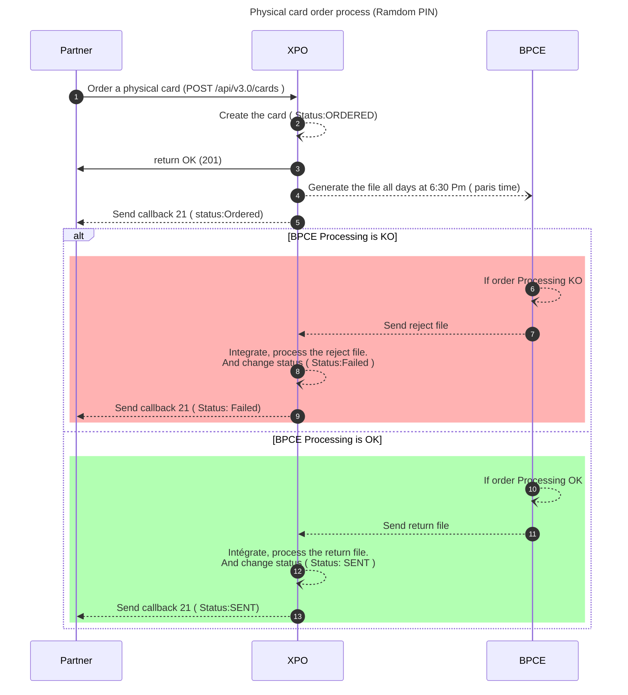
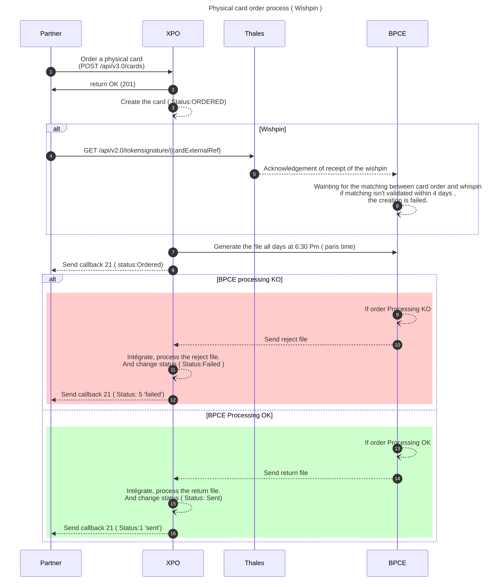
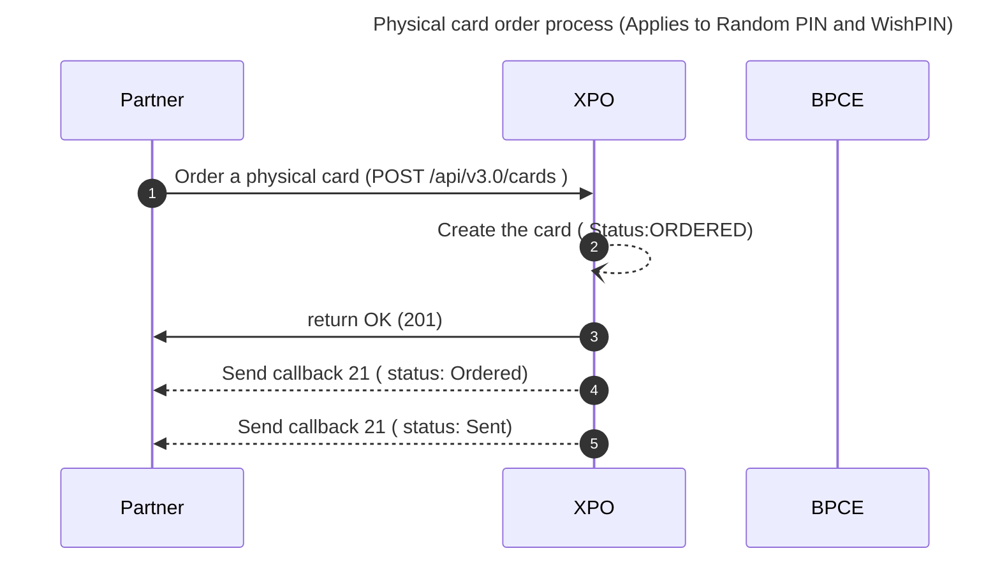
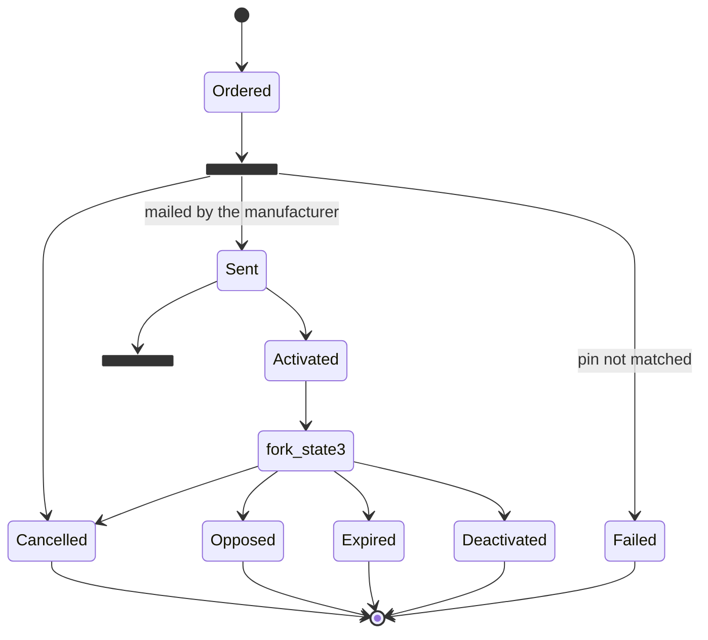

# Cards Issuing
This document applies for **Physical and Vitual cards Order **.
* * *
## Prerequisites
The prerequisites to call this endpoint are:

- Client Authentication.
- Offer partner code.
- Cardholder existence.
- Account existence.
* * *
## Diagram & statuses

### Order a card: sequence diagram for production and unmocked environment
**Physical card order process (Ramdom PIN)**


* * *
**Physical card order process ( Wishpin )**


<br/>

> ⚠ If you are using the wishpin, you have 4 days to send the pin associated to your card.<br/>
> Otherwise, the card order will fail at BPCE PS, and a callback 21 is received with the status "5" (failed).

* * *
**Virtual card order process**


<br/>

> ⚠ Note: no callback 21 is sent when the virtual card is issued. <br/>
> The synchronous response has to be treated immediatly.

* * *
### Order a card: sequence diagram for **mocked** environment
In mocked environment, card oredering is mocked. As a consequence:

- card status changes immediately from ordered to sent
- callback 21 for creation is immediately received

* * *
**Physical card order process (Applies to Random PIN and Wish PIN)**

<br/>

For virtual card, the sequence diagram remains the same.

**Virtual card order process**


* * *
### States diagram for physical cards

<br/>

> Deactivated for remanufacturing

* * *
### States diagram for virtual cards

* * *
## Wishpin process
### Description
The WishPIN Xpollens solution complies with the new BPCE security standards.

Solution relies on 

* the `tokensignature` API [see here](https://docs.xpollens.com/api/CardSecure#get-/api/v2.0/tokensignature/-cardExternalRef-)
* an **SDK** provided by Thales

SDK and SDK documentation are available to download here (Files are password protected, please ask access through our support team) : 

| SDK & Documentation   |
| -- |
| **SDK Documentation**<br/>[CardCompanion SDK - Technical documentation - A16.zip](./files/CardCompanion%20SDK%20-%20Technical%20documentation%20-%20A16.zip)|
|**ANDROID SDK**<br/>[CardCompanionSDK_2.0.0_Android.zip](./files/CardCompanionSDK_2.0.0_Android.zip)|
|**iOS SDK**<br/>[CardCompanionSDK_2.0.2_iOS.zip](./files/CardCompanionSDK_2.0.2_iOS.zip)|


<br/>

Functional principle is as follows : 

* To define his/her PIN, the user first create its card by specifying wishPIN is needed (`haswishpin:true`).  
* The card’s creation returns a card reference (cardExternalRef or AppCardId). 
* This reference should be passed to the signature service and finally to the WishPIN SDK along with the signature.
* The defined PIN is then sent in real time to Thales through the SDK and then sent from Thales to BPCE/PS.
* Card order and WishPIN are then reconciled then the card is sent for customization.

<br/>

**SDK**<br/>
The PIN code entered by the end user in the partner mobile application is sent in real time to the Thales PIN definition platform. PIN codes are stored cyphered on the platform then sent by batch on a daily basis to BPCE to reconciliate Cards and PIN <br/>

> **4 days max after which the WISHPIN request is rejected the reconciliation is not possible**

<br/>

**API Signature**<br/>
Partner authentication toward PIN processor will be done against a BPCEPS/HSM token and then sent with the corresponding signature by the SDK.

* * *
### Order the card with wishpin
The first step required to set up a card with user-selected PIN is to order the card, specifying the use of the wishPIN in the API call.

> Example
> `POST /api/v3.0/cards`
> ```json
> {
>  "cardId": "{{cardExternalRef}}",
>  "cardholderId": "{{appUserId}}",
>  "accountId": "{{accountId}}",
>  "offerPartnerCode": "{{cardOffer}}",
>  "hasWishpin": true,
>  "isNfcDisabled": false,
>  "visualCode": "{{cardVisual}}"
> }
> ```
> **Response**
> ```json
> {
 >   "cardExternalRef": "06ae7f8f02",
 >   "partnerCode": "xpo-bling-sb-mock-001"
> }
>```

<br/>

A **callback 21** will be send to the partner after the card order has been received by the processor (BPCE PS).

* * *
### Get the `tokensignature`
Once the card order has been performed, it is mandatory to retrieve some secure card token information that will be shared with Thales through the provided SDK so that it can handle the PIN request.

For this, the `GET api/v2.0/tokensignature/{{cardExternalRef}}` has to be called by the partner.

> Example
> `GET api/v2.0/tokensignature/{{cardExternalRef}}`
>
> **Response**
> ```json
> {
>   "certificate_alias": "natixis.dev",
>   "token_signature": "{{tokensignature}}",
>    "card_unique_id": "1652800161toJDcN2SIkChUg1yc9ZEiQ",
>    "transaction_id": "efe4a0303caf4e868392e8652e929d81",
>    "transaction_timespan": "1702994478"
>}
>```

<br/>

**Information returned by the `tokensignature` API will have be passed to the Thales SDK.**

* * *
### Thales SDK
Chapter 5.6.1 and 6.4 of the SDK documentation describes the format of the expected fields used to build the input JSON `token` to the `definePINToken` method of the SDK.

<br/><br/>

**⬛ `definePINToken` method (§5.6.1)**


| Name | Type | Description | 
| ---- | ---- | ----------- |
| context | Context | The Android application context |
|hostURL | String | The back-end URL from Digital PIN solution provided by the project manager|
|token | String | The token is a message in JSON format containing information relative to the bank and cardholder.<br/>Token in JSON format as described in the section:<br/>§6.4 Token and Signature |
|signature | String | The signature computed over the token for verification.<br/>Generation is explained in the following section of the document:<br/>§6.4 Token and Signature | 
| pinValue | String |PIN in clear format (e.g. 1234)|

<br/>

> **Note**<br/>
> `HostURL` for test/sandbox environment : https://digitalpindef-app.eservices-lab.gemalto.com/pd/NATIXIS<br/>
> `HostURL` for production environment : https://digitalpindef-app.gemalto.com/pd/NATIXIS/

<br/><br/>

**⬛ `token` format (§6.4)**

**Token Format**<br/>
Token is used in PIN Distribution and PIN Definition schemes to provide information about the cardholder and the request.

The token shall comply with this format:

```json
{
    "IdBEL": "IdBEL",
    "IdFournisseur": "IdFournisseur",
    "IdPorteur": "IdPorteur",
    "IdTransaction": "IdTransaction",
    "SignatureCertAlias": "SignatureCertAlias",
    "Timestamp": "Timestamp",
    "Type": "Type"
}
```

Besides, the token MUST NOT be modified at all after it is signed. Otherwise, the signature verification may fail.
The token shall only be composed with alphanumeric characters: [a-zA-Z0-9].<br/><br/>

**⬛ Token and Signature CB compliant**<br/>
The token must be formatted as a JSON message and needs to contain the following information:

- `IdBEL`: Customer unique Identifier.
- `IdFournisseur`: Unique identifier of the service provider used during authentication.
- `IdPorteur`: Unique ID (uid) of the cardholder retrieving his PIN. Same unique id used during provisioning step.
- `IdTransaction`: Unique identifier of the transaction. All request following will be rejected if they use the same idTransaction.
- `Timestamp`: Timestamp in UNIX format (unit second) generated for each transaction.
- `Type`: Transaction type: 00 for PIN delivery, 01 for PIN reminder and 02 for PIN definition
- `SignatureCertAlias`: alias of the certificate used to sign the token – Optional –

* * *
#### `tokensignature` and `token` mapping
The information retrieved from the `tokensignature` API have to be mapped to the expected JSON `token` used in `definePINToken` SDK method.

The mapping table is as follow :

| `tokensignature` | `definePINToken` parameter | Example Value | Description |
|:----------------:|:--------------------------:|:-----:|:------------|
| N/A              | `IdBEL`                    | 30007 |Customer unique Identifier (XPollens/Fixed Value) |
| N/A              | `IdFournisseur`            | TH    | THALES SUPPLIER ID |
| `card_unique_id` | `IdPorteur`                | 1652800161toJDcN2SIkChUg1yc9ZEiQ | XPollens Card Id shared with<br/>Thales and BPCE |
| `transaction_id` | `IdTransaction`            | efe4a0303caf4e868392e8652e929d81 | XPollens issued wishPIN transaction id |
| `certificate_alias` | `SignatureCertAlias`    | natixis.dev | alias/identifier of used certificate to cypher the PIN<br/>* natixis.dev for test/sandbox environment<br/>* certificat.thales.api.pin.2022 for production environment |
| `transaction_timespan` | `Timestamp`          | 1702994478 | XPollens issued WishPIN request timestamp |
| N/A              | `Type`                    | 02 | Constant : 02 for PIN definition |

* * *
#### Calling the `definePINToken` SDK method
Once the `token` is built from the information returned by `tokensignature` API. The `definePINToken` has to be called in the partner application.

> **Note**
> The `definePINToken` call shall not be initiated from the main UI thread but from its own thread.

<br/>

> Example : Android simple implementation
> ```java
> button.setOnClickListener {
>  val hostUrl: String = "https://digitalpindef-app.eservices-lab.gemalto.com/pd/NATIXIS/"
>  var token: String =  "\"IdBEL\":\"30007\",\"IdPorteur\":\"\${idPorteur.toString()}\",\"IdFournisseur\":\"TH\",\"IdTransaction\":\"\${idTrans.toString()}\",\"Timestamp\":\"\${timestamp.toString()}\",\"Type\":\"02\",\"SignatureCertAlias\":\"natixis.dev\"}"
>  var signature: String = "\${signature.toString()}"
>  val pinValue: String = "\${pin.toString()}"
>  val executionResponse = definePINToken(applicationContext,hostUrl, token, signature, pinValue)
>  var result = false
>  if (executionResponse.errorCode == "0") {
>  // The PIN was set properly for the given cardholder
>  result = true
>  } else {
>  // An issue occurred, handle the error code
>  Log.d("\[CCSDK\]", "\[DefinePin\]Response: " + executionResponse);
>  result = false
>  }        
>}
> ```


* * *
## Configuration when creating the environment
### Random pin or wishpin?
Random pin: the pin is chosen at random when the card is created.
Wishpin: the enduser can choose its own pin. The enduser has 4 days to do so, otherwise the card creation fails.

If the configuration is 'Random Pin', then you have no choice but to go random pin.
If the configuration is 'Wishpin', then you have the choice of the pin type when using the endpoint.

### Card validity period
The card's validity period is fixed and is set when the environment is created. This information is shared with BPCE PS.

### Card offers and visual codes
```json
{
  "cardId": "my_card_reference",
  "cardholderId": "145644-060820-USER-8550478",
  "accountId": "145644-060820-ACCOUNT-8550478",
  "offerPartnerCode": "DemoClassicPhysicalDebitVISA",
  "hasWishpin": true,
  "isNfcDisabled": false,
  "visualCode": "NOCP"
}
```
<br/>

The card offer allows you to find out the type of card you want (classic, premier, etc.) and its characteristics.
This information is an input for card creation.

For each offer, you can have several visuals. All these visuals are validated with BPCE PS and VISA and then configured at Xpollens.
* * *
### Pan ranges
They are chosen by Xpollens and validated with BPCE PS.
* * *
## API, Callback & technical items
### Card order 
[`POST /api/v3.0/cards`](https://docs.xpollens.com/api/CardFactory#post-/api/v3.0/cards)

**⚠** When ordering a virtual card, the wishpin and nfc attributes must be removed from the request.

### SDK Thales

| SDK & Documentation   |
| -- |
| **SDK Documentation**<br/>[CardCompanion SDK - Technical documentation - A16.zip](./files/CardCompanion%20SDK%20-%20Technical%20documentation%20-%20A16.zip)|
|**ANDROID SDK**<br/>[CardCompanionSDK_2.0.0_Android.zip](./files/CardCompanionSDK_2.0.0_Android.zip)|
|**iOS SDK**<br/>[CardCompanionSDK_2.0.2_iOS.zip](./files/CardCompanionSDK_2.0.2_iOS.zip)|

* * *
## How to test
### Create a virtual card
```json
POST /api/v3.0/cards
{
    "cardId": "yourCardId",
    "cardholderId": "yourCardHolderId",
    "accountId": "yourAccountId",
    "offerPartnerCode":"yourOfferPartnerCode",
    "visualCode": "yourVisualCode"
}
```