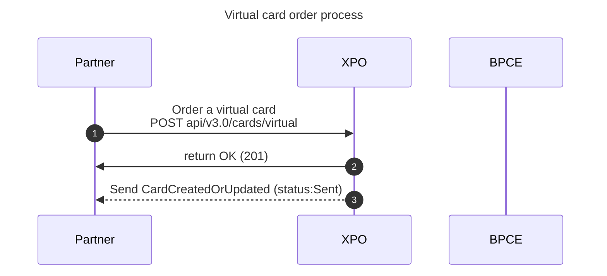
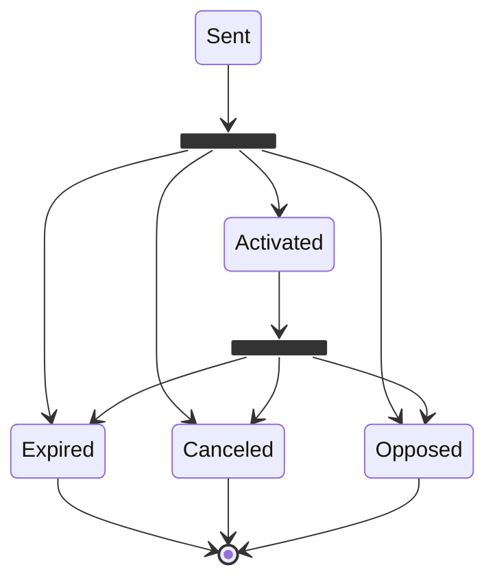

# Virtual card issuance
This document applies for **Virtual Cards **.
* * *
## Prerequisites
The prerequisites to call this endpoint are:

- Client Authentication.
- Offer partner code.
- Cardholder existence.
- Account existence.

<br/>


* * *
## Diagram & status for a virtual card

### Order a virtual card: sequence diagram for all environment

**Virtual card order process**



:::note
The virtual card has to be activated to be used.
:::

<br/>

* * *
### States diagram for virtual cards



<br/> <br/>


* * *

## Configuration when creating the environment
### Card validity period
The card's validity period is fixed and is set when the environment is created. This information is shared with BPCE PS.

### Card offers and visual codes
```json
{
  "cardId": "my_card_reference",
  "cardholderId": "145644-060820-USER-8550478",
  "accountId": "145644-060820-ACCOUNT-8550478",
  "offerPartnerCode": "DemoClassicPhysicalDebitVISA",
  "hasWishpin": true,
  "isNfcDisabled": false,
  "visualCode": "NOCP"
}
```
<br/>

The card offer allows you to find out the type of card you want (classic, premier, etc.) and its characteristics.
This information is an input for card creation.

For each offer, you can have several visuals. All these visuals are validated with BPCE PS and VISA and then configured at Xpollens.
* * *
### Pan ranges
They are chosen by Xpollens and validated with BPCE PS.

<br/>
<br/>

* * *
## API, Callback & technical items


* * *
## How to test
