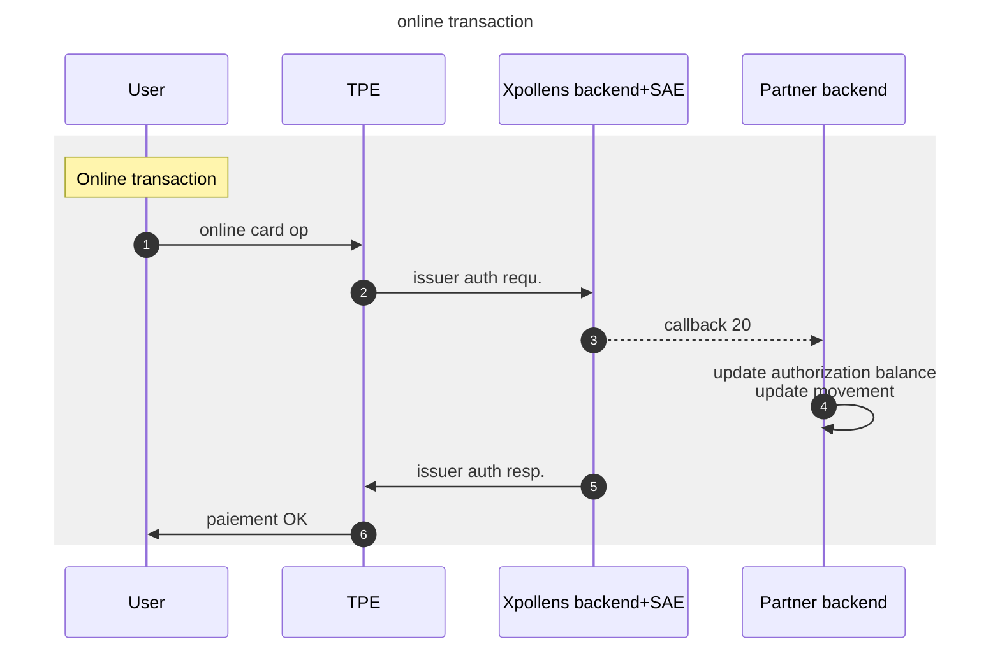
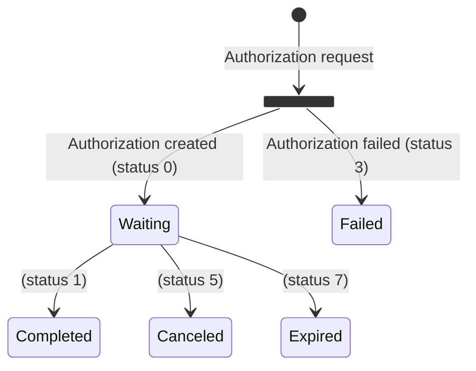
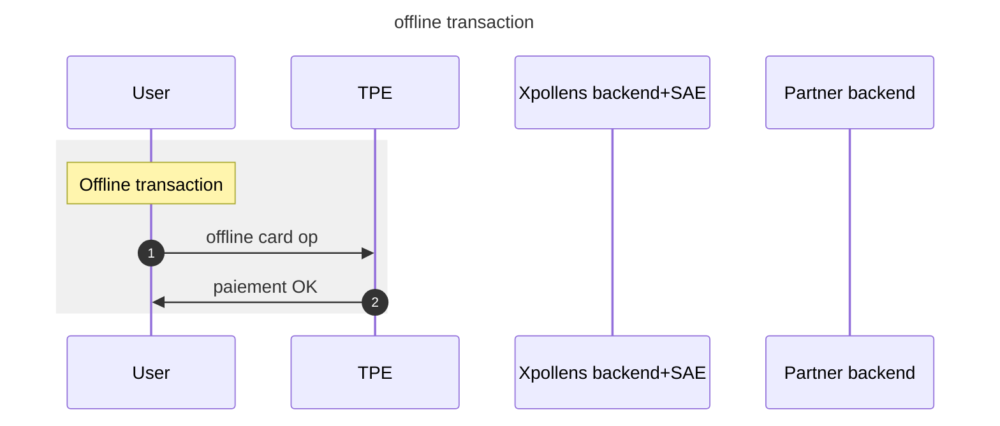
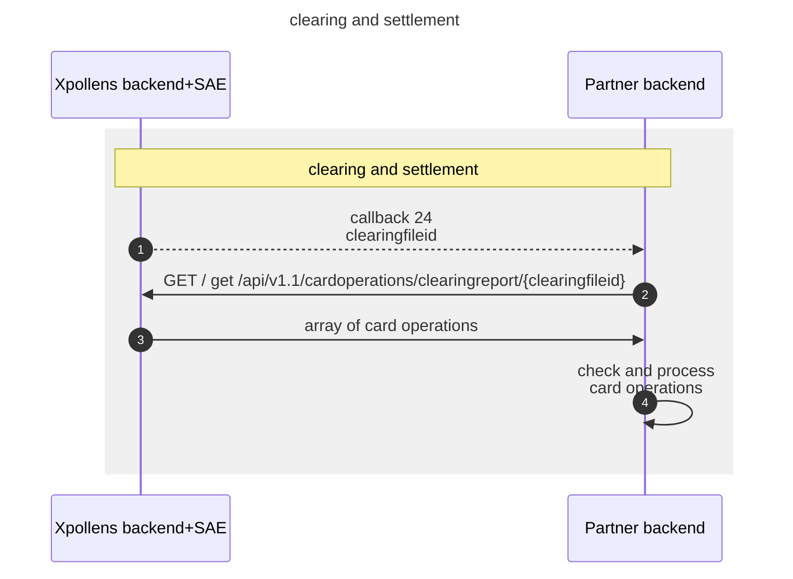
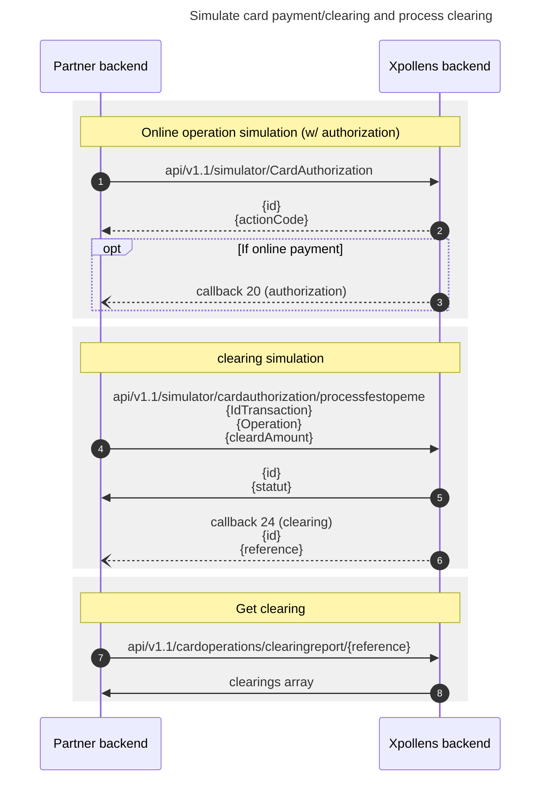

import Image from '@theme/Image';
import Highlight from '@theme/Highlight';
import Endpoint from "@theme/Endpoint"
import Cta from '@theme/Cta'

# Online card transaction
## Feature Description
This document describes the card operation flow from payment initiation / authorization to operation clearing and settlement.

## Feature Flow - Sequence diagram


---
## Callback #20 - Card operation
`POST /{callback20Url}`

Callback received when a card authorization is created following its processing in Xpollens and each time its status change

> Body parameter (exemple)

```json
{
  "id": "464890",
  "reference": "8Y8Loh9L8E6FJsA7J1Tyrg",
  "type": "20",
  "appCardId": "test_card",
  "hint": "9396XXXXXXXX6075",
  "transactionAmount": "11.9",
  "currencyCodeTransaction": "978",
  "cardHolderBillingAmount": "",
  "cardHolderBillingConversionRate": "",
  "availableBalance": "0.96",
  "actionCode": "0",
  "merchantType": "5814",
  "cardAcceptorIdentificationCodeName": "MC DONALD S\\\\GRENOBLE",
  "status": "0",
  "ert": "10",
  "cardDataInputMode": "9",
  "tokenRequestorID": "",
  "terminalCountryCode": "250",
  "userid": "dyYiUtSrj",
  "executedDate": "01/12/2022 14:44:09"
}
```

* * *

### Parameters

|Name|In|Type|Required|Description|
|---|---|---|---|---|
|callback20Url|path|string|true|the location where data will be sent.  Must be network accessible|
|body|body|object|false|JSON Body|
|» id|body|string|false|the Xpollens internal authorization id|
|» reference|body|string|false|the operation orderid|
|» type|body|string|false|the callback type|
|» appCardId|body|string|false|the reference or alias of the card|
|» hint|body|string|false|the card number hint|
|» transactionAmount|body|string|false|the amount in local currency in decimal|
|» currencyCodeTransaction|body|string|false|the transaction currency code (ISO 4217 numeric code)|
|» cardHolderBillingAmount|body|string|false|the amount in euro (used for foreign currency transactions) in decimal format|
|» cardHolderBillingConversionRate|body|string|false|the exchange rate (used for foreign currency transactions) in decimal value in string data type|
|» availableBalance|body|string|false|the balance after authorisation (or after a change in status = cancellation, expiry) in decimal format|
|» actionCode|body|string|false|the response code (authorization and reasons for refusal) :  |
|» merchantType|body|string|false|the merchant type (Merchant Category Code) is a four-digit number listed in ISO 18245 for retail financial services. An MCC is used to classify a business by the types of goods or services it provides|
|» cardAcceptorIdentificationCodeName|body|string|false|the merchant information (name, adress,etc…)|
|» status|body|string|false|the Operation status :  |
|» ert|body|string|false|the regulatory and technical environment  |
|» cardDataInputMode|body|string|false|the input mode for the payment :  |
|» tokenRequestorID|body|string|false|the id of the token requestor :  |
|» terminalCountryCode|body|string|false|the Country where the payment took place|
|» userid|body|string|false|the user unique identifier|
|» executedDate|body|string|false|the executed date of the operation. Warning: unusual date format: (dd/MM/yyyy hh:mm:ss)|

* * *
#### Detailed descriptions

**callback20Url**: the location where data will be sent.  Must be network accessible by the source server

**» actionCode**: the response code (authorization and reasons for refusal) :  
0 = approved  
100 = denied, invalid card status  
114 = denied, authorisation server does not respond  
116 = denied, insufficient funds or limits reached  
119 = denied, transaction not permitted to cardholder  
198 = denied, technical error  
other = denied, Natixis refused the transaction

> `actionCode` is inherited from the authorization server and brings some details about the refusal of the card authorization if any.
> It is direcly related to the `status` of the operation. If `actionCode`=0 then `status`=0, if `actionCode`>0 then `status`=3

**» status**: the Operation status :  
0 = waiting  
1  = completed
3 = failed  
5 = cancelled  
7 = expired

> `status` is the XPollens status of the card authorization. Possible `status` returned consequently to the authorisation request are 0/waiting and 3/failed. Other status may happen during the life cycle of the card operation (5/cancelled, 7/expired)

**» ert**: the regulatory and technical environment  
10 = proximity (face-to-face payment)  
2x = online payment  
4x = unattended vending machine  
6x = quasi-cash  
7x = withdrawal (ATM or bank agency)

**» cardDataInputMode**: the input mode for the payment :  
0 = unspecified  
5 = contact  
9 = contactless  
Other = manual (no terminal), magnetic stripe,…

**» tokenRequestorID**: the id of the token requestor :  
40010030273 = Apple Pay  
40010043095 = Samsung Pay  
40010069887 = Garmin Pay  
40010051602 = Amazon(COF)  
40010075001 = Google Pay  
40010075839 = Netflix (COF)  
40010075338  = Visa Checkout - VCO

<h3 id="#20---card-operation-responses">Responses</h3>

|Status|Meaning|Description|Schema|
|---|---|---|---|
|202|[Accepted](https://tools.ietf.org/html/rfc7231#section-6.3.3)|Your server implementation should return this HTTP status code if the data was received successfully|None|
|204|[No Content](https://tools.ietf.org/html/rfc7231#section-6.3.5)|Your server should return this HTTP status code if no longer interested in further updates|None|

* * *

## FAQ
When the partner receives the callback 20, some information need to be recorded to track the card operation.

For **ATM** withdrawals, the account balance will be updated along the authorization balance.


**Scope**

For each **online** card operation authorization, the partner will receive a callback 20.
Information contained in the callback #20 deals with a single card operation (authorization).
Information contained in the callback #20 allows partner to update :

* the authorization balance amount of the customer account
* the card operation list of the customer
<br/>

**Card information request**

A card information request (wallet card tokenisation, card on file) will not trigger the callback #20, but a callback #25.
<br/>

**Authorization reference / OrderId**

The `reference` field is the pivot ID that will allow the partner to link an authorization request to a settled payment amount.
The `id` field is an internal ID that **should not be used by the partner**.
<br/>

**Amounts**

* `transactionAmount` is the requested authorized amount in **local currency**. 
  
  > Note that this amount can be null in some cases.

* `currencyCodeTransaction` is the local currency code (ISO 4217)

* `cardHolderBillingAmount` is the requested converted authorized amount in **Euros** (based on `cardHolderBillingConversionRate`)

* `cardHolderBillingConversionRate`is the converstion rate applied on local currency amount to retrieve euro amount at the time of the authorization request.

> `transactionAmount` * `cardHolderBillingConversionRate` = `cardHolderBillingAmount`

* * *

**`ActionCode` and `Status`**

In the case of an authozrized transaction, `ActionCode` will always be **0** (approved) and `Status` will always equal **0** (waiting)
In the case an authorization is refused, `ActionCode` will be **>0** and `Status` will always equal **3** (failed)
All other cases (**1**(completed), **5** (cancelled), **7** (expired)) can not happen in first place but can happen subsequently on an already authorized transaction.

> Authorization State diagram



**`merchantType`**

The `merchantType` will always be set (can't be `null`) in the callback 20 response body.
It matches the MCC (Merchant Category Code) of the merchant based on ISO 18245 (https://www.iso.org/fr/standard/79450.html)

**`cardAcceptorIdentificationCodeName`**

The `cardAcceptorIdentificationCodeName `  is the merchant Name.
This data will always be set in the callback 20.

**`terminalCountryCode`**

This fields contains the country code of country where card operation occurs.
**It may not be available** in some cases (Web Payment, ATM withdrawals, ..)

**Card Authorization expiration**

The card authorization -if not settled- will expire after 7 days in most cases.
Some card authorization for specific MCC (hotels, car rent, ..) can last up to 31 days before they expire if no capture is performed on operation.

* * *
# Offline card transaction
## Sequence diagram


## FAQ
### FAQ1 - When does offline card transactions occur ?
All cards issued by Xpollens do normally require an authorization.
Nevertheless, it can happen that some equipments are parameterized by merchant fo **force** acceptation of offline payments so that an offline transaction may be accepted by payment terminal. 
In this case, the offline card payments will be accepted by the POS terminal and will be seent for clearing and settlement along with other card operations.
Refunds will also trigger some offline operations.

*see next chapter*
* * *
# Card operation clearing
## Introduction
The clearing process consists in sending once a day a clearing identification number to the partner through **callback 24**.
This clearing identifier will then be used by the partner to call the `clearingreport` API.
This APIs will return **all settled card operations** (online+offline) related to the clearing identifier.
This will allow the partner to update operation list, authorization balances and account balance of every account.

## Sequence diagram


---
## Callback #24 - Card clearing processing

`POST /{callback24Url}`

Callback received in case of status change in a clearing batch file

> Body parameter

```json
{
  "id": "1691",
  "reference": "1691",
  "type": "24"
}
```

### Parameters

|Name|In|Type|Required|Description|
|---|---|---|---|---|
|callback24Url|path|string|true|the location where data will be sent.  Must be network accessible|
|body|body|object|false|JSON Body|
|» id|body|string|false|the Xpollens report id|
|» reference|body|string|false|the batch file clearing report reference|
|» type|body|string|false|the callback type|

### Detailed descriptions

**callback24Url**: the location where data will be sent.  Must be network accessible by the source server

### Responses

|Status|Meaning|Description|Schema|
|---|---|---|---|
|202|[Accepted](https://tools.ietf.org/html/rfc7231#section-6.3.3)|Your server implementation should return this HTTP status code if the data was received successfully|None|
|204|[No Content](https://tools.ietf.org/html/rfc7231#section-6.3.5)|Your server should return this HTTP status code if no longer interested in further updates|None|
* * *
## Get the list of settled card operations
The clearing identifier will be used by the partner to retrieve trhe list of settled operations using the `/api/v1.1/cardoperations/clearingreport/:id:` API.

### Calling `/api/v1.1/cardoperations/clearingreport/:id:` to get the list of cleared operations

> Code samples

```shell
# You can also use wget
curl -X GET /api/v1.1/cardoperations/clearingreport/{clearingfileid} \
  -H 'Accept: application/json' \
  -H 'CorrId: 8c7d6d01-157e-40b7-87ae-912445b4c643' \
  -H 'Authorization: Bearer {access-token}'

```

`GET /api/v1.1/cardoperations/clearingreport/{clearingfileid}`

### Parameters

|Name|In|Type|Required|Description|
|---|---|---|---|---|
|clearingfileid|path|string|true|It allows to retrieve the operation of the clearing report with the API|
|userid|query|string|false|User identifier in the third-party application.9 characters exactly|
|CorrId|header|string|false|Correlation Id|

* * *
> Example responses

> 200 Response

```json
{
  "callback_type": 24,
  "batch_reference": 6580,
  "clearings": [
    {
      "card_operation_reference": "gxdfvy508EGRPn8YV30gIw",
      "card_operation": {
        "authorization_reference": "70001720210902",
        "card_identifier": "mycard_1",
        "amount": 3159,
        "date": "2021-09-02T14:02:08.0070000+00:00",
        "merchant_name": "TEST",
        "merchant_category_code": 5411,
        "financial_network_code": "VISA",
        "original_amount": 3159,
        "currency": "EUR",
        "exchange_rate": 1,
        "merchant": {
          "name": "AZUR",
          "street": "",
          "city": "AIX"
        },
        "type_code": "00",
        "pos_entry_mode": "0",
        "operation_type": 505,
        "operation_status": 1,
        "service_fee": 0,
        "direction": 2,
        "clearing_date": "2021-09-03T18:00:04.6200000+00:00"
      }
    }
  ]
}
```

### Responses

|Status|Meaning|Description|Schema|
|---|---|---|---|
|200|[OK](https://tools.ietf.org/html/rfc7231#section-6.3.1)|OK|[Smoney.API.Models.Clearing.ReportClearingBatch](#schemasmoney.api.models.clearing.reportclearingbatch)|

<aside class="warning">
To perform this operation, you must be authenticated by means of one of the following methods:
Authorization, Bearer_token_authorization, Sts_authentication
</aside>

* * *
#### Resources

##### Smoney.API.Models.Clearing.ReportClearingBatch

```json
{
  "callback_type": 0,
  "batch_reference": 0,
  "clearings": [
    {
      "card_operation_reference": "string",
      "card_operation": {
        "authorization_reference": "string",
        "card_identifier": "string",
        "amount": 0,
        "date": "2019-08-24T14:15:22Z",
        "merchant_name": "string",
        "merchant_category_code": 0,
        "financial_network_code": "string",
        "original_amount": 0,
        "currency": "string",
        "exchange_rate": 0,
        "merchant": {
          "name": "string",
          "street": "string",
          "city": "string"
        },
        "type_code": "string",
        "pos_entry_mode": "string",
        "operation_type": 0,
        "operation_status": 0,
        "service_fee": 0,
        "direction": 0,
        "clearing_date": "2019-08-24T14:15:22Z"
      }
    }
  ]
}

```

Clearing file processing report

**Properties**

|Name|Type|Required|Restrictions|Description|
|---|---|---|---|---|
|callback_type|integer(int32)|false|none|Contains the callback number that indicates to the partner the file reference (is always 24)|
|batch_reference|integer(int64)|false|none|Contains the reference of the file containing the operations.|
|clearings|[[Smoney.API.Models.Clearing.ReportClearing](#schemasmoney.api.models.clearing.reportclearing)]|false|none|Object containing all the operations processed in the festopeme|

* * *
##### Smoney.API.Models.Clearing.ReportClearing

```json
{
  "card_operation_reference": "string",
  "card_operation": {
    "authorization_reference": "string",
    "card_identifier": "string",
    "amount": 0,
    "date": "2019-08-24T14:15:22Z",
    "merchant_name": "string",
    "merchant_category_code": 0,
    "financial_network_code": "string",
    "original_amount": 0,
    "currency": "string",
    "exchange_rate": 0,
    "merchant": {
      "name": "string",
      "street": "string",
      "city": "string"
    },
    "type_code": "string",
    "pos_entry_mode": "string",
    "operation_type": 0,
    "operation_status": 0,
    "service_fee": 0,
    "direction": 0,
    "clearing_date": "2019-08-24T14:15:22Z"
  }
}

```

**Properties**

|Name|Type|Required|Restrictions|Description|
|---|---|---|---|---|
|card_operation_reference|string|false|none|none|
|card_operation|[Smoney.API.Models.Clearing.ReportCardOperation](#schemasmoney.api.models.clearing.reportcardoperation)|false|none|none|

* * *
##### Smoney.API.Models.Clearing.ReportCardOperation

```json
{
  "authorization_reference": "string",
  "card_identifier": "string",
  "amount": 0,
  "date": "2019-08-24T14:15:22Z",
  "merchant_name": "string",
  "merchant_category_code": 0,
  "financial_network_code": "string",
  "original_amount": 0,
  "currency": "string",
  "exchange_rate": 0,
  "merchant": {
    "name": "string",
    "street": "string",
    "city": "string"
  },
  "type_code": "string",
  "pos_entry_mode": "string",
  "operation_type": 0,
  "operation_status": 0,
  "service_fee": 0,
  "direction": 0,
  "clearing_date": "2019-08-24T14:15:22Z"
}

```

* * *
**Properties**

|Name|Type|Required|Restrictions|Description|
|---|---|---|---|---|
|authorization_reference|string|false|none|Authorization unique reference|
|card_identifier|string|false|none|Thirdparty card ID|
|amount|integer(int64)|false|none|Transaction amount (in cents)|
|date|string(date-time)|false|none|Date and Time the authorization was processed into the system Smoney Time zone reference=Zulu Time(UTC+0)|
|merchant_name|string|false|none|Card acceptor Name|
|merchant_category_code|integer(int32)|false|none|It allows to identify the merchant|
|financial_network_code|string|false|none|Cards network|
|original_amount|integer(int64)|false|none|Amount before exchange,in the smallest currency division|
|currency|string|false|none|Currency code ISO 4217|
|exchange_rate|number(double)|false|none|Exchange rate,1 if euro|
|merchant|[Smoney.API.Models.Clearing.ReportMerchant](#schemasmoney.api.models.clearing.reportmerchant)|false|none|none|
|type_code|string|false|none|Transaction description|
|pos_entry_mode|string|false|none|POS capability ISO8583|
|operation_type|integer(int32)|false|none|Values of operation's type are: (504: CardOperation In, 505: CardOperation Out, 510: CardOperation In Refund, 511: CardOperation Out Refund, 516: ATM Out, 517: ATM Out Refund)|
|operation_status|integer(int32)|false|none|Values of operation's status are (1: Completed, 2: Refunded)|
|service_fee|integer(int32)|false|none|Service fee amount in cents|
|direction|integer(int32)|false|none|Values of operation's direction for the user are (1: In / Credit , 2: Out / Debit)|
|clearing_date|string(date-time)|false|none|Date and time (ZT) the operation was processed in the FestOpeme|

* * *
##### Smoney.API.Models.Clearing.ReportMerchant

```json
{
  "name": "string",
  "street": "string",
  "city": "string"
}

```

**Properties**

|Name|Type|Required|Restrictions|Description|
|---|---|---|---|---|
|name|string|false|none|none|
|street|string|false|none|none|
|city|string|false|none|none|

* * *
## FAQ
### FAQ1 - How to handle the clearing file
The clearing file returned by the `/api/v1.1/cardoperations/clearingreport/{clearingfileid}` API contains the list of every card operation that has been settled or have an impact on account balance or account authorization balance (payments, partial recovery, cancellation, partial cancellation, expiration)

The callback 24 containing the clearing Id will be sent every day.

> It does not contain refused operations.

### FAQ2 - Operation reference
The pivot operation reference is available in the `card_operation_reference` field of each operation of  the `clearings` array.
The `authorization_reference` contained in the `card_operation` section of the JSON is the internal reference of the initial authorization. It is built by concatenating the approval code of the authorization along with the date of the sale. In the case of an online operation, the date of sale is empty.
There is no way appart from the missing date of sale in the `authorization_reference` field to know from the clearing if an operation has been performed **online** or **offline**

### FAQ3 - Amounts
The *settled amount* is available for each operation in the `amount` field of each `card_operation`.
Direction is mentionned in the `direction` field specifying if the operation has to be **credited** (1: In / Credit) or **debited** (2: Out / Debit) to or from the user account.
`amount` is specified in **Euro**.
Original amount in local `currency` is available in the `original_amount` field of the JSON.
Exchange rate that is applied between local currency and settlement curency (Euro) is available in the `exchange_rate` fields of the JSON.

* * *
### FAQ4 - Merchant Name
The clearing report contains two section with information about the merchant.

|--|--|--|--|
|merchant_name|string|false|none|Card acceptor Name|
|merchant_category_code|integer(int32)|false|none|It allows to identify the merchant|

and 

|--|--|--|--|
|merchant|[Smoney.API.Models.Clearing.ReportMerchant](#schemasmoney.api.models.clearing.reportmerchant)|false|none|none|
|\|----name|string|false|none|none|
|\|----street|string|false|none|none|
|\|----city|string|false|none|none|

<br/>

The relevant merchant name merchant information to be used by the partner are `merchant_name` and `merchant_category_code`.
The `merchant` section of the JSON is inherited from the authorization request and may not be accurate and it will be empty for *offline operations*.

### FAQ5 - Operation types
The type of the card operation will be available in the `operation_type` field of the JSON.
Each operation type is either a debit or credit operation.

| code | label      | direction | description                     |
|------|------------|-----------|---------------------------------|
| 500  | Regul_DebitMoney | out | internal debit adjustment |
| 501  | Regul_CreditMoney| in  | internal credit adjustment|
| 504  | CardOperation_In | in  | debit |
|505   |CardOperation_Out | out | credit |
|510   |CardOperation_In_Refund | in | card operation partial or total refund |
|511   |CardOperation_Out_Refund | out | ? |
|516   |ATM_Out | out | ATM withdrawal |
|517   |ATM_Out_Refund |in | ATM refund|

> Note that for a card operation authorization received in callback 20, the only available status will be 505 and 516. Other status will only occur in callback 24 / clearing.

### FAQ6 - Fund reservation
TBD

### FAQ7 - Partial Capture
TBD

* * *
# HOW TO TEST
## Card Operation and clearing simulator APIs
XPollens provide some test API that simulate :

* **A card operation**
	* simulator/cardauthorization 
* **A clearing/settlement (partial or total)**
	* /simulator/cardauthorization/processfestopeme
* **Total Reversal**
	* /simulator/cardauthorization/cardredressement
* **Partial Reversal**
	* /simulator/cardauthorization/cardredressement/partial
* **Apple Pay wallet enrollment**
	* /simulator/cardauthorization/applepaygreenflow
	* /simulator/cardauthorization/applepayyellowflow
	* /simulator/cardauthorization/applepayorangeflow
* **Custom card authorization**
	* /simulator/cardauthorization/customauthorization
	* **some additional parameters can be passed to the card authorization request**
* **Custom clearing/settlement**
	* /simulator/cardauthorization/processfestopmcustom
	* **some additional paramters can be passed to the clearing/settlement request**
* **Card opposition**
	* /simulator/cardauthorization/CardOpposition
* **DAC (Fuel dispenser) simulator**
	* /simulator/cardauthorization/carddacredressement

Those APIs are documented in the **S-money-API-SandboxSimulator-CardOperation-BiB-v1.2x-en.docx** document.
The document is available here : 
https://docs.xpollens.com/assets/files/S-money-API-SandboxSimulator-CardOperation-BiB-v1.25-en-cd9f1ac76f65ec57b9599665e53cdb25.docx

* * *

## Sequence diagrams
### Card payment and clearing



* * *
# USE CASE
## Online Proximity payment fully settled
TBD
## Offline Proximity payment fully settled
TBD
## Online Proximity payment partially settled w/ partial reversal
TBD
## Total Refund
TBD
## Partial Refund
TBD
## Fuel dispenser 
TBD


