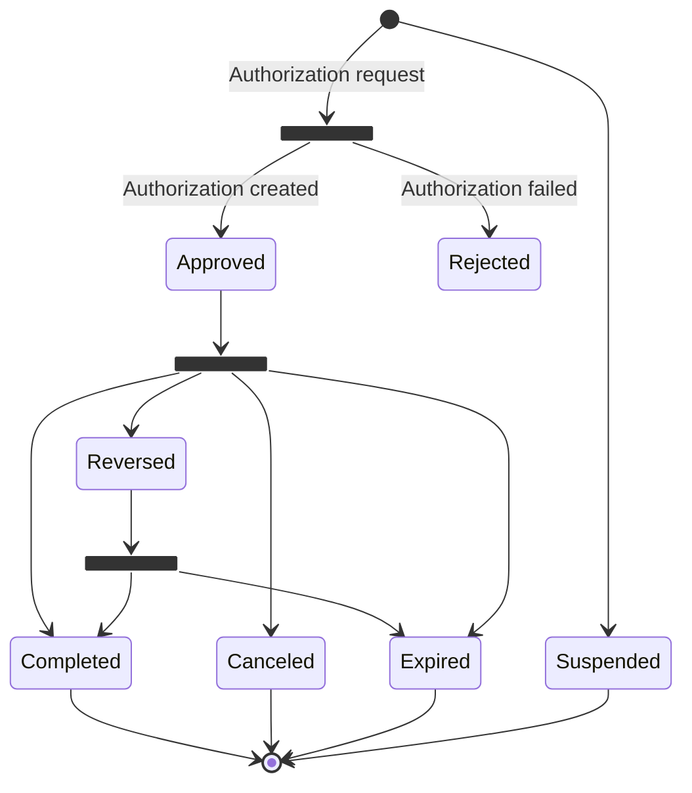
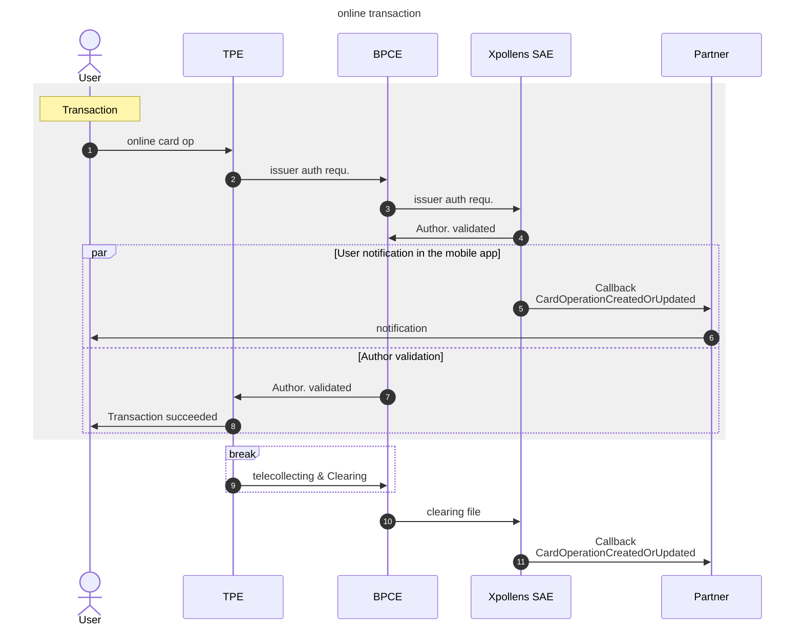
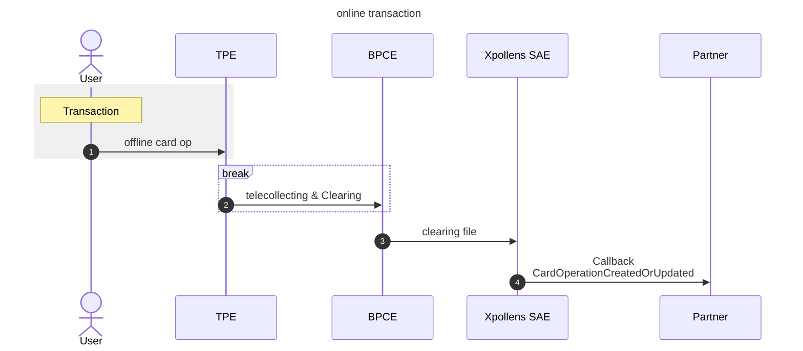

import Image from '@theme/Image';
import Highlight from '@theme/Highlight';
import Endpoint from "@theme/Endpoint"
import Cta from '@theme/Cta'

# Transaction

This part describes the card operation flow from payment initiation / authorization to operation clearing and settlement.

## Feature Flow - Sequence diagram

 

### Card Authorization status

| **Value** | **Description** |
| --- | --- |
| **Approved** | After an authorization creation |
| **Reversed** | After an amount adjustment (partial recovery) |
| **Completed** | 1\. Authorization Online   2\. Authorization Offline |
| **Rejected** | Refused during authorisation |
| **Canceled** | Total recovery |
| **Expired** | After 10 days without clearing (30 days for booking & deposit), 21 days for a withdrawal |
| **Suspended** | Card operation on a closed account |

### Balance diagram

| **Step** | **Authorisation balance** | **Accounting balance** |
| --- | --- | --- |
| 1- Authorisation | x   |     |
| 2-a. Settlement of an existing authorisation |     | x   |
| 2-b. Settlement without authorisation | x   | x   |

  

* * *

## Feature Flow - Sequence diagram for an authorisation and its settlment

  

* * *

## Feature Flow - Sequence diagram for a settlment without authorisation

  
