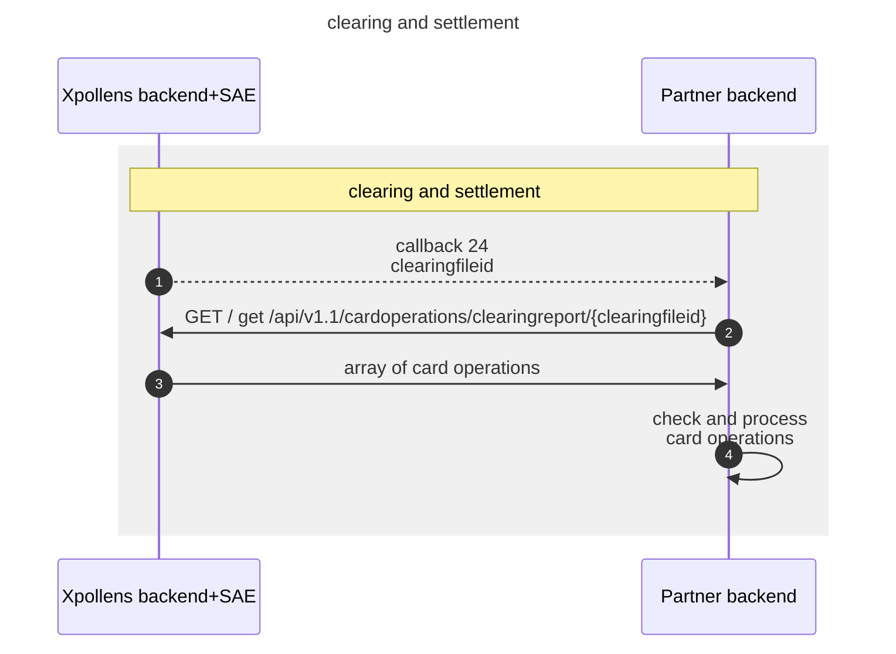

import Image from '@theme/Image';
import Highlight from '@theme/Highlight';
import Endpoint from "@theme/Endpoint"
import Cta from '@theme/Cta'

# Card operation clearing
## Introduction
The clearing process consists in sending once a day a clearing identification number to the partner through **callback 24**.
This clearing identifier will then be used by the partner to call the `clearingreport` API.
This APIs will return **all settled card operations** (online+offline) related to the clearing identifier.
This will allow the partner to update operation list, authorization balances and account balance of every account.

## Sequence diagram


---
## Callback #24 - Card clearing processing

`POST /{callback24Url}`

Callback received in case of status change in a clearing batch file

> Body parameter

```json
{
  "id": "1691",
  "reference": "1691",
  "type": "24"
}
```

### Parameters

|Name|In|Type|Required|Description|
|---|---|---|---|---|
|callback24Url|path|string|true|the location where data will be sent.  Must be network accessible|
|body|body|object|false|JSON Body|
|» id|body|string|false|the Xpollens report id|
|» reference|body|string|false|the batch file clearing report reference|
|» type|body|string|false|the callback type|

### Detailed descriptions

**callback24Url**: the location where data will be sent.  Must be network accessible by the source server

### Responses

|Status|Meaning|Description|Schema|
|---|---|---|---|
|202|[Accepted](https://tools.ietf.org/html/rfc7231#section-6.3.3)|Your server implementation should return this HTTP status code if the data was received successfully|None|
|204|[No Content](https://tools.ietf.org/html/rfc7231#section-6.3.5)|Your server should return this HTTP status code if no longer interested in further updates|None|
* * *
## Get the list of settled card operations
The clearing identifier will be used by the partner to retrieve trhe list of settled operations using the `/api/v1.1/cardoperations/clearingreport/:id:` API.

### ClearingReport API

Calling `/api/v1.1/cardoperations/clearingreport/:id:` to get the list of cleared operations

> Code samples

```shell
# You can also use wget
curl -X GET /api/v1.1/cardoperations/clearingreport/{clearingfileid} \
  -H 'Accept: application/json' \
  -H 'CorrId: 8c7d6d01-157e-40b7-87ae-912445b4c643' \
  -H 'Authorization: Bearer {access-token}'

```

`GET /api/v1.1/cardoperations/clearingreport/{clearingfileid}`

### Parameters

|Name|In|Type|Required|Description|
|---|---|---|---|---|
|clearingfileid|path|string|true|It allows to retrieve the operation of the clearing report with the API|
|userid|query|string|false|User identifier in the third-party application.9 characters exactly|
|CorrId|header|string|false|Correlation Id|

* * *
> Example responses

> 200 Response

```json
{
  "callback_type": 24,
  "batch_reference": 6580,
  "clearings": [
    {
      "card_operation_reference": "gxdfvy508EGRPn8YV30gIw",
      "card_operation": {
        "authorization_reference": "70001720210902",
        "card_identifier": "mycard_1",
        "amount": 3159,
        "date": "2021-09-02T14:02:08.0070000+00:00",
        "merchant_name": "TEST",
        "merchant_category_code": 5411,
        "financial_network_code": "VISA",
        "original_amount": 3159,
        "currency": "EUR",
        "exchange_rate": 1,
        "merchant": {
          "name": "AZUR",
          "street": "",
          "city": "AIX"
        },
        "type_code": "00",
        "pos_entry_mode": "0",
        "operation_type": 505,
        "operation_status": 1,
        "service_fee": 0,
        "direction": 2,
        "clearing_date": "2021-09-03T18:00:04.6200000+00:00"
      }
    }
  ]
}
```

### Responses

|Status|Meaning|Description|Schema|
|---|---|---|---|
|200|[OK](https://tools.ietf.org/html/rfc7231#section-6.3.1)|OK|[Smoney.API.Models.Clearing.ReportClearingBatch](#schemasmoney.api.models.clearing.reportclearingbatch)|

<aside class="warning">
To perform this operation, you must be authenticated by means of one of the following methods:
Authorization, Bearer_token_authorization, Sts_authentication
</aside>

* * *
#### Resources

##### Smoney.API.Models.Clearing.ReportClearingBatch

```json
{
  "callback_type": 0,
  "batch_reference": 0,
  "clearings": [
    {
      "card_operation_reference": "string",
      "card_operation": {
        "authorization_reference": "string",
        "card_identifier": "string",
        "amount": 0,
        "date": "2019-08-24T14:15:22Z",
        "merchant_name": "string",
        "merchant_category_code": 0,
        "financial_network_code": "string",
        "original_amount": 0,
        "currency": "string",
        "exchange_rate": 0,
        "merchant": {
          "name": "string",
          "street": "string",
          "city": "string"
        },
        "type_code": "string",
        "pos_entry_mode": "string",
        "operation_type": 0,
        "operation_status": 0,
        "service_fee": 0,
        "direction": 0,
        "clearing_date": "2019-08-24T14:15:22Z"
      }
    }
  ]
}

```

Clearing file processing report

**Properties**

|Name|Type|Required|Restrictions|Description|
|---|---|---|---|---|
|callback_type|integer(int32)|false|none|Contains the callback number that indicates to the partner the file reference (is always 24)|
|batch_reference|integer(int64)|false|none|Contains the reference of the file containing the operations.|
|clearings|[[Smoney.API.Models.Clearing.ReportClearing](#schemasmoney.api.models.clearing.reportclearing)]|false|none|Object containing all the operations processed in the festopeme|

* * *
##### Smoney.API.Models.Clearing.ReportClearing

```json
{
  "card_operation_reference": "string",
  "card_operation": {
    "authorization_reference": "string",
    "card_identifier": "string",
    "amount": 0,
    "date": "2019-08-24T14:15:22Z",
    "merchant_name": "string",
    "merchant_category_code": 0,
    "financial_network_code": "string",
    "original_amount": 0,
    "currency": "string",
    "exchange_rate": 0,
    "merchant": {
      "name": "string",
      "street": "string",
      "city": "string"
    },
    "type_code": "string",
    "pos_entry_mode": "string",
    "operation_type": 0,
    "operation_status": 0,
    "service_fee": 0,
    "direction": 0,
    "clearing_date": "2019-08-24T14:15:22Z"
  }
}

```

**Properties**

|Name|Type|Required|Restrictions|Description|
|---|---|---|---|---|
|card_operation_reference|string|false|none|none|
|card_operation|[Smoney.API.Models.Clearing.ReportCardOperation](#schemasmoney.api.models.clearing.reportcardoperation)|false|none|none|

* * *
##### Smoney.API.Models.Clearing.ReportCardOperation

```json
{
  "authorization_reference": "string",
  "card_identifier": "string",
  "amount": 0,
  "date": "2019-08-24T14:15:22Z",
  "merchant_name": "string",
  "merchant_category_code": 0,
  "financial_network_code": "string",
  "original_amount": 0,
  "currency": "string",
  "exchange_rate": 0,
  "merchant": {
    "name": "string",
    "street": "string",
    "city": "string"
  },
  "type_code": "string",
  "pos_entry_mode": "string",
  "operation_type": 0,
  "operation_status": 0,
  "service_fee": 0,
  "direction": 0,
  "clearing_date": "2019-08-24T14:15:22Z"
}

```

* * *
**Properties**

|Name|Type|Required|Restrictions|Description|
|---|---|---|---|---|
|authorization_reference|string|false|none|Authorization unique reference|
|card_identifier|string|false|none|Thirdparty card ID|
|amount|integer(int64)|false|none|Transaction amount (in cents)|
|date|string(date-time)|false|none|Date and Time the authorization was processed into the system Smoney Time zone reference=Zulu Time(UTC+0)|
|merchant_name|string|false|none|Card acceptor Name|
|merchant_category_code|integer(int32)|false|none|It allows to identify the merchant|
|financial_network_code|string|false|none|Cards network|
|original_amount|integer(int64)|false|none|Amount before exchange,in the smallest currency division|
|currency|string|false|none|Currency code ISO 4217|
|exchange_rate|number(double)|false|none|Exchange rate,1 if euro|
|merchant|[Smoney.API.Models.Clearing.ReportMerchant](#schemasmoney.api.models.clearing.reportmerchant)|false|none|none|
|type_code|string|false|none|Transaction description|
|pos_entry_mode|string|false|none|POS capability ISO8583|
|operation_type|integer(int32)|false|none|Values of operation's type are: (504: CardOperation In, 505: CardOperation Out, 510: CardOperation In Refund, 511: CardOperation Out Refund, 516: ATM Out, 517: ATM Out Refund)|
|operation_status|integer(int32)|false|none|Values of operation's status are (1: Completed, 2: Refunded)|
|service_fee|integer(int32)|false|none|Service fee amount in cents|
|direction|integer(int32)|false|none|Values of operation's direction for the user are (1: In / Credit , 2: Out / Debit)|
|clearing_date|string(date-time)|false|none|Date and time (ZT) the operation was processed in the FestOpeme|

* * *
##### Smoney.API.Models.Clearing.ReportMerchant

```json
{
  "name": "string",
  "street": "string",
  "city": "string"
}

```

**Properties**

|Name|Type|Required|Restrictions|Description|
|---|---|---|---|---|
|name|string|false|none|none|
|street|string|false|none|none|
|city|string|false|none|none|

* * *
## FAQ

**How to handle the clearing file**

The clearing file returned by the `/api/v1.1/cardoperations/clearingreport/{clearingfileid}` API contains the list of every card operation that has been settled or have an impact on account balance or account authorization balance (payments, partial recovery, cancellation, partial cancellation, expiration)

The callback 24 containing the clearing Id will be sent every day.

> It does not contain refused operations.

* * *
**Handle Operation reference**

The pivot operation reference is available in the `card_operation_reference` field of each operation of  the `clearings` array.
The `authorization_reference` contained in the `card_operation` section of the JSON is the internal reference of the initial authorization. It is built by concatenating the approval code of the authorization along with the date of the sale. In the case of an online operation, the date of sale is empty.
There is no way appart from the missing date of sale in the `authorization_reference` field to know from the clearing if an operation has been performed **online** or **offline**

* * *
**Amounts**

The *settled amount* is available for each operation in the `amount` field of each `card_operation`.
Direction is mentionned in the `direction` field specifying if the operation has to be **credited** (1: In / Credit) or **debited** (2: Out / Debit) to or from the user account.
`amount` is specified in **Euro**.
Original amount in local `currency` is available in the `original_amount` field of the JSON.
Exchange rate that is applied between local currency and settlement curency (Euro) is available in the `exchange_rate` fields of the JSON.

* * *
**Merchant Name**

The clearing report contains two section with information about the merchant.

|  |  |  |  |
|--|--|--|--|
|merchant_name|string|false|none|Card acceptor Name|
|merchant_category_code|integer(int32)|false|none|It allows to identify the merchant|

and 

|  |  |  |  |
|--|--|--|--|
|merchant|[Smoney.API.Models.Clearing.ReportMerchant](#schemasmoney.api.models.clearing.reportmerchant)|false|none|none|
|\|----name|string|false|none|none|
|\|----street|string|false|none|none|
|\|----city|string|false|none|none|

<br/>

The relevant merchant name merchant information to be used by the partner are `merchant_name` and `merchant_category_code`.
The `merchant` section of the JSON is inherited from the authorization request and may not be accurate and it will be empty for *offline operations*.


* * *
**Operation types**
The type of the card operation will be available in the `operation_type` field of the JSON.
Each operation type is either a debit or credit operation.

| code | label      | direction | description                     |
|------|------------|-----------|---------------------------------|
| 500  | Regul_DebitMoney | out | internal debit adjustment |
| 501  | Regul_CreditMoney| in  | internal credit adjustment|
| 504  | CardOperation_In | in  | debit |
|505   |CardOperation_Out | out | credit |
|510   |CardOperation_In_Refund | in | card operation partial or total refund |
|511   |CardOperation_Out_Refund | out | ? |
|516   |ATM_Out | out | ATM withdrawal |
|517   |ATM_Out_Refund |in | ATM refund|

> Note that for a card operation authorization received in callback 20, the only available status will be 505 and 516. Other status will only occur in callback 24 / clearing.

* * *
**Fund reservation**

TBD

* * *
**Partial Capture**

TBD

* * *
