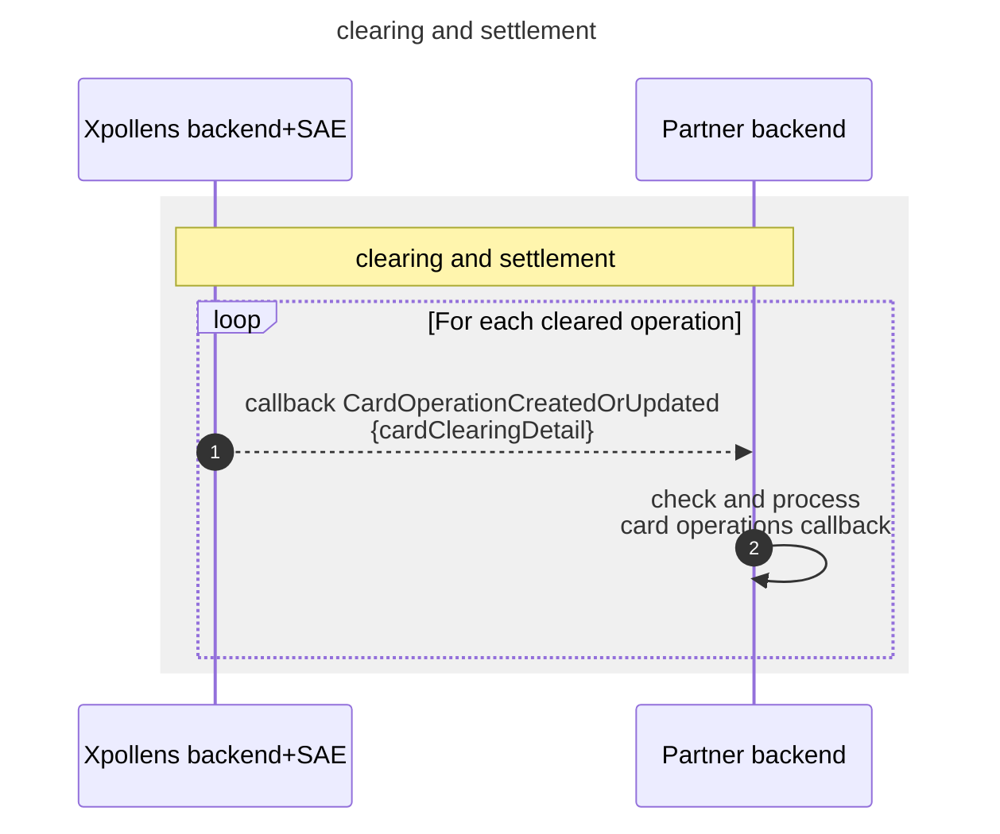
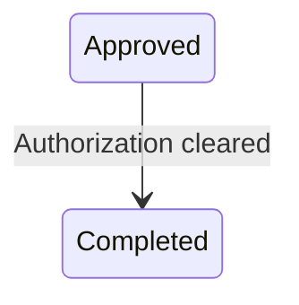

import Image from '@theme/Image';
import Highlight from '@theme/Highlight';
import Endpoint from "@theme/Endpoint"
import Cta from '@theme/Cta'

# Card operation clearing & settlement

## Introduction

The clearing process consists in sending once a day one callback **CardOperationCreatedOrUpdated** per cleared authorisation.

  

* * *

## Operation clearing - Sequence diagram

The content of the callback is the same as that of the API. Therefore, you should directly use the callback to populate your databases.

> /!\ One callback is received for **each** authorisation cleared. This means that you can receive dozens or hundreds of callbacks over a short period, depending on the number of transactions carried out by your cardholders.

  

* * *

## Operation clearing - State diagram

### State diagram

The `Expired` status is part of the authorisation state worfklow.

  

* * *

## FAQ for settlement

### FAQ1 - Can the amount of the cleared transaction be different from the authorisation?

Yes, in the majority of cases the trend is downwards, but there are a few rare cases where the trend is upwards.

### FAQ2 - Can other information change?

The information conveyed by the `cardAuthorizationDetail` section will not be modified, but the data conveyed by `cardClearingDetail` may differ from the values of the authorization.

### FAQ3 - Should I show my user the authorisation information or the compensation information?

We recommend displaying the compensation information, even though this may lead to changes in the details of the operation.

  
