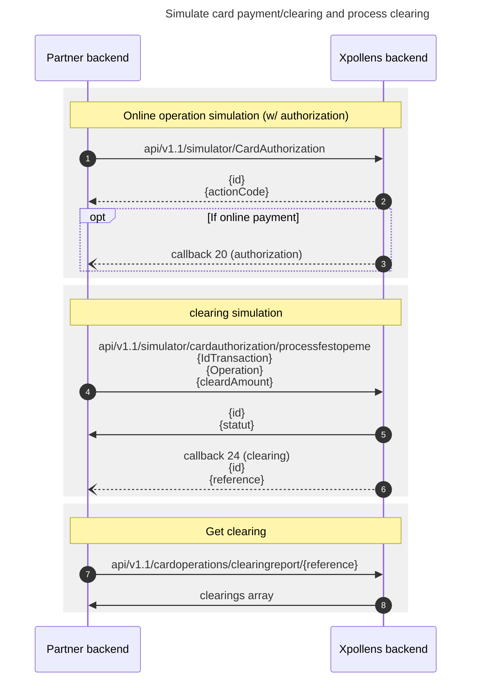

import Image from '@theme/Image';
import Highlight from '@theme/Highlight';
import Endpoint from "@theme/Endpoint"
import Cta from '@theme/Cta'

# HOW TO TEST
## Card Operation and clearing simulator APIs
XPollens provide some test API that simulate :

* **A card operation**
	* simulator/cardauthorization 
* **A clearing/settlement (partial or total)**
	* /simulator/cardauthorization/processfestopeme
* **Total Reversal**
	* /simulator/cardauthorization/cardredressement
* **Partial Reversal**
	* /simulator/cardauthorization/cardredressement/partial
* **Apple Pay wallet enrollment**
	* /simulator/cardauthorization/applepaygreenflow
	* /simulator/cardauthorization/applepayyellowflow
	* /simulator/cardauthorization/applepayorangeflow
* **Custom card authorization**
	* /simulator/cardauthorization/customauthorization
	* **some additional parameters can be passed to the card authorization request**
* **Custom clearing/settlement**
	* /simulator/cardauthorization/processfestopmcustom
	* **some additional paramters can be passed to the clearing/settlement request**
* **Card opposition**
	* /simulator/cardauthorization/CardOpposition
* **DAC (Fuel dispenser) simulator**
	* /simulator/cardauthorization/carddacredressement

Those APIs are documented in the **S-money-API-SandboxSimulator-CardOperation-BiB-v1.2x-en.docx** document.
The document is available here : 
https://docs.xpollens.com/assets/files/S-money-API-SandboxSimulator-CardOperation-BiB-v1.25-en-cd9f1ac76f65ec57b9599665e53cdb25.docx

* * *

## Sequence diagrams
### Card payment and clearing

* * *
# USE CASE
## Online Proximity payment fully settled
TBD
## Offline Proximity payment fully settled
TBD
## Online Proximity payment partially settled w/ partial reversal
TBD
## Total Refund
TBD
## Partial Refund
TBD
## Fuel dispenser 
TBD

