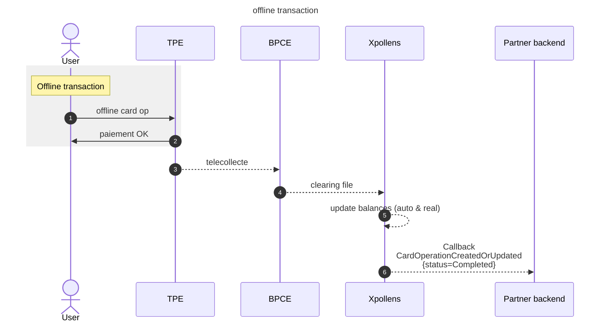
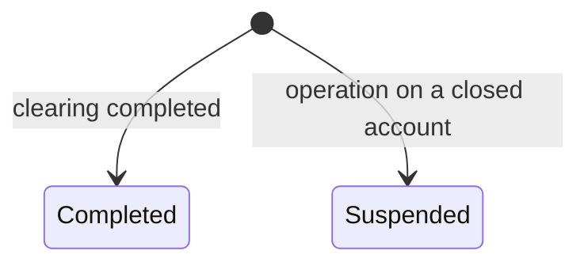

import Image from '@theme/Image';
import Highlight from '@theme/Highlight';
import Endpoint from "@theme/Endpoint"
import Cta from '@theme/Cta'

# Offline card transaction

## Sequence diagram

  

* * *

## State diagram

  

* * *

## When does offline card transactions occur ?

All cards issued by Xpollens do require an authorization, but with exceptions: tolls, car parks, plane purchases, payments on marketplaces, merchant forcing.

**Plane purchases & Merchant forcing**: it can happen that some equipments are parameterized by merchant to **force** acceptation of offline payments so that an offline transaction may be accepted by payment terminal.  
In this case, the offline card payments will be accepted by the POS terminal and will be seent for clearing and settlement along with other card operations.  
Refunds will also trigger some offline operations.

There are two types of tpes used in plane: tpe that performs operations offline only, and tpe that sends authorisations asynchronously as soon as it gets the network back.

**Tolls & car parks:** in the past, in the interests of speed or the network, car parks and toll booths did not require authorisation for payment.  
Today, good practice is changing. However, some tolls and car parks have not yet made the switch, so all operations are carried out offline.We could not block these transactions without risking blocking cardholders, hence the exceptions put in place.

**Payments on marketplace** : When buying through a marketplace, a single authorisation is received for all purchases from each merchant.  
However, if a clearing operation from one merchant arrives before the others, the following process applies:  
1- the compensation is matched with the authorisation, and the amount is modified by the amount of the compensation  
2- all the other offsets that arrive will become offline transactions, with no link to the authorisation.

  
 

* * *
