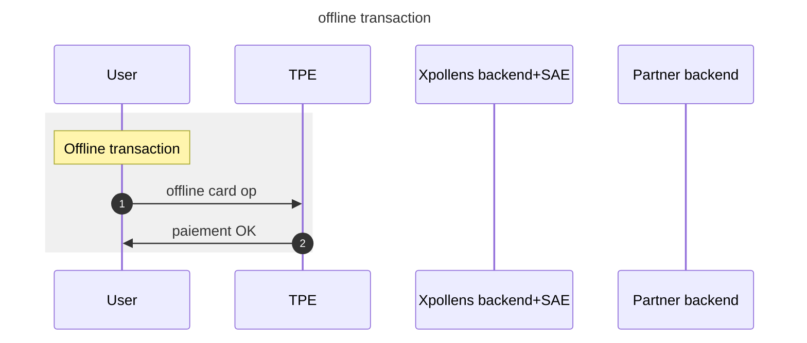

import Image from '@theme/Image';
import Highlight from '@theme/Highlight';
import Endpoint from "@theme/Endpoint"
import Cta from '@theme/Cta'

# Offline card transaction
## Sequence diagram

## FAQ
### FAQ1 - When does offline card transactions occur ?
All cards issued by Xpollens do normally require an authorization.
Nevertheless, it can happen that some equipments are parameterized by merchant fo **force** acceptation of offline payments so that an offline transaction may be accepted by payment terminal. 
In this case, the offline card payments will be accepted by the POS terminal and will be seent for clearing and settlement along with other card operations.
Refunds will also trigger some offline operations.

*see next chapter*
* * *
