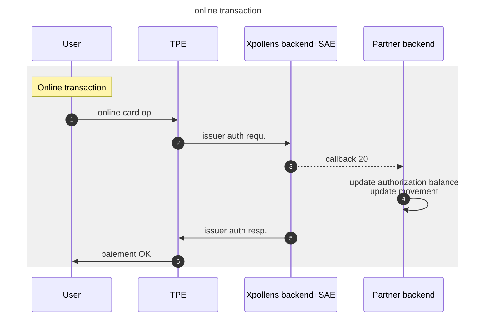
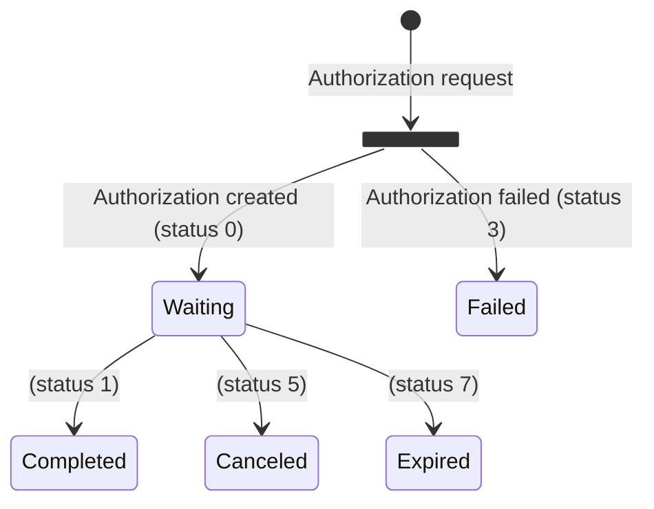

import Image from '@theme/Image';
import Highlight from '@theme/Highlight';
import Endpoint from "@theme/Endpoint"
import Cta from '@theme/Cta'

# Online card transaction
## Feature Description
This document describes the card operation flow from payment initiation / authorization to operation clearing and settlement.

## Feature Flow - Sequence diagram


---
## Callback #20 - Card operation
`POST /{callback20Url}`

Callback received when a card authorization is created following its processing in Xpollens and each time its status change

> Body parameter (exemple)

```json
{
  "id": "464890",
  "reference": "8Y8Loh9L8E6FJsA7J1Tyrg",
  "type": "20",
  "appCardId": "test_card",
  "hint": "9396XXXXXXXX6075",
  "transactionAmount": "11.9",
  "currencyCodeTransaction": "978",
  "cardHolderBillingAmount": "",
  "cardHolderBillingConversionRate": "",
  "availableBalance": "0.96",
  "actionCode": "0",
  "merchantType": "5814",
  "cardAcceptorIdentificationCodeName": "MC DONALD S\\\\GRENOBLE",
  "status": "0",
  "ert": "10",
  "cardDataInputMode": "9",
  "tokenRequestorID": "",
  "terminalCountryCode": "250",
  "userid": "dyYiUtSrj",
  "executedDate": "01/12/2022 14:44:09"
}
```

* * *

### Parameters

|Name|In|Type|Required|Description|
|---|---|---|---|---|
|callback20Url|path|string|true|the location where data will be sent.  Must be network accessible|
|body|body|object|false|JSON Body|
|» id|body|string|false|the Xpollens internal authorization id|
|» reference|body|string|false|the operation orderid|
|» type|body|string|false|the callback type|
|» appCardId|body|string|false|the reference or alias of the card|
|» hint|body|string|false|the card number hint|
|» transactionAmount|body|string|false|the amount in local currency in decimal|
|» currencyCodeTransaction|body|string|false|the transaction currency code (ISO 4217 numeric code)|
|» cardHolderBillingAmount|body|string|false|the amount in euro (used for foreign currency transactions) in decimal format|
|» cardHolderBillingConversionRate|body|string|false|the exchange rate (used for foreign currency transactions) in decimal value in string data type|
|» availableBalance|body|string|false|the balance after authorisation (or after a change in status = cancellation, expiry) in decimal format|
|» actionCode|body|string|false|the response code (authorization and reasons for refusal) :  |
|» merchantType|body|string|false|the merchant type (Merchant Category Code) is a four-digit number listed in ISO 18245 for retail financial services. An MCC is used to classify a business by the types of goods or services it provides|
|» cardAcceptorIdentificationCodeName|body|string|false|the merchant information (name, adress,etc…)|
|» status|body|string|false|the Operation status :  |
|» ert|body|string|false|the regulatory and technical environment  |
|» cardDataInputMode|body|string|false|the input mode for the payment :  |
|» tokenRequestorID|body|string|false|the id of the token requestor :  |
|» terminalCountryCode|body|string|false|the Country where the payment took place|
|» userid|body|string|false|the user unique identifier|
|» executedDate|body|string|false|the executed date of the operation. Warning: unusual date format: (dd/MM/yyyy hh:mm:ss)|

* * *
#### Detailed descriptions

**callback20Url**: the location where data will be sent.  Must be network accessible by the source server

**» actionCode**: the response code (authorization and reasons for refusal) :  
0 = approved  
100 = denied, invalid card status  
114 = denied, authorisation server does not respond  
116 = denied, insufficient funds or limits reached  
119 = denied, transaction not permitted to cardholder  
198 = denied, technical error  
other = denied, Natixis refused the transaction

> `actionCode` is inherited from the authorization server and brings some details about the refusal of the card authorization if any.
> It is direcly related to the `status` of the operation. If `actionCode`=0 then `status`=0, if `actionCode`>0 then `status`=3

**» status**: the Operation status :  
0 = waiting  
1  = completed
3 = failed  
5 = cancelled  
7 = expired

> `status` is the XPollens status of the card authorization. Possible `status` returned consequently to the authorisation request are 0/waiting and 3/failed. Other status may happen during the life cycle of the card operation (5/cancelled, 7/expired)

**» ert**: the regulatory and technical environment  
10 = proximity (face-to-face payment)  
2x = online payment  
4x = unattended vending machine  
6x = quasi-cash  
7x = withdrawal (ATM or bank agency)

**» cardDataInputMode**: the input mode for the payment :  
0 = unspecified  
5 = contact  
9 = contactless  
Other = manual (no terminal), magnetic stripe,…

**» tokenRequestorID**: the id of the token requestor :  
40010030273 = Apple Pay  
40010043095 = Samsung Pay  
40010069887 = Garmin Pay  
40010051602 = Amazon(COF)  
40010075001 = Google Pay  
40010075839 = Netflix (COF)  
40010075338  = Visa Checkout - VCO

<h3 id="#20---card-operation-responses">Responses</h3>

|Status|Meaning|Description|Schema|
|---|---|---|---|
|202|[Accepted](https://tools.ietf.org/html/rfc7231#section-6.3.3)|Your server implementation should return this HTTP status code if the data was received successfully|None|
|204|[No Content](https://tools.ietf.org/html/rfc7231#section-6.3.5)|Your server should return this HTTP status code if no longer interested in further updates|None|

* * *

## FAQ
When the partner receives the callback 20, some information need to be recorded to track the card operation.

For **ATM** withdrawals, the account balance will be updated along the authorization balance.


**Scope**

For each **online** card operation authorization, the partner will receive a callback 20.
Information contained in the callback #20 deals with a single card operation (authorization).
Information contained in the callback #20 allows partner to update :

* the authorization balance amount of the customer account
* the card operation list of the customer
<br/>

**Card information request**

A card information request (wallet card tokenisation, card on file) will not trigger the callback #20, but a callback #25.
<br/>

**Authorization reference / OrderId**

The `reference` field is the pivot ID that will allow the partner to link an authorization request to a settled payment amount.
The `id` field is an internal ID that **should not be used by the partner**.
<br/>

**Amounts**

* `transactionAmount` is the requested authorized amount in **local currency**. 
  
  > Note that this amount can be null in some cases.

* `currencyCodeTransaction` is the local currency code (ISO 4217)

* `cardHolderBillingAmount` is the requested converted authorized amount in **Euros** (based on `cardHolderBillingConversionRate`)

* `cardHolderBillingConversionRate`is the converstion rate applied on local currency amount to retrieve euro amount at the time of the authorization request.

> `transactionAmount` * `cardHolderBillingConversionRate` = `cardHolderBillingAmount`

* * *

**`ActionCode` and `Status`**

In the case of an authozrized transaction, `ActionCode` will always be **0** (approved) and `Status` will always equal **0** (waiting)
In the case an authorization is refused, `ActionCode` will be **>0** and `Status` will always equal **3** (failed)
All other cases (**1**(completed), **5** (cancelled), **7** (expired)) can not happen in first place but can happen subsequently on an already authorized transaction.

> Authorization State diagram



**`merchantType`**

The `merchantType` will always be set (can't be `null`) in the callback 20 response body.
It matches the MCC (Merchant Category Code) of the merchant based on ISO 18245 (https://www.iso.org/fr/standard/79450.html)

**`cardAcceptorIdentificationCodeName`**

The `cardAcceptorIdentificationCodeName `  is the merchant Name.
This data will always be set in the callback 20.

**`terminalCountryCode`**

This fields contains the country code of country where card operation occurs.
**It may not be available** in some cases (Web Payment, ATM withdrawals, ..)

**Card Authorization expiration**

The card authorization -if not settled- will expire after 7 days in most cases.
Some card authorization for specific MCC (hotels, car rent, ..) can last up to 31 days before they expire if no capture is performed on operation.

