import Image from '@theme/Image';
import Highlight from '@theme/Highlight';
import Endpoint from "@theme/Endpoint"
import Cta from '@theme/Cta'

# Online card transaction

## Online Authorisation - Description

An transaction is named "online" if an authorization exists.  
Otherwise, we talk about offline transaction.

  

* * *

## Online Authorisation - Sequence diagram

  

* * *

## Online Authorisation - State diagram & balance

### State diagram

  

* * *

## Authorisation context

The context of card usage is provided in field `context` .  
Depending on this context, the `method` varies to provide even more details about the operation conducted.

The `merchantName` should be displayed in the cardholder's mobile application to provide them with details about their transaction history.

The `tokenRequestorId` is filled in only if the payment has been made with a tokenized card.

The `merchantCategoryCode` will always be set. It is based on ISO 18245 (https://www.iso.org/fr/standard/79450.html)

Payments made abroad are characterized by:

- `localAmount` is not null and contains details about the currency and the value
- `conversionRate` explains how the `amount` is calculated from the `localAmount`

  

* * *

## Authorisation failed

An authorization can fail for various reasons stemming from the card, the account, the transaction conducted, etc.  
In case of authorization refusal, use the `rejectReason` to provide information to your cardholder.

| rejectReason |
| --- |
| AccountLimitsExceeded |
| AccountStatus |
| ActivationDeclined |
| ActivationDeclinedCapture |
| BlockedCard |
| CardLocked |
| CryptoFailure |
| CVV2Blocked |
| CVV2Failed |
| ExpiredCard |
| ForeignOperationBlocked, |
| InsertCardNeeded |
| InsufficientAccountBalance |
| Limits exceeded relatives to the period |
| MerchantNotAuthorized |
| MonthlyPaymentLimitExceeded |
| PINBlocked |
| PINFailed |
| RemotePaymentBlocked |
| SuspiciousFraud |
| TechnicalError |
| TechnicalErrorCapture |
| Timeout |
| TransactionNotAllowed |
| WeeklyWithdrawalLimitExceeded |

  

* * *

## Card Authorization expiration

The card authorization -if not settled- will expire after 10 days in most cases.  
Some card authorization for specific MCC (hotels, car rent, ..) can last up to 31 days before they expire if no capture is performed on operation.
Withdrawals expire after 21 days.

In some rather rare cases, settlements may occur belatedly, after the regulatory delay of 10 and 31 days. In these instances, the authorization expires, and the compensation will be created as an offline operation.

  

* * *

## Authorisation partial or total reversal

Used in particular in fuel distributors.

```mermaid
sequenceDiagram
title: online transaction
autonumber
Actor User
participant TPE
participant BPCE
participant Xpollens SAE
participant Partner

       	Note over User: Transaction
       	User ->> TPE: online card op
       	TPE ->> BPCE: issuer auth requ.
       	BPCE ->> Xpollens SAE: issuer auth requ.
       	Xpollens SAE ->> BPCE: Author. validated
                Xpollens SAE -->> Partner: CardOperationCreatedOrUpdated  {status=Approved, localAmount.Value=X}

rect rgb(245,244,255)
                break Pending the final amount of the operation
        		User-->	Xpollens SAE : 
    		end

            alt Partial reversal
                BPCE ->> Xpollens SAE: partial reversal
                Xpollens SAE -->> Partner: Callback <br/>  CardOperationCreatedOrUpdated  {status=Reversed, localAmount.Value=Y}
            else Total reversal
                BPCE ->> Xpollens SAE: total  reversal
                Xpollens SAE -->> Partner: Callback <br/>  CardOperationCreatedOrUpdated  {status=Canceled, localAmount.Value=0.00}
                end
end 
```

  

* * *

## ATM withdrawal

ATM withdrawal is an online transaction. It is define by the `cardOperationType` = AtmWithdrawal

> Note: ATM withdrawal under 20€ are refused.

  

* * *

## Internet payments

> Note: In any case, the Xpollens checks are performed after the 3DS check.

### Sequence diagram

  

* * *

## Xpay

An Xpay is an online transaction. In case of an Xpay, the `tokenRequestorId` is not null, and details the provider from which the card was tokenised.

  

* * *

## FAQ about card authorisation

### FAQ1 - Card information request

A card information request (wallet card tokenisation, card on file) will not trigger the callback #CardOperationCreatedOrUpdated, but a callback #25.

### FAQ2 - `merchantType`

The `merchantType` will always be settled (can't be `null`) in the callback CardOperationCreatedOrUpdated response body.  
It matches the MCC (Merchant Category Code) of the merchant based on ISO 18245 (https://usa.visa.com/content/dam/VCOM/download/merchants/visa-merchant-data-standards-manual.pdf)

### FAQ3 - One payment but multiple settlement

On marketplaces, one authorisation can lead to several settlements.  
For example  
I am on marketplace A,  
I have a basket of 3 items from 3 different merchants,  
when I pay, I only receive one payment authorisation.  
However, 3 transactions are carried out at the 3 merchants.  
So 3 compensations will be issued by the 3 banks of my merchants.  
In this case, the first clearing will match the authorisation. The other two clearing will created offline operations.
