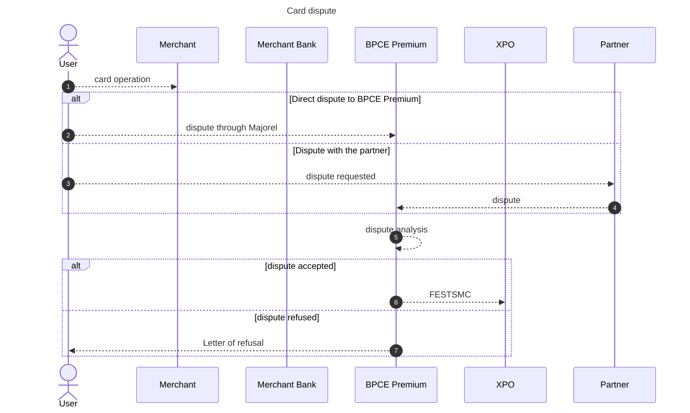
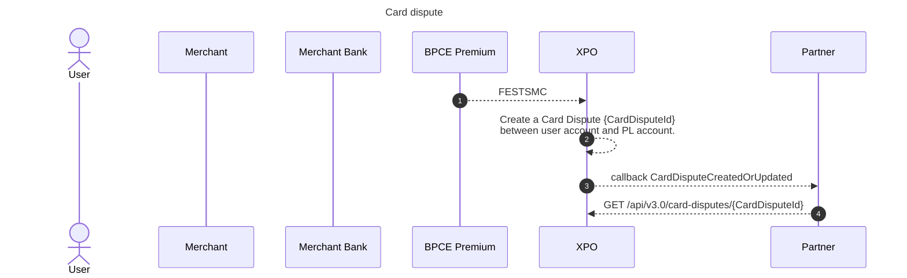
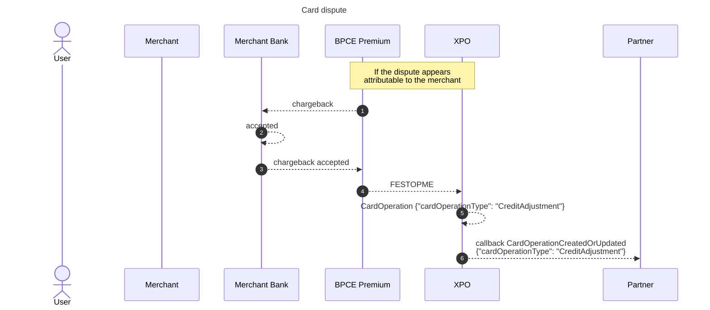

import Image from '@theme/Image';
import Highlight from '@theme/Highlight';
import Endpoint from "@theme/Endpoint"
import Cta from '@theme/Cta'


# Card Dispute

## Definition and rules

A cardholder contestation is a dispute initiated by a cardholder (debit or credit card) regarding a transaction on their card statement. He think there is an issue with the transaction and want it to be investigated and potentially reversed.

:::warning Important  
A cardholder have 13 months to contest a cardpayment. Once this period passed, the customer can no longer dispute the payment.  
:::

How the process works:

1/ Cardholder identifies a problem in his payment: It can be one of the problem described above.

2/ Cardholder initiates the contestation: The cardholder contacts his bank and reports the disputed transaction.

3/ Bank investigates: The bank investigates the claim by contacting the merchant and reviewing relevant information and constitutes a contestation folder.

4/ Communication through FEST messages: Depending on the system used by the bank, FEST messages (particularly FEST SMC) might be used to communicate the details of the dispute electronically. The FEST SMC message would detail the nature of the dispute and the desired resolution.

:::note  
A dispute can involve either a credit or debit transaction; however, the most common scenario is the dispute of a debit transaction.  
For this reason, the following content focuses on this specific use case.  
:::

 <br/><br/>  
  
* * *

## Preparation of the dispute file and dispute analysis



A dispute may be rejected for various reasons, such as:

- The deadline for filing has passed.
- The dispute is not applicable because the payment was made using strong authentication.

<br/><br/>

* * *

## Dispute accepted, client refunded (new behavior)



<br/><br/>

* * *

## Chargeback to the merchant

If BPCE Premium determines that the fault lies with the merchant, it can issue a chargeback with the aim of recovering the funds from the merchant's bank.





<br/><br/>

* * *
## Webdesk
The card dispute is available on the webdesk, named "Contestation carte".
A link is created with the initial operation when this information is available.

<br/><br/>

<br/><br/>

* * *
## Technical aspects
### Callback CardDisputeCreatedOrUpdated
```json
{
  "CardDisputeId": "222a3d0a-4a3b-40a2-9ba6-826b6f68627a",
  "CardDisputeCreationDate": "2024-09-23T17:46:26Z",
  "InitialCardOperationId": null,
  "Amount": 
   {
   "Value": "31,78",
    "Currency": "EUR"
    },
  "CreditedAccountId": "CC",
  "DebitedAccountId": "PEP-Agent",
  "CardDisputeDetails" :
  {
    "DisputeTriggerEvent": "Settlement_Client_Account",
    "DisputeFileId": "E165282409201155",
    "DisputeNature": "UnauthorizedBillingDispute"
    }
}

```


### GET Card dispute
```json
{
  "cardDisputeId": "DF52BB10-ED3B-4809-B8A8-24EA69296CF8",
  "cardDisputeCreationDate": "2024-11-19T22:30:11.294Z",
  "initialCardOperationId": null,
  "status": 'Completed',
  "amount": {
    "value": "36.15",
    "currency": "EUR"
  },
  "creditedAccountId": "E8A94808-0C20-4AEC-B10E-ADF6FF1D9F5F",
  "debitedAccountId": "8D5E76E1-99F4-4A2E-A36F-AA34862D3C6D",
  "cardDisputeDetails": {
    "disputeTriggerEvent": "Settlement_Client_Account",
    "disputeFileId": "4003988E531799EE",
    "disputeNature": "Information"
  }
}

```

| Attribute name| Type | Constraint | Definition  | 
| --- | --- | --- | --- |
| cardDisputeId   | string | lenght: 26 | Unique card dispute reference |
| cardDisputeCreationDate   | date |--- | Date of creation of the dispute operation card in Xpollens system |
| initialCardOperationId   | string nullable | lenght: 26  | initial card operation |
| status | string | Completed | Status of the card dispute operation |
| amount{} | --- | --- | --- |
| value | string | minLength: 1 <br>pattern: ^\d{1,30}(.\d{1,2})?$<br>default: 1.1| operation amount in euro |
| currency | string | EUR | currency |
| creditedAccountId | string | maxLength: 255 <br> minLength: 1 | Reference of the credited account |
| debitedAccountId | string | maxLength: 255 <br> minLength: 1 | Reference of the debited account |
| cardDisputeDetails{} | --- | --- | ---  |
| disputeTriggerEvent | enum | --- | Trigger event |
| disputeFileId | string | --- | dispute file Id |
| disputeNature | enum | Undefined<br>AbusiveUse<br>LostCard<br>NonViolentStolenCard<br>CardStolenUnderThreat<br>CardNotReceivedByTheHolder<br>CounterfeitCardDetection<br>IdentityFraud<br>MultipleCounterfeitCards<br>AccountTakeover<br>UnauthorizedBillingDispute<br>GeneralInformationRequest<br>Information<br>ExpiredCard<br>ClosedAccount<br>DuplicateTransactionProcessing<br>DefectiveMerchandiseClaim<br>CardholderWithdrawalDispute<br>PreClaimWithdrawalRegulation<br>PartialWithdrawalIncident | Method used for PAN entry to initiate the card operation |

<br/><br/>

* * *
# How to test

Xpollens does not provide a simulator for your use. Consequently, you will need to submit a request to your Customer Integration Manager.

<br/><br/>

* * *
# FAQ

<br/><br/>

* * *
