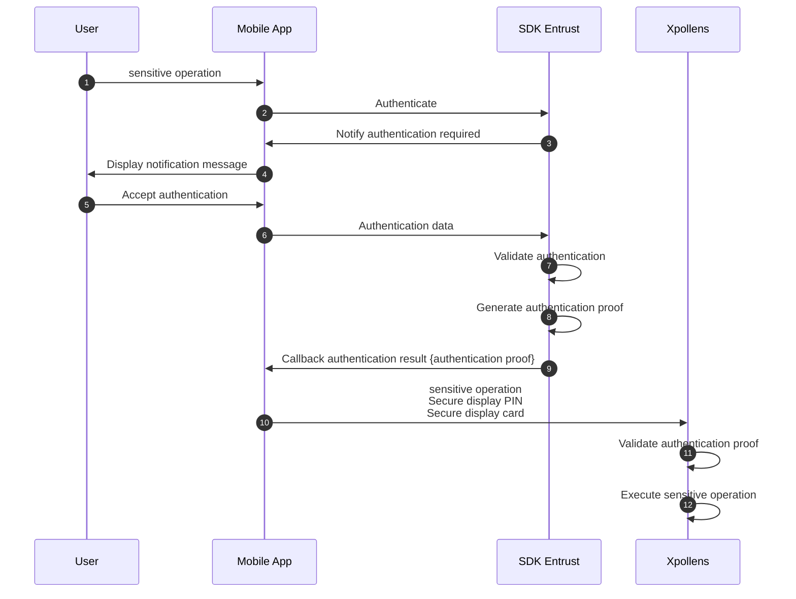
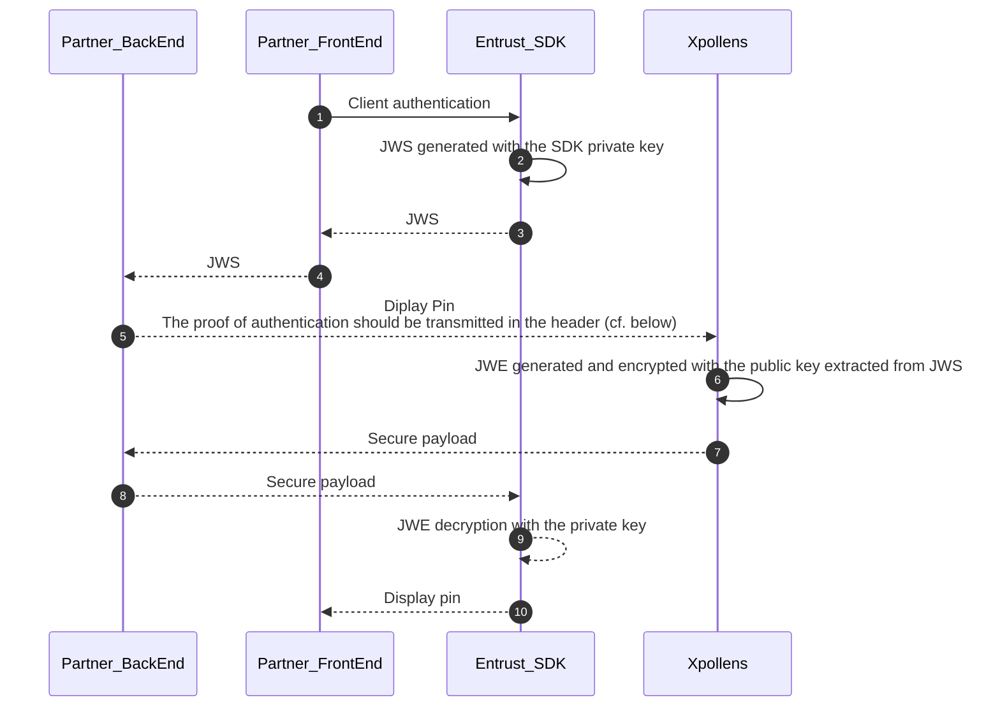
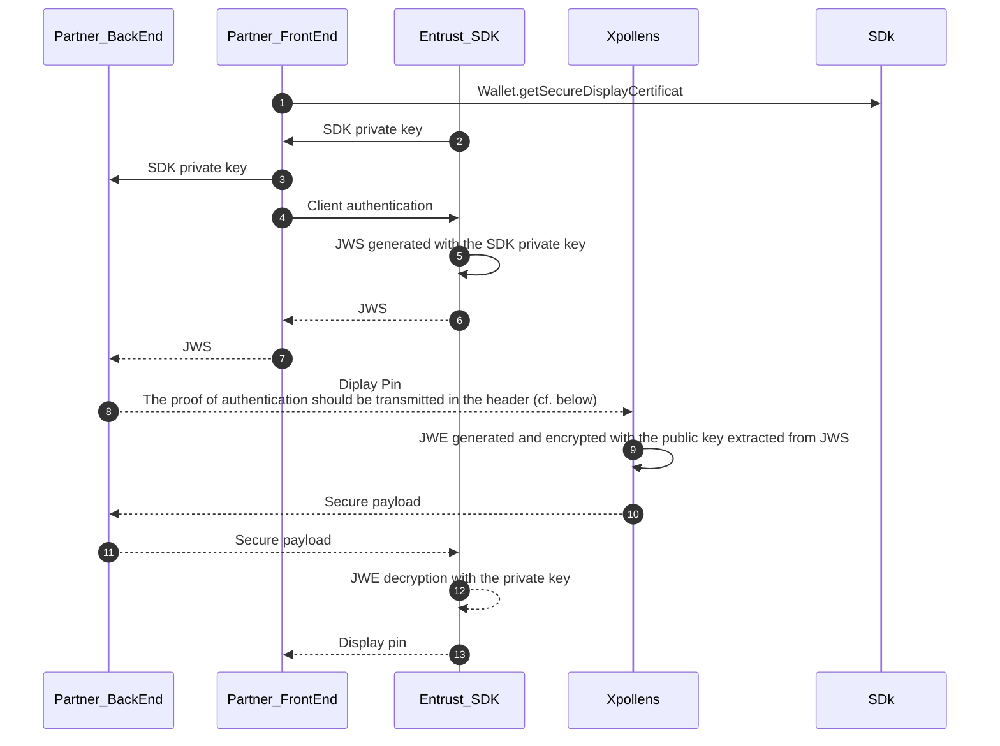
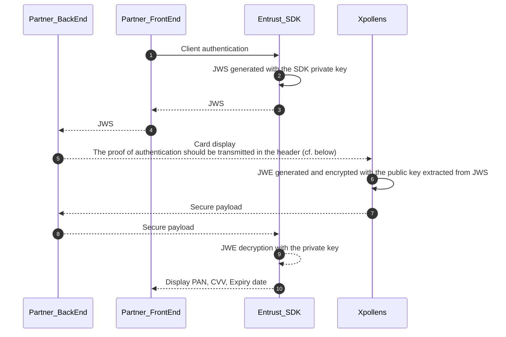
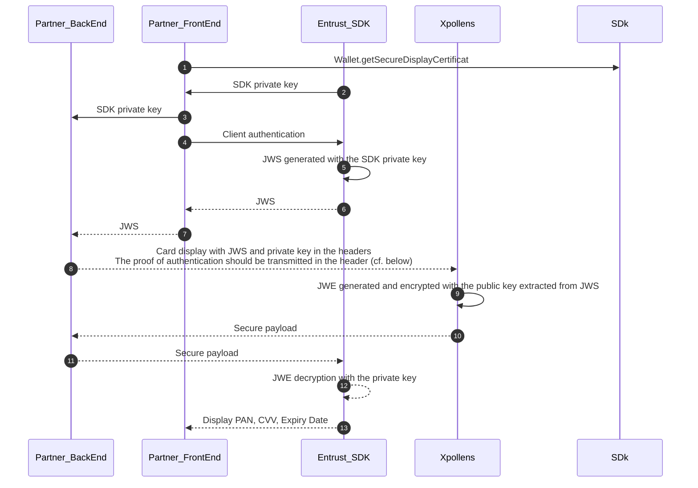

# Physical Cards Selfcare
This document applies for **physical cards**.

* * *

## Card activation

Physical cards can be activated by two ways:

- By withdrawing money from an ATM or by making a local payment using a pin code
- By API through

Before activation, the card status is "Sent".  
As soon as the card is used, the status changed for "Activated".

This status is visible in the webdesk, and a `Callback #21` is received.

It is important to note that VAD (Distance selling) is available as soon as the card status is activated.

### API, Callbacks & technical items

[POST /api/sca/v3.0/cards/{cardId}/activate/{appUserId)](https://docs.xpollens.com/api/CardFactory#post-/api/v3.0/cards/-cardId-/activate)

[`Callback #21`](https://docs.xpollens.com/api/callbacks#post-/-callback21Url-)

* * *

## Card cancellation

Card cancellation is most often used when closing an account, or when the user changes their mind and wants to cancel an order.  
However, the functionality is available throughout the entire lifecycle.

The status changes to 'CANCELED'.

### API, Callbacks & technical items

[POST /api/V3.0/cards/{cardId}/cancel](https://docs.xpollens.com/api/CardFactory#post-/api/V3.0/cards/-cardId-/cancel)

* * *

## Card opposition

Card opposition is available via API and the webdesk, or by calling the VISA call center.

Opposition by the webdesk is only possible for users with a senior profile, or for customised profiles with write access to this section.

### Status

As soon as the card is opposed, the status changed to "OPPOSED". This information is sent thourgh the `Callback #21`.

This action is immediate and irreversible.

If a new card is needed, POST /api/v3.0/cards has to be used (renvoyer vers le use case création de carte)

### API, Callbacks & technical items

[POST /api/v3.0/cards/{cardId}/oppose](https://docs.xpollens.com/api/CardFactory#post-/api/v3.0/cards/-cardId-/oppose)

* * *

## Card remanufacturing

If the card is faulty or does not work, you must ask for it to be remanufactured.  
The old card is automatically '**Deactivated'** as soon as the new card is '**Activated'.**

### API, Callbacks & technical items

[POST /api/v3.0/cards/refabricate](https://docs.xpollens.com/api/CardFactory#post-/api/v3.0/cards/refabricate)

* * *

## Card expiration

The card's validity period is configured when the environment is created. This information is shared with VISA.

As soon as the card expires, the status changes to "EXPIRED" and a `Callback #21` is sent.

The card renewal is automatic. As a new card is ordered, a `Callback #21` is received. All details are available through the API GET /api/v3.0/cards

* * *

## Card information changes depending on the event

| Change | PAN | PIN | CVV | Expiration date |
| --- | --- | --- | --- | --- |
| Cancellation | Change | Change | Change | Change |
| Opposition | Change | Change | Change | Change |
| Remanufacturing | Change | Same | Change | Change |
| Expiration (renewal) | Same | Change | true | Change |

For cancellation, opposition, if a new card is needed:

- by API: order a new card with the POST /api/v3.0/cards and ask for the wishpin
- by webdesk (the new card is systematically with a random pin)

* * *

## Selfcare

### Limits

There are 2 limits on bank cards:

- ATM limits
- Payment limit

For each limit, 2 values are configured when environments are created:  
1- the default amount  
2- the maximum amount  
Customisation by user is then carried out via API (or webdesk).

#### ATM limits

The withdrawal limit is for 7 calendar days.  
Update this limit: [PUT /api/v2.0/card/{cardExternalRef}](https://docs.xpollens.com/api/CardFactory-old#put-/api/v2.0/card/-cardExternalRef-)  
Retrieve the limit value and the used allowance: [GET /api/v3.0/cards/{cardId}](https://docs.xpollens.com/api/CardFactory#get-/api/v3.0/cards/-cardId-)

#### Payment limits

The payment limit is 30 calendar days.  
Update this limit: [PUT /api/v2.0/card/{cardExternalRef}](https://docs.xpollens.com/api/CardFactory-old#put-/api/v2.0/card/-cardExternalRef-)  
Retrieve the limit value and the used allowance: [GET /api/v1.1/cards/{appcardid}/limits](https://docs.xpollens.com/api/Core#get-/api/v1.1/cards/-appcardid-/limits)

* * *
### Temporary blocking

Please note: temporary blocking is not a change in card status, but in one of its attributes. Therefore, changing the boolean does not send a callback 21. The request response has to be integrated in the partner's refential.

Once a card is blocked, all card transactions are impossible.

#### API

[PATCH /api/v3.0/cards/selfcare/{cardId}](https://docs.xpollens.com/api/CardFactory#patch-/api/v3.0/cards/selfcare/-cardId-) : field isFrozen.  
[GET /api/v3.0/cards/{cardId}](https://docs.xpollens.com/api/CardFactory#get-/api/v3.0/cards/-cardId-) : field isFrozen.

#### Webdesk

A card can be blocked temporary through the webdesk for profil "senior operator".

* * *

### Geoblocking

Please note: temporary blocking is not a change in card status, but in one of its attributes. Therefore, changing the boolean does not send a callback 21.

#### API

[PATCH /api/v3.0/cards/selfcare/{cardId}:](https://docs.xpollens.com/api/CardFactory#patch-/api/v3.0/cards/selfcare/-cardId-) isInternationalPaymentEnabled  
[GET /api/v3.0/cards/{cardId}](https://docs.xpollens.com/api/CardFactory#get-/api/v3.0/cards/-cardId-): isInternationalPaymentEnabled

#### Webdesk

This feature is also available through the webdesk for profil "senior operator"

* * *

### VAD

The VAD is activated by default in the configuration of your environments. If you don't want it to be available when the card is created, you need to call up the api to change the Boolean value.

[PATCH /api/v3.0/cards/selfcare/{cardId}](https://docs.xpollens.com/api/CardFactory#patch-/api/v3.0/cards/selfcare/-cardId-): isEcomPaymentEnabled  
[GET /api/v3.0/cards/{cardId}](https://docs.xpollens.com/api/CardFactory#get-/api/v3.0/cards/-cardId-): isEcomPaymentEnabled

* * *

### PIN

The get pin can be tested in all environments, whether the environment is mocked or not.  
However, on mocked environments, the response is mocked and will always return the same value.

#### Mobile initiatedauthenticationflow chart

In this workflow, the user’s strong authentication is processed through the SDK prior to the Xpollens API call. The authentication proof shall be then provided as an input (header) of the corresponding Xpollens APIs (Secure PIN display, Secure PAN/CVV/Expiry date Display) wich work in a synchronous mode.

Note : Xpollens APIs which require the mobile initiated authentication contain « /sca/normal » in the signature

The authentication proof (= JWS token =offline\_authentication\_token) contains a public key used by  
Xpollens to encypher sensitive data (PIN, PAN&CVV)

The SDK will then use the private key to decypher the secure payload, and display the sensitive info on the mobile app.

[https://doc.antelop-solutions.com/latest/wallet/sca/sca-intro.html#\_mobile\_initiated\_authentication](https://doc.antelop-solutions.com/latest/wallet/sca/sca-intro.html#_mobile_initiated_authentication)

[GET /api/sca/normal/v2.0/{holderExternalRef}/pin/{cardExternalRef}?channelCode=XX](https://docs.xpollens.com/api/CardSecure#get-/api/v2.0/pin)

#### Secure Display – Pin Display

Pre-requisites:  
▪ Get the « offline\_authentication\_token » through the SDK  
▪ Card status should be ‘sent’ or ‘Activated

Inputs

| Field | Format | Required(Y/C/O) | Settings | Description |
| --- | --- | --- | --- | --- |
| offline\_authentication\_token | string | Y   | header | The proof of authentication (or JWS) should be transmitted in the header of the request and described as follows:   Key = offline\_authentication\_token   Value = authentication proof |
| secure\_display\_certificate | string | C – for iOS only | header | Certificate obtained by prior call to the Antelop SDK |
| CardExternalRef | string | Y   | Chapathnge | Card Reference attributed by the partner. |
| AppUserId | string | Y   | path | User Reference attributed by the partner |
| channelCode | string | Y   | path | The channel used to display the PIN. List of possible values:   04 = by computer   66 = by phone   72 = by tablet |

Ouput

| Field | Format | Description |
| --- | --- | --- |
| secure\_payload | string | The secure payload containing the PIN, to be sent to the Antelop SDK for decryption & secure display |

#### Secure Display – Pin Display flow chart for Android

for 8, for more details refer to https://doc.antelop-solutions.com/latest/common/sdk-javadoc/fr/antelop/sdk/ui/securedisplay/package-summary.html

#### Secure Display – Pin Display flow chart for iOS

#### Example

| offline\_authentication\_token | Example |
| --- | --- |
| request | `POST https://sb-api.xpollens.com/api/sca/normal/v2.0/71844-1699268066172/carddisplay/43b13cbb-959e-45a2-beb5-33a67c4693d0?channelCode=66` |
| secure\_display\_certificate | LS0...LQ== |
| offline\_authentication\_token | eyJ...zMA |

* * *

### Card display: pan, cvv and expiry date

The card display can be tested in all environments, whether the environment is mocked or not.  
However, on mocked environments, the response is mocked and will always return the same value.

#### Card Display flow chart for Android

[POST /api/sca/normal/v2.0/{holderExternalRef}/carddisplay/{cardExternalRef}](https://docs.xpollens.com/api/CardSecure#get-/api/v2.0/carddisplay/-cardExternalRef-)

#### Card Display flow chart for iOS

#### Secure Display – Pin Display

➢ Pre-requisites :  
▪ Get the « offline\_authentication\_token » through the SDK  
▪ Card status should be ‘sent’ or ‘Activated’

Inputs

| Field | Format | Required(Y/C/O) | Settings | Description |
| --- | --- | --- | --- | --- |
| offline\_authentication\_token | string | Y   | header | The proof of authentication (or JWS) should be transmitted in the header of the request and described as follows:   Key = offline\_authenticattion\_to   Value = \[authentication proof\] |
| secure\_display\_certificate | string | C – for iOS only | header | Certificate obtained by prior call to the Antelop SDK Wallet.getSecureDisplayCertificate/ Transmitted in addition to the offline\_authentication\_token |
| CardExternalRef | string | Y   | Chapathnge | Card Reference attributed by the partner. |
| AppUserId | string | Y   | path | User Reference attributed by the partner |
| channelCode | string | Y   | path | The channel used to display the PAN/CVV/Expiry Date. List of possible values:   04 = by computer   66 = by phone   72 = by tablet |

Ouput

| Field | Format | Description |
| --- | --- | --- |
| secure\_payload | string | The secure payload containing the PAN/CVV/Expiry Date, to be sent to the Antelop SDK for decryption & secure display |

#### Example

| offline\_authentication\_token | Example |
| --- | --- |
| request | `POST https://sb-api.xpollens.com/api/sca/normal/v2.0/71413-1698392824859/carddisplay/43b13cbb-959e-45a2-beb5-33a67c4693d0` |
| secure\_display\_certificate | LS0...tLQ== |
| offline\_authentication\_token | ey...hcg |

* * *

### NFC

NFC is activated or deactivated when the card is created, as this feature is configured when the environment is created. Note that in one environment, there cannot be cards with NFC, and others without.  
The endpoint [GET /api/v3.0/cards/{cardId}](https://docs.xpollens.com/api/CardFactory#get-/api/v3.0/cards/-cardId-) shows the parameter value for each card.

* * *
## How to test

### decode offline\_authtentication\_token

This website can be used: [jwt.io](https://jwt.io/#debugger-io?token=eyJhbGciOiJSUzI1NiIsInR5cCI6IkpXVCIsIng1YyI6WyJMUzB0TFMxQ1JVZEpUaUJEUlZKVVNVWkpRMEZVUlMwdExTMHRDazFKU1VaSFJFTkRRWGREWjBGM1NVSkJaMGxQUVdoMlJVVkViMDVaTWpCcWRGbEJaek5CYjNkRVVWbEtTMjlhU1doMlkwNUJVVVZNUWxGQmQyZGFOSGdLUTNwQlNrSm5UbFpDUVZsVVFXdGFVMDFSZDNkRFoxbEVWbEZSU1VSQlRrcGFSVmw0UkdwQlRVSm5UbFpDUVdOTlFsWkNhR050YkhwTlVrRjNSR2RaUkFwV1VWRkxSRUZrUW1KdVVteGlSemwzVFZKQmQwUm5XVVJXVVZGTVJFRmtRbUp1VW14aVJ6bDNUVkl3ZDBkM1dVcExiMXBKYUhaalRrRlJhMEpHWnpWMkNtTklUa0ZaVnpVd1dsZDRkbU5ETlcxamFrVjFUVU4zUjBFeFZVVkJkM2RzVVZjMU1GcFhlSFpqUTBKUVdtMWFjMkZYTld4SlJVWXhaRWRvYkdKdVVuQUtXVEpHTUdGWE9YVkpSa1pXVVZWNFNsSnFRV1ZHZHpCNVRYcEZlRTFFWTNkUFZGRjZUVlJzWVVaM01IbE9SRVY0VFVSWmQwOVVVWHBOVkd4aFRVUkJlQXBJUkVGaFFtZE9Wa0pCVFUxRmVsRjVUbnBaTUU1cVZUUk5hbU13VFVSamQwOUVRWHBPVkUxNFJVUkJUMEpuVGxaQ1FYTk5RakkxYUdSSGJEUmhXRTEzQ21kblIybE5RVEJIUTFOeFIxTkpZak5FVVVWQ1FWRlZRVUUwU1VKcWQwRjNaMmRIUzBGdlNVSm5VVU1yUnpGckwwOHZNRzV5WkhSYWRsUnhNbWRpVmswS2NsUXdZV1I0SzJsREsxWXZWalV4WlM5eFEyZ3paSFYxT0Uxb1NqaHNSV2RITkhwRGRFVm9SbXBKTWt0NUwxZDFhbUoxYTNaaVNqbEVhVVpOTW5KSmR3cDJkMk55VlVRMGRFbG5jbFZSVm5kalNrZ3hjV1E1ZVZnMFRuRjZjMjRyUlZkc2IyMUNNblF5T1dsMU1HWmhVVGczVFcxT1J6SmpOSGxwZWxoRGJrTXdDa0Z5Tkd0UFdtbFZTSGx5UXpaWmIyNTBhMUZLY25wMlFYTnVRbU01ZVM5UWJXNU1hMFkwZVVrclVsWnhiRE5wZVVkdVNXVm5ha3B0TkVodVJrZFFjMHNLZUdSdlNXMUpPVGhGUVVNd1duaHlkbWhYY2twa1NFNDFWbFppYlRGdU5VdEVPVk5QWWpJeGNFNUdVR2hxUkhOS1dFazRTbVJFVGpkWVVsTlBXVzlsTUFwdFFqTk5abnBCUVZrMVJXcHJNM1pNUjB4WWRFNXphMlY0VjBjMmVUSkxUbVJUWlU1cGVFTk5abTFqVVc1RGNFdFJNVXRDV1VOaU5tUmhkMDFuVEdKTENtTkhNV2QyZHpsc2RIcEVjbEZGWTFOSVRuVnFkV2hNUVhnNGFITXZZbWhUTm1oUVUzVldha2h6VldRMFFYTjBPV0ptUzFwMk5FZDJZamRhVVZGc1VWQUtaMDQzVEV0V1NETXhSVTVMTlZOTGVHRjVZWGhRVkU5ck1XTmlUbGRVZEhScVRrbFVNSE5ZZVVoVVpubHFla0ZrWkVVNWJpdGhXRUl2V2xwQ1pTdEVTQXBwUm1oT2JIUkljblZJVFd0eVl6SmxLMjVHZUZOc2EwaHFVUzlMSzFWemFtWTVTVUpITm1WT09ISXdRMEYzUlVGQllVNUNUVVE0ZDBOUldVUldVakJVQ2tKQlNYZEJSRUZQUW1kT1ZraFJPRUpCWmpoRlFrRk5RMEpoUVhkSloxbEVWbEl3YWtGUlNDOUNRbWQzUm05QlZWb3ZVR2t6U1VNNU5rRk1MM1JIVkhjS2FVOXVZazU0WkZsbU5YTjNSRkZaU2t0dldrbG9kbU5PUVZGRlRFSlJRVVJuWjBsQ1FVZERhbEJyVjBsRVRsUndSRkJtU1hKWllqQjFTMlZDVTNOTFVRbzJNazFtTlU1SFVHSkJablZSZFRGS01VbHBWMll5TnpGV2QzSnJjVXRaTDFaUFRrSlFhWE0xVFdWVmJ6WnFWV1JwUTBFeU1WTm5OMEpTYjA1NGNWZGhDbmxXY0hCUmRrZFZVeXRWTTBaa00zWmtXVVpLUkVRM1VVWnBLMVoxZW1ONGNWcFFhMnBKZDBWSloyRTVSWGxDZEROWVl6SmhSbHBoSzJkblNWVk1halVLU21Wb00ySk1LMkpsUWxCa1lrRnRaakZuVEZSWVlsaEhUMnB5YzFOWmNESmtlR3hYV1doSk4xcHRZWHBPUm1GR09EQnJURU5UT0hwbE0wcFRVbnBZZWdwS1ZHVkZkMk5OV2padU5teE9jR2xUWkN0bmRUWk9ZbE5xUTFOTlQxWTVVR0ZFVEhCaVMzRTRaVkZwUWl0cmNtZHhhR0pSU2psdllUUTJUbE5hU0dWbkNqRXdkVUZ5VVc4d1RuTldhVGx1WWtaTmJWRTFRVVpFYVZwaVNXMDVNVnAwWlRWUU1WWkRkRGRMTm1rclFrUnlSMU56TlRSVVNtRTNXRFJEV2xoMFNFc0tjMlI0WVdGcGMyUmhibk0xWVhCNFFVWkVTV2wwTUcwMlNHTXdOMFJYYmpRM2FrdFJTMEUyU0c1R2RXVlplbVIyY0d4dWEwNXJlRWR4ZVZCVWJUSXlWQXAwYzNoYVRsSkVaSEZTYWpZMmIzcHdWM2hCY1VNemRraHRkWGhFT1Zvd1oyVlViakExZDJkWlppdDRZbVJwYkZaclJqRjBkVGxaZEVwWVRtOXFNV0ozQ25oRFpVdEdiWE5ITmpCdmJIUmtibEJtVW0xVlJEWndTVFJTVERkWE5tOTROMnRKWm1kV1dVeERiRzVTUTNRek1uRjBhRUpCTVN0WWNtbFBNMVJvT1hJS2JFbE5SVmhVZWpWMFZuZHRVM3B1YVZwUlRIZHRLM2RtV0RGR01HNWxjemgyYjNoeFZVZFVRMWxHYVRkQ1lURjBibkEyUmxGaU1UazRTalJLVGs5T0t3cE1XRFpuUXpsUWRrRjZVRTFDYlc5S1pUZGxUVzVMU0hkM1R6aEdlWHB4V1hSeU5USmthSE5ZTDNoRGJHbE1VVkk1VGxOSE5DOUlOMFpOY0dwWVZtaElDbVJsZUhGWE1XVktaMmRYT1dScGFtTUtMUzB0TFMxRlRrUWdRMFZTVkVsR1NVTkJWRVV0TFMwdExRPT0iXX0.eyJpc3MiOiJodHRwczovL2F1dGguYW50ZWxvcC5pbyIsImlhdCI6MTY5OTM1MDI4Niwic3ViIjoiNDI3NjQ2NTgyNzQwNzA4MDM1MyIsImFtciI6WyJERVZJQ0VfQklPTUVUUklDIl0sImF1dGhfcGF0dGVybiI6IkJJT09SUElOIiwidmFsaWRhdGlvbl90eXBlIjoib2ZmbGluZSIsIm1lc3NhZ2UiOiJVR3hsWVhObElHRjFkR2hsYm5ScFkyRjBaUT09In0.ejZ5HOFvoYI0T9hDbGoPxNhn33pvBb96_Zf8zAogQoD_rnbP-3p9Lg6IXtwnpNbwYO9X_tAi3StYJvORrYAt0DZKB2uB0Ir-CQRpCntwykQM5XSGfl9KgYULZQ5McOPxhVixzK1bP6eOKhKWTlHwSG6uPiOjiUr5zWigOcqAFG8pGYp1umA2yh15lc1jx_rpDHTTqCSbCZ9FBEvZE9SgWemKK5zUkZ-GxRGtZ7ESwJC8TrQE1G5xjoXtl1bBo9HEJT8hKW3tjW8MNgCWkLUfhgeqEgu8prBRbKqd5feWXk0h2oOrGd2Iej1Kcpbe1ezZQw_va3NXD-IwYXFsyVoasNUHTGBL3ItRwNoadBmgIHu5V0jxtpAfcsOQfWzJja1CfeWOBrnqFT0Ouc6y1PedEpa5vagCzqqVVFz49ek2ujF0Xn5f7Kv2bXjtdz7ewW9nMR9Cc1AEYM6eVMF9hxNxNodoOJ44oto4bPbctCXEsbgw6qHkyiDaFXO_FGfLfMGA&publicKey=-----BEGIN%20CERTIFICATE-----%0AMIIFGDCCAwCgAwIBAgIOAhvEEDoNY20jtYAg3AowDQYJKoZIhvcNAQELBQAwgZ4x%0ACzAJBgNVBAYTAkZSMQwwCgYDVQQIDANJZEYxDjAMBgNVBAcMBVBhcmlzMRAwDgYD%0AVQQKDAdBbnRlbG9wMRAwDgYDVQQLDAdBbnRlbG9wMR0wGwYJKoZIhvcNAQkBFg5v%0AcHNAYW50ZWxvcC5mcjEuMCwGA1UEAwwlQW50ZWxvcCBPZmZsaW5lIEF1dGhlbnRp%0AY2F0aW9uIFFVQUxJRjAeFw0yMzExMDcwOTQzMTlaFw0yNDExMDYwOTQzMTlaMDAx%0AHDAaBgNVBAMMEzQyNzY0NjU4Mjc0MDcwODAzNTMxEDAOBgNVBAsMB25hdGl4aXMw%0AggGiMA0GCSqGSIb3DQEBAQUAA4IBjwAwggGKAoIBgQC%2BG1k%2FO%2F0nrdtZvTq2gbVM%0ArT0adx%2BiC%2BV%2FV51e%2FqCh3duu8MhJ8lEgG4zCtEhFjI2Ky%2FWujbukvbJ9DiFM2rIw%0AvwcrUD4tIgrUQVwcJH1qd9yX4Nqzsn%2BEWlomB2t29iu0faQ87MmNG2c4yizXCnC0%0AAr4kOZiUHyrC6YontkQJrzvAsnBc9y%2FPmnLkF4yI%2BRVql3iyGnIegjJm4HnFGPsK%0AxdoImI98EAC0ZxrvhWrJdHN5VVbm1n5KD9SOb21pNFPhjDsJXI8JdDN7XRSOYoe0%0AmB3MfzAAY5Ejk3vLGLXtNskexWG6y2KNdSeNixCMfmcQnCpKQ1KBYCb6dawMgLbK%0AcG1gvw9ltzDrQEcSHNujuhLAx8hs%2FbhS6hPSuVjHsUd4Ast9bfKZv4Gvb7ZQQlQP%0AgN7LKVH31ENK5SKxayaxPTOk1cbNWTttjNIT0sXyHTfyjzAddE9n%2BaXB%2FZZBe%2BDH%0AiFhNltHruHMkrc2e%2BnFxSlkHjQ%2FK%2BUsjf9IBG6eN8r0CAwEAAaNBMD8wCQYDVR0T%0ABAIwADAOBgNVHQ8BAf8EBAMCBaAwIgYDVR0jAQH%2FBBgwFoAUZ%2FPi3IC96AL%2FtGTw%0AiOnbNxdYf5swDQYJKoZIhvcNAQELBQADggIBAGCjPkWIDNTpDPfIrYb0uKeBSsKQ%0A62Mf5NGPbAfuQu1J1IiWf271VwrkqKY%2FVONBPis5MeUo6jUdiCA21Sg7BRoNxqWa%0AyVppQvGUS%2BU3Fd3vdYFJDD7QFi%2BVuzcxqZPkjIwEIga9EyBt3Xc2aFZa%2BggIULj5%0AJeh3bL%2BbeBPdbAmf1gLTXbXGOjrsSYp2dxlWYhI7ZmazNFaF80kLCS8ze3JSRzXz%0AJTeEwcMZ6n6lNpiSd%2Bgu6NbSjCSMOV9PaDLpbKq8eQiB%2BkrgqhbQJ9oa46NSZHeg%0A10uArQo0NsVi9nbFMmQ5AFDiZbIm91Zte5P1VCt7K6i%2BBDrGSs54TJa7X4CZXtHK%0Asdxaaisdans5apxAFDIit0m6Hc07DWn47jKQKA6HnFueYzdvplnkNkxGqyPTm22T%0AtsxZNRDdqRj66ozpWxAqC3vHmuxD9Z0geTn05wgYf%2BxbdilVkF1tu9YtJXNoj1bw%0AxCeKFmsG60oltdnPfRmUD6pI4RL7W6ox7kIfgVYLClnRCt32qthBA1%2BXriO3Th9r%0AlIMEXTz5tVwmSzniZQLwm%2BwfX1F0nes8voxqUGTCYFi7Ba1tnp6FQb198J4JNON%2B%0ALX6gC9PvAzPMBmoJe7eMnKHwwO8FyzqYtr52dhsX%2FxCliLQR9NSG4%2FH7FMpjXVhH%0AdexqW1eJggW9dijc%0A-----END%20CERTIFICATE-----)

### How to test pin / card display
*coming soon*

* * *

## FAQ

### FAQ1: After 3 consecutive wrong pin codes, what happens?

No information is sent: the card status remains activated. The only way to find out: you will receive 3 authorisation callbacks refused with a rejectedReason 117 "pin failed", the following will also be refused with a code 106 "PinBlocked".  
If you want to warn the enduser proactively beforehand as soon as the card is blocked, you need to take charge of development on your side.

If your 3 false pin codes are made on payments, then your chip is blocked. In this case, you can't unblock the card, so you need to order another one.

If at least one of your false pin codes is made on an ATM, then the card is blocked on the server for 7 days. It can be unblocked after 7 days by making a withdrawal with the correct pin code.

### FAQ2: How long does the information pin/pan-cvv-expirydate stay on display?

As this information is confidential, it should only be displayed for a few seconds. Unfortunately, Entrust solution does not support this feature.
