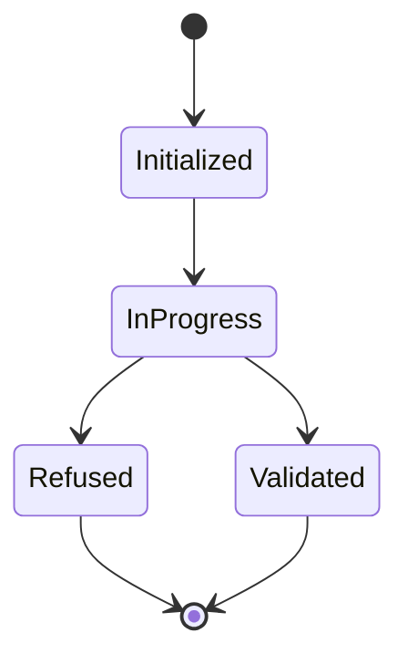
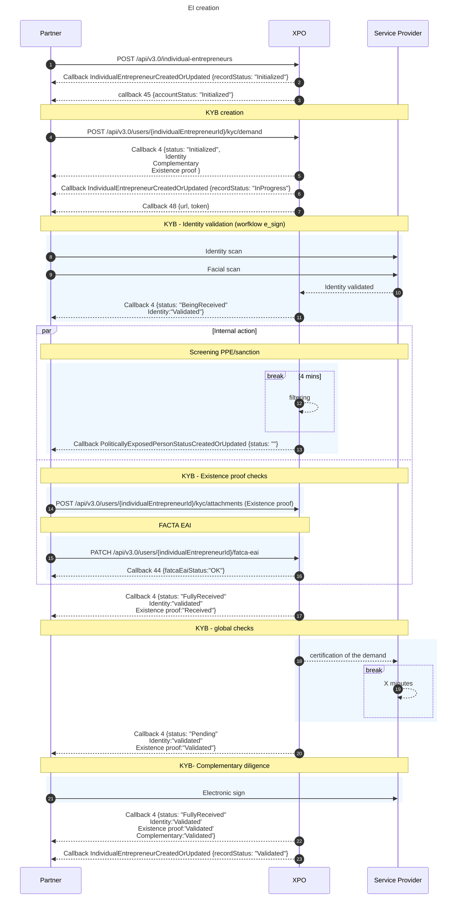

# Individual Entrepreneur
The Individual Entrepreneur (EI) is a legal status that does not create a separate legal entity distinct from the entrepreneur. The entrepreneur operates in their own name, with no distinction between their person and their business. Here are the key features:

- Single ownership → One person owns and operates the business;
- No share capital;
- No need to draft bylaws;
- Limited liability to professional assets;
- Tax regime: Personal Income Tax (IR), with the option to choose Corporate - Income Tax (IS);
- Social regime: Non-salaried worker.
- Individual entrepreneurs are recognized as natural persons by the ACPR.

<br/>

* * *
## Global overview


The individual entrepreneur onboarding is composed by the following steps:
- KYB
- Facta eai
- PPE & sanction filtering

<br/><br/>

* * *

## Diagram & status

### Status diagram for an IndividualEntrepreneur


This status is retreived by the  `recordStatus` .

<br/>

* * *

### Sequence diagram




<br/><br/>

* * *

## API & callback
### API
POST /api/V3.0/individual-entrepreneurs

```json
{
    "individualEntrepreneurId":"1234123412",
    "company" : {
        "registrationNumber":"1231223",
        "registrationCountry":"FR",
        "creationDate":"2024-09-26",
        "companyName":"Mon EI",
        "tradeName":"Mon EI",
        "businessActivityCode":"25.50A",
        "legalForm":"1000",
        "vatNumber":"FR32400000000",
        "annualTurnOver":"3",
        "address" : {
            "street":"1 rue de Paris",
            "zipCode":"75009",
            "city":"Paris",
            "country":"FR",
            "supplementIn":"test",
            "supplementOut":"test",
            "area":"FR"
        }
    },
    "profile" : {
        "civility":"Mrs",
        "firstname":"Corinne",
        "lastName":"Berthier",
        "birthName":"Berthier",
        "birthDate":"1965-12-06",
        "birthCity":"Paris",
        "birthZipCode":"75009",
        "birthCountry":"FR",
        "nationality":"FR",
        "phoneNumber":"+33652927234",
        "email":"Corinne.Berthier@xpollens.com",
        "address" : {
            "street":"1 rue de Paris",
            "zipCode":"75009",
            "city":"Paris",
            "country":"FR",
            "supplementIn":"Test",
            "supplementOut":"Test",
            "area":"Test"
        }
    }
}
```

### Callback
individualEntrepreneurCreatedOrUpdated
```json
{
    "type": "IndividualEntrepreneurCreatedOrUpdated",
	"individualEntrepreneurId": "7e4c54dd58a4J",
	"recordStatus": "InProgress", 
    "IdentificationLevel": "None",
    "OnboardingDate": "2024-08-06T08:55:49.3066667", 
    "LastUpdate": "2024-08-06T09:02:00.9678393Z",
    "company": {
        "registrationNumber": "881676191",
        "registrationCountry": "FR",
        "companyName": TEST EI,
        "tradeName": "TEST EI",
        "legalForm": "1000",
        "creationDate": "2024-09-26",
        "businessActivityCode": "25.50A",
        "vatNumber": "FR32400000000",
        "annualTurnOver": "3",
        "address": {
            "city": "Paris",
            "street": "1 rue de Paris",
            "zipCode": "75009",
            "supplementIn": "test",
            "supplementOut": "test",
            "area": "FR",
            "country": "FR"
        }
    },
	"profile": {
        "civility": "Mrs",
        "lastName": "Berthier",
        "firstName": "TEST EI",
        "birthName": "Berthier",
        "birthDate": "1965-06-12",
        "birthCity": "Paris",
        "birthZipCode": "75009",
        "birthCountry": "FR",
        "nationality": "FR",
        "address": {
            "city": "Paris",
            "street": "1 rue de Paris",
            "zipCode": "75009",
            "supplementIn": "Test",
            "supplementOut": "Test",
            "area": "Test",
            "country": "FR"
        },
        "email": "corinne.berthier@xpollens.com",
        "phoneNumber": "+33612312312"
	}
}
```
