# Individual Entrepreneur KYB
The KYB for a individual entrepreur is composed by:
- the validation of the identity of the physical person.
- the validation of the documents related to the company

The  identity of the physical person is composed by 2 diligences:
- the ID document
- the complementary diligence 

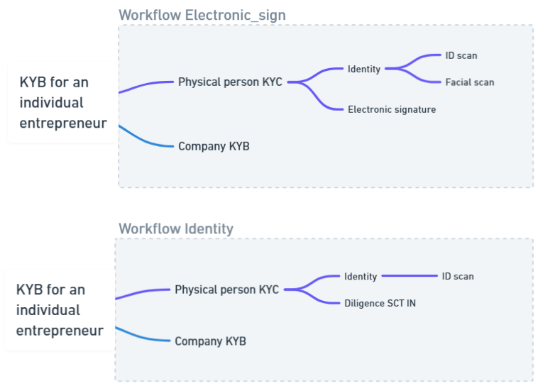

<br/>

* * *

## Status diagram for an IndividualEntrepreneur KYB
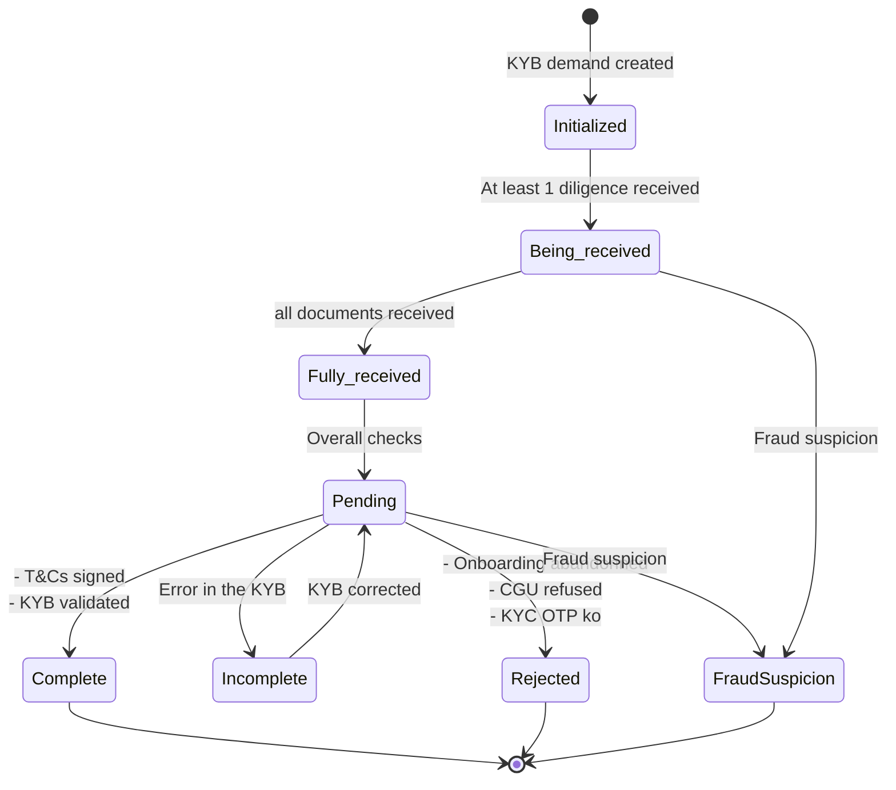

<br/>

* * *

## Sequence diagram for an IndividualEntrepreneur KYB

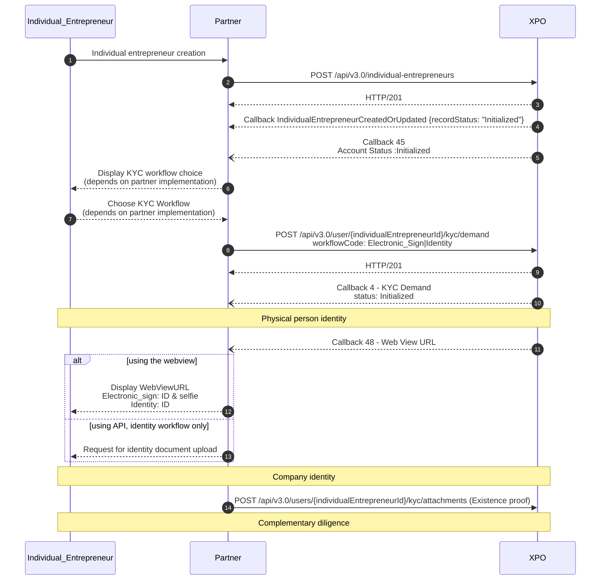

<br/><br/>

:::note  **Note**
Wokflow parameterization has to be made upstream during the environment parameterization. Partner choice is then taken into account by XPollens for global workflow parameterization. The Xpollens recommandations by order of preference are as follow :
<br/>
1- Electronic signature + Identity (in fallback)  
2- Identity alone (not recommended)  

In accordance with CNIL regulations and rules:
	- all customers have the right to refuse the use of biometrics when entering into a relationship with us
	- the service provider must offer a fallback solution, enabling the customer to enter into a relationship.

In the case of facial scanning, it is therefore **mandatory** to implement the "Identity" fallback solution with SCT IN diligence.
:::

:::warning  **Note**
**⚠ XPollens recommend to use the `Identity` workflow only in fallback when the user is not able to complete the Electronic signature workflow**
:::

:::info  **Remark**
Steps 6 and 7 are optionnal and depends on partner implementation
:::

<br/>

* * *

## Due diligence Workflow
### Due Diligence types
For the `Electronic_Signature` workflow, the due diligences expected are :

1- Identity document & selfie 
2- Electronic signature
3- Existence proof

For the `Identity` workflow, the due diligences expected are :

1- Identity document<br/>
2- Sepa Credit Transfer IN (this sepa transfer could be an instant payment, a standard one)
3- Existence proof

For these two workflows, when configuring your environment, you can choose to accept one or more of the following forms of identification:

* ID card
* passport
* resident permit

Identity checks are subject to SLAs: 5 minutes maximum in 90% of cases.

<br/>

* * *

### Due Diligence state diagram
#### Diligence Status (webview mode)

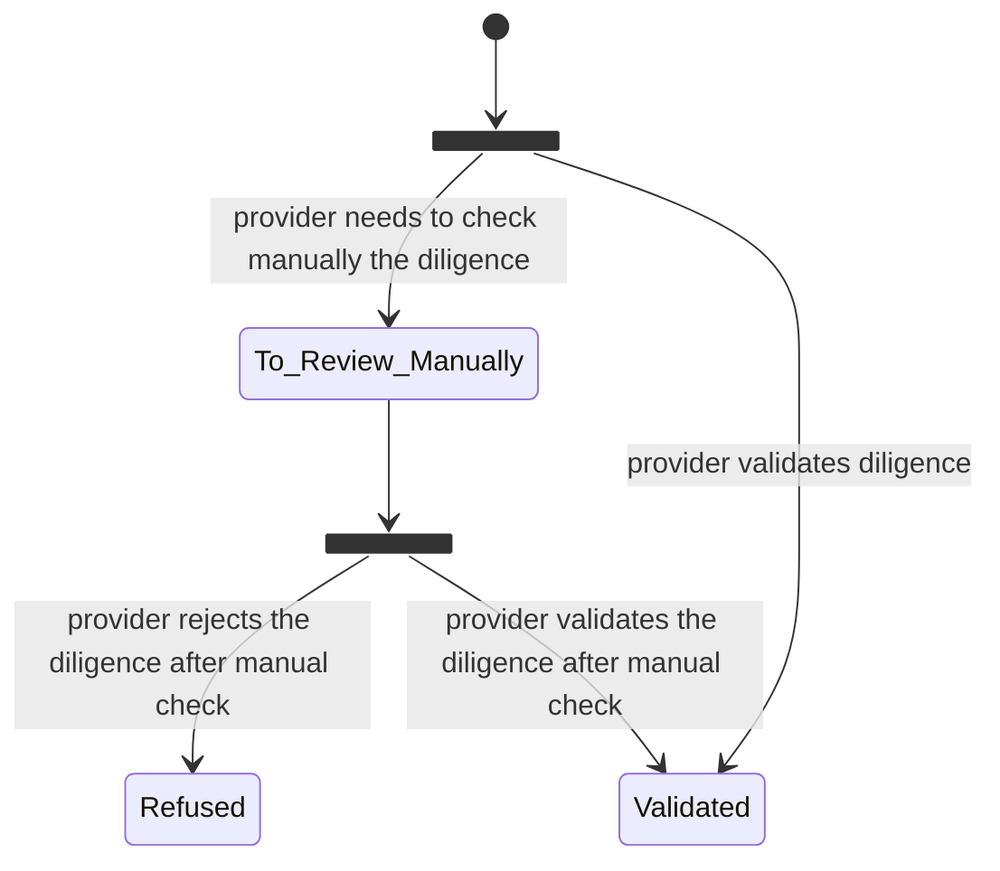

* * *
#### Diligence Status (API mode)

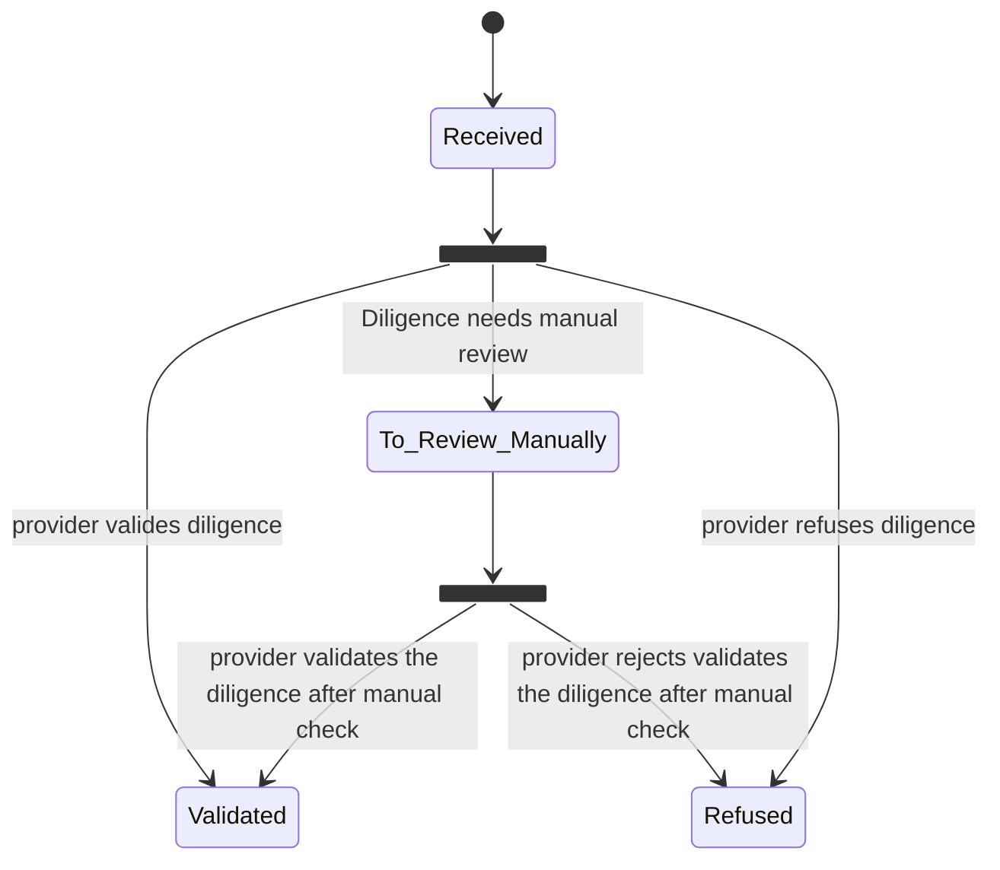

<br/>

:::note
Each time the status of a due diligence changes, a callback 4 is sent.
:::

<br/><br/>

* * *

### Due Diligence identity & complementary: workflow Electronic_Sign

#### Best scenario: due diligences validated

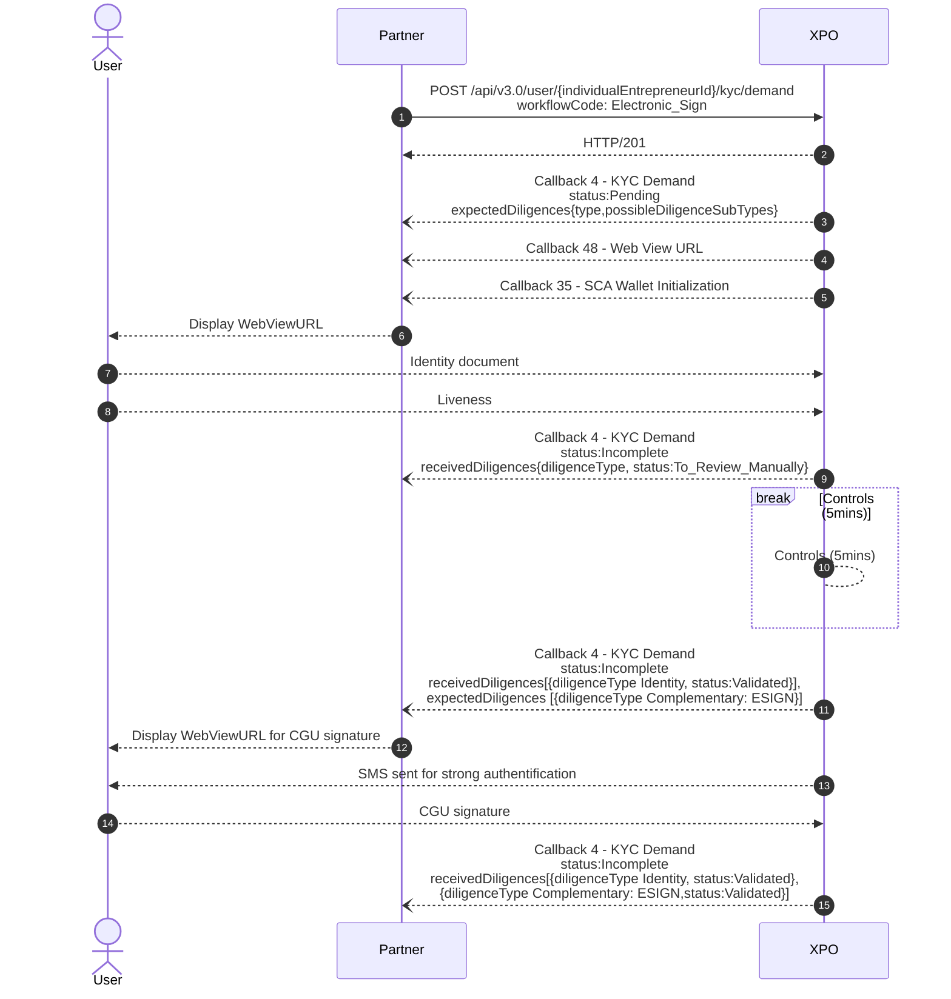

<br/>
<br/>

:::note
The strong authentification code expires after 10 minutes. A second SMS is sent after the first expires.
:::

<br/>

*  * *
### Due Diligence identity & complementary : workflow Identity

Two important pieces of information about workflow:

- the identity document can be sent either via the webview or the API
- in this case T&Cs are signed by API and the signature is not considered as a diligence
- the complementary diligence is the SCT/IP IN diligence

#### Best scenario: due diligences validated

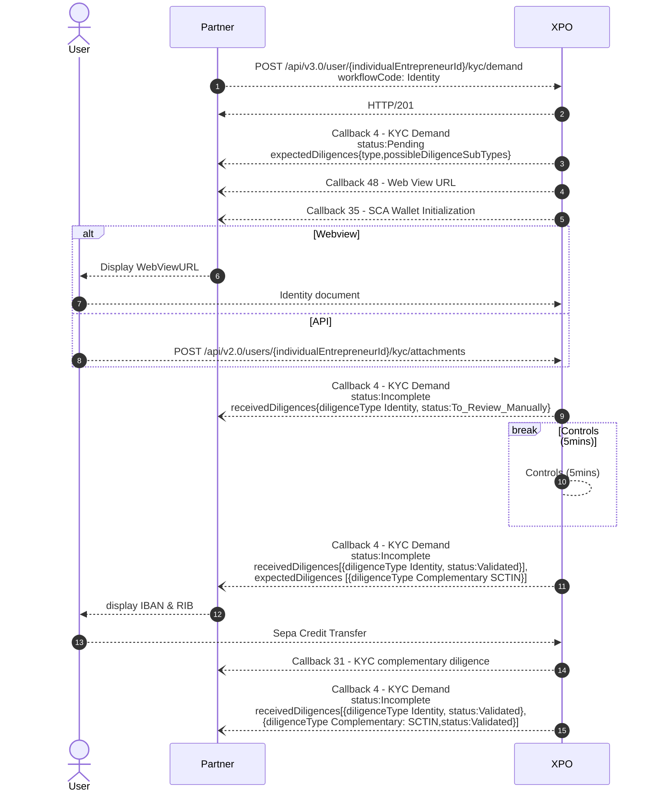

 
 <br/>

* * *

#### Due Diligence SCT IN details

**Important information** : the iban for SCT IN due diligence is displayed IF AND ONLY IF the ID due diligence has been completed.  
Otherwise, a comparison could be made between an issuer and the wrong identity.

The minimum and maximum amount of the Sepa Credit Transfer (as a diligence) is set when the environment is created.
Usally, the minimum amout is 1€ and the maximum amount 1000€.

In order to be accepted, the issuer of the SCT must be the same person as the account holder.
To achieve this, the account from which the transfer is made must be in the customer's first and last name. 
Depending on the degree of consistency between the two names, the diligence may be validated, manually reviewed by an operator or rejected.

This due diligence process takes much longer, with the SCT taking around 2 working days to be transmitted from the issuing bank to Xpollens.


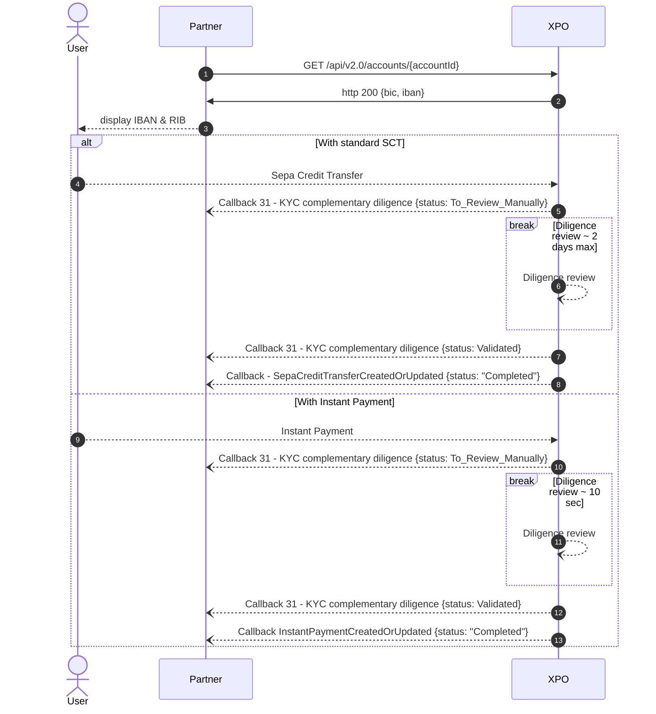


<br/>

*  * *
### Due Diligence existence proof 


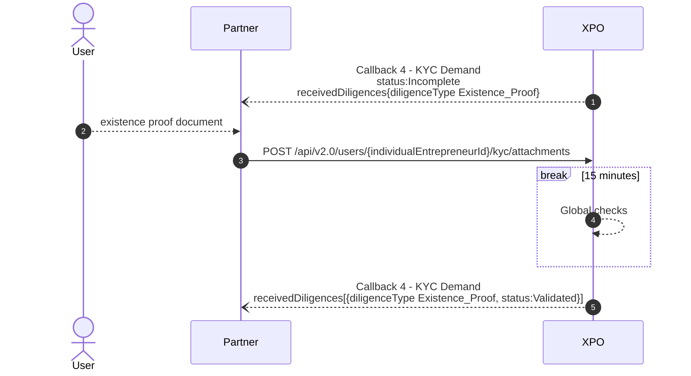


The callback 4 describes the expected documents.
Here is an example:
```json
      {
          "type": "Existence_Proof",
          "expectedCount": 1,
          "possibleDiligenceSubTypes": [
              "COMPANY_STATUTES",
              "KBIS",
              "EXTRACT_D1",
              "OTHER_EXISTENCE_PROOF",
              "BUSINESS_CARD",
              "SIREN_NOTICE",
              "ADELI_CERTIFICATE",
              "PROFESSIONAL_ORDER_CERTIFICATE"
          ]
      }
```

 <br/>

* * *

### Due Diligence sequence diagram : refused

#### Due diligence Identity refused : issue during the identity document checks

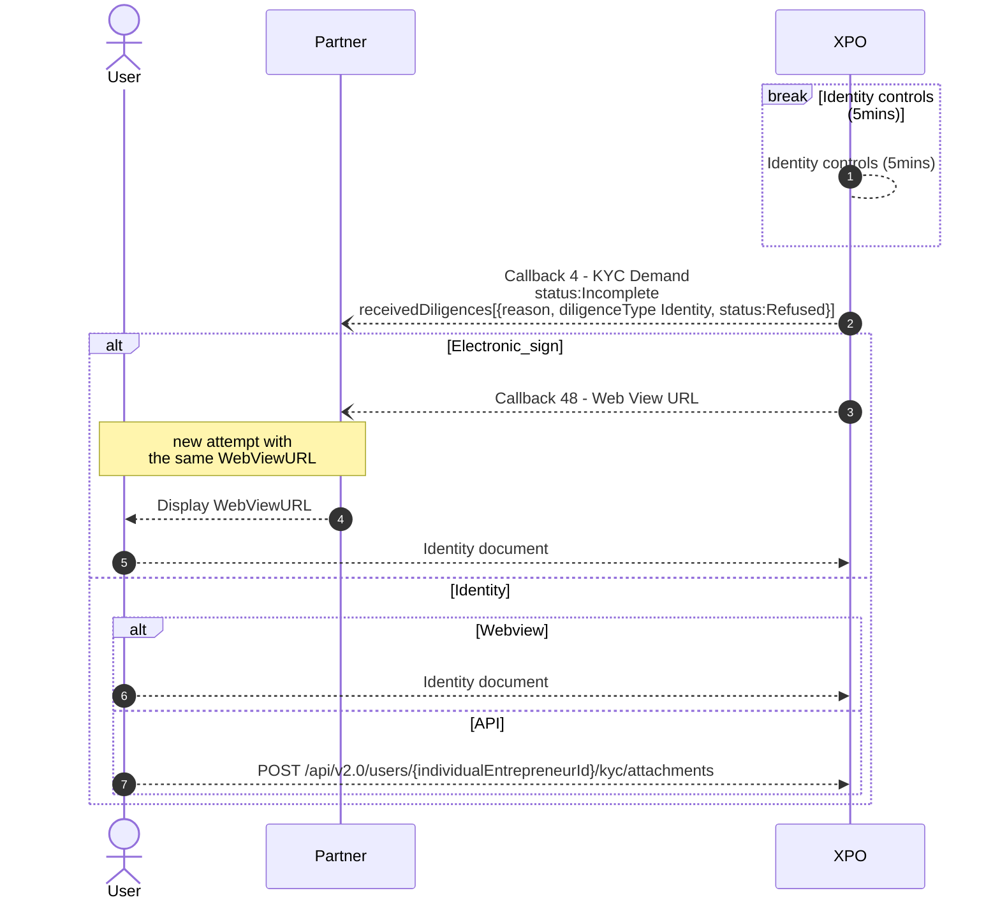

<br/><br/>

:::note
The `WebViewUrl` remains the same for the next attempt(s).
:::

<br/>

| **KO quality** |
| :--- |
| Poor quality of document |
| Document badly framed |
| Missing document page |
| Expired document |
| Restricted country |
| Document type not allowed |
| Poor quality of biometry |

<br/>

| **Error when providing an identity document.** |
| :--- |
| Document is too large |
| The document is empty |
| The lines of the MRZ (identity documents) are not valid. |
| The document could not be read (corrupted file) |
| Image is too blurry |
| Image is not contrasted enough |
| Image is too small (does not contain enough pixels) |
| The image is too big (contains too many pixels) |
| Processed image is binarised, but the server does not accept them |
| The font of the text in an image is too small to be read. |
| The document received does not match the expected one. |
| The type of document received is not recognized. |
| The image processing system did not respond. |
| No text found in the document |
| Participant's name not found in document |
| The date of the document was not found. |
| The document is too old. |
| The country of issue of the document is not allowed. |
| The document has expired. |
| MRZ lines not found in the identity document |
| The first name of the MRZ does not match the name on the face of the identity document. |
| Document number of the ZRM does not match the number on the face of the identity document |
| The date of birth of the MRZ does not match the date of birth on the face of the identity |
| Document expiry date could not be read (only for identity documents) |
| The same file has already been submitted: same participant and same file or same type of document requested and same data read |
| Expiration date is not consistent with the MRZ |

* * *
#### Due diligence Identity refused: inconsistency between the data declared and the data on the identity document

Use the `PUT /api/v3.0/individual-entrepreneurs/{individualEntrepreneurId}` to modify the wrong data.


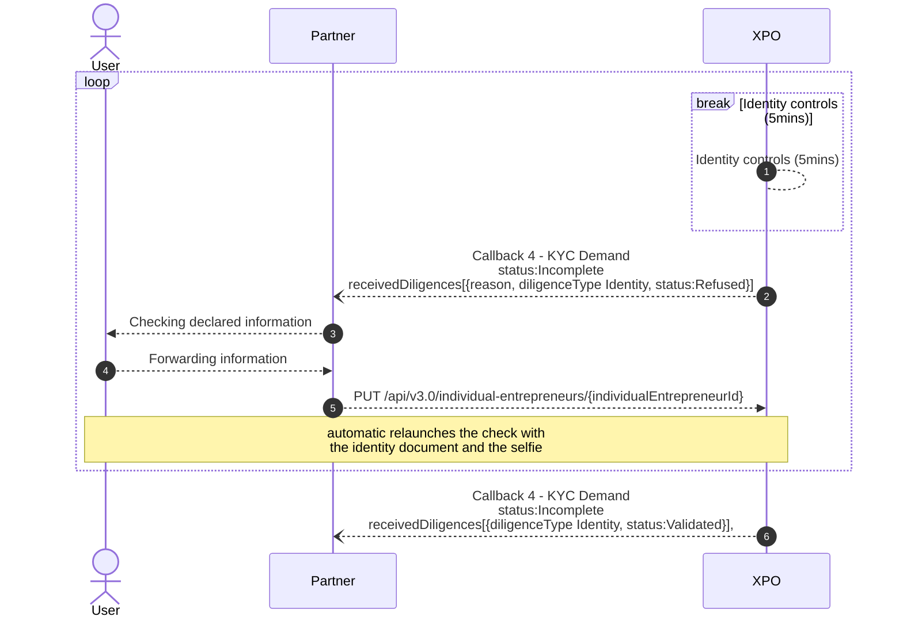
* * *
**Error codes**

| **Inconsistency between the data declared and the information on the identity document** |
| :--- |
| Inconsistent birthDate between ID document and user’s information |
| Inconsistent fullName between ID document and user’s information |
| Inconsistent birthName between ID document and user’s information |
| Inconsistent lastName between ID document and user’s information |
| Inconsistent firstName between ID document and user’s information |
| Data inversion: birthName and lastName |
| Inconsistent civility between ID document and user’s information |
| Data inversion: firstName and lastName |
| Nationality on id card does not match with user's nationality. Case will be reopened |


<br/>

  
* * *
#### Due diligence Identity refused: diligence type undefined
In some cases, the Netheos robot is unable to **recognise** the type of identity document sent to it (e.g. the user sends an image containing the front and back of their identity document).  
The diligence status changes to "refused", and callback 4 is sent as follows, the refusal may be for different reasons.   
If this is the case, ask your customer to scan the ID again, making sure that the accepted documents are respected.

```json
{
    "Payload": {
        "type": "4",
        "status": "Incomplete",
        "appUserId": "68968-1694163949661",
        "kycLevel": "High",
        "workflowCode": "Electronic_Sign",
        "receivedDiligences": [
            {
                "diligenceType": "UNDEFINED",
                "status": "Refused",
                "attachments": [
                    {
                        "FileName": "name1.jpg",
                        "AttachmentKey": "xxx"
                    },
                    {
                        "FileName": "name2.jpg",
                        "AttachmentKey": "yyy"
                    }
                ]
            },
            {
                "diligenceType": "SELFIE",
                "status": "Refused",
                "attachments": [
                    {
                        "FileName": "name3.jpg",
                        "AttachmentKey": "zzz"
                    }
                ]
            }
        ],
        "expectedDiligences": [
            {
                "type": "Identity",
                "expectedCount": 1,
                "possibleDiligenceSubTypes": [
                    "ID_CARD",
                    "PASSPORT",
                    "RES_CARD"
                ]
            },
            {
                "type": "Complementary",
                "expectedCount": 1,
                "possibleDiligenceSubTypes": [
                    "SCTIN",
                    "ESIGN"
                ]
            }
        ]
    },
}
```

* * *
#### Due diligence SCT IN refused: inconsistency between the data declared and the data on the identity document

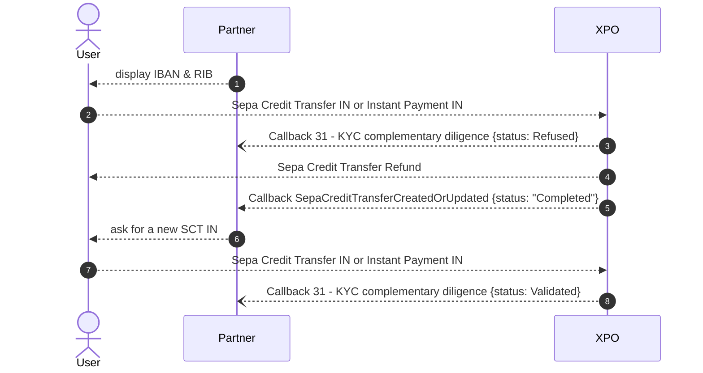

  <br/><br/>

| **Error** |
| :--- |
| The beneficiary's name is different from the transmitter's name |

  

* * *

#### Due diligence eletronic_signature T&C refused by the enduser

If :
- the enduser refuses to sign the T&C, 
- the user does not sign within 90 days
- the user makes all his sms OTP attempts without success
the status of the due diligence changes to "Refused".  

As a consequence, the KYC status changes for **Rejected**. This status is an final status: if the enduser changes his mind and wishes to sign the GCU, **a new KYC demand is required.**

Callback 4 example: refuse to sign T&C
```json
{ 
   "Payload": {
        "type": "4",
        "status": "Rejected",
        "appUserId": "7297826676138718614",
        "kycLevel": "High",
        "workflowCode": "Electronic_Sign",
        "receivedDiligences": [
            {
                "reason": "",
                "diligenceType": "ID_CARD",
                "status": "Validated",
                "attachments": [
                    {
                        "fileName": "xxx_FRONT_SIDE_1.jpg",
                        "attachmentKey": "5966c914-02dc-49f2-84c6-62d65b220a35"
                    },
                    {
                        "fileName": "xxx_BACK_SIDE_1.jpg",
                        "attachmentKey": "e0289fc6-5141-47db-8b0f-4017d94da69d"
                    }
                ]
            },
            {
                "diligenceType": "SELFIE",
                "status": "Validated",
                "attachments": [
                    {
                        "fileName": "1_alexis_bonnet_hevin_SELFIE_1.jpg",
                        "attachmentKey": "83bd84a5-4e98-407c-a574-18cd49c14ecc"
                    },
                    {
                        "fileName": "1_alexis_bonnet_hevin_SELFIE_2.jpg",
                        "attachmentKey": "74bbda94-5a71-4691-bc92-fdc1a7ba8220"
                    },
                    {
                        "fileName": "1_alexis_bonnet_hevin_SELFIE_3.jpg",
                        "attachmentKey": "a8ee8219-f2ef-4560-960a-c9b3089bb757"
                    }
                ]
            },
            {
                "reason": "Refusal to sign the T&Cs",
                "diligenceType": "ESIGN",
                "status": "Refused",
                "attachments": [
                    {
                        "fileName": "document_cgu_testAgent.pdf",
                        "attachmentKey": "317c6b36-6c77-4de4-9425-015a15ec2863"
                    }
                ]
            }
        ],
        "expectedDiligences": [
            {
                "type": "Complementary",
                "expectedCount": 1,
                "possibleDiligenceSubTypes": [
                    "SCTIN",
                    "DELEGATED_COMPLEMENTARY_DILIGENCE",
                    "ESIGN"
                ]
            }
        ]
    },
```

Here is an example of GET KYC/demand  

```json
{
    "status": "Rejected",
    "creationDate": "2023-11-07T13:22:32",
    "lastUpdate": "2023-11-07T13:35:19",
    "diligences": [
        {
            "type": "ID_CARD",
            "status": "Validated",
            "reason": "",
            "files": [
                {
                    "name": "1_corinne_berthier_FRONT_SIDE_1.jpg",
                    "key": "8e053965-382a-4b35-8d26-a5a9e40b661b"
                },
                {
                    "name": "1_corinne_berthier_BACK_SIDE_1.jpg",
                    "key": "c8bc9f16-98db-43a6-84f5-29ad472a566e"
                }
            ],
            "creationDate": "2023-11-07T13:26:23",
            "lastUpdate": "2023-11-07T13:26:23"
        },
        {
            "type": "SELFIE",
            "status": "Validated",
            "files": [
                {
                    "name": "1_corinne_berthier_SELFIE_1.jpg",
                    "key": "89ef63f8-36a3-43f9-adb4-9febe66c7f5e"
                },
                {
                    "name": "1_corinne_berthier_SELFIE_2.jpg",
                    "key": "cac978d7-fab8-4ce1-bd9f-0e4b9b4d98a8"
                },
                {
                    "name": "1_corinne_berthier_SELFIE_3.jpg",
                    "key": "4b935737-b235-447b-8ad4-e217b646e987"
                }
            ],
            "creationDate": "2023-11-07T13:26:23",
            "lastUpdate": "2023-11-07T13:26:23"
        },
        {
            "type": "ESIGN",
            "status": "Refused",
            "reason": "Refusal to sign the T&Cs",
            "files": [
                {
                    "name": "document_cgu_testAgent.pdf",
                    "key": "59592f49-277f-4f5e-8ec1-286f80a8b859"
                }
            ],
            "creationDate": "2023-11-07T13:35:19",
            "lastUpdate": "2023-11-07T13:35:19"
        }
    ],
    "decision": "Abandoned"
}
```

<br/>

* * *
### Fraud suspicion

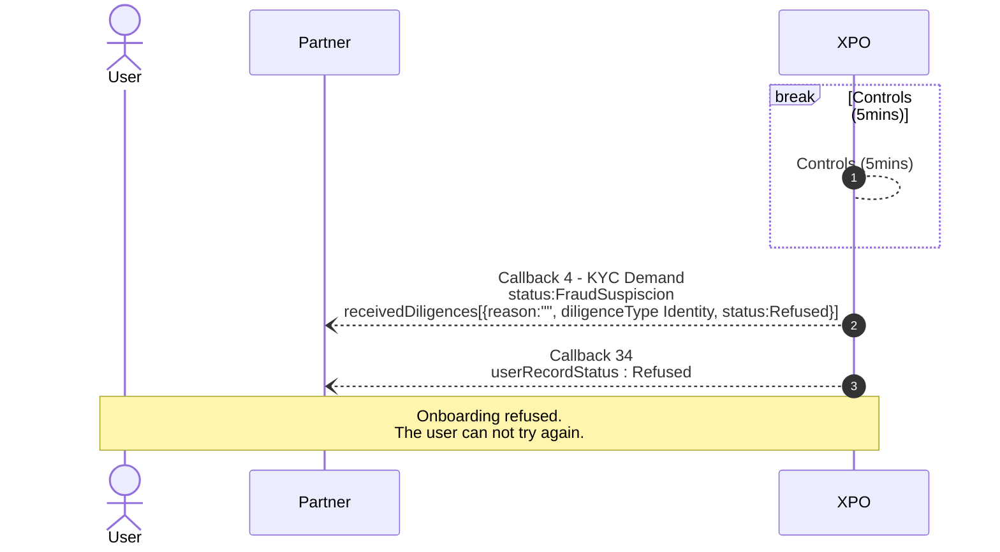

<br/>

* * *

## Workflow change

During user onboarding it is possible for the user to switch from the `Electronic_Signature` workflow to the `Identity` workflow (this way only, it is not possible to switch from `Identity` to `Electronic_Signature`).
This is possible as long as the user has not completed the Selfie+ID step in the `Electronic_Signature` workflow.
To handle the switch of workflow, partner should call the `PUT /api/v3.0/users/{individualEntrepreneurId}/kyc/demand` by specifying the new workflow in the payload.

:::note  Example

```json
PATCH /api/v3.0/users/{individualEntrepreneurId}/kyc/demand
{
     "workflowCode" : "Identity"
}
```
:::

<br/>

> Conversely, it is impossible to switch from the `Identity` workflow to the `Electronic_Signature` workflow.

<br/>

* * *

## KYC file expiry
A KYC folder expires after a period of 90 days from the date it was created. If the user has not finalised or validated the file within this period, it will automatically expire.

As soon as the KYC is rejected, a callback 4 is sent with the statut `Rejected` . 
With a request to GET
/api/v3.0/users/{appUserId}/kyc/demand endpoint, the `decision`  is retrieved with the value "expired".
The userRecordStatus does not change.

After expiry, the enduser always has the option of making a new KYC request.

 <br/><br/>

* * *

### APIs, callbacks & technical items
#### WebView integration

##### Parent Page integration (mandatory)

The Netheos Web Page can be displayed using the `webviewUrl` or `url`?token=`token` URL.
**But** as the partner will have to handle some specific **javascript** event, it is mandatory to implement the following code in the parent page to display the URL :

```html
<iframe id="signbook" scrolling="no" frameBorder="no" width="100%" allow="microphone; camera"></iframe>
<script src="https://integration-api.ekeynox.net/contract/signbook/v3/script/signbook.js"></script>
<script type="text/javascript">
    window.onload = function () {
        var signbook = new NthSignbook({
            iframeSelectorId: 'signbook',
            url: 'https://api.ekeynox.net/contract/signbook/signbook.html',
            options: {
                renderMode: 'pretty'
            },
            token: '20140917_7HJOLUbtlKET2iQwBGtN7QkkzFgg2r'
        });
    }
</script>
```

<br/>

:::note
See the full Netheos Documentation here : https://integration-api.ekeynox.net/docs/integration/latest/integration_signbook_v3/
:::

* * *
#### Javascript Events handling

##### Identity check events

When identity check is completed (10 min max), an "identity" type event will be sent to the main page.

:::note  Example

```javascript
event = {
   type: "identity",
   state: "WAITING",
   ok: true
}
```
:::

> This event should be handled as in the example below :  

:::note  Example

```javascsript
window.addEventListener('message', function(evt){
    var msg = JSON.parse(evt.data);
    if (msg && msg.type === 'identity') {
        console.log('message: ',msg);
    }
}, false);
```
:::

* * *
##### Electronic Signature Event handling

The same way, once an electronic signature is performed, a `clientFileEvent` will be sent with `accepted` status.

* * *

#### Upload ID document by API

The `Identity` workflow can also be processed by API.
It will require to send the ID Documents using the `post /api/v2.0/users/{appUserId}/kyc/attachments` API.

:::note
In this case, it is not neccessary to handle the webview URL provided in callback 48. 
:::

<br/>

:::note  note 2
Ìdentity` workflow requires an addionnal identity verification diligence. The additionnal diligence supported by XPollens in an incoming money transfer originating from an account owned by the user (name, firstname, .. are checked at the receipt of the money transfer by XPollens) 
:::

* * *
#### Callbacks type 4

Each time the status of a due diligence changes, a callback 4 is sent.
This callback is composed of `expectedDiligences` and `receivedDiligences`, so you can see the progress of the items sent.

* * *
##### KYC Status Pending, no due diligence sent

> Body parameter

```json
        "type": "4",
        "status": "Pending",
        "appUserId": "appUserId-1",
        "kycLevel": "High",
        "workflowCode": "Electronic_Sign",
        "expectedDiligences": [
            {
                "type": "Identity",
                "expectedCount": 1,
                "possibleDiligenceSubTypes": [
                    "ID_CARD",
                    "PASSPORT",
                    "RES_CARD"
                ]
            },
            {
                "type": "Complementary",
                "expectedCount": 1,
                "possibleDiligenceSubTypes": [
                    "SCTIN",
                    "DELEGATED_COMPLEMENTARY_DILIGENCE",
                    "ESIGN"
                ]
            }
        ]
```

<br/>

:::note
`possibleDiligenceSubTypes` as `expectedDiligences` depend on the environment parameterization. 
:::

* * *
##### KYC Status "Incomplete", the identity document and the selfie have been sent

> Body parameter

```json
        "type": "4",
        "status": "Incomplete",
        "appUserId": "appUserId-1",
        "kycLevel": "High",
        "workflowCode": "Electronic_Sign",
        "receivedDiligences": [
            {
                "diligenceType": "ID_CARD",
                "status": "To_Review_Manually",
                "attachments": [
                    {
                        "FileName": "ID_CARD_FRONTSIDE",
                        "AttachmentKey": "d84c3525-d037-4e81-8b95-668c4de2340f"
                    },
                    {
                        "FileName": "ID_CARD_BACKSIDE",
                        "AttachmentKey": "96306caa-cc48-4aa4-8403-6055d92b629f"
                    },
                ]
            },
            {
                "diligenceType": "SELFIE",
                "status": "To_Review_Manually",
                "attachments": [
                    {
                        "FileName": "SELFIE_1",
                        "AttachmentKey": "dc840307-de7d-419b-b05d-222bda4ec0d4"
                    },
                ]
            }
        ],
                "expectedDiligences": [
            {
                "type": "Complementary",
                "expectedCount": 1,
                "possibleDiligenceSubTypes": [
                    "SCTIN",
                    "DELEGATED_COMPLEMENTARY_DILIGENCE",
                    "ESIGN"
                ]
            }
        ]
    },

```

* * *
##### KYC Status "Complete", all due diligences are validated

When all due diligence has been completed, the KYC status changes to "Completed".

```json
"Payload": {
        "type": "4",
        "status": "Complete",
        "appUserId": "appUserId-1",
        "diligences": [
            {
                "reason": "",
                "diligenceType": "ID_CARD",
                "status": "Validated"
            },
            {
                "reason": null,
                "diligenceType": "SELFIE",
                "status": "Validated"
            },
            {
                "reason": null,
                "diligenceType": "ESIGN",
                "status": "Validated"
            }
        ]
    },
```

* * *
##### KYC Status "Refused"

The identity document status and the selfie status are not always the same.
The identity document is checked in several stages:

- the data on the post kyc/demand and the card are automatically checked. If an error occurs here, the status of the ID document is changed to refused, regardless of the selfie.
- automatically, checks are carried out on the quality of the document, the legibility of the photo, etc.
- manually, an operator completes the check.
    If a refusal occurs during these last two phases, the status of the stagecoach will be identical.

Each time a diligence is refused, a `reason` is added to the callback.

```json
  "Payload": {
        "type": "4",
        "status": "Incomplete",
        "appUserId": "appUserId-1",
        "kycLevel": "High",
        "workflowCode": "Electronic_Sign",
        "receivedDiligences": [
            {
                "reason": "",
                "diligenceType": "ID_CARD",
                "status": "Refused",
                "attachments": [
                    {
                        "FileName": "ID_CARD_FRONTSIDE",
                        "AttachmentKey": "d84c3525-d037-4e81-8b95-668c4de2340f"
                    },
                    {
                        "FileName": "ID_CARD_BACKSIDE",
                        "AttachmentKey": "96306caa-cc48-4aa4-8403-6055d92b629f"
                    },
                ]
            },
            {
                "diligenceType": "SELFIE",
                "status": "Validated",
                "attachments": [
                    {
                        "FileName": "SELFIE_1",
                        "AttachmentKey": "dc840307-de7d-419b-b05d-222bda4ec0d4"
                    }
                ]
            }
        ],
      "expectedDiligences": [
            {
                "type": "Identity",
                "expectedCount": 1,
                "possibleDiligenceSubTypes": [
                    "ID_CARD",
                    "PASSPORT",
                    "RES_CARD"
                ]
            },
            {
                "type": "Complementary",
                "expectedCount": 1,
                "possibleDiligenceSubTypes": [
                    "ESIGN"
                ]
            }
        ]
    },

```

* * *

#### Callback 48 - WebView URL

The new [callback 48](https://docs.xpollens.com/api/callbacks#post-/-callback48Url-) will contain required information to display the KYC Web View URL to the user.
The format of the new callback is the following :

`POST /{callback48Url}`


> **Remark**
> 
> 1.  The `webviewUrl` is the concatenation of the `url` value and `token` value with the following format: `url`?token= `token`
> 2.  The `WebViewUrl` contained if the callback #35 is deprecated.


<br/>


* * *

## FAQ
### FAQ1: Is the webview display customisable?

R: Partially: https://integration-api.ekeynox.net/docs/integration/latest/integration_signbook_v3/#parametrage-de-lapparence-du-facematch-video

* * *
### FAQ2: Do I have to send the second and third first names?
R: Yes, separated by spaces.

* * *
### FAQ3: Are all telephone numbers accepted? 
R: Yes, provided that the operator is not blacklisted.

* * *
### FAQ4: when can I display my customer's iban?
R: The iban should only be displayed:
- as part of the Eletronic-sign workflow, the user is validated (userRecordStatus validated).
- as part of the Identity workflow, the identity check part is validated.

<br/>

* * *

## How to test

This annexe describes available mocks on **test environment** for test and integrate the KYC functionnality.
Each mocked test case is based on the provided email adress for the user :

`Radical.email+alias_code+autre_alias@email.fr`

> Alias allows the partner to simulate one or more behaviour.
> Alias ordering is not relevant
> At the minimum, the alias for the live check must be present.

### Available mocks

| Alias | Decription |
| --- | --- |
| LC\_ACCEPTED | Accepted Live Check |
| LC\_FRAUD | Rejected Live Check / Reason code "Fraud Suspicion" |
| LC\_EXPIRED | Rejected Live Check / Reason code "Other reason" |
| LC\_DOC\_EXPIRED | Rejected Live Check / Reason Code : "Expired Document" |
| LC\_DOC\_QUALITY | Rejected Live Check / Reason Code : "Document Quality is insufficient" |
| LC\_BIO\_QUALITY | Rejected Live Check / Reason Code : "Liveness Quality is insufficient" |
| LC\_DOC\_RECEIPT | Rejected Live Check / Reason Code : "Présence du récépissé seul" |
| LC\_DOC\_MISSING | Rejected Live Check / Reason Code : "Recto or Verso of id document is missing" |
| LC\_DOC\_FRAMED | Rejected Live Check / Reason Code : "Truncated Document" |
| LC\_DOC\_UNSUPPORTED | Rejected Live Check / Reason Code : "Not supported Document" |
| LC\_DOC\_UNAUTHORIZED | Rejected Live Check / Reason Code : "Document country not supported" |
| LC\_OTHER | Rejected Live Check / Reason Code : "Other reason" |
