# Purpose
The purpose of this document is to describe the workflow / steps required to create a Legal Entity / Company / Professional User, using the XPollens API.
Those steps have to be achieved using the **XPollens APIs** and **XPollens Callbacks**.

* * *
# Reference

:::note  Legal Entity Creation XPollens APIs
* Initiate the creation of a Legal Entity (**mandatory**)
	* https://docs.xpollens.com/api/Users#post-/api/v2.0/legalentities
* Sign the service Terms & conditions (**param**)
	* https://docs.xpollens.com/api/Users#post-/api/v2.0/users/-AppUserId-/cgu
* Provide FATCA information (**param**)
	* https://docs.xpollens.com/api/Compliance#patch-/api/v3.0/users/-appUserId-/fatca-eai
* Provide FATCA documents (**param**)
	* https://docs.xpollens.com/api/KYC#get-/api/v3.0/users/-AppUserId-/fatca/attachments/-Key-
* Provide Benefical owners declarative (***optional***)
	* https://docs.xpollens.com/api/Users#patch-/api/v2.0/users/-appUserId-/beneficial-owner-declarative
:::

:::note  Legal Entity Management XPollens APIs
* Retrieve Legal Entity details
	* https://docs.xpollens.com/api/Users#get-/api/v2.0/legalentities
* Update Legal Entity information
	* https://docs.xpollens.com/api/Users#put-/api/v2.0/legalentities/-legalEntityId-
:::

:::note  Representatives XPollens APIs 
* Create user representative (mandated, legal representative, Beneficial owner) (**mandatory**)
	* https://docs.xpollens.com/api/Users#post-/api/v2.0/users
* Sign the Terms & Conditions (**param**)
	* https://docs.xpollens.com/api/Users#post-/api/v2.0/users/-AppUserId-/cgu
* Provide FATCA information (**param**)
	* https://docs.xpollens.com/api/Compliance#patch-/api/v3.0/users/-appUserId-/fatca-eai
* Provide FATCA documents (**param**)
	* https://docs.xpollens.com/api/KYC#get-/api/v3.0/users/-AppUserId-/fatca/attachments/-Key-
* Create a KYC demand (***param***)
	* https://docs.xpollens.com/api/KYC#post-/api/v3.0/users/-appUserId-/kyc/demand
* Upload KYC diligence (***param***)
	* https://docs.xpollens.com/api/KYC#post-/api/v3.0/users/-appUserId-/kyc/attachments
* Provide beneficial owner declaratives (***optional***)
	* https://docs.xpollens.com/api/Users#patch-/api/v2.0/users/-appUserId-/beneficial-owner-declarative
* Provide User Declaratives (**param**)
	* https://docs.xpollens.com/api/Users#post-/api/v2.0/users/-AppUserId-/declarative
:::

:::note  XPollens Callbacks
| Scope | Documentation link | Purpose | Trigger |
| ----- | ------------------ | ------- | ------- |
| Legal Entity creation | https://docs.xpollens.com/api/Callbacks#post-/-callback43Url- | Provide information on legal entity | on status change |
| Legal Entity KYB | https://docs.xpollens.com/api/Callbacks#post-/-callback46Url- | Provide information on legal entity KYB demand | on KYB demand status change |
| Legal entity & User FATCA information | https://docs.xpollens.com/api/Callbacks#post-/-callback44Url- | Provide information on FATCA declaration | on FATCA status change |
| Legal Entity Account Creation | https://docs.xpollens.com/api/Callbacks#post-/-callback45Url- | Provide information on legal entity Bank Account | on account status change |
| Representative creation | https://docs.xpollens.com/api/Callbacks#post-/-callback34Url- | Provide information on user representative onboarding status | on user representative status change |
| Representative KYC | https://docs.xpollens.com/api/Callbacks#post-/-callback04-V2.0Url- | Provide information on user representative KYC status | on status change |
| Representative Risk level | https://docs.xpollens.com/api/Callbacks#post-/-callback32Url- | Provide information on representative risk level | on risk level change |
| Representative PEP | https://docs.xpollens.com/api/Callbacks#post-/PoliticallyExposedPersonStatusCreatedOrUpdated | Provide information on representative political exposition | on political exposition change |
| Representive KYC | https://docs.xpollens.com/api/Callbacks#post-/-callback48Url- | Provide webview URL for representative KYC verification | at KYC demand creation |
:::

* * *
# Legal Entity Creation
## Introduction
XPollens provides all necessary APIs to onboard legal entities.
Depending on the partner setup, the steps to onboard a company can be either mandatory or optional.
The onboarding workflow needs to be discussed between XPollens and the partner prior the integration phase begins.
This document will cover the most complete onboarding use case when all steps are required  to complete the onboarding.

* * *
## Onboarding workflow
### Legal Entity creation
#### User Flow
:::note  
The following forms are provided as examples to illustrate the information required for onboarding.
:::
Choose your country
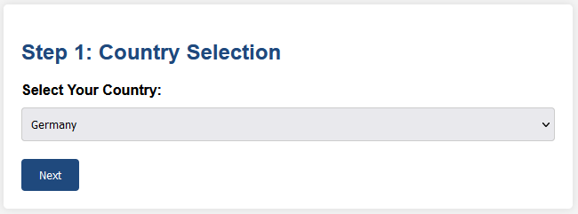

Fill in required information
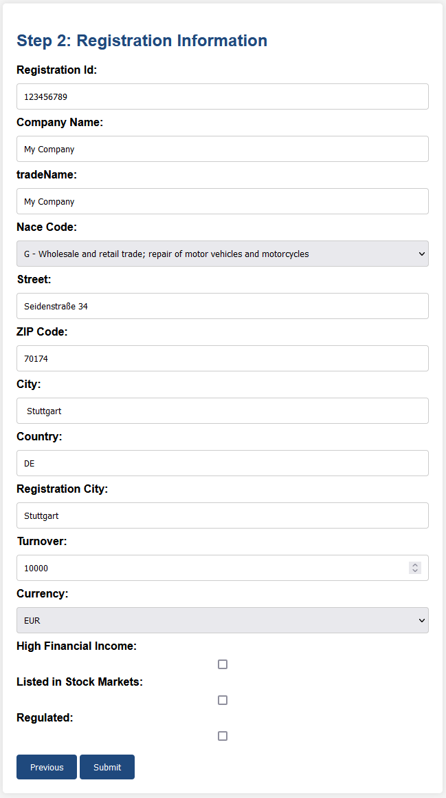

:::note  Note
Company detailed information are not mandatory when registering a French Entity.
All company details will be automatically retrieved from official government data.
:::

* * *
#### French Registered Entity Creation Workflow
In order to register a **french** entity, the following information are required :

* `LegalEntityId`
* `RegistrationNumber` (SIREN)
* `RegistrationCountry` (FR)
* `TurnOver`
* `Currency`
* `HighFinancialIncome`
* `ListedInStockMarkets`
* `isRegulated`

All other information is automatically retrieved through official government  APIs form the company identification number (`SIREN`) :

* **`CompanyName`**
* **`TradeName`**
* **`NaceCode`**
* **`LegalForm`**
* **`CreationDate`**
* **`Address`**

* * *
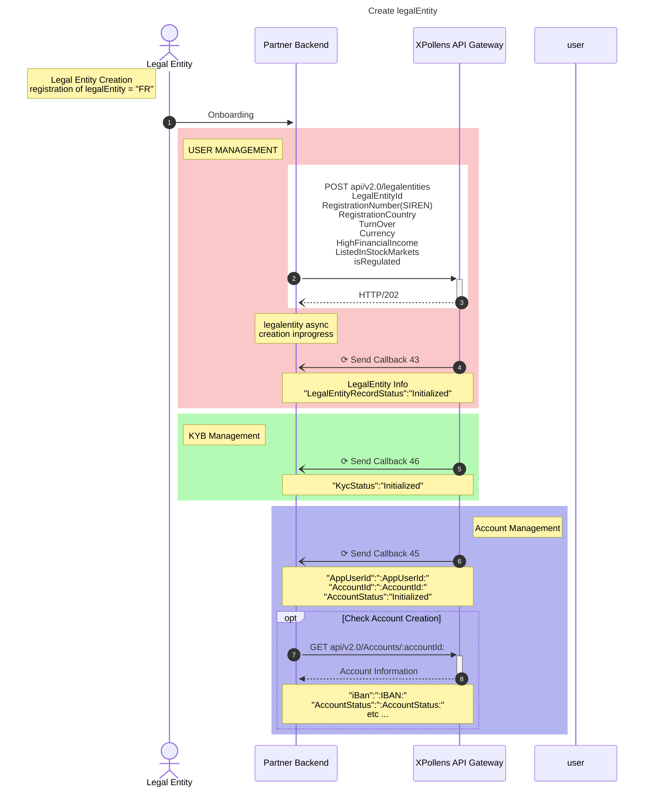

* * *
#### Foreign Registered Entity Creation Workflow
Foreign companies information can not be retrieved automatically,  the following information have to be provided manually.

* **`CompanyName`**
* **`TradeName`**
* **`NaceCode`**
* **`LegalForm`**
* **`CreationDate`**
* **`Address`**

* * *

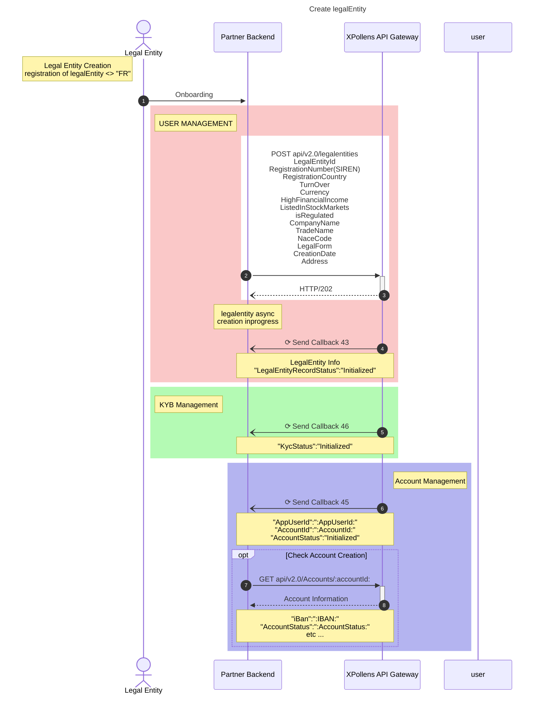

* * *
#### Callbacks
Once the `POST api/v2.0/legalentities` is called, it will return an empty `HTTP 202` response.
Partner will then receive information about the legal entity with the following callbacks :

* Callback 43 (Legal Entity Creation)
```json
{
	"type": "43",
	...
	"legalEntityCreationStatus": "Succeeded",
	...
	"legalEntityRecordStatus": "Initialized",
	...
	"identificationLevel": "None"
}
```
* Callback 45 (Legal Entity Account Creation)
```json
{
	"type": "45",
	...
	"accountStatus": "Initialized"
}
```
* Callback 46 (KYB demand creation)
```json
{
"type": "46",
"status": "Initialized",
"expectedDiligences": [
		{
			"type": "Existence_Proof",
			"expectedCount": 2,
			"possibleDiligenceSubTypes": [
				"COMPANY_STATUTES",
				"KBIS",
				"OTHER_EXISTENCE_PROOF"
			]
		},
		{
			"type": "Economic_Activity_Evidence",
			"expectedCount": 1,
			"possibleDiligenceSubTypes": [
				"BALANCE_SHEET",
				"TAX_REPORT",
				"OTHER_ECONOMIC_ACTIVITY_EVIDENCE"
			]
		}
	]
}
```

* * *
### Legal Entity KYB
#### Requested Diligences
The list of requested diligences will be retrieved through the **callback #46** that is received by the partner after le legal Entity creation has been initiated.

Depending on the context, company form, .. one to several documents can be requested from the following :

| Type | #ID| Value                       | Meaning                                           |
| ---- | -- | --------------------------- | --------------------------------------------------|
| ExistenceProof | 25 | COMPANY_STATUTES                 | Statuts of the company |
| ^^ | 26 | KBIS | French KBIS document|
| ^^ | 27 | EXTRACT_D1 | D1 Extract |
| ^^ | 28 | PREFECTURE_RECEIPT | |
| ^^ | 29 | RNSC_CERTIFICATE | |
| ^^ | 30 | ANAH_FORM | |
| ^^ | 31 | OTHER_EXISTENCE_PROOF | |
| ^^ | 43 | OFFICIAL_NEWSPAPER_EXTRACT | |
| ^^ | 44 | FINESS_NOTICE | |
| ^^ | 45 | BUSINESS_CARD | |
| ^^ | 46 | MSA_CERTIFICATE | |
| ^^ | 47 | ORDER_CERTIFICATE | |
| ^^ | 48 | ENIM_CERTIFICATE | |
| EconomicActivityEvidence | 25 | BALANCE_SHEET | |
| ^^ | 34 | TAX_REPORT | |
| ^^ | 35 | OTHER_ECONOMIC_ACTIVITY_EVIDENCE | |
| UboDeclarationForm | 36 | UBO_DECLARATION_FORM | A UBO declaration is a legal document that gives you current, accurate, and reliable information about the true beneficial owners of a corporate company all within your own portal account or integrated API. The legally binding document is signed by a verified authorized person.<br/>Key Attributes in a UBO Declaration<br/><ul><li>Declaration with Verified Electronic Signature</li><li>Signer Name</li><li>Signed at Time and Date</li><li>Signature</li></ul>               | |
* * *
#### User Flow
After the partner received the callback 46 with the list of expected documents. 
The next step consist in asking the user to upload these documents.

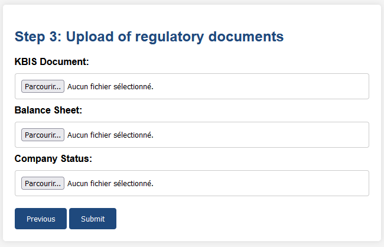

* * *
#### KYB demand completness state diagram
For each diligence received from our partner, xpollens calculates the KYB demand completeness.

The demand is considered fully received (legal entity kycDemandStatus = Fully_received) if:

1. All expected diligences are received successfully (for legal entity and contributors)
2. KYC demand(s) of legal representative are complete (With OneyTrust)
3. KYC demand(s) of beneficial owners are fully_received (identity received)
4. All expected fatca diligences received (legal entity fatcaDemandStatus = fully_received) 

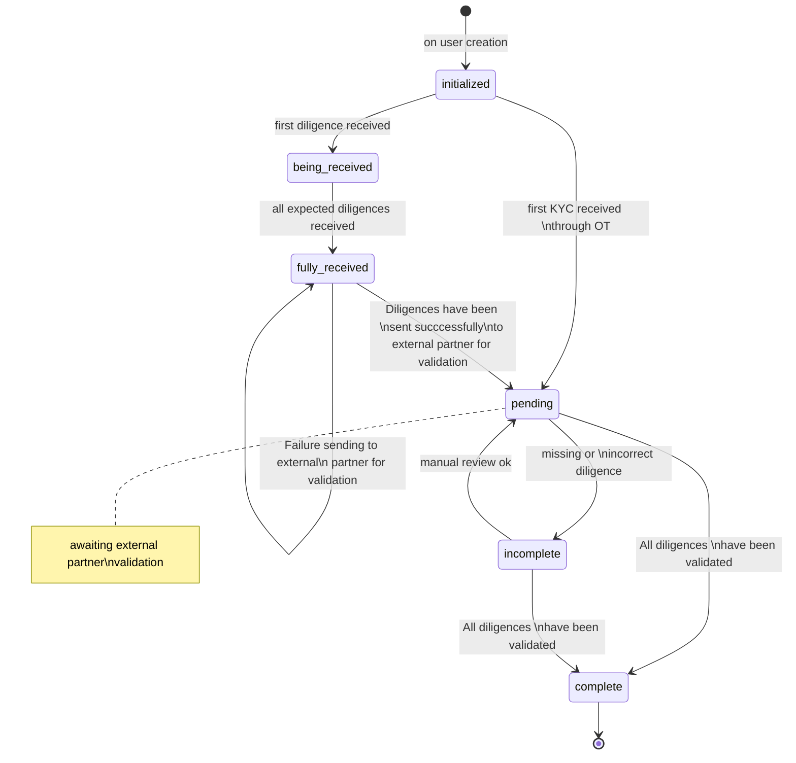

* * *
#### KYB diligence status state diagram
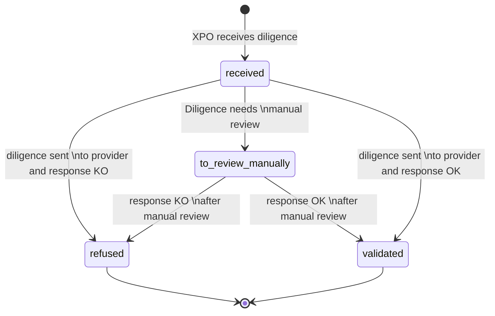

* * *
#### KYB diligence sequence diagram
##### Existence proofs
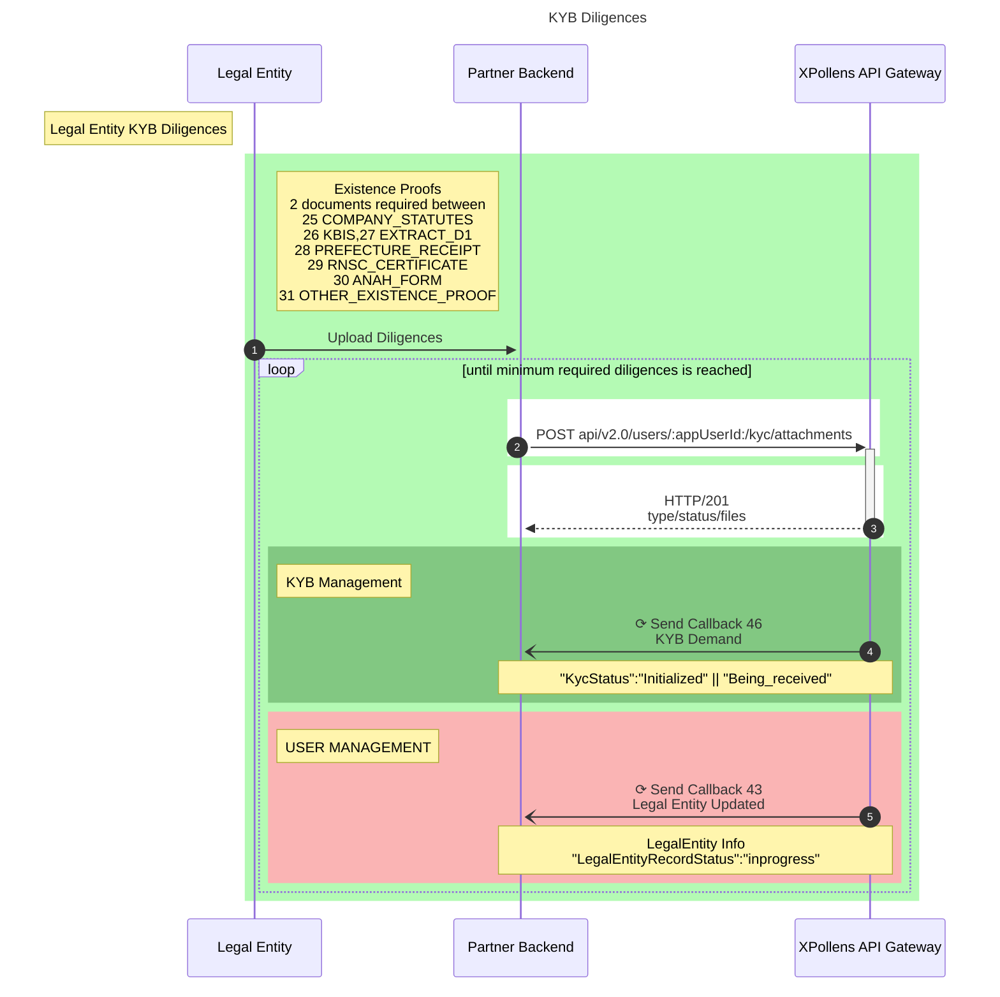

* * *
##### Address proof
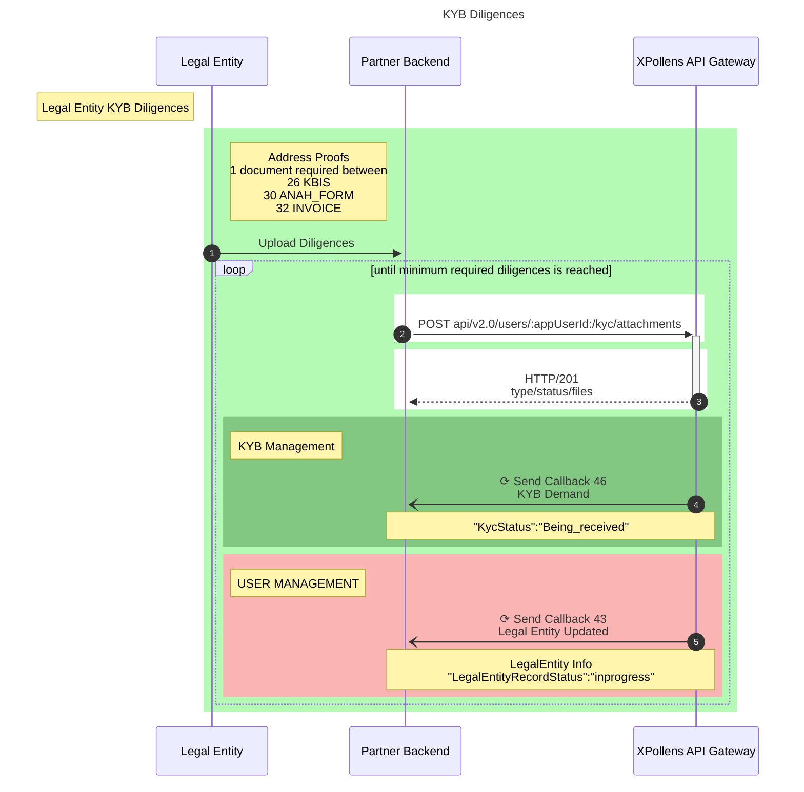

* * *
##### Economic Activity Evidences
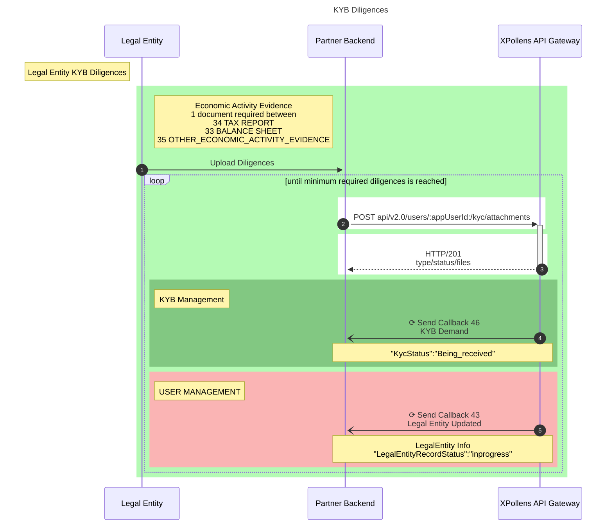

* * *
##### All diligences received / KYB complete
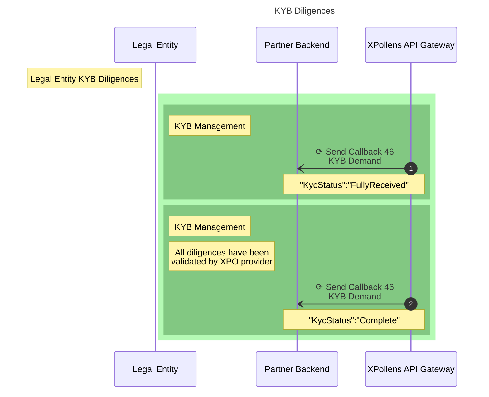

* * *
#### Sending diligence
The `POST api/v2.0/users/{{legalEntityId}}/kyc/attachments` API will be used to send required diligence to XPollens.

:::note 
The type and number of expected diligences is contained in the callback 46 received by the partner
The API has to be called for each expected diligence by the partner
:::

The callback 46 will inform the partner at each change of the KYB status, providing information on received diligences and their status :

```json
{
    "type": "46",
    "status": "FullyReceived",
    "legalEntityId": "LEGAL_ENTITY_NAME",
    "receivedDiligences": [{
            "diligenceType": "COMPANY_STATUTES",
            "status": "Received",
            "attachments": [{
                    "fileName": "statutes.png",
                    "attachmentKey": "36973678-8763-4e3d-89c4-51448d4e2ad2"
                }
            ]
        }, {
            "diligenceType": "KBIS",
            "status": "Received",
            "attachments": [{
                    "fileName": "kbis.png",
                    "attachmentKey": "157b4121-9a84-4181-b9d2-57e84211548a"
                }
            ]
        }, {
            "diligenceType": "BALANCE_SHEET",
            "status": "Received",
            "attachments": [{
                    "fileName": "balance.png",
                    "attachmentKey": "8c8a55f0-cb9d-454a-8643-0e89e3fda433"
                }
            ]
        }
    ]
}
```

```json
{
    "type": "46",
    "status": "Pending",
    "legalEntityId": "LEGAL_ENTITY_NAME",
    "receivedDiligences": [{
            "diligenceType": "COMPANY_STATUTES",
            "status": "To_Review_Manually",
            "attachments": [{
                    "fileName": "statutes.png",
                    "attachmentKey": "36973678-8763-4e3d-89c4-51448d4e2ad2"
                }
            ]
        }, {
            "diligenceType": "KBIS",
            "status": "To_Review_Manually",
            "attachments": [{
                    "fileName": "kbis.png",
                    "attachmentKey": "157b4121-9a84-4181-b9d2-57e84211548a"
                }
            ]
        }, {
            "diligenceType": "BALANCE_SHEET",
            "status": "To_Review_Manually",
            "attachments": [{
                    "fileName": "balance.png",
                    "attachmentKey": "8c8a55f0-cb9d-454a-8643-0e89e3fda433"
                }
            ]
        }
    ]
}
```

:::warning  IMPORTANT
The review of diligences can take up to several days in case additional controls are needed.
:::

:::note  KYB completion
The KYB final status will be obtained only once the contributors KYC have been also validated.
:::

* * *
### Legal Entity FATCA/EAI
After all KYB steps have been performed, the user has to provide FATCA/EAI information of the legal entity.
The `PATCH api/v2.1/user/{{legalEntityId}}/fatcaEai` has to be called by the partner for FATCA declaration.
Depending on the company country of operation, additional documents may be requested. 
These documents can be provided via the `api/v3.0/users/{{legalEntityId}}/fatca/attachments` API.

The list of documents that wen be requested is as follow : 

| Id                       | Code                                           | Description |
| --------------------------- | --------------------------------------------------|----|
| 22                 | FATCA_W9 | W9  Form |
| 23                 | FATCA_W8-BEN | W8-Ben Form | 
| 24               | FATCA-OTHER | 	Other personal FATCA supported documents | 
| 38               | FATCA_CERTIFICATION_FORM | Signed FATCA self-certification document |
| 39               | FATCA_W8-BEN-E | The W8-BEN-E document. Required only for legal entities |

* * *
#### User Flow
Asking for FATCA/EAI declarative information :

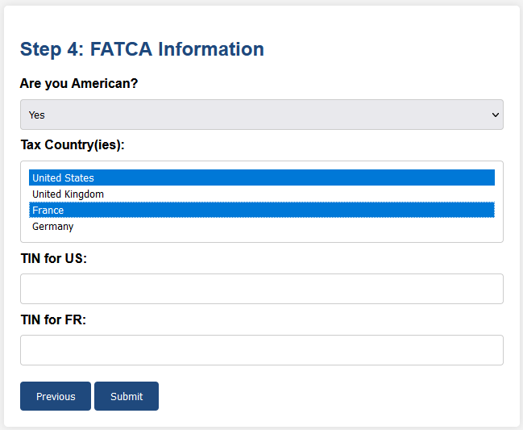

Upload required documents :

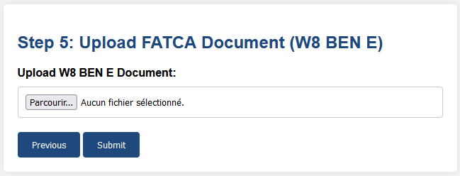

* * *
#### FATCA validation sequence diagram

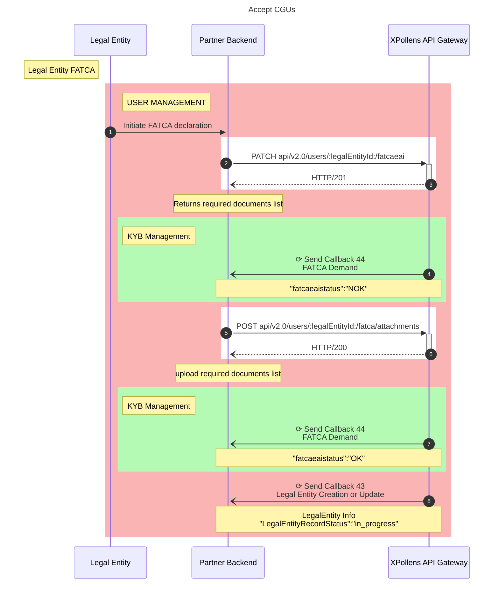

* * *
#### Sending diligence
The `POST api/v2.0/users/{{legalEntityId}}/fatca/attachments` API will be used to send required diligence to XPollens.

:::note 
The type and number of expected diligences is contained in the callback 44 received by the partner
The API has to be called for each expected diligence by the partner
:::

The callback 44 will inform the partner at each change of the FATCA status, providing information on received diligences and their status :

* Pending FATCA
```json
{
    "appUserId": "LEGAL_ENTITY_NAME",
    "diligences": [{
            "files": [
                "FATCA_W8-BEN.pdf"
            ],
            "status": "Awaiting",
            "reason": null
        }
    ],
    "fatcaEaiStatus": "Pending",
    "date": "2023-04-29T09:59:49",
    "type": "44"
}
```

* Ongoing FATCA
```json
{
    "appUserId": "LEGAL_ENTITY_NAME",
    "diligences": [{
            "files": [
                "FATCA_W8-BEN.pdf"
            ],
            "status": "Received",
            "reason": null
        }
    ],
    "fatcaEaiStatus": "Pending",
    "date": "2023-04-29T09:59:49",
    "type": "44"
}
```

* Validated FATCA
```json
{
    "appUserId": "LEGAL_ENTITY_NAME",
    "diligences": [{
            "files": [
                "FATCA_W8-BEN.pdf"
            ],
            "status": "Validated",
            "reason": null
        }
    ],
    "fatcaEaiStatus": "OK",
    "date": "2024-04-29T10:09:52",
    "type": "44"
}
```
* * *
## Representatives creation
Once all the previous steps have been performed to onboard the legal entity, the user has to provide information on company contributors.
### Roles
3 roles can be defined for the relation between contributors and the legal enity :

* Mandated
* LegalRepresentative
* BeneficialOwner

:::warning  IMPORTANT
**At least one user should have the Mandated role (this user can be the legal representative or one of the beneficial owners)**
:::

* * *
### User creation
#### User Flow
Each of the  legal entity contributor has to provide some information and diligences about their identity.
The first step of the user onboarding consists in providing personnal information about the user and then create the user with the `POST api/v2.0/users` APIs.

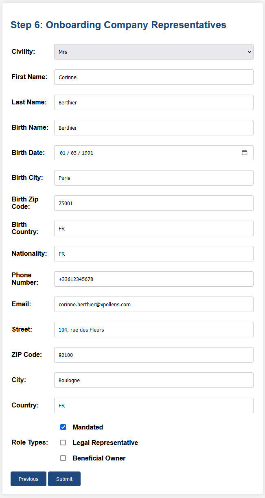

#### More information
You can refer to the Usedrf onboarding available documentation here : https://docs.xpollens.com/usecases/users/onboarding/user_onboarding

* * *
## Legal Entity T&C validation
The last required steps to onboard the legal entity once all other steps are completed and validated is to sign the Terms & Conditions.
After presenting the terms and conditions to the company representative, you have to call the `POST /api/v2.0/users/{{legalEntityId}}/cgu` APIs to  formalize the acceptance of the terms and conditions.

***
# Concluding remarks
After all those steps have been perform, the legal enity account is fully operationnal.

:::note
Please note that the workflow introduce in this document contains all the required steps to onboard a legal entity with the default requirements and environment parameterization.

Depending on the use case, the XPollens API flexibility allows for several other workflow to be operated.
:::