# Instant Payment (IP)

## Create a beneficiary

Before being able to perform an **instant transfer**, it is necessary to add the transfer recipient to one's list of beneficiaries.

The [Create a beneficiary](/api/TransferBeneficiary#post-/api/v2.0/users/-appUserId-/beneficiary) endpoint is used in order to create and associate an external beneficiary account in order to perfom a Sepa Out operation.

* The BIC (Bank Identifier Code) is optionnal to add a beneficiary.
* The IBAN (International Bank Account Number) is mandatory to create the beneficiary

  
The following sequence diagram shows the API workflow to add a beneficiary :

  
<br/><br/>  

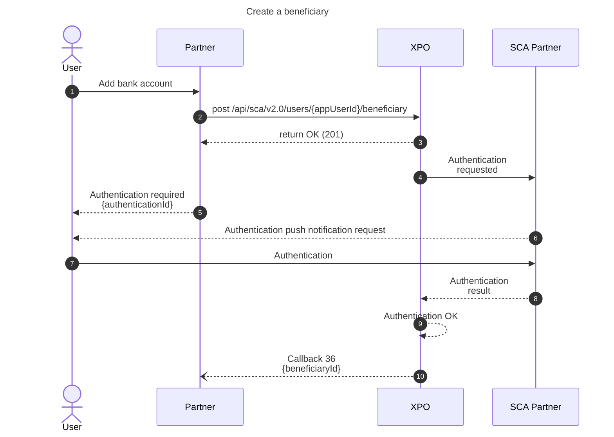

  

:::warning  Important  
When the **add beneficiary** feature is triggered by a manual action from an end user, it is mandatory to use the **sca** route to add a beneficiary as user authentication is required for security / compliance reasons.  
:::

::: note  **API reference**  
API : https://docs.xpollens.com/api/TransferBeneficiary#tag--Beneficiary  
:::

* * *

## Initiate an IP OUT

### State diagram

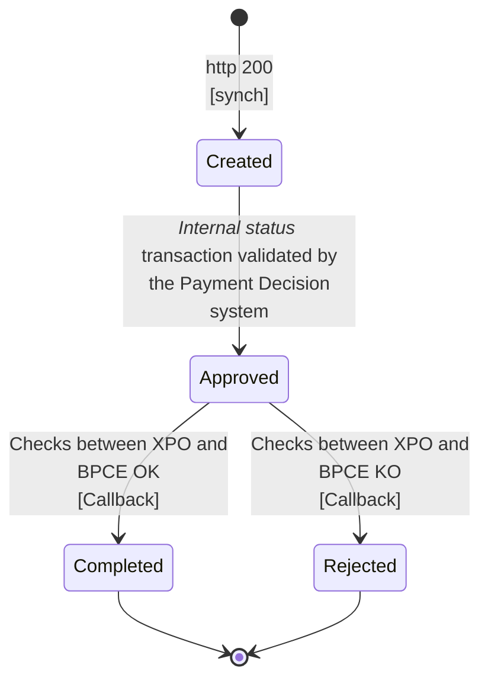

* * *

### IP OUT succeeded

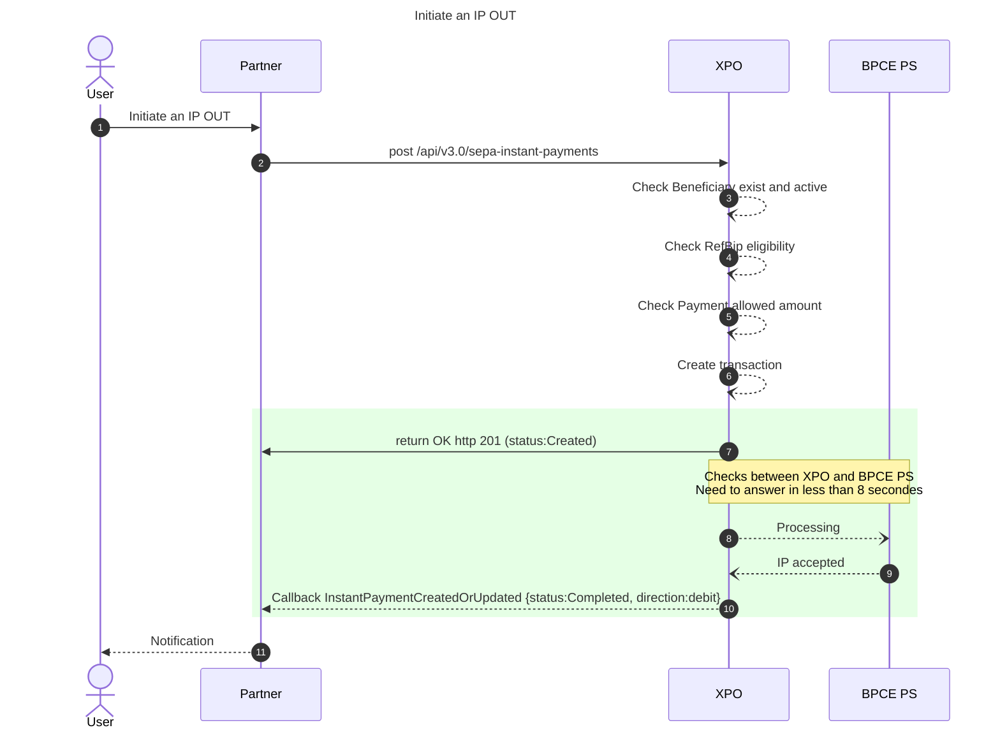

  

[`POST /api/v3.0/sepa-instant-payments`](https://docs.xpollens.com/api/SCTINST#post-/api/v3.0/sepa-instant-payments)

[`Callback "InstantPaymentCreatedOrUpdated"`](https://docs.xpollens.com/api/Callbacks#post-/-InstantPaymentCreatedOrUpdated-)

##### Succeeded during the post sepa-instant-payments Check Eligibility

Synchrone reponse

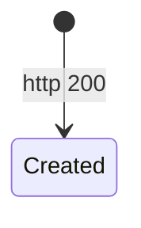

##### Succeeded during the process between Xpollens and BPCE PS

Asynchrone reponse

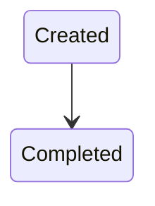

* * *

### IP OUT failed

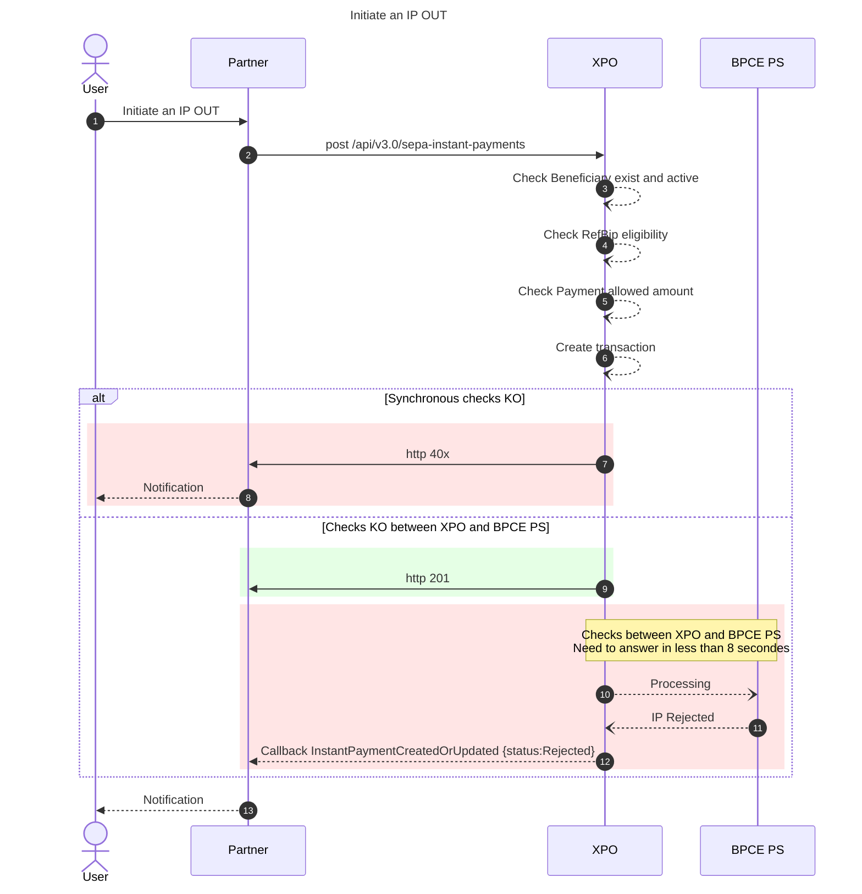

  

#### Failed during the post sepa-instant-payments

| <ins>Status HTTP</ins> | <ins>Error code</ins> | <ins>Reason</ins> | <ins>Definition</ins> |
| --- | --- | --- | --- |
| 400 | 715 | ERR_API_PARAMETER_INVALID | **Non éligble à l'ip** |
| 404 | 147 | ERR_USER_NOTFOUND | \*  |
| 404 | 302 | ERR_IBAN_NOT_FOUND | \*  |
| 201 |     |     | **Created** |
| 500 |     | XPOLLENS INTERNAL ERROR | \*  |

  

#### Failed during the process between Xpollens and BPCE PS

| <ins>Status</ins> | <ins>SepaRejectCode</ins> | <ins>sepaRejectReason</ins> |
| --- | --- | --- |
| Rejected | 500 | Reason not communicated, please contact Xpollens |
| Rejected | AB05 | Transaction stopped due to timeout at the creditor agent |
| Rejected | AB06 | Transaction stopped due to timeout at the Instructed Agent |
| Rejected | AB07 | Agent of message is not online. Generic usage if it cannot be determined who exactly is not online |
| Rejected | AB08 | Creditor Agent is not online |
| Rejected | AB09 | Transaction stopped due to error at the Creditor Agent |
| Rejected | AB10 | Transaction stopped due to error at the Instructed Agent |
| Rejected | AC01 | Account identifier invalid or incorrect (i.e. invalid IBAN or account number does not exist) |
| Rejected | AC04 | Account closed |
| Rejected | AC06 | Account blocked |
| Rejected | AG01 | Credit transfer forbidden on this account |
| Rejected | AAM02 | Not allowed amount |
| Rejected | AM04 | Insufficient funds on the account |
| Rejected | AM05 | Duplicate payment |
| Rejected | AM09 | Wrong amount |
| Rejected | CNOR | Beneficiary bank is not registered under this BIC in the CSM |
| Rejected | FF01 | Operation/transaction code |
| Rejected | FRAD | Fraudulent originated (instant) credit transfer |
| Rejected | ISSUE-DISPCHECK-TIMEOUT-RESPONSE | Timeout on PSP communication, please retry |
| Rejected | MS01 | Reason not specified |
| Rejected | MS02 | By order of the Beneficiary |
| Rejected | MS03 | Reason not specified, please contact Xpollens |
| Rejected | RR02 | Missing Debtor’s Name Or Address |
| Rejected | RR04 | Regulatory Reason |
| Rejected | TM01 | Time-out – maximum execution time has been exceeded |

  
<br/>

* * *

## Receive an IP IN

Xpollens is **eligible** to instant payment.

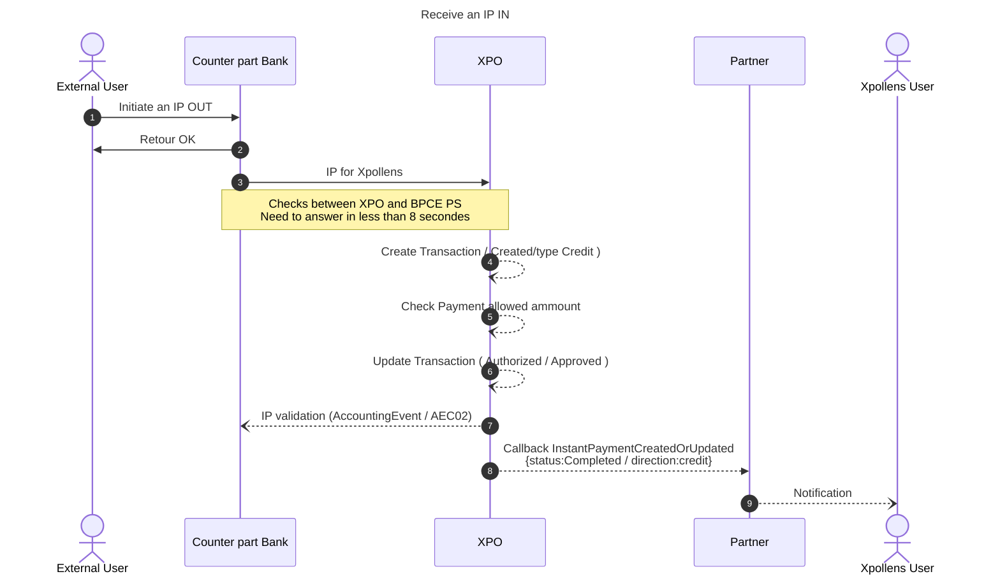

- [`Callback "InstantPaymentCreatedOrUpdated"`](https://docs.xpollens.com/api/Callbacks#post-/-InstantPaymentCreatedOrUpdated-)

* * *

## Recall IP

### Recall IP OUT

How the partner can do a recall > Zendesk ticket to Xpollens' banking production department

#### Succeeded

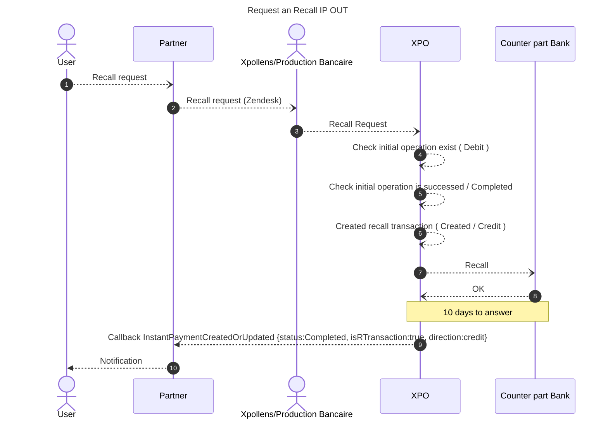

- Account credited
- [`Callback "InstantPaymentCreatedOrUpdated"`](https://docs.xpollens.com/api/Callbacks#post-/-InstantPaymentCreatedOrUpdated-)

#### Failed

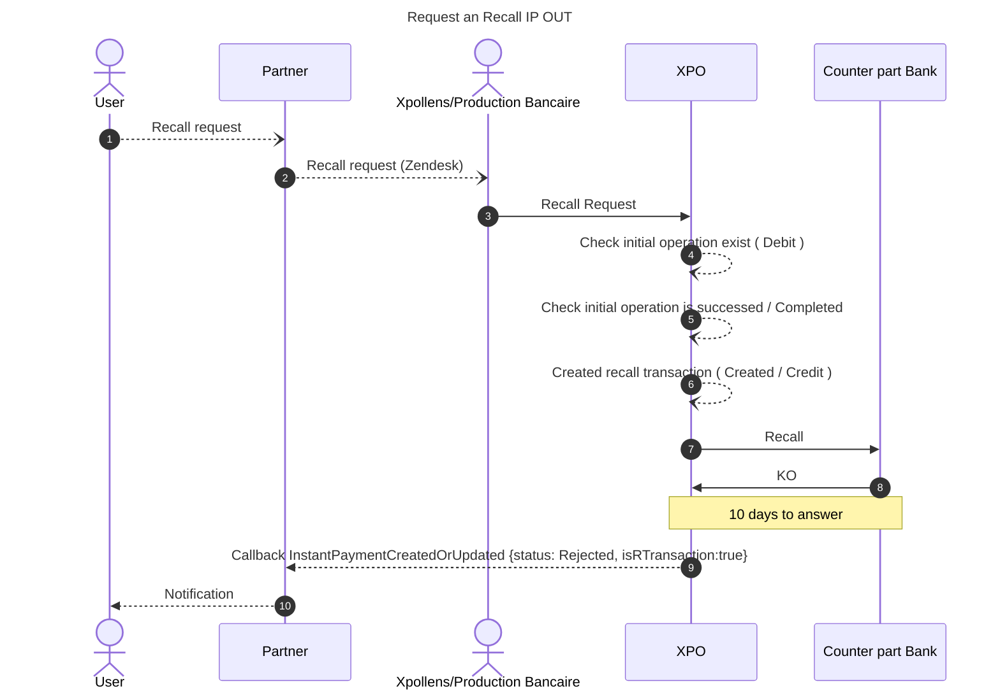

- Account not debited
- [`Callback "InstantPaymentCreatedOrUpdated"`](https://docs.xpollens.com/api/Callbacks#post-/-InstantPaymentCreatedOrUpdated-)

  

* * *

### Recall IP IN

Recall request from an external bank processed by our banking production department

#### Succeeded

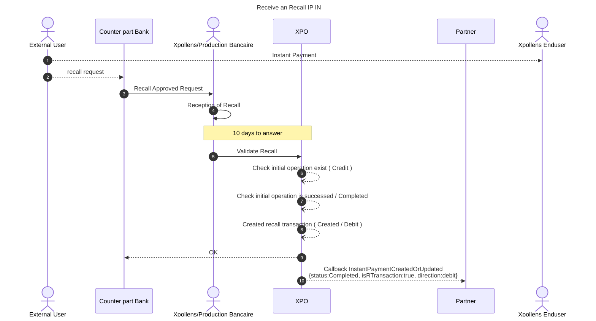

- Account debited
- [`Callback "InstantPaymentCreatedOrUpdated"`](https://docs.xpollens.com/api/Callbacks#post-/-InstantPaymentCreatedOrUpdated-)

#### Failed

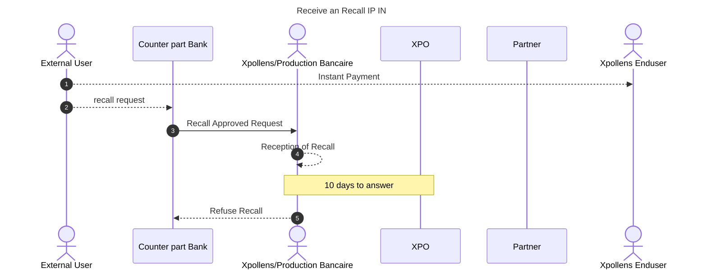

- Account not debited

  
<br/>

* * *

## How to test

### IP OUT

/!\ Only the ibans of unmocked environment pass the Luhn key checks and can be used.

`POST /api/v2.0/users/{appUserId}/beneficiary`

```json
{
  "displayName": "Compte Xpollens 1",
  "iban": "FR7630001007941234567890185",
  "bic": "SMOEFRP1",
  "firstName": "John",
  "lastName": "Doe",
  "companyName": "Xpollens",
  "zipCode": "75001",
  "email": "john.doe@xpollens.com",
  "phoneNumber": "0123456789"
}

```

**Response**

```json
{
[...]
"beneficiaryId": "YourBeneficiaryId",
[...]
}

```

`POST /api/v3.0/sepa-instant-payments`

```json
{
  "sepaInstantPaymentId": "Ip-out-1",
  "accountId": "account-partner-reference",
  "creditor": {
    "beneficiaryId": "YourBeneficiaryId"
  },
  "amount": {
    "value": "5.00",
    "currency": "EUR"
  },
  "reference": "Reference-Ip-Out",
  "description": "Ip-Out-Description"
}

```


 <br/> 

* * *

### IP IN

Simulator to come, to create cases ask your Customer Integration Manager.

### IP OUT

Simulator to come, to create cases ask your Customer Integration Manager.

<br/>

* * *

## FAQ

*Coming soon*
