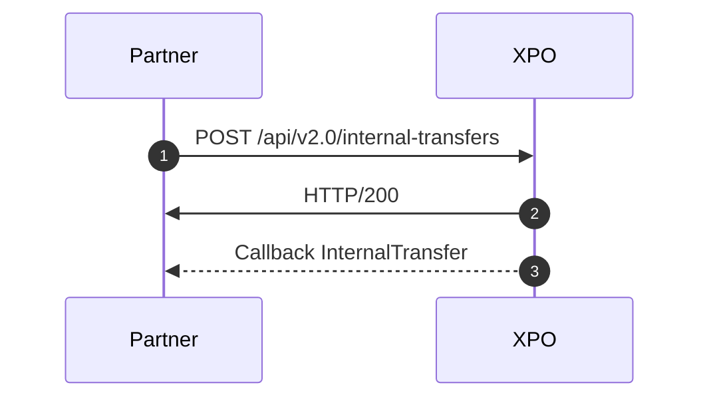
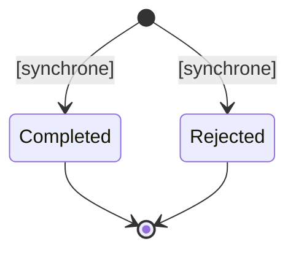

# Internal Transfer: definition

Interal transfers are from xpollens account to xpollens account only.  
They are instantaneous.
Internal transfer are sometimes called "P2P", meaning "peer to peer"  operation.

<br/><br/>

* * *
## Feature characteristic

The **processUnpaid** parameter allows the account to be debited even if there are insufficient funds. This function is particularly useful in the fees and commission use case described below.


The  `checkLimits`  parameter allows you to specify whether the limits should be verified before performing a P2P transfer. This feature is commonly used when you want to apply fees regardless of the set limits. If  `checkLimits`  = false, the limits are **not** affected and remain unchanged.




<br/>

* * *

## Status



<br/><br/> 

* * *

## Use cases

### Charges, commission

If charges are to be deducted from the account (operating costs, card charges, etc.), the internal transfer must be used.

By using processUnpaid = true, it is possible to debit the account, even if it does not have sufficient funds.  
A debt will then be created on the account, which will then have to be recovered.

<br/> 

### Transform Sepa Credit Transfer out / Instant Payment out to Internal Transfer

To reduce costs and increase speed, it is possible to transform SCT and IP between two accounts at your premises into P2P.

To do this, each time you receive a transfer request from one of your customers, you need to :  
1- check that the bic is SMOEFRP  
2- if so, check that the iban exists in your database, or check that the iban contains your sort code  
the iban is made up as follows: 

| code country | Check Digits | Bank code | Sort code | Account number |
| --- | --- | --- | --- | --- |
| 2 letters | 2 digits | 4 digits | 8+ 4 digits | 13 caracters |
| Example: FR | Example: 76 | 1652 | ask to your integration manager |     |

\=> if yes, make a post /api/v2.0/internal-transfers

<br/> 

### Debts and fund recovery

When a debt is created - meaning the authorization balance turns negative - an internal transfer is automatically triggered to reset the balance to €0. This transfer is made from the profit and loss account to the user’s account. 
A debt is then created, **see the Debt documentation.**


When a customer owes you money, it is your responsibility to recover the funds. To do so, you need to initiate internal transfers from the customer’s account to your profit and loss account.

For more details, please refer to **the Debts documentation**.

<br/> 

### Webdesk

Internal transfers are available in the partner area for manual adjustments. These transfers can be made between customer accounts or between a customer account and one of your own partner accounts.

<br/><br/>

* * *

## API, callbacks & technical items

[`POST api/v2.0/internal-transfers`](https://docs.xpollens.com/api/TransferP2p#post-/api/v1.1/users/-userid-/payments)


| Error | Status | Code | Message | Comment | 
| --- | --- | --- | --- | --- |
| 400 | Not created | 710 | Opération déjà existante.| |
| 400 | Not created | 147 | Votre saisie ne correspond pas à un utilisateur S-money | |
| 500 | Not created | 1 | "Une erreur technique est survenue, veuillez réessayer. Si l’erreur persiste, contactez le support client S-money. Object reference not set to an instance of an object.| recipient.accountId unvalid |
| 201 | Rejected | -- | Insufficient fund | |
| 200 | Rejected | -- | Account limits reached | For the sender or the receiver |


[`internalTransfer`](https://docs.xpollens.com/api/TransferP2p#post-/api/v1.1/users/-userid-/payments)


```json
"Payload": {
        "type": "InternalTransfer",
        "internalTransferId": "thisIsYourInternalTransferId",
        "creationDate": "2023-09-25T12:05:29.4246004+00:00",
        "status": "Completed",
        "reason": null,
        "amount": {
            "value": "10.00",
            "currency": "EUR"
        },
        "sender": {
            "accountId": "rmyrqwhxzj"
        },
        "recipient": {
            "accountId": "locwfbm3dt"
        },
        "extraDatas": {
            "description": "description",
            "label1": "label1",
            "label2": "label2",
            "label3": "label3"
        },
        "processUnpaid": false,
	"checkLimits": boolean
    }
```


<br/> 

* * *
## FAQ
### FAQ1: Are InternalTransfer and InternalDebtTransfer considered the same type of operation?
Yes and no.
Both are P2P operations, meaning they involve transferring money between two Xpollens accounts. 
However, they are considered distinct because an InternalTransfer is initiated by you, while an InternalDebtTransfer is generated by Xpollens in the specific scenario of debt creation.

<br/>

* * *
## Best practise
### Automatic batch for commission processing and account closure
Accounts with the following statuses must be excluded from this batch:

- ClosureRequested
- PendingClosure
- Closed

Accounts in any of these statuses cannot be debited; therefore, a 40x error will be returned for such requests.

For more details, please refer to **the Debts documentation**.
