# Sepa Credit Transfer (SCT)

SCT transfer is used to send money to a beneficiary defined by an IBAN. You can also define recurring SCT, plan them or ask for its refund.

  
<br/>

* * *

## SEPA zone

The SEPA region consists of 36 European countries, including several countries which are not part of the euro area or the European Union. Also are included all French overseas areas. More information here : https://www.ecb.europa.eu/paym/integration/retail/sepa/html/index.en.html

<br/>

* * *

## Create a beneficiary

This endpoint is used to create and associate an external beneficiary account in order to perfom a Sepa Out operation. The BIC and IBAN should be used to create the beneficiary.

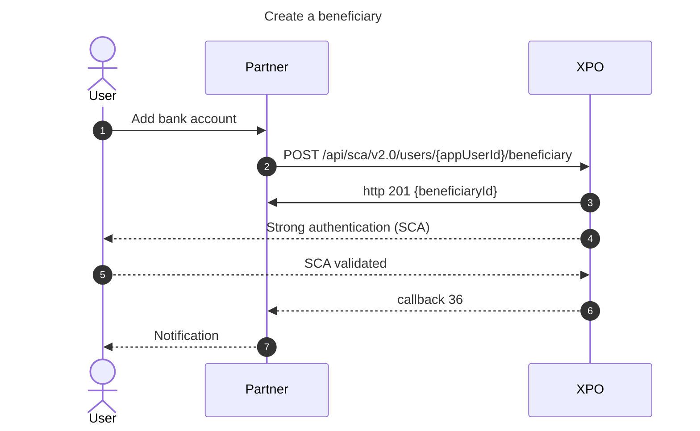

:::note 
No callback is sent when the beneficiary is created.
:::

API : https://docs.xpollens.com/api/TransferBeneficiary#post-/api/v2.0/users/-appUserId-/beneficiary

  
  <br/><br/>

* * *

## Initiate an SCT OUT

### States diagram

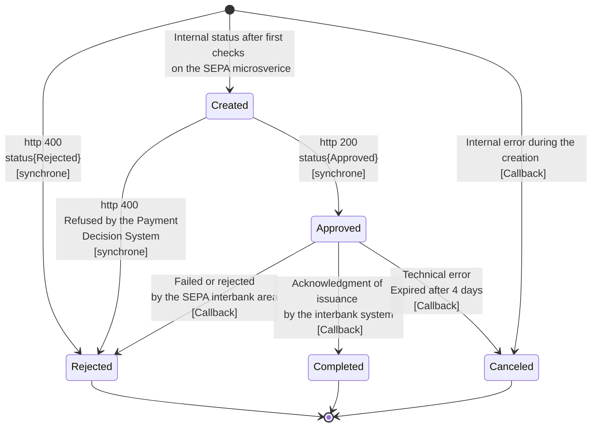

  

* * *

### Status & balance

<ins>Approved</ins> : Only the authorization balance is debited,  
<ins>Completed</ins> : Both accounting balance and authorisation balance are debited  
<ins>Rejected</ins> : Funds are on the account  
<ins>Canceled</ins> : Funds are on the account

  

* * *

### SCT OUT succeeded

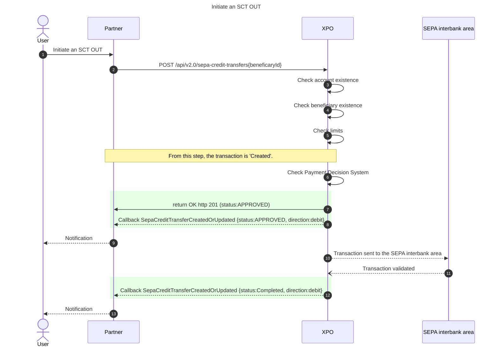

[`POST /api/v2.0/sepa-credit-transfers`](https://docs.xpollens.com/api/TransferSCT#post-/api/v2.0/sepa-credit-transfers)

[`Callback "SepaCreditTransferCreatedOrUpdated"`](https://docs.xpollens.com/api/Callbacks#post-/-SepaCreditTransferCreatedOrUpdated-)

  

* * *

### SCT OUT Rejected
#### SCT OUT Rejected during the controls performed by the SEPA microservice
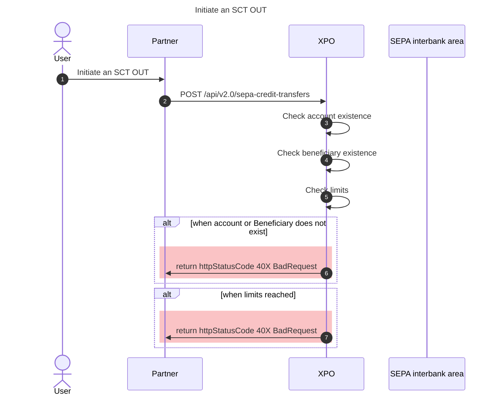


#### SCT OUT Rejected during the controls performed by the Payment Decision System 
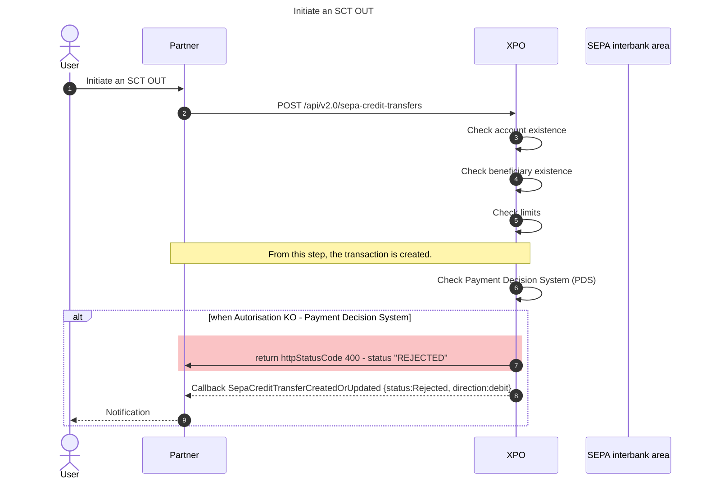

#### SCT OUT Rejected by the external bank
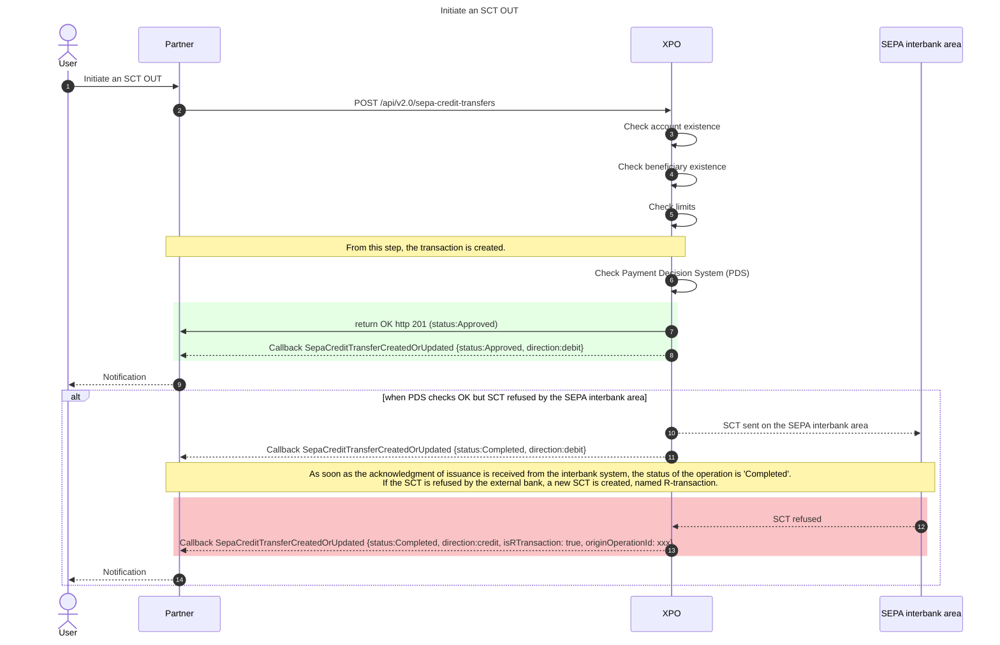

* * *

#### Error during the POST /api/v2.0/sepa-credit-transfers

| <ins>Status HTTP</ins> | <ins>Error code</ins> | <ins>Reason</ins> | <ins>Definition</ins> | Is the SCT created? |
| --- | --- | --- | --- | --- |
| 400 | 715 | ERR_BENEFECIARY_NOT_FOUND | Beneficiary not found | not created |
| 404 | 147 | ERR_USER_NOTFOUND | User does not existe | not created |
| 400 | 149 | Plafond de transaction atteint | limit reached | not created |
| 500 |     | XPOLLENS INTERNAL ERROR | \*  |  not created   |

* * *

#### SEPA Reject Code, if not R-transaction

In the case the SCT is refused, the attribute `sepaRejectCode` provides some details about the rejection reason.

These reasons are listed in the [documentation](https://docs.xpollens.com/api/TransferSCT#get-/api/v2.0/sepa-credit-transfers/-sepaCreditTransferId-)

  
<br/>

* * *

### SCT OUT Canceled

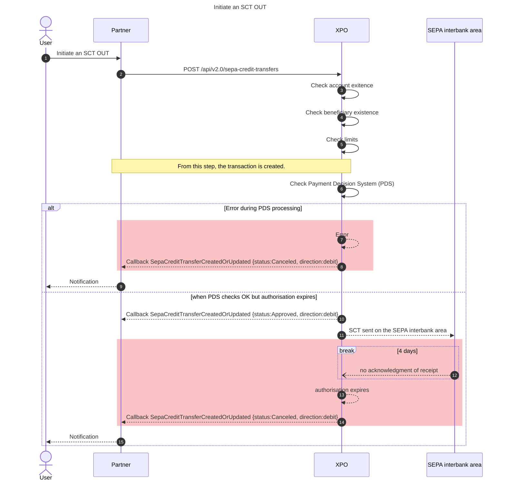

  
<br/><br/>

* * *

## Receive an SCT IN

### States diagram

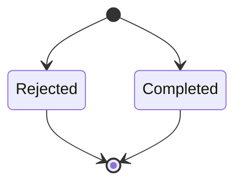

* * *

### SCT IN sequence diagram

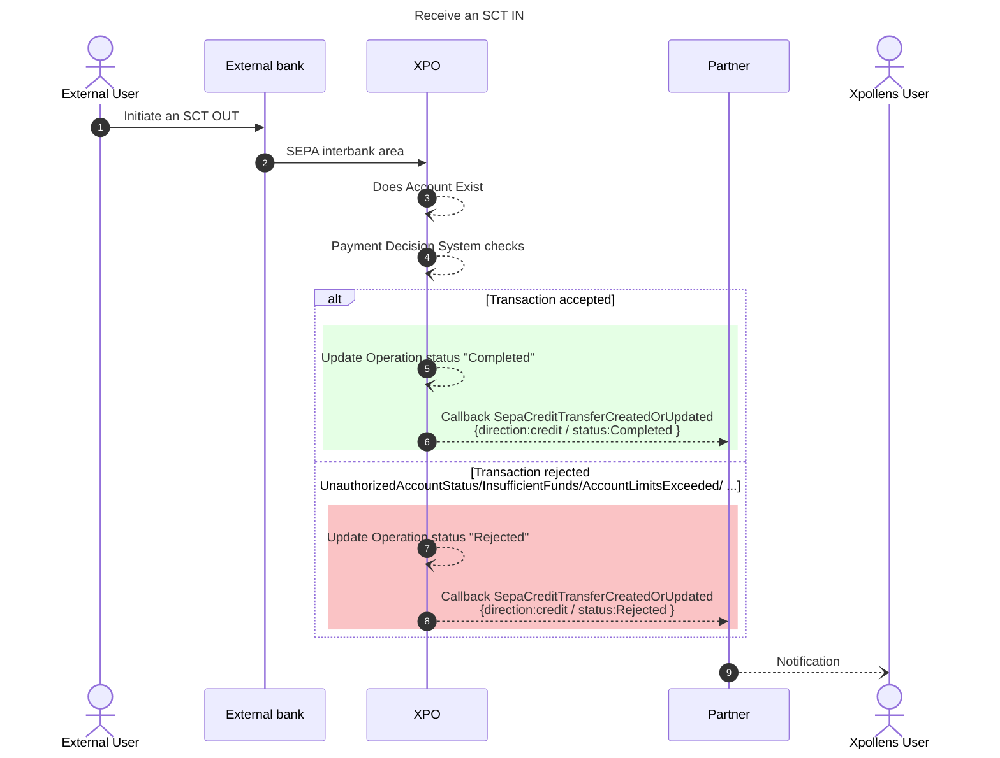

[`Callback "SepaCreditTransferCreatedOrUpdated"`](https://docs.xpollens.com/api/Callbacks#post-/-SepaCreditTransferCreatedOrUpdated-)

  
<br/><br/>

* * *

## R-transaction for Sepa Credit Transfer

### Recall SCT OUT

How the partner can do a recall > Zendesk ticket to Xpollens' banking production department

#### Succeeded

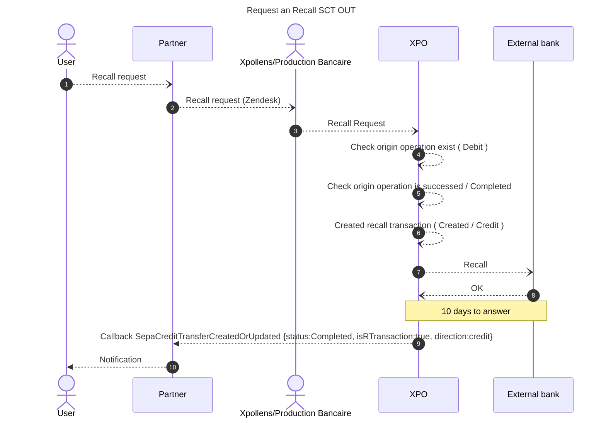

- Account credited

#### Failed

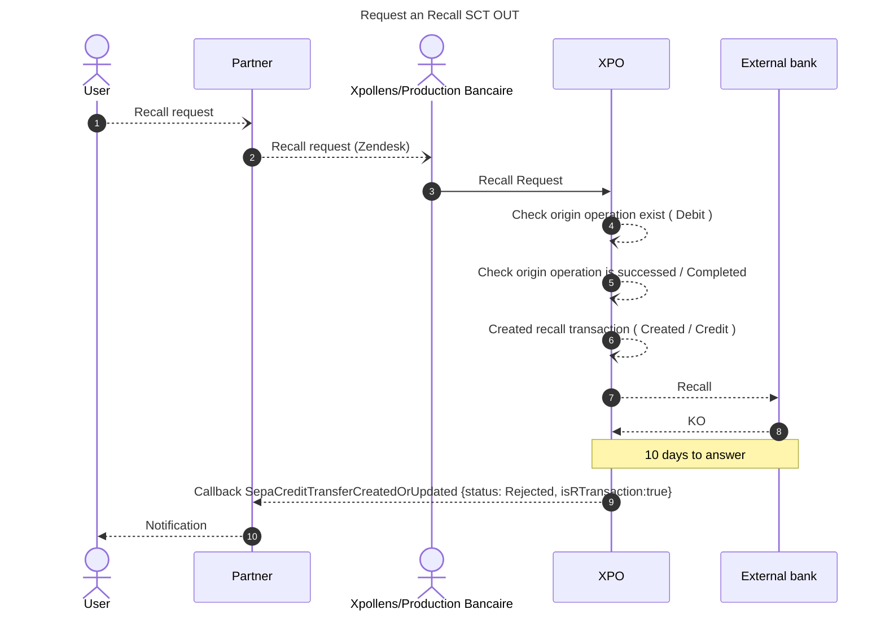

- Account not debited

* * *

### Recall SCT IN

Recall request from an external bank processed by our banking production department

#### Succeeded

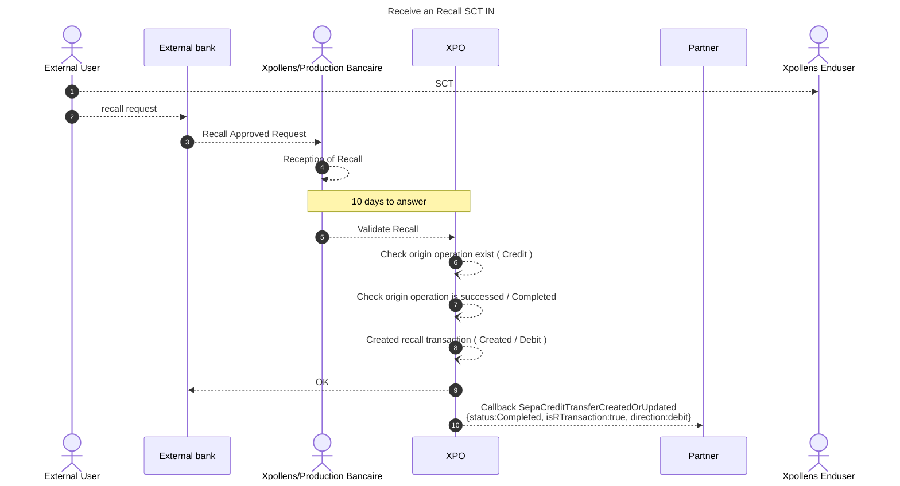

- Account debited


#### Failed

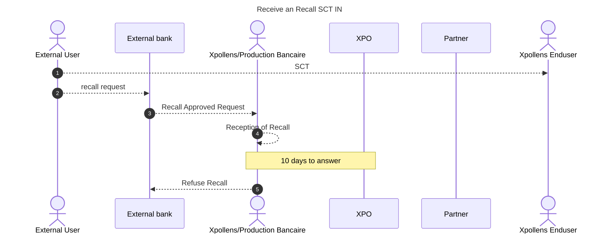

- Account not debited

  
<br/><br/>

* * *

## How to test

### Create a beneficiary

:::warning  Important
Only the ibans of unmocked environment pass the Luhn key checks and can be used.
:::

`POST /api/v2.0/sca/users/{appUserId}/beneficiary`

```json
{
  "displayName": "Compte Xpollens 1",
  "iban": "FR7616528001310000000321058",
  "bic": "SMOEFRP1",
  "firstName": "John",
  "lastName": "Doe",
  "companyName": "Xpollens",
  "zipCode": "75001",
  "email": "john.doe@xpollens.com",
  "phoneNumber": "0123456789"
}

```

**Response**

```json
{
    "id": 1055663,
    "beneficiaryId": "xxxxxxxx-xxxx-xxxx-xxxx-xxxxxxxxxxxx",
    "displayName": "Compte Xpollens 1",
    "bic": "SMOEFRP1",
    "iban": "FR7616528001310000000321058",
    "firstName": "John",
    "lastName": "Doe",
    "companyName": "Xpollens",
    "zipCode": "75001",
    "email": "john.doe@xpollens.com",
    "phoneNumber": "0123456789",
    "creationDate": "2024-10-11T08:27:13.16Z",
    "modificationDate": "2024-10-11T08:27:13.16Z"
}

```

**Callback36**

```json
    "Payload": {
        "Header": {
            "AuthenticationId": "53b66cfc-ead2-4f23-910e-3d5b95fd0b1b",
            "Type": 36,
            "AppUserId": "appUserId",
            "AuthenticationResultDate": "2024-10-11T07:58:45+00:00",
            "RequestProcessDate": "2024-10-11T08:27:13.16+00:00",
            "RequestResponseCode": 201,
            "RequestDate": "2024-10-11T07:58:46.621378+00:00",
            "Status": "Succeeded",
            "Reason": null
        },
        "Payload": "{\"id\":1170641,\"beneficiaryId\":\"xxxxxxxx-xxxx-xxxx-xxxx-xxxxxxxxxxxx\",\"displayName\":\"Compte Xpollens 1\",\"bic\":\"SMOEFRP1\",\"iban\":\"FR7616528001310000000321058\",\"companyName\":\"Xpollens\",\"creationDate\":\"2024-10-11T08:27:13.16Z\",\"modificationDate\":\"2024-10-11T08:27:13.16Z\"}"
    },


```

### Initiate a SCT OUT

`POST /api/v2.0/sepa-credit-transfers`

```json
{
  "sepaCreditTransferId": "partnerOperationId123",
  "accountId": "YourAccountId",
  "creditor": {
    "beneficiaryId": "YourBeneficiaryId"
  },
  "amount": {
    "value": "25.11",
    "currency": "EUR"
  },
  "description": "Sending money with Xpollens",
  "reference": "PartnerInternalReference",
  "expectedExecutionDate": "2024-10-09T13:54:50.5317369+00:00"
}

```

  
<br/>

* * *

### Receive a SCT IN

`POST /v1.1/users/{{appUserId}}/sct/in/registration`

```json
{
  "amountRequest": {
    "value": "20.00", // amount
    "currency": "EUR"
  },
  "executionDate": "2024-07-18T15:06:56.619276+02:00",
  "externalBankAccountModel": {
    "thirdPartyIban": "FR7616528000510000001751068",
    "thirdPartyBIC": "SMOEFRP1",
    "thirdPartyFullName": "John Doe"
  },
  "partnerOperationId": "310a8513-fa13-43cb-bb2b-2f7e49112315_20240719_1",
  "message": "Sending money through SCT",
  "motif": "Sending money with Xpollens"
}
```

  
<br/><br/>

* * *

## FAQ

### FAQ1: What is the SCT description sent to the SEPA interbank area and visible in the external application ?
The attribute named `description` is the one sent to the SEPA interbank area and visible in the external application.

The `reference` attribute, on the other hand, is only visible to you and not shared externally.

In some cases, the external application may not display the description. Unfortunately, this is beyond our control.

### FAQ2: How long does it take to receive an SCT?
SCTs are typically received within 2 working days.

### FAQ3: Is a callback received when a beneficiary is created?
Our application does not have a dedicated callback for beneficiary creations. 
The information is sent through the SCA webhook (36).
