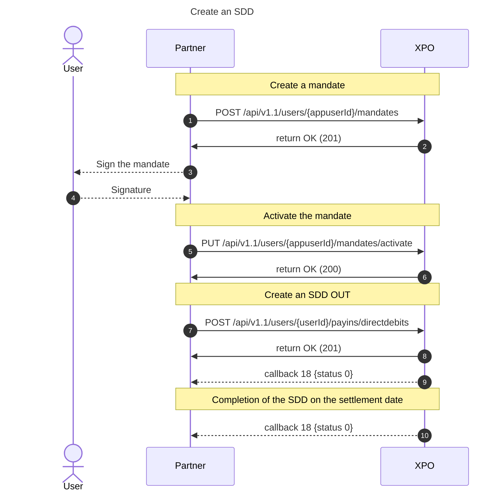
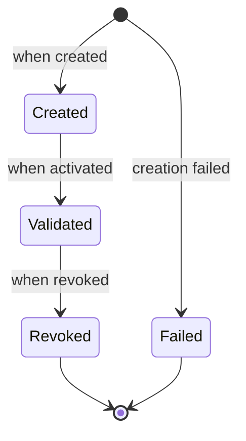
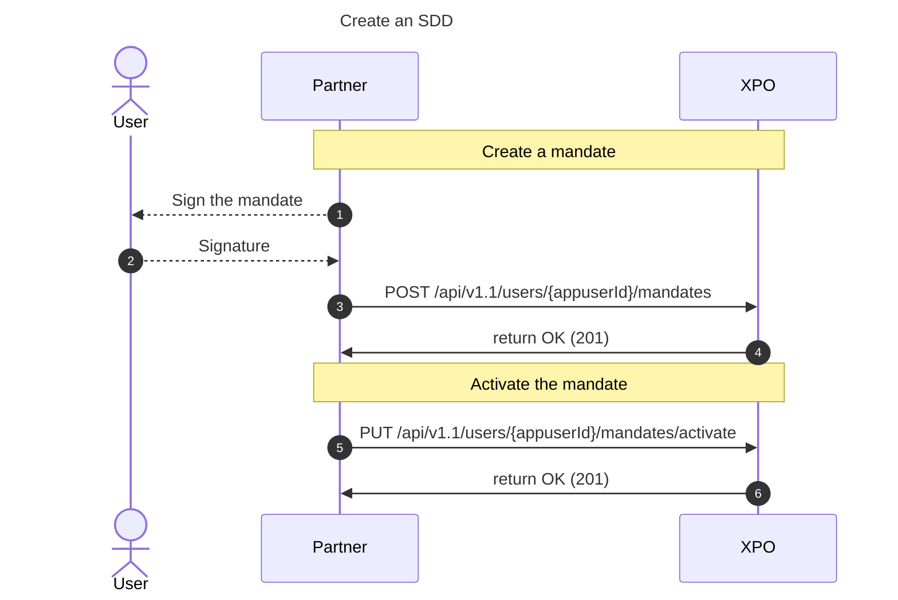
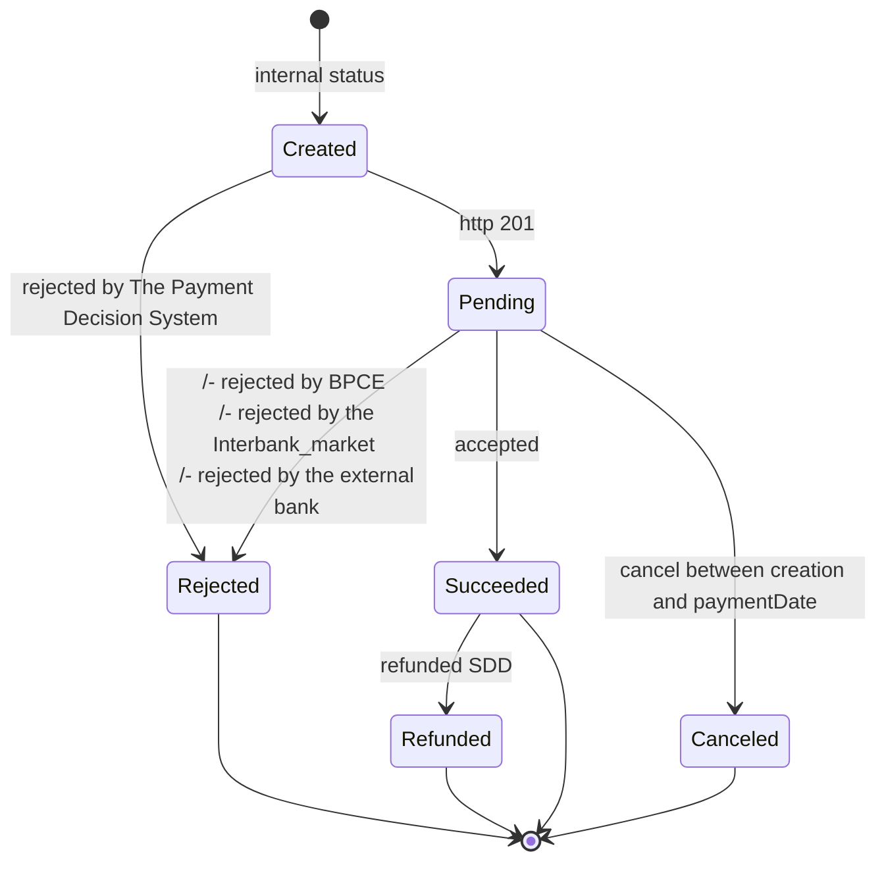
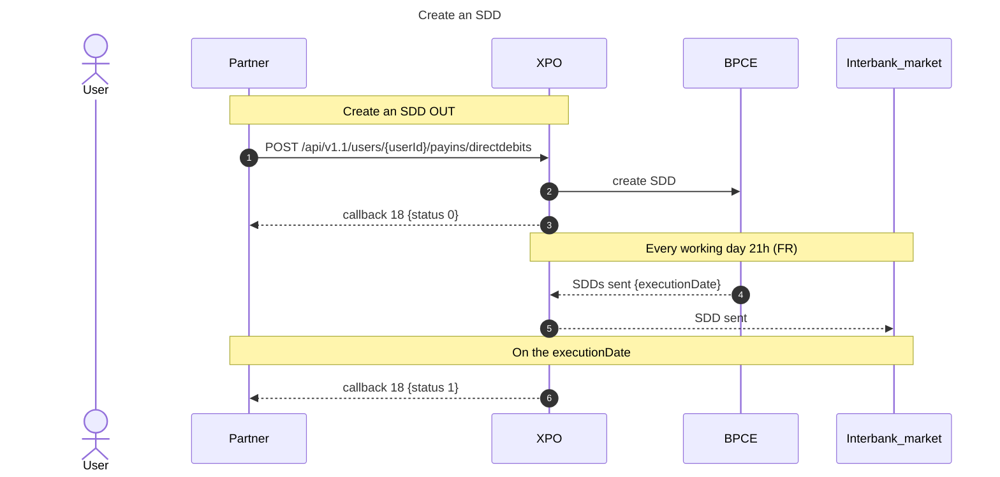
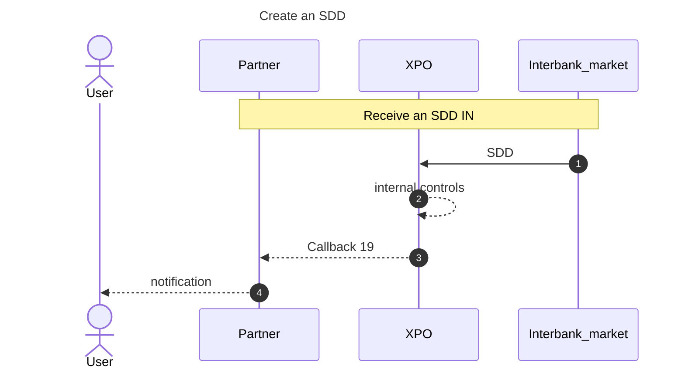
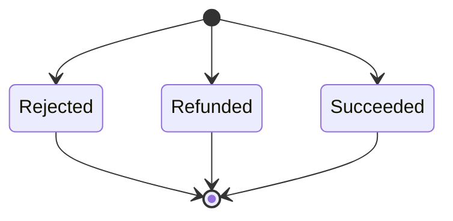
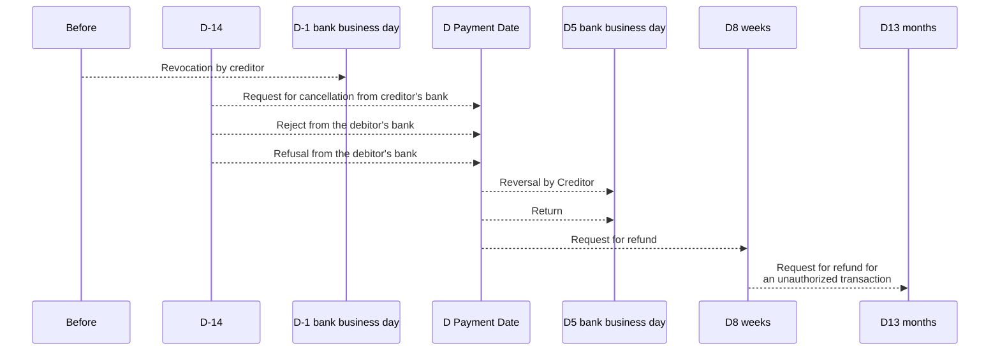
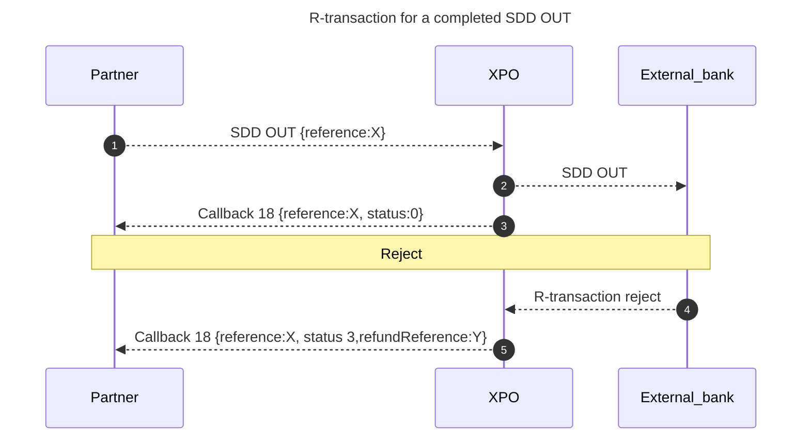

# Sepa Direct Debit (SDD)

SEPA Direct Debit (SDD) is a pull-based payment scheme that allows a creditor to debit a debtor's bank account. Similarly to other SEPA transfers, an SDD requires the IBAN (and occasionally the BIC) of both the sender and the recipient's bank accounts. However, it differs from other SEPA transfers in that the roles are reversed: the recipient of the funds is the one who must request the money transfer from the sender.

SEPA Direct Debit is only available in Euros and can be used for both one-off transactions and recurring payments. It is often used for recurrent payments so that customers can avoid missing payments and being charged additional fees.  
The debtor must sign a valid SDD mandate to authorize the creditor to withdraw the money from the debtor's account. Additionally, there are other rules governing SDDs, such as pre-notifications, refunds, returns, etc.

Xpollens provides a complete solution to create mandates and manage Sepa Direct Debit (SDD). If you already have a Sepa Creditor ID (SCI), you will be able to use it to direct debit your customer. If not, we can provide you with one within 48 hours.

   

## General sequence diagram

  

* * *

## Mandate

The mandate creation is a prerequesite to create an SDD (see "State diagram for an SDD OUT").

### State diagram for a mandate

| **Status Name** | **Status Id** |
| :--- | :--- |
| Created | 2   |
| Validated | 3   |
| Revoked | 4   |
| Failed | 6   |

> Note: Xpollens does not create a document for the mandate. If you want to display a document to your customers, you must create it.

  

* * *

### Mandate creation

[POST /api/v1.1/users/{appuserId}/mandates](https://docs.xpollens.com/api/TransferSDD#post-/api/v1.1/users/-appuserId-/mandates)

To use this mandate and create and SDD, the mandate must be activated.

  

* * *

### Mandate activation

[PUT /api/v1.1/users/{appuserId}/mandates/activate](https://docs.xpollens.com/api/TransferSDD#put-/api/v1.1/users/-appuserId-/mandates/activate)

  

* * *
### Mandate revocation

#### Why and when

The mandate can not be modified. As a consequence, if a modification is needed, you must

- revoke the mandate
- create a new one

#### Impacts

The revocation of the mandate does not cancel already scheduled SDDs.

  

* * *
### What happens if the end user revokes the mandate from their external bank?  
Xpollens is not aware that all SDDs have been opposed and that the mandate has been revoked.  
However, we receive rejections for all direct debit attempts.

    

* * *

## Sepa Direct Debit OUT (SDD OUT)

An SDD out is an SDD that debits an external account to credit the Xpollens account.

### State diagram for an SDD OUT

| **Status Name** | **Status Id** |
| :--- | :--- |
| Created | Internal |
| Pending | 0 | 
| Succeeded | 1 |
| Refunded | 2 |
| Rejected | 3 |
| Canceled | 5 |

 

* * *

### Sequence diagram for an SDD OUT

 

### paymentDate / executionDate

The `paymentDate` is the payment date expected by the partner (or its enduser) and entered in the request POST.  
This date is sent to Base Mandat, which gives us the real date: the `executionDate`. This information is returned by the GET.

These `executionDate` can be different from the `paymentDate` if:

- the `paymentDate` is a day during a week-end or a day off. In this case, the `executionDate` is the next working day.
- the `paymentDate` is between today (D) and strictly less than D+3. In this case, the `executionDate` is automatically the first working day >= {paymentDate + 3 days}.

> Note: the `paymentDate` can not be in the past.

An SDD can only be created a maximum of 14 days before the `paymentDate`.
Therefore, you need to manage the debit schedule on your side to create the SDDs in a timely manner.

### Rule
To schedule multiple SDDs in parallel for the same mandate, the first SDD must be finalized. This occurs as soon as its status changes to "1."

  

* * *

## Sepa Direct Debit IN (SDD IN)

An SDD in is an SDD that debits the Xpollens account to credit an external account. The mandate is owned by the external bank.

### Sequence diagram for an SDD IN

 

* * *

### State diagram for an SDD IN

| **Status Name** | **Status Id** |
| :--- | :--- |
| Succedeed | 1 |
| Refunded | 2 |
| Rejected | 3 |

   

* * *

## API & technical items

### POST /api/v1.1/users/{appuserId}/mandates

`uniqueMandateReference` (umr): to use for mandate activation and revocation, and for get mandate  
`id`: to use for SDD OUT creation

### POST /api/v1.1/users/{userId}/payins/directdebits

`orderId`: unique reference
`userId`: can only be one of your internal account  
`amount`: cents
`motif`: description visible in the external app

### Error for a mandate creation

| **Use case** | **HTTP code** | **Code** | **Response** |
| :--- | :--- | :--- | :--- |
| Technical error on our supplier side | 400 | 1056 | {"Code": 1056,   "ErrorMessage": "Erreur creation mandat.",   "Title": "L'opération ne peut pas aboutir",   "Priority": 2,   "Date": "2024-05-28T12:56:13.9122356Z",    "OperationId":"81e6a6e9b12064e14d636477904fb621"}|

 

* * *

### Error for a SDD OUT creation

| **Use case** | **Transaction** | **HTTP code** | **Code** | **Response** |
| :--- | :--- | :--- | :--- | :--- |
| orderId already exists | Not created | 400 | 710 | {"Code": 710,   "ErrorMessage": "Opération déjà existante.",   "Title": "L'opération ne peut pas aboutir",8   "Priority": 2,   "Date": "2024-05-22T14:36:43.3317607Z",   "OperationId": "7bf9a2a1de20f2be1ccb56c89475dd8a"} |
| Invalid Mandate | Created | 400 | 1025 | {   "Code": 1025,   "ErrorMessage": "Le status du mandat est invalid",   "Title": "L'opération ne peut pas aboutir",   "Priority": 2,   "Date": "2024-05-22T14:44:21.8696087Z",   "OperationId": "5a2894dfc63eb5e2f94d0f5f2362d961"} |
| Can not created 2 SDD | Created | 400 | 1026 | {   "Code": 1026,   "ErrorMessage": "Une erreur technique est survenue, veuillez réessayer. Si l'erreur persiste, contactez le support client S-money.",   "Title": "Erreur technique",   "Priority": 2,   "Date": "2024-05-22T14:44:21.8696087Z",   "OperationId": "5a2894dfc63eb5e2f94d0f5f2362d961"} |
| Action not authorized | Created | 401 | 362 | {   "Code": 362,   "ErrorMessage": "Opération non autorisée",   "Title": "",   "Priority": 2,   "Date": "2024-05-22T14:35:52.4521289Z",   "OperationId": "fe02aa2ac8481ec53707dd003aca72be"} |
| SDD created in the past | Not created | 400 | 715 | {"Code": 715,   "ErrorMessage": "Paramètre(s) d'appel invalide(s). Invalid date",   "Title": "L'opération ne peut pas aboutir",   "Priority": 2,   "Date": "2024-05-28T12:47:33.1807154Z",   "OperationId":"98139f1c201f12b510c6e8fb8d431bed"} |
| Limit reached | Created | 400 | 149 | {"Code": 362,   "ErrorMessage": "Plafond de transaction atteint",   "Title": "Opération non autorisée",   "Priority": 2,   "Date": "2024-05-28T12:47:33.1807154Z",   "OperationId":"98139f1c201f12b510c6e8fb8d431bed"} |
| Insufficient balance | Created | 400 | 362 | {"Code": 362,   "ErrorMessage": "Opération non autorisée",   "Title": "",   "Priority": 2,   "Date": "2024-05-28T12:47:33.1807154Z",   "OperationId":"98139f1c201f12b510c6e8fb8d431bed"} |

 

* * *

### Error for a mandate revocation

| **Use case** | **HTTP code** | **Code** | **Response** |
| :--- | :--- | :--- | :--- |
| Revocation in the futur | 400 | 1   | {"Code": 1,   "ErrorMessage": "Une erreur technique est survenue, veuillez réessayer. Si l’erreur persiste, contactez le support client S-money. The mandate is just allowed to be revoked in the current date.",   "Title": "Erreur technique",   "Priority": 2,   "Date": "2024-05-28T12:57:56.1073723Z",   "OperationId": "ef85ecfe6c6f83a48115046f930f86b4"} |
  
  

* * *

## R-transactions
Some direct debit transactions require exception handling, because one of the parties involved does not or cannot process the collection in the
normal way. This exception handling involves the sending of messages called R-transactions because their names all start with an R: Refusals,
Rejects, Returns, Refunds, Reversals. The definitions of the various SDD R-transactions are outlined this document	:
https://www.europeanpaymentscouncil.eu/sites/default/files/kb/file/2024-11/EPC173-14%20v8.0%20Guidance%20on%20Reason%20Codes%20for%20SDD%20R-transactions.pdf

### General scheme

Reject example: account closed
Refusal by debtor example: the user debited by the SDD OUT refused 

Reversal by creditor example: external bank debit error.
Return example: insufficient balance

 

* * *

### General sequence diagram
In the case of a reject or a refusal the day or after the paymentDate, a new operation is created: this operation is named R-transaction. 
Each of these two operations has an independent status diagram, but the R-transaction is linked to the original operation through the field `refundReference`.

### Case refund after the payment date

The refund operation has a status 1.

:::note
No callback is sent for the refund operation.

As a result, when refundReference is not empty, you must perform a GET request on the refund operation to retrieve the details.
:::

### Case reject or refusal after the payment date

The refund operation has a status 1.

:::note
No callback is sent for the refund operation.

As a result, when refundReference is not empty, you must perform a GET request on the refund operation to retrieve the details.
:::

In this case, Xpollens can not refuse to reimburse the external bank.

 

* * *

### sepaReasonCode & sepaReason
These attributes are visible in callbacks 18 and 19. They are filled when the SDD is refused and a R-transaction 

Please referee to this link, page 5, to find all code, definition and associated use cases.
https://www.europeanpaymentscouncil.eu/sites/default/files/kb/file/2024-11/EPC173-14%20v8.0%20Guidance%20on%20Reason%20Codes%20for%20SDD%20R-transactions.pdf

 

* * *

## FAQ

### FAQ 1 : Can we refuse an SDD IN?
Currently, Xpollens platform can not refuse an SDD IN.

### FAQ 2 : How to simulate an SDD IN?
Ask your Customer Integration Manager to create one.
