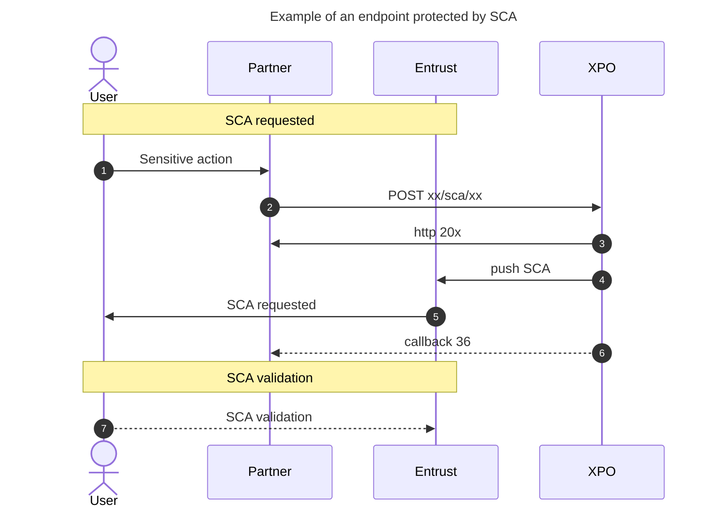
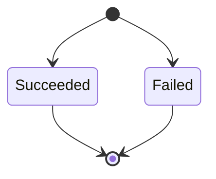
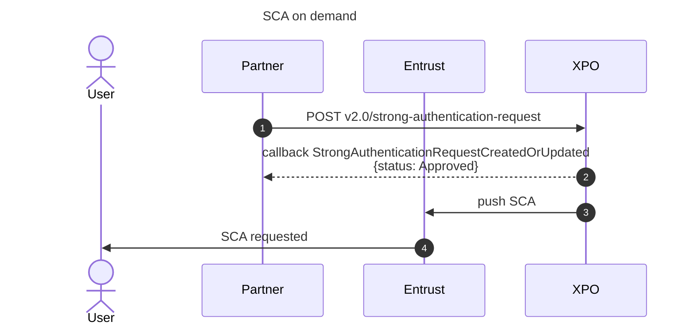
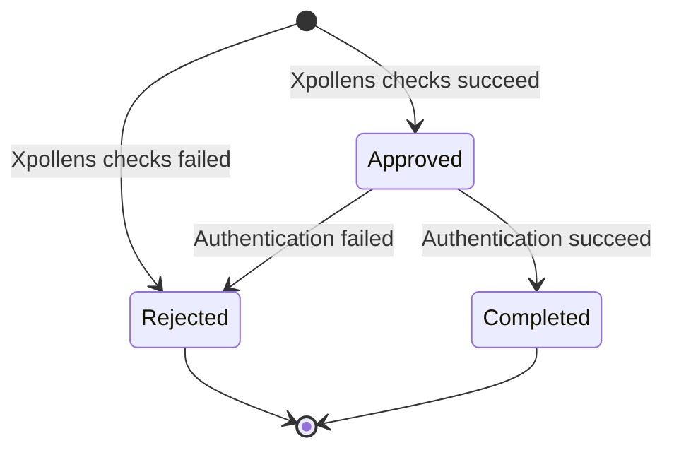
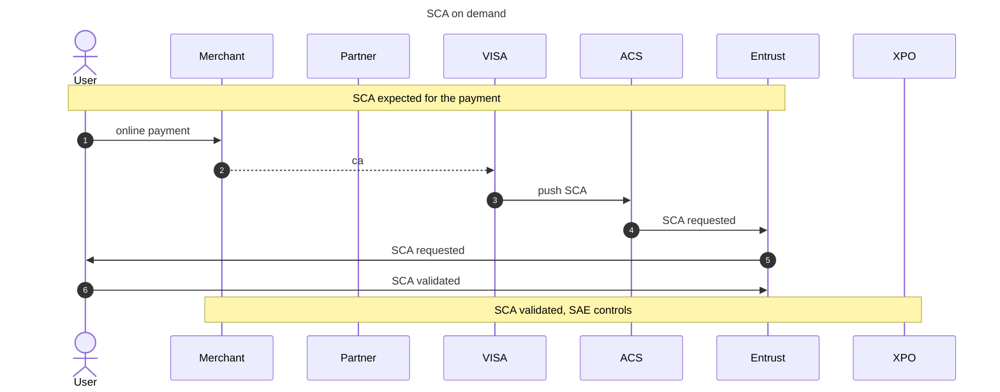

# Strong Customer Authentication

Some actions are considered sensitive by Xpollens. As a result, these actions are protected and request a Strong Customer Authentication (SCA).

Endpoints concerned have an /sca/ in the URL.

<br/>

* * *

## Server-Initiated SCA, triggered by Xpollens
These SCA are generated by Xpollens when requests with /sca/ are received.
Endpoints concerned:

|Action|Endpoint|
|:---|:---|
| Create a beneficiary for a SCT OUT | POST/api/sca/vX.Y/users/{appUserId}/beneficiary|
|Activate a card| POST /api/sca/vX.Y/cards/{cardId}/activate/{appUserId)|
|Declare fatca and americaness information |PATCH /api/sca/vX.Y/users/{appUserId}/fatca-eai|
|Validate CGU |POST /api/sca/vX.Y/users/{AppUserId}/cgu|
|Modify user's information |PUT /api/sca/vX.Y/users/{appUserId}/|

<br/>

* * *

### General sequence diagram



In the case the SCA failed, the action requested by the POST/PUT is not performed.

<br/> 

* * *

### Status diagram



<br/> 

* * *

### Payload examples for a succedeed SCA (callback36)
#### PATCH fatca eai
Example
```json

"Payload": "{\"VraisemblanceStatus\":\"OK\",\"FatcaEaiStatus\":\"OK\",\"RequiredDocuments\":[]}"


```

#### POST beneficiary
Example
```json

"Payload": "{\"id\":1562417,\"beneficiaryId\":\"7e6bcd81-eab5-41ea-a806-cef3328bbbb8\",\"displayName\":\"John Doe nathalie\",\"bic\":\"SMOEFRP1\",\"iban\":\"FR7612869000940001215321034\",\"creationDate\":\"2025-04-01T08:45:35Z\",\"modificationDate\":\"2025-04-01T08:45:35Z\"}"


```
BIC and IBAN are fully visible. Bin and Iban displayed in this example are false.

#### POST CGU
Example
```json

"Payload": "{\"card\":true,\"partner\":true,\"account\":true}"


```

#### POST card activation
Example
```json

"Payload": ""


```

#### PUT user
Example
```json

"Payload": ""


```

<br/> 

* * *

### Payload for failed SCA

|Action|Endpoint|Payload| 
|:---|:---|:---|
| SCA canceled by the enduser | "Reason": "CANCELED"|  "Payload": null |
| Wallet not activated | "Reason": "UnprocessableEntity "|"Payload": null|
| Wallet not found | "Reason": "NotFound "|"Payload": null|
| SCA  | "Reason": null |"Payload": null|
| SCA expired when performed by the enduser | "Reason": "TIMEOUT" |"Payload": null|

<br/> <br/>

* * *

## SCA on demand, initiated by you

For specific cases on your business case, SCA can be created on demand.
This SCA is not linked to the action that will be performed afterward. It is your responsibility to properly orchestrate the SCA and then make the call according to the SCA result.

### Sequence diagram


<br/> 

* * *

### Status diagram


<br/> 

* * *

### Technical details
context
data


<br/><br/>
  
* * *

## Online payment: 3-D Secure (3DS)

In the case you offer card to your enduser, and the possibility to pay online, 3DS validation is needed to validate the online payment.

In this case, the SCA is pushed by the ACS



:::note
No callback is sent for the SCA requested for the 3DS payment.
If this SCA is not performed, the authorization failed. Then you receive the webhook CardOperationCreatedOrUpdated.
:::

<br/>

* * *

## What you have to do

You need to manage SCA notification.
Refere to this page for more details : https://doc.antelop-solutions.com/latest/wallet/sca/sca-intro.html


<br/>

* * *

## Front initiated Strong Customer Authentication
The principle of these front-initiated SCAs is:
1/ Generate an SCA request from the Entrust SDK.
2/ Once the SCA is validated, include the authentication proof in the Xpollens request.

|Action|Endpoint|Dedicated page URL|
|:---|:---|:---|
| Activate a token for Xpay in app verification | POST/api/sca/normal/vX.Y/{{appUserId}}/token/xpayInAppVerifActivation/{{cardExternalRef}}| https://docs.xpollens.com/usecases/xpay/X-Pay#in-app-verification-activation |
|Display card details (PAN, CVV, expiration date| POST /api/sca/normal/vX.Y/{holderExternalRef}/carddisplay/{cardExternalRef})| https://docs.xpollens.com/usecases/cards/selfcare/physical#card-display-pan-cvv-and-expiry-date |
|Display card PIN |GET /api/sca/normal/vX.Y/{holderExternalRef}/pin/{cardExternalRef}?channelCode=XX| |https://docs.xpollens.com/usecases/cards/selfcare/physical#pin|

For these cases, refer to the dedicated pages provided in the table.

### Technical details
Refere to this page: https://doc.antelop-solutions.com/latest/wallet/sca/mobile-overview-integration.html
