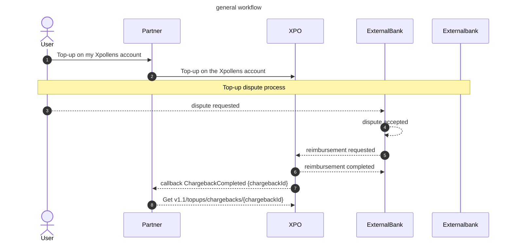
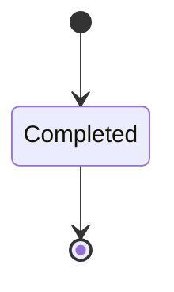

# Top-up dispute
Also called a "chargeback", a top-up dispute occurs when an end user disputes a top-up transaction with their external bank.

If the top-up is validated by the external bank, Xpollens must reimburse the amount. In this case, a chargeback is processed.

<br/>

* * *

## Sequence diagram


<br/>

* * *
## State diagram



<br/>


* * *
## Callback ChargebackCompleted
Here is an example of a chargeback callback

```json
    "Payload": {
        "type": "ChargebackCompleted",
        "data": {
            "chargebackId": "3exxxxxf6-75a0-4ea7-9b53-a6dxxxxxc09",
            "initialTopUpId": "4axxxxx5d5-2719-4f0d-96f2-7xxxxxf651",
            "status": "Completed",
            "amount": {
                "value": "30.00",
                "currency": "EUR"
            },
            "chargebackReason": "CardHolderDisputeDefectiveNotAsDescribe",
            "createdDate": "2025-02-03T10:46:12.92"
        }
    }
```

* * *

## How to test
Use the endpoint post v1.1/topups/{orderId}/simulate-chargeback

<br/>

* * *

## FAQ
### FAQ1: Can we refuse a top-up dispute?
No, Xpollens must reimburse it.
