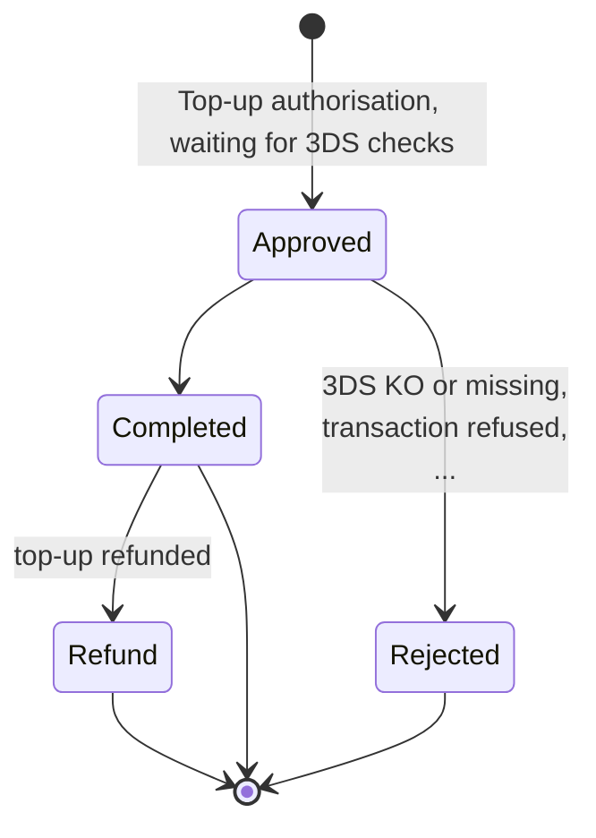
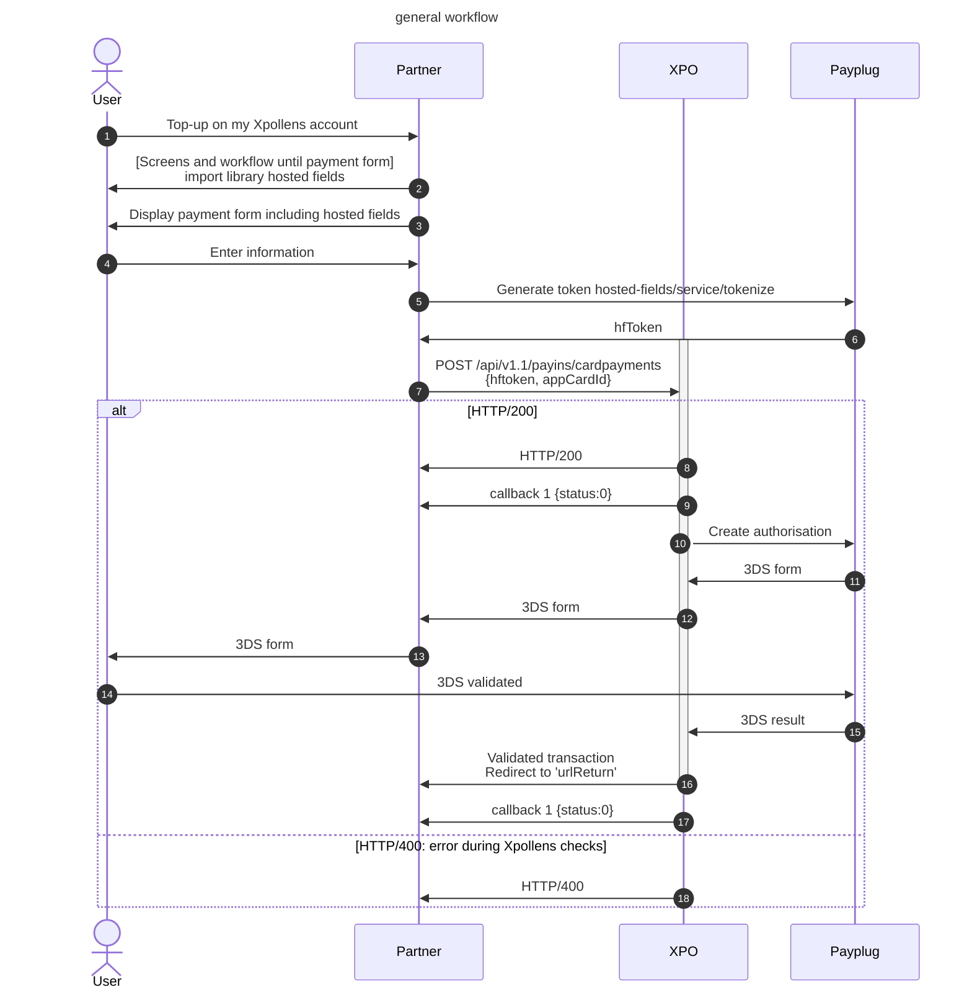
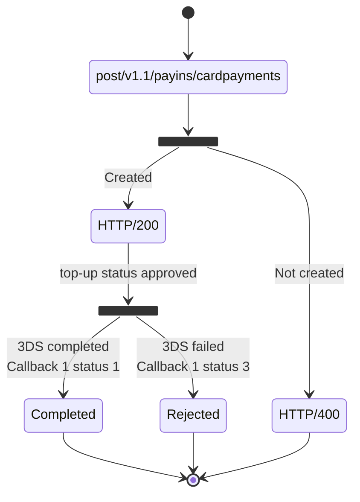

# Top-Up

## Definition

A topup card is a way for your customer to credit money on their account directly from a debit/credit card. There are different methods to do a topup.

Refere to this page for the functionnal overview: https://docs.xpollens.com/docs/payments/topup/#xpollens-shop-integration

<br/><br/>

* * *

## Top-up state diagram



| Statut code | Status name |
| --- | --- |
| 0   | Approved |
| 1   | Completed |
| 2   | Refunded |
| 3   | Rejected |

<br/><br/>

* * *

## General rules

A top-up amount must be between 1€ and 1000€ (excluded).  
A user cannot make more than 5 top-ups within a 48-hour period.  
You cannot load an account with a card belonging to that account.

<br/><br/>

* * *

## Create a top-up

### Top-up types

There are 4 possibilities for the top-up:

- create a top-up **without card registration**.  
    The card information will have to be filled in again the next time a topup is done.
- create a top-up **with card registration**.  
    This first top-up is necessary for one-click top-ups.
- create a **one-click** top-up.  
    this is possible only if the card is registred. In this case, the card information was registred during the first top-up, and is not needed during the one-click top-up. Only the 3DS validation remains to be done.
- creation of a **subscription**, or **recurrent** top-up  
    Enabling the card to be saved and not having to validate it on the 3DS the next time it is loaded: it is called "recurrent"

<br/>

:::note  
The **one-click** top-up is **customer-initiated**.  
:::

:::note  
**Subscription** top-up, on the other hand, is **reserved exclusively for the partner initiative**, for example to take expenses or a subscription. It is forbidden to use it on a customer's initiative, in order to dispense with 3DS. **For all customer-initiated top-ups, the 3DS is mandatory.**  
:::

### Hosted fields

To create a top-up, you need to implement the Dalenys hosted fields.  
Please refere to this documentation: https://developer.dalenys.com/ui/developer-doc/integration-modes/hosted-fields.html

* * *

### Top-up sequence diagram



<br/>

* * *

### 3DS top-up with / without card registration

If the user wants to save the card information, the attribute `Card` is not null.  
In this case, for the next top-up:

- the user will not have to fill in the card information
- the user will still need to validate the 3DS

**Case 1: without card registration**

**POST** /api/v1.1/payins/cardpayments

- the `AppCardId` is not filled

```json
{
    "OrderId": "{{orderId_TOPUP_1}}",
    "UrlReturn": "http://rest-integ.s-money.net/HostedFieldsApp/v2/ProcessTopUp",
    "Payer": {
        "Name": "Jean DUPONT",
        "Email": "jean_dupont@gmail.com",
        "UserAgent": "Mozilla/5.0 CK={​​}​​ (Windows NT 6.1; WOW64; Trident/7.0; rv:11.0) like Gecko",
        "UrlReferrer": "https://www.s-money.fr?cart=473",
        "IpAddress": "127.0.0.1"
    },
    "subscriptionTopUp": false,
        "Card": {
            "HFToken":"{{HFToken}}",
    },
    "TermsAndConditionsValidationDate": "2022-05-17T17:00:48.0255806+01:00",
    "Payments": [
        {
            "OrderId": "payment_{{orderId_TOPUP_1}}",
            "Amount": 100, //cents
            "Fee": 0, // cents
            "Beneficiary": {
                "AppAccountId": "{{accountId}}"
            }
        }
    ]
}
```

**Case 2: with card registration**  
Same request, with the `AppCardId` filled.

**POST** /api/v1.1/payins/cardpayments

```json
{
   [...]
   "Card": {
            "HFToken": "xxx",
            "AppCardId": "CB_Test"
    },
   [...]
    }
```

* * *

### One-click payment (with 3DS validation)

The card must already be registered.

To create a top up oneclick, you must, in the body of the request, add and fill in the `AppCardId` parameter instead of the `HFToken` parameter. This will allow you to directly call the previously registered bank card.

**POST** /api/v1.1/payins/cardpayments

```json
{
   [...]
   "Card": {
        "AppCardId": "CB_Test",
    },
     "subscriptionTopUp": false
   [...]

    }
```
<br/>

* * *

### With subscription (one-click without 3DS validation)

The card must already be registered.

**1st request**

- `AppCardId` and `HFToken`
- 3DS validation

**POST** /api/v1.1/payins/cardpayments

```json
{
   [...]
   "card": {
            "HFToken": "xxx"
            "AppCardId": "CB_Test",
    },
     [...]
          "Payments": [
        {
             [...]
            "Beneficiary": {
                "AppAccountId": "{{accountId}}"
            }
 [...]
}
```

**Next request**

- no `HFToken`, only the `AppCardId`
- no 3DS validation
- the `Payments.Beneficiary.AppAccountId` must be the same as then one used for the first request

**POST** /api/v1.1/payins/cardpayments

```json
{
   [...]
   "card": {
                "AppCardId": "CB_Test"
    },
     "subscriptionTopUp": true
   [...]
              "Payments": [
        {
             [...]
            "Beneficiary": {
                "AppAccountId": "{{accountId}}"
            }
 [...]
}
```
<br/><br/>

* * *

## Top-up life cycle

| Etape | Definition | \--- | Response |
| --- | --- | --- | --- |
| 1   | Creation of the authorisation at Xpollens side | Prerequesite:  <br/>\- request is correct.  <br/>\- Xpollens controls are OK. | post/v1.1/payins/cardpayments -> Response 200 |
| 2   | 3DS authentication |     | If KO, callback 1 {status 3} |
| 3   | Creation of the authorisation on the Payplug side. |     | If OK, callback 1 {status: 1}.  <br/>If KO, callback 1 {status: 3} |

  



* * *

### Erros Code: response 400

| Name | Type |
| --- | --- | 
| When Hftoken is not filled | {"Code": 354,<br/>    "ErrorMessage": "Erreur module de rechargement",<br/>"Title": "",<br/>"Priority": 2} | 
| When card is already registrered | {    "Code": 717,<br/>     "ErrorMessage": "CardId déjà existant.",<br/>     "Title": "L'opération ne peut pas aboutir",<br/>     "Priority": 2} | 
| When OrderId already exists | {    "Code": 710,<br/>    "ErrorMessage": "OrderId déjà existant.",<br/>    "Title": "L'opération ne peut pas aboutir",<br/>    "Priority": 2} | 
| When the card is not found	 | {    "Code": 195,<br/>     "ErrorMessage": "Carte de crédit introuvable",<br/>     "Title": "L'opération ne peut pas aboutir",<br/>     "Priority": 2} | 
| When Payer name is not filled	 | {    "Code": 177,<br/>    "ErrorMessage": "Valeur de paramètre invalide ('Name' ne doit pas être vide.)",<br/>    "Title": "L'opération ne peut pas aboutir",<br/>    "Priority": 2} | 
| When Amount is not filled	 | {    "Code": 178,<br/>     "ErrorMessage": "Les paramètres suivants sont invalides : cardPaymentRequestDto.Payments\[0\].Amount.",<br/>     "Title": "L'opération ne peut pas aboutir",<br/>     "Priority": 2} | 
| When AppAcountId is not filled	 | {    "Code": 149,<br/>     "ErrorMessage": "Plafond de transaction atteint",<br/>     "Title": "Opération non autorisée"<br/> } | 
| When the appCardId is not registered for the accountId (error 404)	 | {    "Code": 195,<br/>    "ErrorMessage": "Carte de crédit introuvable",<br/>    "Title": "L'opération ne peut pas aboutir"} | 

<br/>

* * *

### ExecCode: Execution Code

The ExecCode translates the status of the CB loading at the PayPlug level and the 3DS validation.

The GET {{URLT}}/v1.1/users/{appUserId}/payins/cardpayments/{orderId} retrieves details.

The execution codes are organized with different ranges:

- 0XXX operation succeeded or still processing
- 4XXX operation rejected because of the bank or the supplier
- 5XXX operation rejected because of a system error
- 6XXX operation rejected because of anti-fraud engine

| CODE | Message | Top-up status |
| --- | --- | --- |
| 0000 | Successful operation | 1   |
| 0001 | 3-D Secure authentication required | 0   |
| 4001 | Transaction declined by the banking network | 3   |
| 4002 | Insufficient funds | 3   |
| 4003 | Card declined by the banking network | 3   |
| 4004 | The transaction has been abandoned | 3   |
| 4005 | Fraud suspicion | 3   |
| 4009 | 3DSecure authentication abandoned or expired | 3   |
| 4010 | Invalid transaction | 3   |
| 4011 | Duplicated transaction | 3   |
| 4012 | Invalid card data | 3   |
| 4013 | Transaction not allowed by banking network for this holder | 3   |
| 4014 | Non 3-D Secure-enrolled card | 3   |
| 4015 | Expired transaction | 3   |
| 4016 | Transaction declined by the payment terminal | 3   |
| 4017 | Form expiration (as planed by the merchant) | 3   |
| 4018 | Recurring payment revocated for this card holder | 3   |
| 4019 | The bank will decline further transactions from this card | 3   |
| 4020 | Strong customer authentication required by issuer | 3   |
| 4021 | Operation not allowed / not supported | 3   |
| 5001 | Exchange protocol failure | 3   |
| 5002 | Banking network error | 3   |
| 5003 | System under maintenance, please try again later | 3   |
| 5004 | Time out, the response will be sent to the notification URL (only applicable for Visa / MasterCard direct connection) | 3   |
| 5005 | 3-D Secure authentication error | 3   |
| 5006 | Unexpected bank response | 3   |
| 6001 | Transaction declined by the merchant | 3   |
| 6002 | Transaction declined | 3   |
| 6003 | The cardholder has already disputed a transaction | 3   |
| 6004 | Transaction declined by merchant and/or platform rules | 3   |
| 6005 | Card not enrolled or 3-D secure unavailable | 3   |
| 6006 | Blocked payment method | 3   |
| 6007 | Operation prohibited by the bank networks | 3   |
| 6008 | Card holder has already declared transaction as fraudulent | 3   |


<br/><br/>

* * *

## API, callbacks and technical items

### Callbacks

`Callback1` : https://docs.xpollens.com/api/Callbacks#post-/-callback01Url-  
`Callback5` : https://docs.xpollens.com/api/Callbacks#post-/-callback05Url-

* * *

### API

[`POST /api/v1.1/payins/cardpayments`](https://docs.xpollens.com/api/Topup#get-/api/v1.1/users/-userid-/payins/cardpayments)  
TermsAndConditionsValidationDate: date/time UTC+3  
date: date/time UTC+2

| Name | Type | Required | Restrictions | Description |
| --- | --- | --- | --- | --- |
| Message | string | false | \-  | Obsolete |
| OrderId | string | true | \-  | transaction Id |
| UrlReturn | string | false | \-  | URL to redirect your enduser after the top-up |
| Status | integer | false | \-  | Obsolete, don't use |
| TermsAndConditions  <br/>ValidationDate | date-time | true | yyyy-mm-ddT1hh:mm:ss.xxxxxxx | Top-up date |
| Payer.name | string | true | \-  | First Name & Last name of the payer |
| Payer.email | string | true | \-  | Obsolete, use your enduser's email address |
| Payer.userAgent | string | true | \-  | Obsolete, use "{partnerName} Browser" |
| Payer.urlReferrer | string | true | \-  | Obsolete, use your website address |
| Payer.ipAddress | string | true | \-  | Ip address of the user (ipv4 or v6) |
| Card.HfToken | string | false -   <br/>depending of the use case | \-  | Hf token previously created |
| Card.AppCardId | string | false -   <br/>depending of the use case | Existing card | Token of the card used for the top-up |
| Card.Status | integer | false | \-  | Obsolete |
| Card.Hint | Obsolete | false | \-  | Obsolete |
| Card.ExpiryDate | string | false | \-  | Obsolete |
| Card.IsActive | string | false | \-  | Obsolete |
| Payments.OrderId | string | true | \-  | Obsolete, use payment_orderId |
| Payments.Amount | string | true | \-  | Amount in cents |
| Payments.Fee | string | false | \-  | Obsolete, use the P2P post to debit fees |
| Payments.  <br/>Beneficiary.AppAccountId | string | true | Existing account for the appUserId | appAccountId to credit |
| Payments.Message | string | false | \-  | Obsolete |
| Payments.Statut | string | false | \-  | Obsolete |
| SubscriptionTopUp | string | false | true/false | Subscription for a topup |

<br/><br/>

* * *

## Get a top-up

### By orderid

[`GET /api/v1.1/users/{userid}/payins/cardpayments/{id}`](https://docs.xpollens.com/api/Topup#get-/api/v1.1/users/-userid-/payins/cardpayments/-id-)

date: date/time UTC+2

Response code 200

| Name | Type | To use | Value | Description |
| --- | --- | --- | --- | --- |
| Message | string | Yes | \-  | Obsolete |
| OrderId | string | Yes | \-  | transaction Id |
| UrlReturn | string | Yes | \-  | URL to redirect your enduser after the top-up |
| Status | integer | Yes | \-  | Obsolete, don't use |
| Payer.name | string | Yes | \-  | First Name & Last name of the payer |
| Payer.email | string | Yes | \-  | Obsolete |
| Payer.userAgent | string | Yes | \-  | Obsolete |
| Payer.urlReferrer | string | Yes | \-  | Obsolete |
| Payer.ipAddress | string | Yes | \-  | Enduser Ip address |
| Card.AppCardId | string | Yes | Given name to the used card | Token of the card used for the top-up |
| Card.Status | integer | no  | 0   | Obsolete |
| Card.Hint | Obsolete | no  | \-  | Obsolete |
| Card.ExpiryDate | string | no  | \-  | Obsolete |
| Card.IsActive | string | no  | \-  | Obsolete |
| Payments.OrderId | string | no  | \-  | Obsolete, use orderId |
| Payments.Amount | string | Yes | \-  | Amount of the top-up |
| Payments.Fee | string | no  | 0.0 | Obsolete, use the P2P post to debit fees |
| Payments.  <br/>Beneficiary.AppAccountId | string | Yes | Existing account for the appUserId | appAccountId to credit |
| Payments.Message | string | no  | null | Obsolete |
| Payments.Statut | string | no  | 0   | Obsolete |
| ExtraResult.TransactionId | string | no  | \-  | Obsolete |
| ExtraResult.ExecCode | string | Yes | \-  | excution code on Payplug side |
| ExtraResult.Message | string | Yes | \-  | Translation of the ExecCode |
| ExtraResult.Currency | string | no  | null | Obsolete |
| ExtraResult.ThreeDSecure | string | no  | null | Obsolete |
| ExtraResult.ThreeDSAuthenticationStatus | string | no  | null | Obsolete |
| extraResult.AuthorizationNumber | string | no  | null | Obsolete |
| extraResult.CardNetwork | string | no  | null | Obsolete |
| extraResult.CardValidityDate | string | no  | null | Obsolete |
| extraResult.CardCountry | string | no  | null | Obsolete |
| extraResult.CardFullname | string | no  | null | Obsolete |
| extraResult.CardThreeDSecureEnrolled | string | no  | null | Obsolete |
| extraResult.ThreeDSecureVersion | string | no  | 0   | Obsolete |
| extraResult.ThreeDSGlobalStatus | string | no  | null | Obsolete |
| extraResult.Version | string | no  | null | Obsolete |
| extraResult.CardType | string | no  | null | Obsolete |
| TermsAndConditions  <br/>ValidationDate | date-time | Yes | yyyy-mm-ddThh:mm:ss.xxxxxxx | Same value than the post |
| Date | date-time | Yes | true/false | UTC (FR) |
| Refunds | string | false | \-  | Details of the refund |

### Get All top-up

[`GET /api/v1.1/users/{userid}/payins/cardpayments`](https://docs.xpollens.com/api/Topup#get-/api/v1.1/users/-userid-/payins/cardpayments)  
<br/>

:::warning IMPORTANT  
When The `GET /api/v1.1/users/{userid}/payins/cardpayments` API is called without additional parameters (`startDate`, `endDate)`it will return the user top-ups starting **30 days** before the current date until the **current date**.

  

The maximum timeframe between `startDate` and `endDate` is **31 days**.

  

If the timeframe exceeds 31 days then an exception (http/400) will be raised by the API.

  
<br/>

```json
{
  "code": 1,
  "errorMessage": "Unknown technical error, please contact Xpollens support. Max date range allowed is 31 days.",
  "title": "Technical error",
  "priority": 2,
  "date": "2024-06-17T15:04:39.3684193Z",
  "operationId": "f7903cd3b34ef856bfdf493d4ad65f9f",
  "httpStatusCode": 400
}
```

<br/><br/>

* * *

## Refund a top-up

Top-up reimbursement may be total or partial.  
This reimbursement allows you to return to the original situation in terms of creditlimit, as if the initial operation had not taken place.

### Post refund

[POST /api/v1.1/users/{userid}/payins/cardpayments/{orderId}/payments/{paymentid}/refunds](https://docs.xpollens.com/api/Topup#post-/api/v1.1/users/-userid-/payins/cardpayments/-id-/payments/-paymentid-/refunds)  
where orderId = orderId of the original transaction  
and paymentId = paymentId of the original transaction

| Name | Type | Required | Restriction | Description |
| --- | --- | --- | --- | --- |
| id  | string | Obsolete | Obsolete | Obsolete |
| amount | string | Mandatory | \- Cents  <br/>\- Can not be higher than the original amount | Amount of the refund |
| fee | string | Obsolete | Obsolete | Obsolete |
| orderId | string | Mandatory | Unique orderId | Your orderId for the refund |
| status | string | Obsolete | \-  | Obsolete |

> Note: If the cancellation is made on the same day, before the merchant discount, then there is only one transaction, with the status Refund.  
> In the opposite case, two operations will exist: the original operation with Completed status, and the Refund operation with status Completed and Rtransaction = true

### Response

Response

| Name | Type | To use | Value | Description |
| --- | --- | --- | --- | --- |
| Id  | string | no  | Obsolete | Xpollens internal transaction id |
| OrderId | string | Yes | \-  | transaction orderId |
| Amount | string | Yes | XX.XX | Amount € |
| Fee | string | no  | Obsolete | Obsolete |
| Status | string | Yes | 1   | refund status completed |
| PaymentDate | string | Yes | UTC+3 | date of the refund |
| OriginalPayment.Id | string | no  | Obsolete | Obsolete |
| OriginalPayment.OrderId | string | Yes | \-  | initial top-up |
| OriginalPayment.Href | string | no  | Obsolete | Obsolete |
| Type | string | no  | 1   | Obsolete |

### Error codes

| Name | Type |
| --- | --- |
| Insufficient balance | {    "Code": 110,<br/>    "ErrorMessage": "Votre solde est insuffisant pour effectuer ce virement. Veuillez saisir un autre montant.",<br/>    "Title": "Opération non autorisée",<br/>    "Priority": 2,<br/>    "Date": "2024-04-25T09:39:57.3326109Z",<br/>    "OperationId": "2cb1cd79829d041fe2fd0c4c5274ce03"} | 
| Status of the top-up is not "Completed"	 | {    "Code": 364,<br/>    "ErrorMessage": "Opération invalide",<br/>    "Title": "L'opération ne peut pas aboutir",<br/>    "Priority": 2,<br/>    "Date": "2024-04-25T09:46:57.8817933Z",<br/>    "OperationId": "7b2e38c3ac31db9d1256aea67f7b7b7f"} | 
| Refund orderId already exists	 | {    "Code": 364,<br/>    "ErrorMessage": "Opération invalide",<br/>    "Title": "L'opération ne peut pas aboutir",<br/>    "Priority": 2,<br/>    "Date": "2024-04-25T09:46:57.8817933Z",<br/>    "OperationId": "7b2e38c3ac31db9d1256aea67f7b7b7f"} | 
| Refund amount = 0 | {    "Code": 704,<br/>    "ErrorMessage": "Paramètre(s) d'appel manquant(s) ({0}). amount is invalid",<br/>    "Title": "L'opération ne peut pas aboutir",<br/>    "Priority": 2,<br/>    "Date": "2024-05-15T13:50:27.452768Z",<br/>    "OperationId": "bcb194d1af237f8bab8c1697c41bf67c"} | 
| Sum of refunds > initial transaction amount | {    "Code": 706,<br/>    "ErrorMessage": "Le montant du remboursement dépasse le montant de l'opération originale.",<br/>    "Title": "L'opération ne peut pas aboutir",<br/>    "Priority": 2,<br/>    "Date": "2024-05-15T13:48:34.9307117Z",<br/>    "OperationId": "74204d2cabbcdac8293458f5a0a07404"} | 
| Top-up already refunds through Payplug BackOffice | {    "Code": 707,    "ErrorMessage": "{0}",<br/>    "Title": "L'opération ne peut pas aboutir",<br/>    "Priority": 2,<br/>    "Date": "2024-05-07T15:26:20.9242088Z",<br/>    "OperationId": "1ff1458942d8c1f1914cfe27640abf4e"} | 
| Transaction already refunded totally | {    "Code": 708,<br/>    "ErrorMessage": "Statut du paiement incohérent",<br/>    "Title": "L'opération ne peut pas aboutir",<br/>    "Priority": 2,<br/>    "Date": "2024-04-25T09:43:53.2930334Z",<br/>    "OperationId": "57591d396a793b2156053840cec15ee8"}| 

<br/><br/>

* * *

## How to test

### Sandbox

#### 1- Get a HF TOKEN

On test environments, you can either use the integrated payment HTML page provided by Dalenys or use the following API to get an `HFToken`

POST `https://secure-test.be2bill.com/hosted-fields/service/tokenize`

with the following parameters (`x-www-form-urlencoded`) :

```
CARDCODE=4464215790990001
CARDVALIDITYDATE=06/24
CARDCVV=123
SELECTEDBRAND=visa
APIKEYID=<provided on demand>
```

**cUrl example**

```
curl -X POST -k -H 'Content-Type: application/x-www-form-urlencoded' \ 
-i 'https://secure-test.be2bill.com/hosted-fields/service/tokenize' \ 
--data 'CARDCODE=4464215790990001&CARDVALIDITYDATE=06/24&CARDCVV=123&SELECTEDBRAND=visa&APIKEYID=<PROVIDED ON DEMAND>'
```

*Response code*

```json
{
    "EXECCODE": "0000",
    "MESSAGE": "Operation succeeded.",
    "HFTOKEN": "7016e7df-04ef-4c92-83e2-8c5d1155c2b6",
    "CARDTYPE": "VISA",
    "CARDVALIDITYDATE": "06-24",
    "CARDCODE": "446421XXXXXX0001",
    "SELECTEDBRAND": "visa",
    "BINTYPE": "Consumer",
    "BINBRANDS": [
        {
            "BRAND": "VISA",
            "SERVICETYPE": "Debit"
        }
    ],
    "BINNETWORK": "VISA"
}
```

* * *

#### 2- Create a top_up with

POST {{URLT}}/v1.1/payins/cardpayments

```json
{
    "OrderId": "{{orderId_TOPUP_1}}",
    "UrlReturn": "http://rest-integ.s-money.net/HostedFieldsApp/v2/ProcessTopUp",
    "Payer": {
        "Name": "Jean DUPONT",
        "Email": "jean_dupont@gmail.com",
        "UserAgent": "Mozilla/5.0 CK={​​}​​ (Windows NT 6.1; WOW64; Trident/7.0; rv:11.0) like Gecko",
        "UrlReferrer": "https://www.s-money.fr?cart=473",
        "IpAddress": "127.0.0.1"
    },
    "subscriptionTopUp": false,
    "Card": {
        "HFToken":"{{HFTOKEN}}",
        "AppCardId": "CB_{{orderId_TOPUP_1}}"
    },
    "TermsAndConditionsValidationDate": "2022-05-17T17:00:48.0255806+01:00",
    "Payments": [
        {
            "OrderId": "payment_{{orderId_TOPUP_1}}",
            "Amount": 100, //cents
            "Fee": 0, // cents
            "Beneficiary": {
                "AppAccountId": "{{accountId}}"
            }
        }
    ]
}
```

* * *

#### 3- Validate 3DS

On postman, click on visualize > Inspect vizualisation > copy link address  
Paste it in your browser.  
Validate 3DS.

* * *

#### 4- Create a refund

POST {{URLT}}/V1.1/users/{{accountId}}/payins/cardpayments/{{orderId_TOPUP_1}}/payments/payment_{{orderId_TOPUP_1}}/refunds

```json
{
        "orderid" : "orderId_refund",
        "amount" : {amount} //cents
}
```

* * *

### Production

When the alphatests are launched, the Payplug library and url configurations need to be modified. Ask your Customer Integration Manager.

* * *

## FAQ

### Can I access to the Payplug backoffice?

No, you don't have access. Only xpollens employees have access.

### After a top-up, how to redirect my enduser from the 3DS page to the application.

You need to fill the `UrlReturn` in the post.

### Can I customise the 3DS page?

No, you can only modify the logo and the merchant name.

### I can't find my top-ups

The `GET /api/v1.1/users/{userid}/payins/cardpayments` has some limitations regarding the timeframe and the maximum number of records it can return.

Please see the note here for more detailed information : [Get All top-ups](#get-all-top-up)

### Can we have top-ups without 3DS 

Yes, 
- if the subscription mode is used
- for B2B cards
