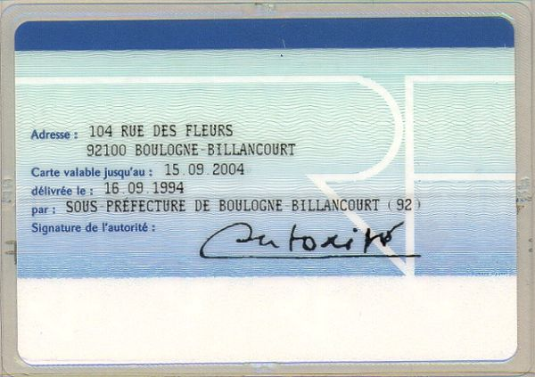

# How To Test KYC
## Step 1 - User Creation
`POST https://sb-api.xpollens.com/api/v2.0/users`

```json
{
    "appUserId" : "1bf28a6dab",
    "profile" : {
        "civility" : "Miss",
        "firstName" : "Corinne",
        "lastName" : "Berthier",
        "birthName" : "Berthier",
        "birthDate" : "1965-12-06",
        "birthCity" : "Paris",
        "birthZipCode" : "75001",
        "birthCountry" : "FR",
        "nationality" : "FR",
        "phoneNumber" : "+336XXXXXXXX",
        "email" : "db778705-42a0-4503-b38b-4e241bb99a8a+LC_ACCEPTED@xpollens.fr",
        "address" : {
            "street" : "104, rue des Fleurs",
            "zipCode" : "92100",
            "city" : "Boulogne",
            "country" : "FR"
        }
    }
}
```

> **Note**
> - email adress should containt +LC_ACCEPTED for the ID Check to be successful.
> - phone number should be a real phone number able to receive SMS for electronic signature.
> - first name, last name and birth date must be the same as on the identity document

<br/>

Once the user is created, we can get user information by calling the API : 

`GET https://sb-api.xpollens.com/api/v2.0/users?AppUserId=1bf28a6dab`

```json
{
    "pageSize": 50,
    "nextPageIndex": 127821,
    "previousPageIndex": 127821,
    "values": [
        {
            "appUserId": "1bf28a6dab",
            "userRecordStatus": "Initialized",
            "identificationLevel": "None",
            "onboardingDate": "2023-06-23 12:25:30",
            "lastUpdate": "2023-06-23 12:25:30",
            "profile": {
                "civility": "Miss",
                "lastName": "Berthier",
                "firstName": "Corinne",
                "birthName": "Berthier",
                "birthDate": "1965-12-06",
                "birthCity": "Paris",
                "birthZipCode": "75001",
                "birthCountry": "FR",
                "nationality": "FR",
                "address": {
                    "city": "Boulogne",
                    "street": "104, rue des Fleurs",
                    "zipCode": "92100",
                    "supplementIn": null,
                    "supplementOut": null,
                    "area": null,
                    "country": "FR"
                },
                "email": "db778705-42a0-4503-b38b-4e241bb99a8a+LC_ACCEPTED@xpollens.fr",
                "phoneNumber": "+33660698238"
            },
            "roles": null
        }
    ]
}
```

* * *
## Step 2 - KYC Demand creation
`POST https://sb-api.xpollens.com/api/v3.0/users/1bf28a6dab/kyc/demand`

```json
{
    "workflowCode": "Electronic_Sign"
}
```

* * *
## Step 3 - Retrieve WebViewURL and token from callback #48
```
select * from c where c.Payload.type='48' order by c._ts DESC
```

```json
{
    "Payload": {
        "type": "48",
        "appUserId": "1bf28a6dab",
        "url": "https://integration-api.ekeynox.net/contract/signbook/v3/#/identity-page",
        "token": "20240622_oyxEuU7CFE6AZewwraaZpbxr199hX6f"
    }
}
```
> The webviewUrl is the concatenation of the url value and token value with the following format: url?token= token

* * *
## Step 4 - Build WebView URL
https://integration-api.ekeynox.net/contract/signbook/v3/#/identity-page?token={token}=pretty&vidRequestMode=redirect

Open the URL from with a webview component inside your app or in a desktop or mobile browser.

> **Note 1**<br/>
> The `vidRequestMode=redirect` parameter is mandatory when displaying the URL within a webveiw embedded in an application
>
> **Note 2**<br/>
> A `callbackURL` parameter can be used in the querystring to set the callback URL after all the steps are completed.
>
> **Note 3**<br/>
> The URL should normally not be opened directly in the webview but in a specific `iframe` component allowing the parent page to drive events returned by Netheos javascript library. (see example implementation at the end of this document) 

* * *
## Step 5 - Upload your ID Document
* * *




Find other test IDs in this link: https://www.consilium.europa.eu/prado/fr/search-by-document-country.html

* * *
## Step 6 - Perform liveness


You can use your own face or any other royalty-free face.

* * *
## Step 7 - Wait for ID / Liveness validation
Once validated, go back to the webview/signbook URL :
https://integration-api.ekeynox.net/contract/signbook/v3/#/identity-page?token=20240622_5LJmyY3aWRRnMf45TE5EI2BhgCUtOPj&renderMode=pretty&vidRequestMode=redirect

Open the URL from with a webview component inside your app or in a desktop or mobile browser.

* * *
## Step 8 - Electronic Signature Tunnel
Accept T&C
Confirm SMS OTP Sending
Receive SMS OTP
Copy SMS OTP
Submit
Wait for signature to be validated

> **⚠ NOTE**
> **The final case validation requires a manual validation through the Netheos Backoffice**

* * *
## Step 9 - FATCA / EAI informations
`PATCH https://sb-api.xpollens.com/api/v2.1/user/{{appuserid}}/fatcaEai`

```json
{
    "Americanness": true,
    "TaxInfo": [
        {
            "TaxCountry": "FR",
            "TIN": "1999999999999"
        }
		]
}
```
> Tax country has to be the same as the country declared for the address 

* * *
## Step 10 - Declaratives
`POST https://sb-api.xpollens.com/api//v2.0/users/{{appuserid}}/declarative`

```json
{
    "economicActivity": 21,
    "asset": 1,
    "income": 1
}
```


* * *

## ANNEXE / OPTIONAL / NOT SUPPORTED - Checking Case status by API
> TIP
> Case detail can be obtain from a simple GET on the following Netheos endpoint :
> https://integration-api.ekeynox.net/contract/v6/api/clientfiles/{{netheos_token}}
> This tip is provided as is without any guarantee. **This should probably NOT be used in a production environment.**

## ANNEXE - HTML / JAVASCRIPT SAMPLE IMPLEMENTATION
Below is a simple **sample implementation** of the parent page that handles the Netheos URL in an iFrame with event driven management.

> ⚠ Beware this example is provided as is and should obvioulsy not be used for production purpose.

```html
<html>
<head>
<script>
// Obtention de la query string de l'URL
var queryString = window.location.search;

// Vérification si la query string est présente
if (queryString) {
  // Suppression du point d'interrogation au début
  queryString = queryString.substring(1);

  // Découpage des paramètres en utilisant le séparateur "&"
  var params = queryString.split("&");

  // Boucle à travers tous les paramètres
  for (var i = 0; i < params.length; i++) {
    // Découpage du paramètre en utilisant le séparateur "="
    var param = params[i].split("=");

    // Accès au nom et à la valeur du paramètre
    var paramName = decodeURIComponent(param[0]);
    var tokenValue = decodeURIComponent(param[1]);

    // Utilisation des paramètres récupérés
    console.log("Nom du paramètre : " + paramName);
    console.log("Valeur du paramètre : " + tokenValue);
   
  }
}
</script>
<head>
    <title> Mon parcours client </title>
    <meta charset="utf-8">
    <meta name="viewport" content="width=device-width, initial-scale=1.0, maximum-scale=1.0, user-scalable=no"/>
    <link rel="stylesheet" type="text/css" href="https://cdnjs.cloudflare.com/ajax/libs/normalize/5.0.0/normalize.min.css"/>
    <style>
        #container {
            padding: 20px;
            margin: 0 auto;
        }
        #message-container {
            display: none;
            width: 100%;
            text-align: center;
            margin: 200px auto;
        }
        #iframe-wrapper {
            width: 100%;
            overflow: hidden;
        }
    </style>
</head>
<body>
<!--<iframe id="signbook" scrolling="no" frameBorder="no" width="100%" allow="microphone; camera"></iframe>-->

<div id="container">
    <header></header>
    <div id="iframe-wrapper">
        <iframe id="signbook" width="99%" scrolling="no" frameBorder="no" allow="microphone; camera"></iframe>
    </div>
    <div id="message-container">
        <h4 id="message-title"></h4>
        <p id="message-text"></p>
    </div>
    <footer></footer>
</div>

<script src="https://integration-api.ekeynox.net/contract/signbook/v3/script/signbook.js"></script>
<script type="text/javascript">
    var MESSAGE_TITLES = {
        'EXIT': "A bientôt !",
        'SUSPENDED': "Pièces justificatives en cours de contrôle",
        'FINALIZED': "Dossier complet",
        'WAITING': "Dossier en cours de validation",
        'ACCEPTED': "Félicitations !",
        'REJECTED': "Désolé"
    };

    var MESSAGE_TEXTS = {
        'EXIT': "Vous pouvez revenir quand vous le souhaitez compléter votre dossier.",
        'SUSPENDED': "Une ou plusieurs des pièces que vous avez soumises sont en cours d'examen par nos opérateurs. Merci de revenir plus tard.",
        'FINALIZED': "Votre dossier est désormais complet, nous vous recontacterons quand nous l'aurons examiné.",
        'WAITING': "Votre dossier est en cours d'examen.",
        'ACCEPTED': "Votre dossier a été accepté.",
        'REJECTED': "Votre dossier a été refusé."
    };

    var ERROR_TEXTS = {
        'BROWSER_NOT_SUPPORTED': "Désolé, ce navigateur n'est pas supporté, veuillez utiliser Chrome, Firefox, Safari, IE10+, Edge ou Opera."
    };

    var GENERIC_ERROR_TEXT = "Nos serveurs sont en cours de maintenance, merci de revenir plus tard.";

    /**
     * Show a message instead of the SignBook
     * @param title
     * @param text
     */
    function showMessage(title, text) {
        document.getElementById('iframe-wrapper').style.display = 'none';
        document.getElementById('message-container').style.display = 'block';
        document.getElementById('message-title').innerHTML = title;
        document.getElementById('message-text').innerHTML = text;
    }

    function onUserEventMessageFn(event) {
        // All user actions => used by web analytics libraries like Google Analytics
        console.log("user event : " + event.action);
    }

    function onClientFileEventMessageFn(event) {
        // Event coming from eKeynox SaaS with data concerning the state of the client file
        console.log("client file state : " + event.state);

        if ((event.changedState &&
                (event.changedState.from === 'PENDING' && (event.changedState.to === 'WAITING' || event.changedState.to === 'ACCEPTED'))) ||
                (event.participantState === 'WAITING')) {
            showMessage(MESSAGE_TITLES['FINALIZED'], MESSAGE_TEXTS['FINALIZED'])
        } else {
            if (event.state !== 'PENDING') {
                showMessage(MESSAGE_TITLES[event.state], MESSAGE_TEXTS[event.state]);
            }
        }
    }

    function onExitEventMessageFn(event) {
        showMessage(MESSAGE_TITLES['EXIT'], MESSAGE_TEXTS['EXIT']);
    }

    function onErrorEventMessageFn(event) {
        // Errors detected by the SignBook (server errors, invalid state, unsupported browser, etc.)
        if (event.cause === 'REJECTED_STATE' || event.cause === 'ACCEPTED_STATE'
                || event.cause === 'SUSPENDED_STATE' || event.cause === 'WAITING_STATE') {
            // Do not deal with these "errors", this is just for backwards compatibility purpose...
            return;
        }
        showMessage('Erreur', (ERROR_TEXTS[event.cause] ? ERROR_TEXTS[event.cause] : GENERIC_ERROR_TEXT) + "(" + event.cause + ")");
    }
    
    window.onload = function () {
        var signbook = new NthSignbook({
            iframeSelectorId: 'signbook',
            url: 'https://integration-api.ekeynox.net/contract/signbook/v3/#/identity-page',
            options: {
                renderMode: 'pretty',
                vidRequestMode: 'redirect',
                callbackURL: 'https://www.google.com'
            },
            onUserEventMessage: onUserEventMessageFn,
            onClientFileEventMessage: onClientFileEventMessageFn,
            onErrorEventMessage: onErrorEventMessageFn,
            //onDisplayEventMessage: onDisplayEventMessageFn,
            onExitEventMessage: onExitEventMessageFn,            
            token: tokenValue
        });
    }
</script>
</body>
</html>
```

* * *
## ANNEXE - Available Mocks
### Introduction
This annexe describes available mocks on **test environment** for test and integrate the KYC functionnality.
Each mocked test case is based on the provided email adress for the user :

`Radical.email+alias_code+autre_alias@email.fr`

> Alias allows the partner to simulate one or more behaviour.
> Alias ordering is not relevant
> At the minimum, the alias for the live check must be present.

### Available mocks
| Alias | Decription |
| ----  | ---------- |
| LC_ACCEPTED | Accepted Live Check |
| LC_FRAUD | Rejected Live Check / Reason code "Fraud Suspicion"|
| LC_EXPIRED | Rejected Live Check / Reason code "Other reason" |
| LC_DOC_EXPIRED | Rejected Live Check / Reason Code : "Expired Document" | 
| LC_DOC_QUALITY  | Rejected Live Check / Reason Code : "Document Quality is insufficient" |
| LC_BIO_QUALITY | Rejected Live Check / Reason Code : "Liveness Quality is insufficient" | 
| LC_DOC_RECEIPT | Rejected Live Check / Reason Code : "Présence du récépissé seul" | 
| LC_DOC_MISSING | Rejected Live Check / Reason Code : "Recto or Verso of id document is missing" | 
| LC_DOC_FRAMED | Rejected Live Check / Reason Code : "Truncated Document" | 
| LC_DOC_UNSUPPORTED | Rejected Live Check / Reason Code : "Not supported Document" | 
| LC_DOC_UNAUTHORIZED | Rejected Live Check / Reason Code : "Document country not supported" | 
| LC_OTHER | Rejected Live Check / Reason Code : "Other reason" 