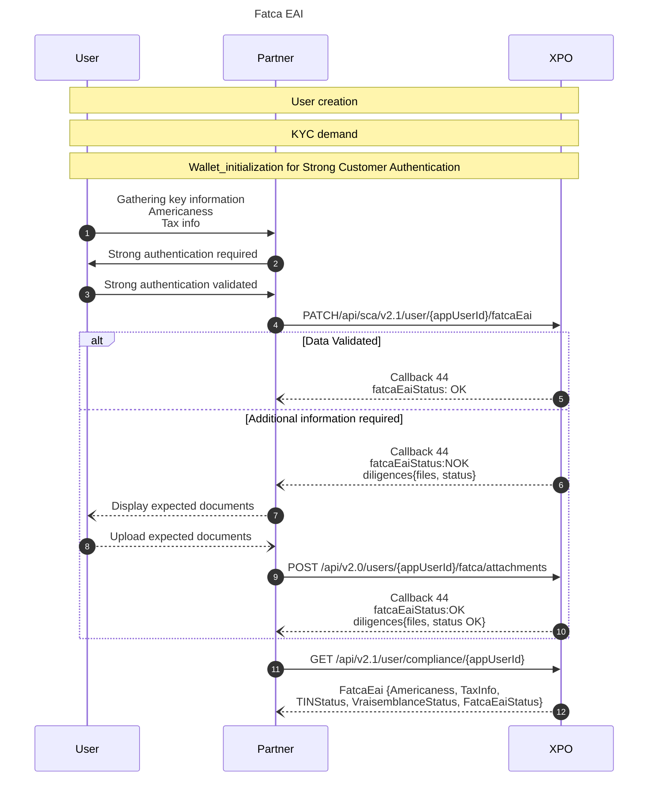

# FATCA / EAI

To fight against tax evasion, the government has asked financial institutions to implement solutions to collect and verify their customers' tax information. This is the role of FatacaEai Feature, which consists of verifying FATCA information and related documents at the onboarding phase, analyzing the FATCA information versus the customer banking usage during the relationship and finally reporting to tax institutions.

The facta eai status is part of the user status.

**<u>Definitions</u>** 
**FATCA** (Foreign Account Tax Compliance Act) is a mandatory reporting resulting from a US law to combat tax evasion by US taxpayers.
**EAI** : For countries that have signed an agreement to prevent tax evasion.

* * *
## Fatca Eai sequence diagram

### Fatca Eai steps
The FatcaEai functionality consists of a 3-step process:

- Collection of the customer's tax information
- Validation of the consistency/likelihood of the tax information, document analysis (scope of the KYC brigade) and Fatca validation
- Display of Fatca self-certification

***
## Collect Customer Tax Information
[`PATCH /api/sca/v2.1/user/{appUserId}/fatcaEai`](https://docs.xpollens.com/api/Compliance#patch-/api/v2.1/user/-appUserId-/fatcaEai)  
A customer can declare the maximum of three tax countries along with their respective tax identification numbers.

At this stage, we perform some basic checks to ensure that the mandatory fields are filled in and that the TIN is correct according to the format (combination of numbers, letters, and characters) given by the tax country

For each TIN provided by the customer, an action takes place to verify its format and coherence considering the tax country associated to it.

Find the list of TINs on this page: https://www.oecd.org/tax/automatic-exchange/crs-implementation-and-assistance/tax-identification-numbers/

***
## Fatca Eai status diagram: Tax Information Consistency / Vraisemblance
The first step is to check whether the user has declared himself to be an American. If so, documents are requested.

The second step includes the consistency validation among client’s identity information, his currently country of residence and tax countries inserted. It’s also called Vraissemblance (French for likelihood, apperance of truth).

A synchronous response of the API PATCH fatcaEai allows to see the results of these controls and to know what the required document is.

When the controls fail, the customer will need to provide document(s) to justify and support his tax declaration :

- W9 = required when the customer tax declaration is related with USA
- W8-Ben = required to declare that an USA citizen or resident is not an USA contributor
- Other documentation = required to justify and support his tax declaration

It’s important to mention that “Vraissemblance checks” do not verify the information inside any document, it is done by an agent.

To follow the evolution of this entire Fatca process, the field FatcaEaiStatus is updated .
The field FatcaEaiStatus can have 3 possibles values:

- enum 0 = NOK,
- enum 1 = Pending,
- enum 2 = OK

### FatcaEaiStatus OK
If the user is not American, and all the checks are good, then the status is validated.
[`Callback #44`](https://docs.xpollens.com/api/callbacks#post-/-callback44Url-) is sent with the `fatcaEaiStatus` OK.

The `GET /api/v2.1/user/compliance/{appUserId}` allows you to return:
-  `TINStatus` OK
- `VraisemblanceStatus` OK
-  `FatcaEaiStatus` OK

### FatcaEaiStatus NOK
Otherwise, [`Callback #44`](https://docs.xpollens.com/api/callbacks#post-/-callback44Url-) describes the expected document(s). 
The user needs to upload documents, using a dedicated endpoint [`POST /api/v2.0/users/{appUserId}/fatca/attachments`](https://docs.xpollens.com/api/KYC#post-/api/v2.0/users/-appUserId-/fatca/attachments) 
Important to mention that the vraissemblance value does not change, **even if** FatcaEaiStatus changes for OK.

The diligences have 3 statuts: Validated/ To\_Review\_Manually/Refused

| ExpectedDiligence | Diligence1Status | Diligence2Status\_or\_Diligence3Status | FatcaEaiStatus |
|---|---|---|---|
|1|No Diligence Received|NA|NOK|
|1|To Review Manually|NA|Pending|
|1|Refused|NA|NOK|
|1|Validated|NA|OK|
|2 or 3|No Diligence Received|No Diligence Received|NOK|
|2 or 3|To Review Manually|No Diligence Received|Pending|
|2 or 3|Refused|No Diligence Received|NOK|
|2 or 3|Validated|No Diligence Received|Pending|
|2 or 3|To Review Manually|To Review Manually|Pending|
|2 or 3|To Review Manually|Validated|Pending|
|2 or 3|Validated|Validated|Validated|
|2 or 3|Refused|Refused|Refused|
|2 or 3|Refused|Validated|Refused|

### W8 or W9 as FATCA attachments
If W8 or W9 are expected, here are the templates:

- W8:https://www.irs.gov/forms-pubs/about-form-w-8-ben
	- [fw8ben.pdf](../_resources/fw8ben.pdf)

- W9: https://www.irs.gov/forms-pubs/about-form-w-9
	- [fw9.pdf](../_resources/fw9.pdf)

### Other Document for EAI
In the EAI process, when an "other document" is requested, it is necessary to ask the customer to justify the difference between its country of residence and the country in which it pays tax.  
This explanation are given in a text document which is sent by API to Xpollens.

Once the explanation has been received, it is studied by the Xpollens Middle Office team, who will indicate which document is required.

In most cases, an employee will be asked to provide proof of tax assessment, while a student will be asked to provide a school leaving certificate.

* * *
## Display fatca eai certification
The partner must make this document available for the customer at any time once the onboarding path has been confirmed. This certification is not archived in Xpollens DB, it is generated everytime a partner asks for it.

 [`GET /api/v2.0/users/{AppUserId}/fatca/attachments/{Key}`](https://docs.xpollens.com/api/KYC#get-/api/v2.0/users/-AppUserId-/fatca/attachments/-Key-)

* * *
## APIs, callbacks and technical items
### [`PATCH /api/sca/v2.1/user/{appUserId}/fatcaEai`](https://docs.xpollens.com/api/Compliance#patch-/api/v2.1/user/-appUserId-/fatcaEai)
The strong authentication is mandatory for Agent Partners.

### [`GET /api/v2.1/user/compliance/{appUserId}`](https://docs.xpollens.com/api/Compliance#get-/api/v2.1/user/compliance/-appUserId-)

### [`GET /api/v2.1/user/{appUserId}/self-certification`](https://docs.xpollens.com/api/Compliance#get-/api/v2.1/user/-appUserId-/self-certification)

### [`POST /api/v2.0/users/{appUserId}/fatca/attachments`](https://docs.xpollens.com/api/KYC#post-/api/v2.0/users/-appUserId-/fatca/attachments)

### [`Callback 44`](https://docs.xpollens.com/api/Callbacks#post-/-callback44Url-)

* * *
## FAQ

* * *
## How to test

Let see some examples:

| User Personal Data | User Fatceai input data | User FatcaEai result | Comments |
| --- | --- | --- | --- |
| User birth country: FR  <br\>User Country of Residence: PT | 1st tax country: PT  <br\>2nd tax country: null  <br\>3rd tax country: null | Vraisemblance status: OK  <br\>Fatcaeai status: OK |     |
| User birth country: US  <br\>User Country of Residence: FR | 1st tax country: US  <br\>2nd tax country: FR  <br\>3rd tax country: null | Vraisemblance status: OK  <br\>Fatcaeai status: NOK | W9 document it’s required when the customer tax declaration is related with US |
| User birth country: FR  <br\>User Country of Residence: US | 1st tax country: US  <br\>2nd tax country: FR  <br\>3rd tax country: null | Vraisemblance status: OK  <br\>Fatcaeai status: NOK | W9 document it’s required when the user tax declaration is related with US. |
| User birth country: US  <br\>User Country of Residence: FR | 1st tax country: PT  <br\>2nd tax country: FR  <br\>3rd tax country: IT | Vraisemblance status: NOK  <br\>Fatcaeai status: NOK | The customer is a US citizen, but he did not declare US on his taxes.  <br\>W8-Ben is required to declare that the customer is not an US contributor |
| User birth country: US  <br\>User Country of Residence: FR | 1st tax country: US  <br\>2nd tax country: null  <br\>3rd tax country: null | Vraisemblance status: NOK  <br\>Fatcaeai status: NOK | W9 document it’s required when the user tax declaration is related with US.  <br\>Other documentation is required to justify and support his tax declaration |
| User birth country: FR  <br\>User Country of Residence: FR | 1st tax country: PT  <br\>2nd tax country: IT  <br\>3rd tax country: null | Vraisemblance status: NOK  <br\>Fatcaeai status: NOK | The customer works in France, but he did not declare France on his taxes.  <br\>Other documentation is required to justify and support his tax declaration. |

In pre-production, it is necessary to synchronise with the customer integration manager for end-to-end tests, with sandbox review carried out on request.

* * *