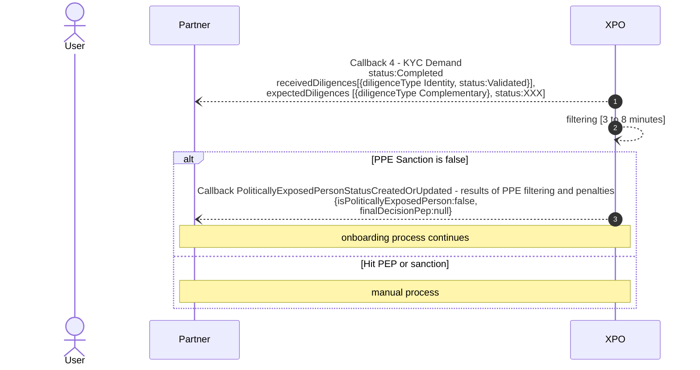
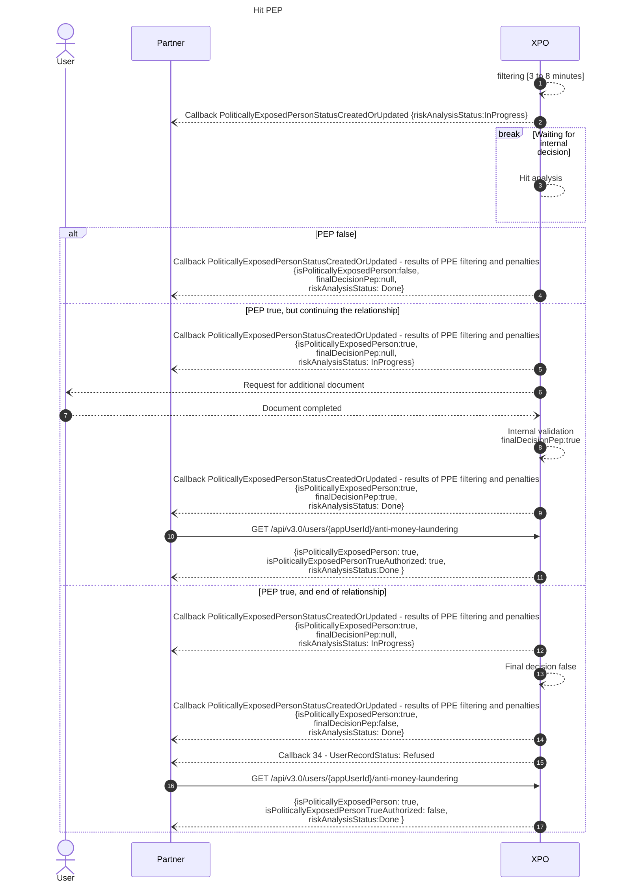
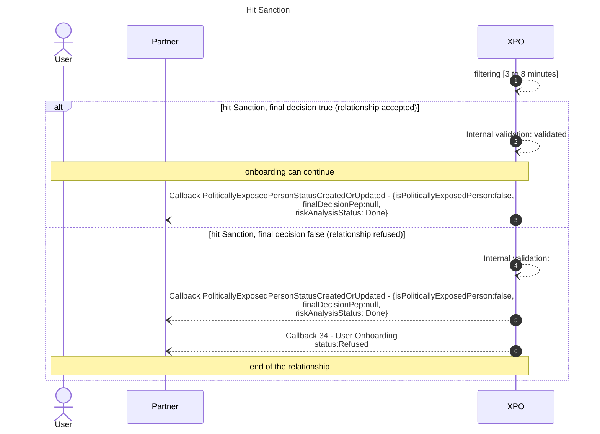

# Filtering
Filtering is used to control the presence of users on PEP or sanctions lists.

* * *
## Filtering start

The filtering is launched as soon as the **identity** is validated.
The maximum treatment time is 8 minutes, if no hits appear.
If a hit appears, an operator has to manually validate the accuracy of the hit before the workflow can continue.

* * *

## Filtering results

Xpollens results are shared through the attributs "IsPoliticallyExposedPerson" in the callback named `PoliticallyExposedPersonStatusCreatedOrUpdated`.

It is important to note that the filtering is done automatically, but that the decision to enter into a relationship following a hit is manual. The delay is therefore longer in this case.

* * *
## Filtering sequence diagram
As soon as the identity is validated, the Political Exposed Person filtering starts. 

### Best scenario


* * *
### Hit PEP


<br/>

> **Note**<br/>
> The user is contacted directly by Xpollens to request additional documents.
> * [Formulaire_Client_PPE_v4.pdf](../_resources/Formulaire_Client_PPE_v4.pdf)

<br/>

If the PEP document is not received within 3 weeks, the account will be permanently blocked.

As long as the hit is being processed, the user's status will remain at InProgress; and as long as the status is in progress, the customer cannot carry out transactions or receive money.

* * *
### Hit Sanction



<br/>

Unlike PPE filtering, if a hit sanction is proven, the user is irremediably refused.

Important note: no information is displayed during a hit sanction, for compliance reasons.

<br/>

* * *
## Filtering duration
### Production and unmocked environment vs. mocked environment (preproduction)
| Step | Production & unmocked environment | For mocked environnement |
| :--- |:--- |:--- |
| Sent users 	to the provider for filtering | Every 3 min |	Every 3 min |
| Provider analyses the user and sends response to Xpollens |In 3 min max |	In 1 min max |
|In case of a hit, after processing by Xpollens middle office, Provider sends response to Xpollens |4 times per day: 11h, 14h, 17h et 20h (Paris time) |Every 10 min |
| Xpollens verifies if there is a Provider response and process updates| Every 1 min | Every 1 min |

<br/>
<br/>

* * *
## APIs, callbacks and technical items

### GET /api/v2.1/user/compliance/{appUserId}

`GET /api/v3.0/users/{appUserId}/anti-money-laundering`

### Callback

[PoliticallyExposedPersonStatusCreatedOrUpdated](https://docs.xpollens.com/api/callbacks/#post-/PoliticallyExposedPersonStatusCreatedOrUpdated)


### Mapping fields API \<\> callback
| API | Callback |
| :--- |:--- |
| isPoliticallyExposedPerson |isPoliticallyExposedPerson |
| isPoliticallyExposedPersonTrueAuthorized | **finalDecisionPep** |
| riskAnalysisStatus |riskAnalysisStatus |


### Mapping  API \<\> callback
#### Cas not hit
| Step | API | Callback |
| :--- |:--- |:--- |
| Fircosoft filtering done |{<br/>"isPoliticallyExposedPerson": false,<br/>"isPoliticallyExposedPersonTrueAuthorized": null,<br/>"riskAnalysisStatus": "InProgress"<br/>} |"Payload":{<br/>"appUserId": "{{appUserId}}",<br/>"type": "PoliticallyExposedPersonStatusCreatedOrUpdated",<br/>"isPoliticallyExposedPerson": false,<br/>"finalDecisionPep": null,<br/>"riskAnalysisStatus": "InProgress"<br/>} |
| Immediately after |{<br/>"isPoliticallyExposedPerson": false,<br/>"isPoliticallyExposedPersonTrueAuthorized": null,<br/>"riskAnalysisStatus": "Done"<br/>} |"Payload":{<br/>"appUserId": "{{appUserId}}",<br/>"type": "PoliticallyExposedPersonStatusCreatedOrUpdated",<br/>"isPoliticallyExposedPerson": false,<br/>"finalDecisionPep": null,<br/>"riskAnalysisStatus": "Done"<br/>} |

#### Cas hit PPE
| Step | Comment | API | Callback |
| :--- |:--- |:--- |:--- |
| Fircosoft filtering done, hit raised |We know there is a hit, but we don't know if it will be confirmed. <br/> As a consequence, isPoliticallyExposedPerson is null. |{<br/>"isPoliticallyExposedPerson": null,<br/>"isPoliticallyExposedPersonTrueAuthorized": null,<br/>"riskAnalysisStatus": "InProgress"<br/>} |"Payload":{<br/>"appUserId": "{{appUserId}}",<br/>"type": "PoliticallyExposedPersonStatusCreatedOrUpdated",<br/>"isPoliticallyExposedPerson": null,<br/>"finalDecisionPep": null,<br/>"riskAnalysisStatus": "InProgress"<br/>} |
| After manual review, hit confirmed |We don't yet know whether we'll be able to enter into a relationship with this enduser.<br/>As a consequence, isPoliticallyExposedPersonTrueAuthorized is null |{<br/>"isPoliticallyExposedPerson": true,<br/>"isPoliticallyExposedPersonTrueAuthorized": null,<br/>"riskAnalysisStatus": "InProgress"<br/>} |"Payload":{<br/>"appUserId": "{{appUserId}}",<br/>"type": "PoliticallyExposedPersonStatusCreatedOrUpdated",<br/>"isPoliticallyExposedPerson": true,<br/>"finalDecisionPep": null,<br/>"riskAnalysisStatus": "InProgress"<br/>} |
| case 1: Relationship accepted ||{<br/>"isPoliticallyExposedPerson": true,<br/>"isPoliticallyExposedPersonTrueAuthorized": true,<br/>"riskAnalysisStatus": "Done"<br/>} |"Payload":{<br/>"appUserId": "{{appUserId}}",<br/>"type": "PoliticallyExposedPersonStatusCreatedOrUpdated",<br/>"isPoliticallyExposedPerson": true,<br/>"finalDecisionPep": true,<br/>"riskAnalysisStatus": "Done"<br/>} |
|case 2:  Relationship refused ||{<br/>"isPoliticallyExposedPerson": true,<br/>"isPoliticallyExposedPersonTrueAuthorized": false,<br/>"riskAnalysisStatus": "Done"<br/>} |"Payload":{<br/>"appUserId": "{{appUserId}}",<br/>"type": "PoliticallyExposedPersonStatusCreatedOrUpdated",<br/>"isPoliticallyExposedPerson": true,<br/>"finalDecisionPep": false,<br/>"riskAnalysisStatus": "Done"<br/>} |


#### Cas hit Sanction
| Step | Comment | API | Callback |
| :--- |:--- |:--- |:--- |
| Fircosoft filtering done, hit raised |We don't know if the hit has been confirmed |{<br/>"isPoliticallyExposedPerson": null,<br/>"isPoliticallyExposedPersonTrueAuthorized": null,<br/>"riskAnalysisStatus": "InProgress"<br/>} |"Payload":{<br/>"appUserId": "{{appUserId}}",<br/>"type": "PoliticallyExposedPersonStatusCreatedOrUpdated",<br/>"isPoliticallyExposedPerson": null,<br/>"finalDecisionPep": null,<br/>"riskAnalysisStatus": "InProgress"<br/>} |
| After manual review, hit confirmed |End of relationship|{<br/>"isPoliticallyExposedPerson": false,<br/>"isPoliticallyExposedPersonTrueAuthorized": null,<br/>"riskAnalysisStatus": "Done"<br/>} |"Payload":{<br/>"appUserId": "{{appUserId}}",<br/>"type": "PoliticallyExposedPersonStatusCreatedOrUpdated",<br/>"isPoliticallyExposedPerson": false,<br/>"finalDecisionPep": null,<br/>"riskAnalysisStatus": "Done"<br/>} |

> Note that the first two fields are false and null because they point to the PPE characteristic.
> We can not display sanction data for compliance reasons. 

<br/>
<br/>

* * *

## How to test
Here are the users' identities you have to use to create a hit

| **First Name & last Name** | **PPE 1st returm : hit ?** | **PPE 2nd returm: proven hit** | **Final result PPE** | **Sanction 1st returm : hit ?** | **Sanction 2nd returm: proven hit** | **Final result Sanction** |
| :--- |:--- |:--- |:--- |:--- |:--- |:--- |
| Any other user that is not in this table |0 NoHit |N/A |FALSE |0 (FALSE) |N/A |FALSE |
| - |- |- |- |- |- |- |
| BENOIT MAGIMEL |Hit |Not proven |FALSE |No Hit | N/A |	FALSE |
| JULIETTE BINOCHE |Hit |Not proven |FALSE |Hit |Not proven |	FALSE |
| BRIGITTE MACRON|Hit |Proven|TRUE |No Hit  |N/A | FALSE |
| PHILIPPE RICHARD |Hit|Proven|TRUE |Hit |Not proven |FALSE |
| ARTHUR PRINCE |Hit |Proven |TRUE |Hit |Proven | TRUE |
| SULTAN ZABIN |No Hit |N/A |FALSE |Hit |Not proven |FALSE |
| PETR AKOPOV | No Hit |N/A |FALSE |Hit |Proven| TRUE |
| KENZI BENAHMED |Hit |Not proven |FALSE |Hit |Proven|	TRUE |

<br/>

1- Create a user with one the previous identity regarding the expected case 

`POST {{URLT}}/v2.0/users`
```json


{
  "appUserId": "{{appuserid}}",
  "profile": {
    "civility": "{{civility}}",
    "firstName": "{{firstName}}",
    "lastName": "{{lastName}}",
    "birthName": "{{lastName}}",
    "birthDate": "1965-12-06",
    "birthCity": "Paris",
    "birthZipCode": "75001",
    "birthCountry": "FR",
    "nationality": "FR",
    "phoneNumber": "+33675449988",
    "email": "{{firstname}}_{{lastname}}+LC_ACCEPTED@xpollens.com",
    "address": {
      "street": "51 Pender Street",
      "supplementIn": "Access by the garden",
      "supplementOut": "Corner House",
      "zipCode": "3071",
      "city": "Paris",
      "country": "FR",
      "area": "East-Thornbury"
    }
  }/*,
  "roles": [
    {
      "dependenceId": "{{legalEntityId}}",
      "types": [
        "LegalRepresentative",
        "BeneficialOwner"
      ]
    }
  ]*/
}
```

2- Create the KYC
`POST {{URLT}}/v3.0/users/{{appuserid}}/kyc/demand`
```json
{
   "workflowCode":"Electronic_Sign"
}
```

3- Scan Corinne Bethier's identity document and scan a face (see "0-Create and validate a user" if you don't want to scan yours).

3- Ask your Customer Integration Manager to force the identity in the Netheos backoffice.
The post user does not contain the same values as the identity card. You will therefore receive  errors (inconsistent firstName inconsistent lastName, ...).

4- As soon as this action is done, the following step are automatics. An hit is automatically generated.

5- In the case of a proven PPE hit, ask your Customer Integration Manager to validate or refuse the relationship. 


* * *

## FAQ
### FAQ1: Is it possible to reopen a user in Refused status? 
The "refused" user status is a final status. It is therefore no longer possible to reopen it.
