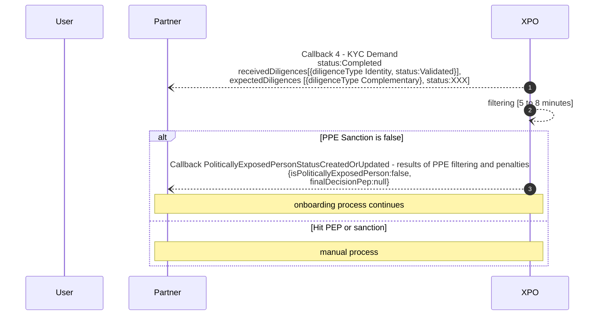
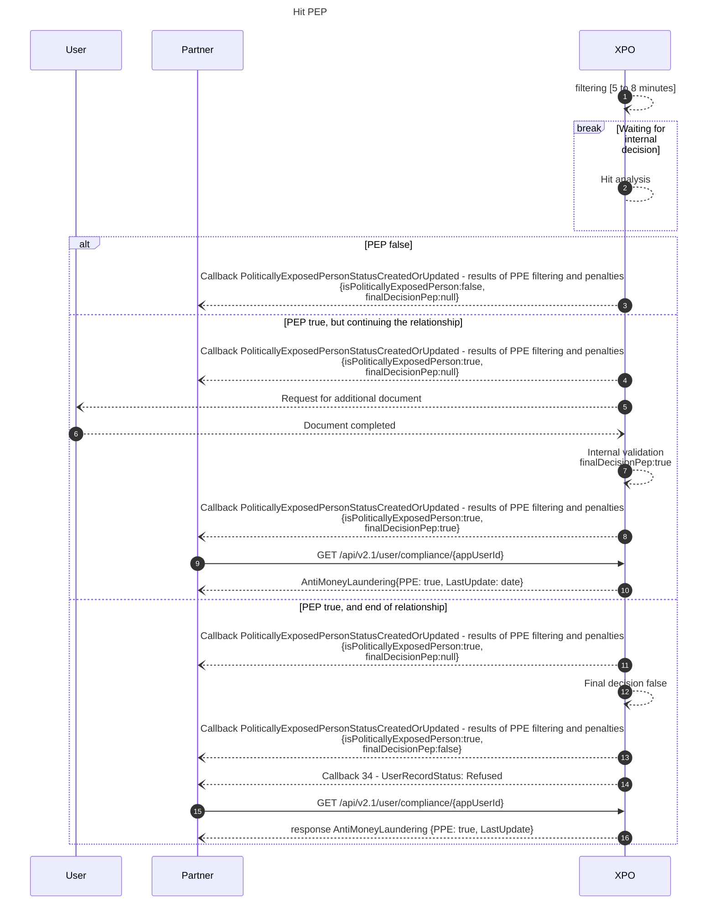
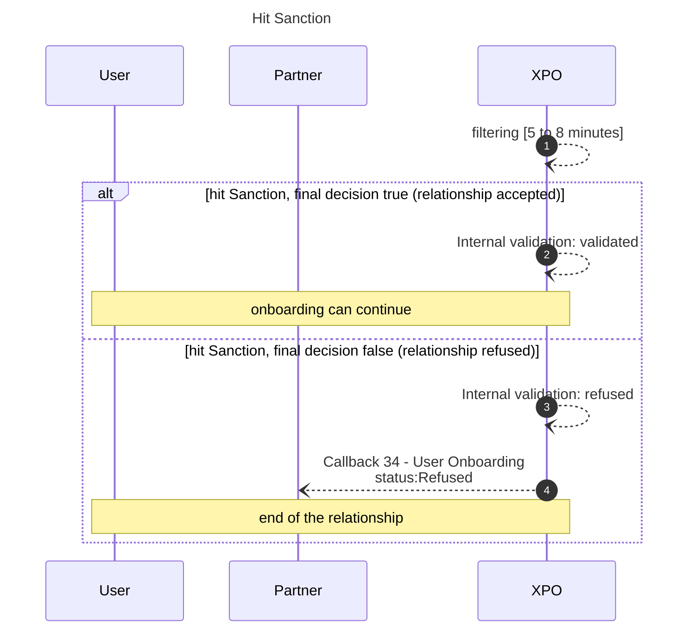

# Filtering
Filtering is used to control the presence of users on PEP or sanctions lists.

* * *
## Filtering start
The filtering is launched as soon as the identity document is validated.
The maximum treatment time is 8 minutes, if no hits appear.
If a hit appears, an operator has to manually validate the accuracy of the hit before the workflow can continue.

* * *

## Filtering results

Xpollens results are shared through the attributs "IsPoliticallyExposedPerson" in the callback named `PoliticallyExposedPersonStatusCreatedOrUpdated`.

It is important to note that the filtering is done automatically, but that the decision to enter into a relationship following a hit is manual. The delay is therefore longer in this case.

* * *
## Filtering sequence diagram
As soon as the identity is validated, the Political Exposed Person filtering starts. 

### Best scenario

* * *
### Hit PEP

 

> **Note** 
> The user is contacted directly by Xpollens to request additional documents.
> * [Formulaire_Client_PPE_v4.pdf](../_resources/Formulaire_Client_PPE_v4.pdf)

 

If the PEP document is not received within 3 weeks, the account will be permanently blocked.

As long as the hit is being processed, the user's status will remain at InProgress; and as long as the status is in progress, the customer cannot carry out transactions or receive money.

* * *
### Hit Sanction

 

Unlike PPE filtering, if a hit sanction is proven, the contact is irremediably refused.

* * *
## APIs, callbacks and technical items

### GET /api/v2.1/user/compliance/{appUserId}
[`GET /api/v2.1/user/compliance/{appUserId}`](https://docs.xpollens.com/api/Compliance#get-/api/v2.1/user/compliance/-appUserId-)

### Callback

[PoliticallyExposedPersonStatusCreatedOrUpdated](https://docs.xpollens.com/api/callbacks/#post-/PoliticallyExposedPersonStatusCreatedOrUpdated)

* * *

## How to test
As a customer, you don't have the power to independently test the creation of hit PPE and the processing of these hits. 
Ask your Customer Integration manager to support you.

* * *

## FAQ