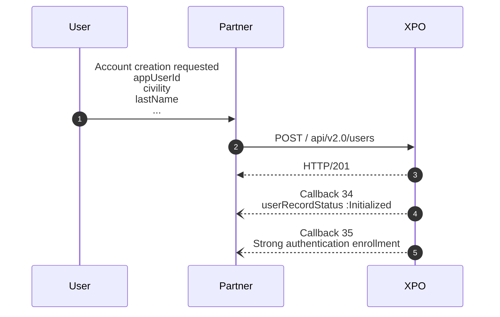
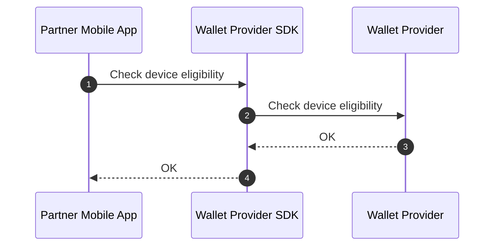
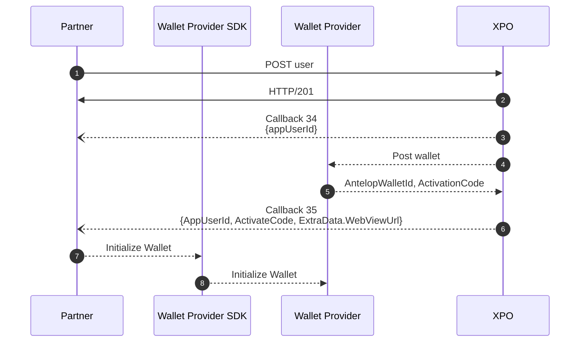

# Strong Customer Authentication
The strong anthentification is needed for some sensitive actions.

Important note:

* * *
## Strong Authentication Enrollment 

Xpollens offers two kind of usage that require the use of a mobile phone by the customer:

1. KYC process during the user’s onboarding (please refer to Know your customer | Xpollens API docs)
2. Strong authentication process (please refer to Strong customer authentication | Xpollens API docs)

 

Authentication is required for your end-customers if you are on the Retail B2C market ; it is also required for all key individuals of your professional customers, if you are on the Corporates B2B market. 
Strong Customer Authentication will occur in two situations :

1. Online card payment
2. Sensitive Operations (amongst which, some require secure display)

 

This document aims at presenting the key elements to use these features.

The first step consists of **integrating our SDK in your mobile application.** 

SDK’s documentation is available at : https://doc.antelop-solutions.com/latest/wallet/sdk/index.html

> **Note** 
> To access this online documentation, you shall use the ID / pwd provided by Xpollens, during your Onboarding process.*

 

* * *
### Check mobile eligibility

### Wallet initialization

> **Note** 
> To access this online documentation, you shall use the ID / pwd provided by Xpollens, during your Onboarding process.
> [Getting Started](https://doc.antelop-solutions.com/latest/wallet/general/getting-started.html) 
> [Wallet Management](https://doc.antelop-solutions.com/latest/wallet/sdk/wallet_management.html)

* * *
### Wallet initialization
The Customer Authentication is based on Authentication Patterns, which define the possible combinations of authentication methods to 
authenticate for a given operation.
The authentication pattern used by Xpollens when creating the wallet is « BIOORPIN ».

For more details, please refer to : [sca intro](https://doc.antelop-solutions.com/latest/wallet/sca/sca-intro.html#_authentication_patterns)

***
## APIs, callbacks & technical items
### Callback #34
[`Callback #34`](https://docs.xpollens.com/api/callbacks#post-/-callback34Url-)

### Callback #35
[`Callback #35`](https://docs.xpollens.com/api/callbacks#post-/-callback35Url-)

***
## FAQ