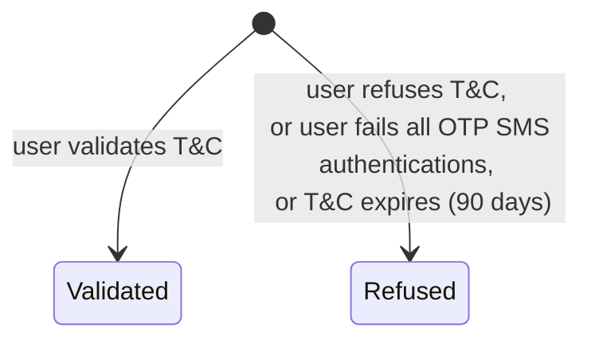
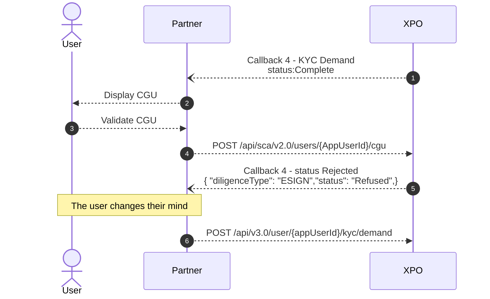
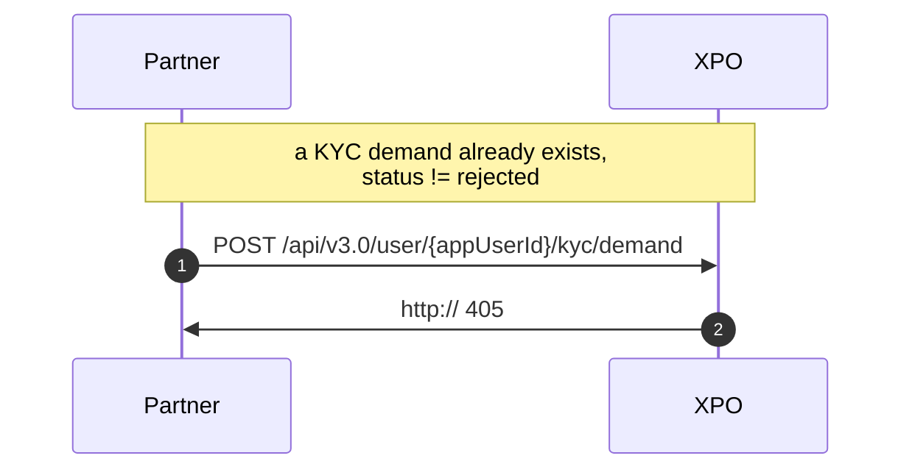
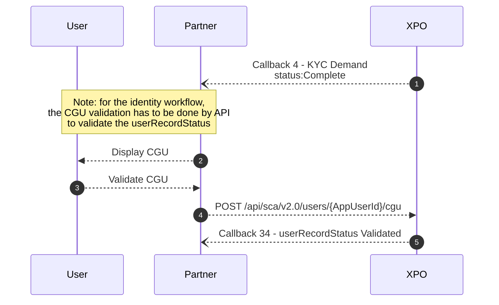

# Terms and conditions

T&C must be signed to valide the user status.

  

***

## Workflow Electronic_sign
The T&C validation is included in the workflow eletronic_sign and is a due diligence.
It must be signed to validate the KYC Status - cf. dedicated section.

The Terms and Conditions is configured by Xpollens in the Netheos backoffice. At the time of signing, the user signs the Terms and Conditions of the partner, Xpollens and VISA if applicable.

The partner T&C are a prerequesite to create the production environment. They have to be sent to the Customer Experience Manager.

  

* * *

### Due diligence "ESIGN" State Diagram

As a consequence, the KYC demand state changes to Rejected.

  

* * *

### Secret code: SMS
The eletronic signature is available 90 days. During these 90days, the sms can be sent again at the enduser's request.

Each secret code has a lifetime of 10 minutes.

The user has 3 attempts to enter the secret code, and can resend the text message up to 2 times. The user therefore has a total of 9 attempts to authenticate the SMS OTP.

After 3 attempts, the client has to click on the "Send SMS" button.
If the code expires,  the client has to click on the "Send SMS" button	

If all attempts have been exhausted, or if the signature has not been made within 90 days, the status of the KYC request changes to Rejected.

  
* * *

### T&C refused. What to do?

- the new KYC demand has no link with the previous one
- the workflow can be electronic_sign or identity, independently of the previous one.
- the `GET /api/v3.0/users/{appUserId}/kyc/demand` now returns the information from the new KYC request; the information from the old request is no longer accessible.

The `POST /api/v3.0/user/{appUserId}/kyc/demand` is only possible if the other KYC requests are in rejected status.

 

***
## Workflow Identity

For the T&C signature in the idendity workflow, the wallet initialization is a prerequesite as it is a sensitive action.

For this workflow, the Partner Terms and Conditions are signed on the Partner side, and the Xpollens Terms and Conditions (and VISA if applicable) are signed through the POST /api/sca/v2.0/users/{AppUserId}/cgu.

It is **impossible** to refuse the T&Cs by API.

  

***

## How to modify the T&C

If there is a change to the T&C, a zendesk ticket must be created so that Xpollens can modify the settings in the Netheos back office.

When the T&C are changed, the partner must notify its customers of the new version. By default, users are deemed to have accepted the new Terms and Conditions. If a user refuses to accept the new Terms and Conditions, an account closure procedure must be initiated.

 

***
## How to test
Please refer to the dedicated section: Netheos KYC test procedure

 

***
## FAQ
### FAQ1: Are all telephone numbers accepted? 
R: Yes, as long as the operator is whitelisted in France.

### FAQ2: What should I do if the telephone number I have entered is not the right one?

R: In this case, if the workflow used is the electronic_sign, the user is not able to received the SMS for the secret code.  
As a consequence, you must allow the enduser to close the webview, change the telephone number and return to the webview.  
The user then has to tick the boxes again, and receive the text message on the new phone number.
