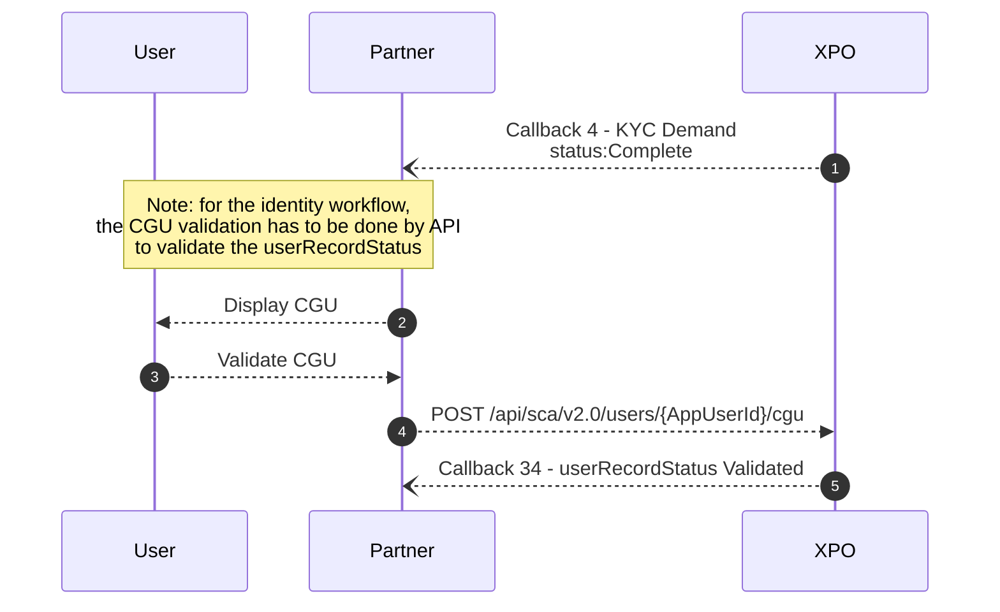

# Terms and conditions
T&C must be signed to valide the user status.

***
## Workflow Eletronic_sign
The T&C validation is included in the workflow eletronic_sign and is a due diligence.
It must be signed to validate the KYC Status - cf. dedicated section.

The Terms and Conditions is configured by Xpollens in the Netheos backoffice. At the time of signing, the user signs the Terms and Conditions of the partner, Xpollens and VISA if applicable.

The partner T&C are a prerequesite to create the production environment. They have to be sent to the Customer Experience Manager.

### Secret code: SMS
The eletronic signature is available 90 days. During these 90days, the sms can be sent again at the enduser's request.
The user has 3 attempts to enter the secret code, and can resend the text message up to 2 times. 
Each secret code has a lifetime of 10 minutes.

After 3 attempts, the client has to click on the "Send SMS" button.
If the code expires,  the client has to click on the "Send SMS" button	

If all attempts have been exhausted, you will need to contact support so that a manual unlock can be performed.

***
## Workflow Identity
For the CGU signature in the idendity workflow, the wallet initialization is a prerequesite as it is a sensitive action.

For this workflow, the Partner Terms and Conditions are signed on the Partner side, and the Xpollens Terms and Conditions (and VISA if applicable) are signed through the POST /api/sca/v2.0/users/{AppUserId}/cgu.

***
## How to modify the GCU
If there is a change to the GCU, a zendesk ticket must be created so that Xpollens can modify the settings in the Netheos back office.

When the GCU are changed, the partner must notify its customers of the new version. By default, users are deemed to have accepted the new Terms and Conditions. If a user refuses to accept the new Terms and Conditions, an account closure procedure must be initiated.

***
## How to test
Please refer to the dedicated section: Netheos KYC test procedure

***
## FAQ
### FAQ1: Are all telephone numbers accepted? 
R: Yes, as long as the operator is whitelisted in France.
