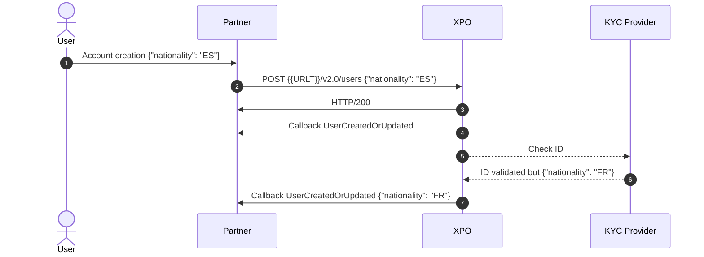
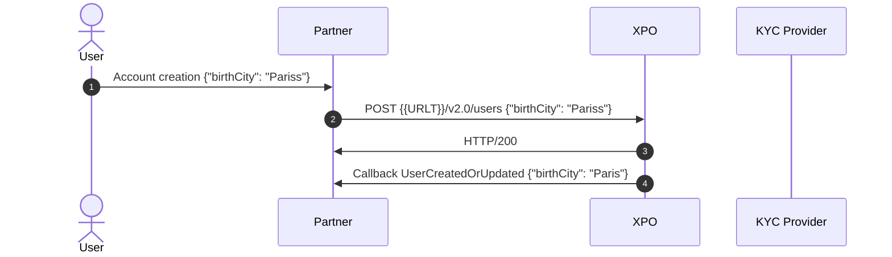

# Callback UserCreatedOrUpdated

## Case: the verified nationality does not match the declared one.

In this example, the declared nationality is ES whereas the user provides a french ID card.

### Sequence diagram


### Technical aspects
`POST {{URLT}}/v2.0/users`

```json
 {
  "appUserId": "{{appuserid}}",
  "profile": {
    "civility": "Mrs",
    "firstName": "Corinne",
    "lastName": "Berthier",
    "birthName": "Berthier",
    "birthDate": "1965-12-06",
    "birthCity": "Paris",
    "birthZipCode": "75001",
    "birthCountry": "FR",
    "nationality": "ES",
    "phoneNumber": "+33675449988",
    "email": "{{firstname}}_{{lastname}}+LC_ACCEPTED@xpollens.com",
    "address": {
      "street": "110 avenue de France",
      "supplementIn": "3e etage",
      "supplementOut": "Pilier D",
      "zipCode": "75013",
      "city": "Paris",
      "country": "FR",
      "area": ""
    }
  }
}
```


First Callback received : contains the information provided by the end user.

```json
    "Payload": {
        "type": "UserCreatedOrUpdated",
        "appUserId": "de731dd3J",
        "recordStatus": "InProgress",
        "identificationLevel": "None",
        "onboardingDate": "2025-05-28 13:15:56",
        "profile": {
            "email": "Tomasa_Lang+LC_ACCEPTED@xpollens.com",
            "phoneNumber": "+33675449988",
            "firstName": "Corinne",
            "lastName": "Berthier",
            "birthName": "Berthier",
            "birthCity": "Paris",
            "birthZipCode": "75001",
            "birthCountry": "FR",
            "nationality": "ES",
            "birthDate": "1965-12-06",
            "civility": "Mrs",
            "address": {
				"street": "110 avenue de France",
				"supplementIn": "3e etage",
				"supplementOut": "Pilier D",
				"zipCode": "75013",
				"city": "Paris",
				"country": "FR",
				"area": ""
            }
        },
        "dataCorrectionLogs": []
    }

```

Then a second Callback is received, after controls.
```json
    "Payload": {
        "type": "UserCreatedOrUpdated",
        "appUserId": "de731dd3J",
        "recordStatus": "InProgress",
        "identificationLevel": "None",
        "onboardingDate": "2025-05-28 13:15:56",
        "profile": {
            "email": "Tomasa_Lang+LC_ACCEPTED@xpollens.com",
            "phoneNumber": "+33675449988",
            "firstName": "Corinne",
            "lastName": "Berthier",
            "birthName": "Berthier",
            "birthCity": "Paris",
            "birthZipCode": "75001",
            "birthCountry": "FR",
            "nationality": "FR",
            "birthDate": "1965-12-06",
            "civility": "Mrs",
            "address": {
				"street": "110 avenue de France",
				"supplementIn": "3e etage",
				"supplementOut": "Pilier D",
				"zipCode": "75013",
				"city": "Paris",
				"country": "FR",
				"area": ""
            }
        },
        "dataCorrectionLogs": [
            {
                "propertyName": "profile.nationality",
                "originalValue": "ES",
                "newValue": "FR",
                "reason": "Correction"
            }
        ]
    }
```

<br/>
* * *

## Case: declared city contains an minor error

In this example, the declared birthCity is "Pariss" whereas the correct spelling is 'Paris'.

### Sequence diagram



### Technical aspects
`POST {{URLT}}/v2.0/users`
```json
 {
  "appUserId": "{{appuserid}}",
  "profile": {
    "civility": "Mrs",
    "firstName": "Corinne",
    "lastName": "Berthier",
    "birthName": "Berthier",
    "birthDate": "1965-12-06",
    "birthCity": "Pariss",
    "birthZipCode": "75001",
    "birthCountry": "FR",
    "nationality": "FR",
    "phoneNumber": "+33675449988",
    "email": "{{firstname}}_{{lastname}}+LC_ACCEPTED@xpollens.com",
    "address": {
      "street": "110 avenue de France",
      "supplementIn": "3e etage",
      "supplementOut": "Pilier D",
      "zipCode": "75013",
      "city": "Paris",
      "country": "FR",
      "area": ""
    }
  }
}
```

First Callback received : the user is created and the city was fixed
```json
    "Payload": {
        "type": "UserCreatedOrUpdated",
        "appUserId": "de731dd3J",
        "recordStatus": "Initialized",
        "identificationLevel": "None",
        "onboardingDate": "2025-05-28 13:15:56",
        "profile": {
            "email": "Tomasa_Lang+LC_ACCEPTED@xpollens.com",
            "phoneNumber": "+33675449988",
            "firstName": "Corinne",
            "lastName": "Berthier",
            "birthName": "Berthier",
            "birthCity": "Paris",
            "birthZipCode": "75001",
            "birthCountry": "FR",
            "nationality": "ES",
            "birthDate": "1965-12-06",
            "civility": "Mrs",
            "address": {
				"street": "110 avenue de France",
				"supplementIn": "3e etage",
				"supplementOut": "Pilier D",
				"zipCode": "75013",
				"city": "Paris",
				"country": "FR",
				"area": ""
            }
        },
        "dataCorrectionLogs": [
            {
                "propertyName": "profile.birthCity",
                "originalValue": "Pariss",
                "newValue": "Paris",
                "reason": "Normalization"
            }
        ]
    }

```

<br/>

* * *


## Case: data correction
Data correction can occur either during onboarding or throughout the customer relationship, with or without strong authentication, depending on the use case.

In this example, during onboarding, the end user corrects their first name, having initially entered "Colinne" instead of "Corinne."

`PUT {{URLT}}/v2.0/users/{appUserId}`
```json
{
  "profile": {
    "firstName": "Corinne"
  }
}
```

The callback contains the new value.
```json
  "Payload": {
        "type": "UserCreatedOrUpdated",
        "appUserId": "12526b6dJ",
        "recordStatus": "Initialized",
        "identificationLevel": "None",
        "onboardingDate": "2025-05-28 14:37:42",
        "profile": {
            "email": "Madisyn_Lubowitz+LC_ACCEPTED@xpollens.com",
            "phoneNumber": "+33675449988",
            "firstName": "Corinne",
            "lastName": "Berthier",
            "birthName": "Berthier",
            "birthCity": "Paris",
            "birthZipCode": "75001",
            "birthCountry": "FR",
            "nationality": "FR",
            "birthDate": "1965-12-06",
            "civility": "Mrs",
            "address": {
				"street": "110 avenue de France",
				"supplementIn": "3e etage",
				"supplementOut": "Pilier D",
				"zipCode": "75013",
				"city": "Paris",
				"country": "FR",
				"area": ""
            }
        },
        "dataCorrectionLogs": []
    }
 
```
