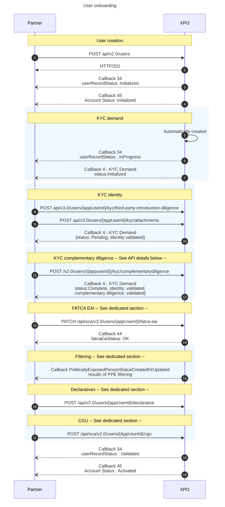

# KYC delegation - with ID document - for physical person business case B2C

The KYC delegation is applicable only under specific conditions.
Please confirm its feasibility with your Customer Project Manager.	

<br/>

* * *


# Sequence diagram



<br/>

* * *

# API details for the delegated identity

POST {{URLT}}/api/v3.0/users/{{appUserId}}/kyc/third-party-introduction-diligence

```json
 {
 "type": "55"
}
```

RESPONSE 200

OK

<br/>


* * *

# API details for complementarydiligence

POST /v2.0/users/{{appuserid}}/kyc/complementarydiligence

```json
{
 "Type" : 53,
 "Status" : "Validated",
 "Reason" : "None"
}
```

RESPONSE

```json
{
 "type": "TIERCE_INTRODUCTION",
 "status": "Validated",
 "reason": "None",
 "creationDate": "2023-12-01T23:18:20",
 "lastUpdate": "2023-12-01T23:18:20"
}
```

<br/>

* * *