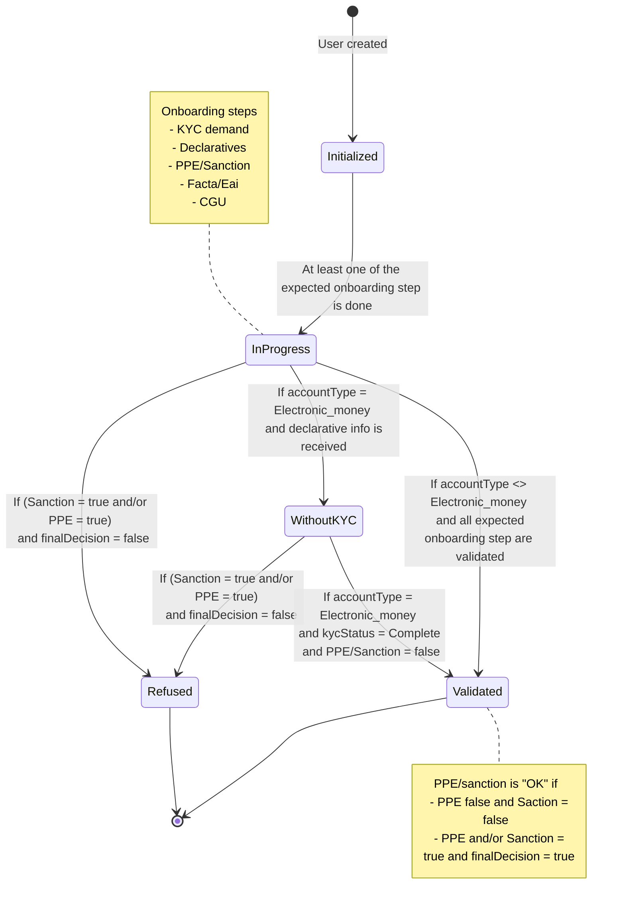
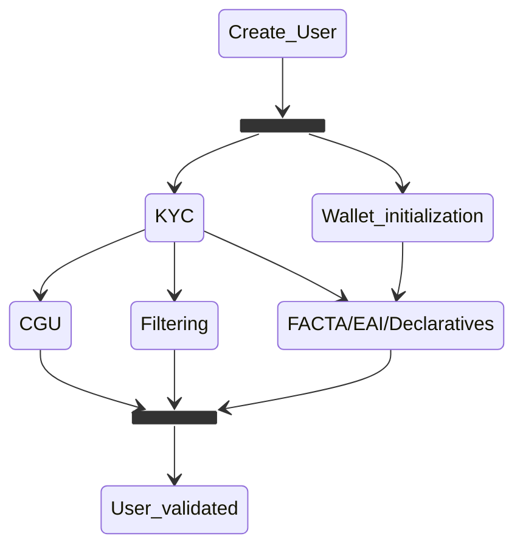
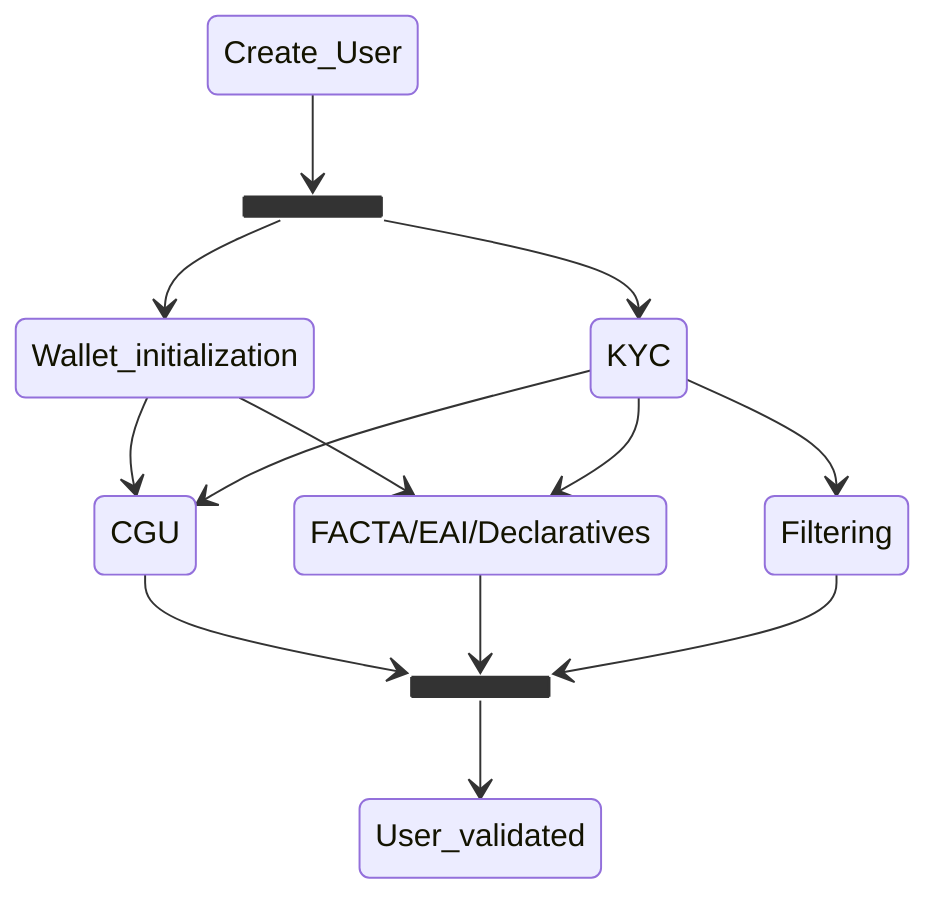
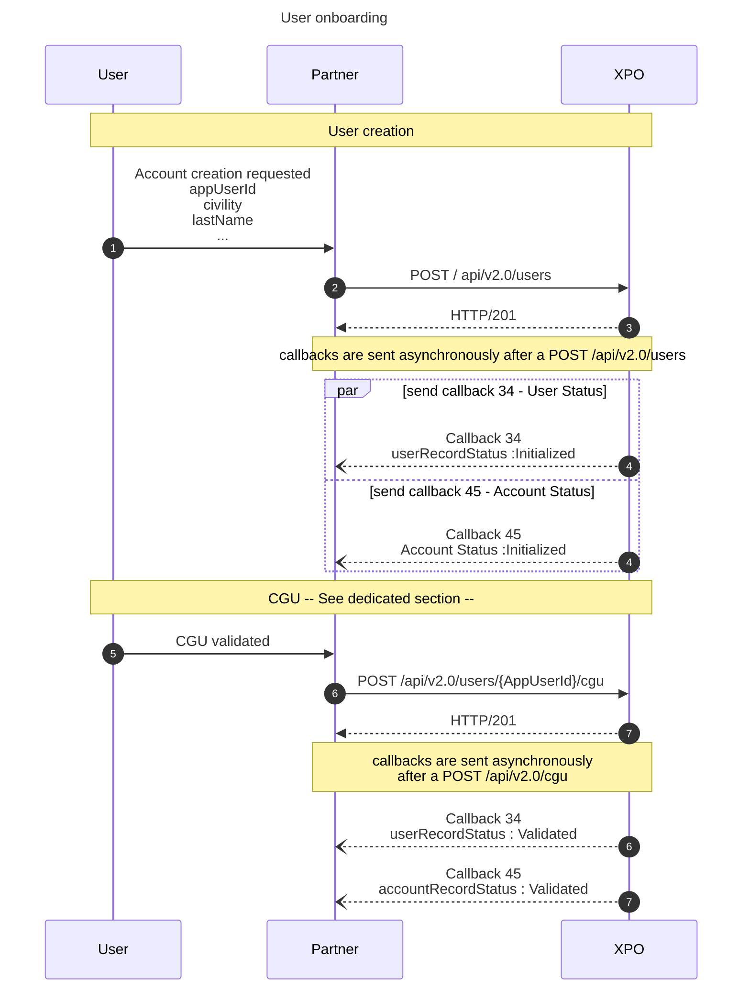

# User Onboarding Introduction
This documentation applies to the creation of a particular user in the contexte of payment accounts.

* * *
## User status diagram: UserRecordStatus
The userRecordStatus is the user's highest status level. It includes:
- the KYC status,
- the CGU validation,
- the PEP Sanction filtering status, 
- the FACTA/EAI status.

 

* * *
## User & Account
A user can have several accounts. This is why there is a distinction between accounts and users.
Today, the creation of a user automatically generates the creation of an account.

In the future, these two actions will be decoupled: the account should be created once the user has been created.

 

* * *
## User sequence diagram
### electronic_sign workflow

* * *

### Identity workflow

* * *
### Detailed user onboarding sequence diagram

```mermaid
sequenceDiagram
Title: User onboarding
autoNumber
Participant User
Participant Partner
Participant XPO

Note over User, XPO: User creation

User ->> Partner : Account creation requested<br/>appUserId<br/>civility<br/>lastName<br/>...
Partner ->> XPO : POST / api/v2.0/users
XPO -->> Partner: HTTP/201
autonumber off
note over Partner, XPO : callbacks are sent asynchronously after a POST /api/v2.0/users
par send callback 34 - User Status
autonumber 4
XPO --) Partner : Callback 34<br/>userRecordStatus :Initialized
autonumber 4
and send callback 45 - Account Status
XPO --) Partner : Callback 45<br/>Account Status :Initialized
end

Note over User, XPO: KYC -- See dedicated section --
autonumber 5
rect rgb(104, 180, 255, 0.1)
	Partner ->> XPO: POST /api/v3.0/user/{appUserId}/kyc/demand<br/>workflowCode: Electronic_Sign|Identity
	XPO -->> Partner : HTTP/201
	autonumber 7
	note over Partner, XPO : callbacks are sent asynchronously after a POST /api/v3.0/kyc/demand
	par Send callback 35 - Strong Authentication
		rect rgb(255, 255, 255, 1)
			XPO --) Partner : Callback 35<br/>Strong authentication enrollment [Note1]
		end
	autonumber 7
	and send callback 34 - User Status
		rect rgb(255, 255, 255, 1)
			XPO --) Partner : Callback 34<br/>userRecordStatus :InProgress
		end
	autonumber 7
	and send callback 48 - KYC web view
		XPO --) Partner : Callback 48 - KYC web view
	autonumber 7
	and send callback 4 - KYC status
		XPO --) Partner : Callback 4<br/> KYC status<br/>(Incomplete|Complete|..)
	end
end
rect rgb(104, 180, 255, 0.1)
	Note over User, XPO: CGU -- See dedicated section --
	alt Electronic_sign <br/> CGU included in the KYC workflow
	else Identity
		autonumber 8
		User ->> Partner: CGU validated
		Partner ->> XPO : POST /api/sca/v2.0/users/{AppUserId}/cgu
		XPO -->> Partner : HTTP/201
end
autonumber 11
note over Partner, XPO : callbacks are sent asynchronously after a POST /api/v2.0/cgu
rect rgb(255, 255, 255, 1)
			par Send callback 4 - KYC status		
				XPO --) Partner : Callback 4<br/>KYCStatus : Complete
		 autonumber 11
			and send callback 34 - User Status
				XPO --) Partner : Callback 34<br/>userRecordStatus : InProgress
			end
		end
end
rect rgb(104, 180, 255, 0.1)
	Note over User, XPO: FATCA EAI -- See dedicated section --
	par Declarative informations
		autonumber 12
		User ->> Partner: Declarative 
		Partner ->> XPO : POST /api/v2.0/users/{AppUserId}/declarative
		XPO -->> Partner : HTTP/200		
		XPO --) XPO : Callback 32<br/>Internal
	and Fatca eai
		autonumber 15
		User ->> Partner: Americaness & Tin info 
		Partner ->> XPO : PATCH /api/sca/v2.1/user/{appUserId}/fatcaEai
		XPO -->> Partner : HTTP/201		
		note over Partner, XPO : callbacks are sent asynchronously after a POST /api/v2.1/fatcaEai
		XPO --) Partner : Callback 44<br/>fatcaEaiStatus: OK
	end
end

rect rgb(104, 180, 255, 0.1)
	Note over User, XPO: Filtering -- See dedicated section --
	note over Partner, XPO : callbacks are sent asynchronously after filtering
	autonumber 18
	XPO --) Partner : Callback PoliticallyExposedPersonStatusCreatedOrUpdated <br/>results of PPE filtering and penalties
end
par send callback 34 - User Status
	autonumber 18
	XPO --) Partner : Callback 34<br/>userRecordStatus : Validated
and send callback 45 - Account Status
	autonumber 18
	XPO --) Partner : Callback 45<br/>Account Status : Activated
end
```

 

> **Note1** 
> The strong authentication wallet initialization is not a prerequisite for KYC validation if the choosen workflow is "electronic_sign". It can be done at any time after the user has been created. 
> Otherwise (if the workflow is "identity"), the wallet initialization is a prerequesite to sign CGU, and as a consequence a prerequesite to validate the user status. 
> This callback is received as soon as the KYC demand is created. 
> However, it is necessary for user validation, as sending FATCA/EAI information requires strong authentication. 

 

> **Note2** 
> The call sequence presented below is an example. Once the user is created, APIs related to KYC, T&Cs, Declarative, and FATCA can be called in the order chosen by the partner. The recommendation is as follows:
>1. User creation
>2. KYC request creation
>3. KYC completion (Identity or Electronic Signature)
>4. Since the KYC request may take some time to be validated, it is recommended, to avoid leaving the user waiting, to proceed with the following steps during the wait:
>5. Initialization of the Authentication Wallet
>6. Income Declaration
>7. FATCA / EAI (requires prior creation of the authentication wallet)
>8. T&Cs Signature (in the case of the IDENTITY workflow - Requires prior creation of the authentication wallet)

 

> **⚠ Note3** 
> It is impossible to represent all possible cases. However, it is important to note the following: 
> **Callbacks are triggered as soon as an action modifies data related to the callback (User status for callback 34, Account status for callback 45, KYC status for callback 4, etc.)** 

* * *
### Detailed user onboarding sequence diagram - Anonymous Electronic Money Account
Anonymous Electronic Money accounts creation does not require most of the previous steps to be completed.
The only requirement for anonymous electronic money account creation is the signature of terms & conditions.

 

> **⚠ Note4** 
> For now, the authentication wallet can not be used with an electronic money account and thus, no callback 35 is sent to the partner. 
> For this reason the validation of T&C can be performed in this case and **this case only** without Strong Authentication. 
> In the future, the callback 35 may be sent as soon as the user is created in order to initialize the authentication wallet. The T&C signature may require a Strong Authentication in this case, even for anonymous electronic money accounts.

* * *

## User status diagram: UserRecordStatus
In accordance with CNIL regulations and rules:
- all customers have the right to refuse the use of biometrics when entering into a relationship with us
- the service provider must offer a fallback solution, enabling the customer to enter into a relationship.

In the case of facial scanning, it is therefore **mandatory** to implement the "Identity" fallback solution with SCT IN diligence.

* * *
## APIs, callbacks and technical items
### Create a user
[`POST /api/v2.0/users`](https://docs.xpollens.com/api/Users#post-/api/v2.0/users)
* * *
### Create a KYC demand
`POST /api/v3.0/users/{appUserId}/kyc/demand`
* * *
### Save User declarative
[`POST /api/v2.0/users/{AppUserId}/declarative`](https://docs.xpollens.com/api/Users#post-/api/v2.0/users/-AppUserId-/declarative)
* * *
### Create and update FATCA information for a Customer
[`PATCH /api/sca/v2.1/user/{appUserId}/fatcaEai`](https://docs.xpollens.com/api/Compliance#patch-/api/v2.1/user/-appUserId-/fatcaEai)
* * *
### Save User T&C acceptance (`IDENTITY` workflow only)
[`POST sca/v2.0/users/{{appUserId}}/cgu`](https://docs.xpollens.com/api/Users#post-/api/v2.0/users/-AppUserId-/cgu)

* * *
### Callbacks
[`Callback 34`](https://docs.xpollens.com/api/callbacks#post-/-callback34Url-)

[`Callback 4`](https://docs.xpollens.com/api/callbacks#post-/-callback04-V2.0Url-)

[`Callback 44`](https://docs.xpollens.com/api/callbacks#post-/-callback44Url-)

[`Callback 48`](https://docs.xpollens.com/api/Callbacks#post-/-callback48Url-)

[`Callback 35`](https://docs.xpollens.com/api/Callbacks#post-/-callback35Url-)

[`Callback 45`](https://docs.xpollens.com/api/Callbacks#post-/-callback45Url-)

* * *
### CGU
For the Electronic_Sign worlfklow, the CGU are signed through the webview.
For the Identity workflow, the CGU are signed though the dedicated API. 
