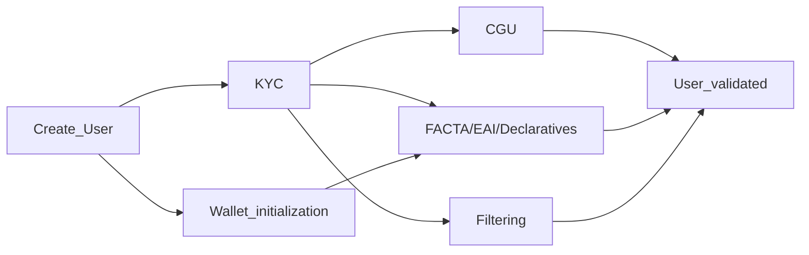
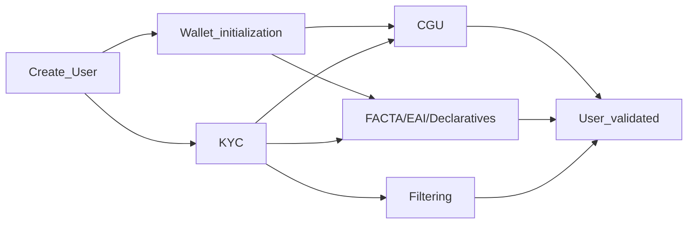
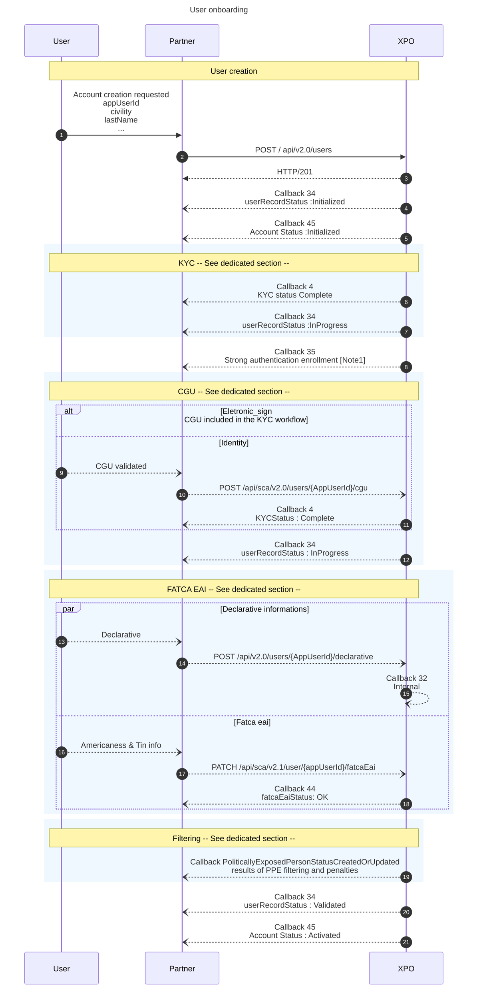

import Image from '@theme/Image';
import Highlight from '@theme/Highlight';
import Endpoint from "@theme/Endpoint"
import Cta from '@theme/Cta'

# User Onboarding Introduction
This documentation applies to the creation of a particular user in the contexte of payment accounts.
* * *
## User status diagram: UserRecordStatus
The userRecordStatus is the user's highest status level. It includes:
- the KYC status,
- the CGU validation,
- the PEP Sanction filtering status, 
- the FACTA/EAI status.

 

* * *
## User & Account
A user can have several accounts. This is why there is a distinction between accounts and users.
Today, the creation of a user automatically generates the creation of an account.

In the future, these two actions will be decoupled: the account should be created once the user has been created.

 

* * *
## User sequence diagram
### Eletronic_sign workflow

* * *
### Identity workflow

* * *
### Detailed user onboarding sequence diagram

 

> **Note** 
> The strong authentication wallet initialization is not a prerequisite for KYC validation if the choosen workflow is "electronic_sign". It can be done at any time after the user has been created. 
> Otherwise (if the workflow is "identity"), the wallet initialization is a prerequesite to sign CGU, and as a consequence a prerequesite to validate the user status. 
> This callback is received as soon as the KYC demand is created. 
> However, it is necessary for user validation, as sending FATCA/EAI information requires strong authentication. 

 

* * *
## APIs, callbacks and technical items
### Create a user
[`POST /api/v2.0/users`](https://docs.xpollens.com/api/Users#post-/api/v2.0/users)
* * *
### Create a KYC demand
`POST /api/v3.0/users/{appUserId}/kyc/demand`
* * *
### Save User declarative
[`POST /api/v2.0/users/{AppUserId}/declarative`](https://docs.xpollens.com/api/Users#post-/api/v2.0/users/-AppUserId-/declarative)
* * *
### Create and update FATCA information for a Customer
[`PATCH /api/sca/v2.1/user/{appUserId}/fatcaEai`](https://docs.xpollens.com/api/Compliance#patch-/api/v2.1/user/-appUserId-/fatcaEai)
* * *
### Callbacks
[`Callback 34`](https://docs.xpollens.com/api/callbacks#post-/-callback34Url-)

[`Callback 4`](https://docs.xpollens.com/api/callbacks#post-/-callback04-V2.0Url-)

[`Callback 44`](https://docs.xpollens.com/api/callbacks#post-/-callback44Url-)

* * *
### CGU
For the Electronic_Sign worlfklow, the CGU are signed through the webview.
For the Identity workflow, the CGU are signed though the dedicated API. 