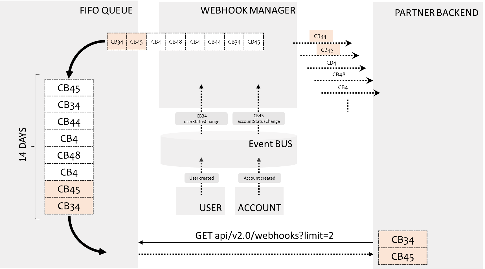

# WebHook Manager
## Description
The Xpollens webhook manager is a centralized system hosted at Xpollens in charge of sending asynchronous notifications based on events to the parner information system.

> ie
> 
> - Change in the user creation status
> - Change in the account status
> - Change in thje KYC status
> - Cards operation
> - Money transfers (in/ou) operation
> - ...

<br/>
Each time an internal event is received at Xpollens that requires the partner to be informed of a change, a callback is sent to the partner.  

These callbacks are HTTP/RESTful based and target a partner endpoint in charge of handling this event.

Once the callbacks are sent to the partner (whenever the status of the call) It then adds them to a "FIFO Queue".<br/>
The "FIFO Queue" is a first-in-first-out (FIFO) queue. Callbacks are added to the queue at the end and removed from the beginning.<br/>
The GET/WEBHOOKS API allows clients to retrieve callbacks from the queue.

**Advantages**<br/>
This system has several advantages:

* It allows for centralized callback management.
* It ensures that callbacks are processed in the order in which they were received.
* It makes callbacks accessible to clients via a standardized API.

<br/><br/>

* * *

## How it works?
Callbacks are sent as soon as they are received internally by the Xpollens webhook manager.

The parameterization of target enpoints is made during the onboarding phase.  
The partner has to provide the associated endpoint hosted in its information system so they can be set by Xpollens for each of the corresponding callbacks

> Example :
> 
> | **Name** | **Description** | **Type** | **Partner URL** | **Remarks** |
> | :---: | :--- | :---: | :---: | :---: |
> | **topup** | On topup received … | **1** | https://partnerurl/callback//topup | *same URL expected for these  3 callbacks* |
> | **topup** | On card registration | **5** |^^ |^^ |
> | **Refund topup** | On Topup refund | **37** |^^  |^^ | 
> | **kyc** | On KYC demande status change | **4** | https://partnerurl/kyc/demand |     |
> | **sct in** | On SEPA money transfer received | **16** | [https://partnerurl/sepa_in](https://recette.api.bred.fr/api-digitalpayment/v1/callback/transaction/code) | |

<br/>

**These  rules apply to all callbacks :**

- The http request can be retried by the webhook if the partner is not able to respond or responds with an error (timeout, bad http status received from the partner, ...).
The retry mecanism is done 3 times within a fixed interval (20 secondes) 
- Partner should send an http response to the query. This response should return HTTP/200. The response body can either be empty or contains some information (will not be handled by Xpollens)
- Every change in partner callbacks URL should be requested to the Xpollens Support team through a zendesk support request.

<br/><br/>

* * *

## FIFO Queue and GET / webhooks API
A dedicated queue is created for each Partner and each received callback is stored in this queue for 14 days.



These callbacks are stored with their ids and process date. 

> These IDs and processDate matches the one send with the initial callback received by the partner in the following specific headers :
>
> * `Webhook-id`
> * `Webook-Processdate`

<br/>
The partner can retreive them using this route : 

```Get {{URLT}}/v2.0/webhooks?limit={*}&remove={*}```

> See https://docs.xpollens.com/api/Webhooks#get-/api/v2.0/webhooks

<br/>
The numbers of callbacks to return can be specified by using the limit query string. The ranking is from oldest to most recent.  

This call return the metadata, the payload, and the response.

Exemple :<br/>
`GET https://sb-api.xpollens.com/api/v2.0/webhooks?remove=false&limit=1000`
```json
[
    {
        "metadata": {
            "id": "138c9b7c-834c-422f-9e6a-58e9c3cbeb8b",
            "processDate": "2023-12-18T13:05:14.9053587+00:00"
        },
        "payload": {
            "type": "34",
            "userRecordStatus": "Initialized",
            "appUserId": "6f548fabaf",
            "publicUserCode": "2TKCATH38I8M",
            "identificationLevel": "None"
        },
        "response": {
            "pushDate": "2023-12-18T13:05:15.0072383+00:00",
            "duration": "00:00:00.7309018",
            "httpStatusCode": "200 (OK)",
            "body": ""
        }
    },
    {
        "metadata": {
            "id": "bfe1feb0-d83e-43c7-b5ca-bf412109f6a8",
            "processDate": "2023-12-18T13:05:15.0026537+00:00"
        },
        "payload": {
            "type": "45",
            "accountId": "6f548fabaf",
            "appUserId": "6f548fabaf",
            "accountStatus": "Initialized"
        },
        "response": {
            "pushDate": "0001-01-01T00:00:00+00:00",
            "duration": "00:00:00",
            "httpStatusCode": "200",
            "body": ""
        }
    }
]
```

<br/><br/>

* * *

## How to use the queue

The queue has to be unstacked at **least every day**.

Here is a **best practice guide**:  
1- Call GET {{URLT}}/v2.0/webhooks?limit={\*}&remove={false}, with limit = X  
2- Count the number of callbacks returned = Y

If nb callbacks returned (Y) = X  
3- Call Get {{URLT}}/v2.0/webhooks?limit={\*}&remove={**true**}

Repeat as soon as  
nb callbacks returned != X (it is inferior because your are at the end of the queue)  
3- Call Get {{URLT}}/v2.0/webhooks?limit={**Y**}&remove={**true**}

By doing this, you can be sure that you're only deleting what you got on the first call, and not a callback that arrived between the first get with remove = false, and the second with remove = true.

> Note: the `limit` is max 30 in sandbox, 100 in production

Why make two requests—one with `remove = false` and another with `remove = true`—instead of just a single request with `remove = true`?  
This approach ensures that the queue is only cleared once the consumption process is successfully completed.

If you use `remove = true` from the start and an error occurs during the process, the callbacks would already be deleted from the queue, making it impossible to process them again.

<br/><br/>

* * *

## Retry policy

In the event of a sending or receiving error, Xpollens has a retry policy:

1st retry: 20 seconds  
2nd retry: 60 seconds  
3rd retry: 5 minutes  
4th retry: 30 minutes

If, after these 4 attempts, the callback still cannot be delivered, the recommended practice is to retrieve it from the queue.

> Note: Due to the retry policy, a "single" callback (identified by one metadata.id) can appear multiple times. The queue records each attempt to send the callback along with the corresponding httpStatusCode.

```json
Example of a response for a callback that has been retried twice.

[
    {
        "metadata": {
            "type": "20",
            "version": "1.0",
            "id": "504b959e-74a5-4bee-af66-2589f203f96a",
            "processDate": "2024-09-24T22:10:24"
        },
        "payload": {
            "id": "2564400",
            "reference": "5D10CE36-0286-4D61-BF41-166D0DB11364",
            "type": "20",
            "appCardId": "cbsCardId70022",
            "hint": "4990XXXXXXXX9276",
            "transactionAmount": "21.80",
            "currencyCodeTransaction": "124",
            "cardHolderBillingAmount": "14.53",
            "cardHolderBillingConversionRate": "0.666514",
            "availableBalance": "51.25",
            "actionCode": "0",
            "merchantType": "5999",
            "cardAcceptorIdentificationCodeName": "YYZ  Sweet Maple\\\\Mississauga",
            "status": "0",
            "ert": "10",
            "cardDataInputMode": "9",
            "tokenRequestorId": "",
            "terminalCountryCode": "124",
            "userId": "39966-1708350677834",
            "executedDate": "09/25/2024 00:10:24"
        },
        "response": {
            "httpStatusCode": null,
            "pushDate": "2024-09-24T22:10:24.405909+00:00",
            "duration": "00:00:00.0035648",
            "body": "An error occurred while sending the request."
        }
    },
    
   	{
        "metadata": {
            "type": "20",
            "version": "1.0",
            "id": "504b959e-74a5-4bee-af66-2589f203f96a",
            "processDate": "2024-09-24T22:10:24"
        },
        "payload": {
            "id": "2564400",
            "reference": "5D10CE36-0286-4D61-BF41-166D0DB11364",
            "type": "20",
            "appCardId": "cbsCardId70022",
            "hint": "4990XXXXXXXX9276",
            "transactionAmount": "21.80",
            "currencyCodeTransaction": "124",
            "cardHolderBillingAmount": "14.53",
            "cardHolderBillingConversionRate": "0.666514",
            "availableBalance": "51.25",
            "actionCode": "0",
            "merchantType": "5999",
            "cardAcceptorIdentificationCodeName": "YYZ  Sweet Maple\\\\Mississauga",
            "status": "0",
            "ert": "10",
            "cardDataInputMode": "9",
            "tokenRequestorId": "",
            "terminalCountryCode": "124",
            "userId": "39966-1708350677834",
            "executedDate": "09/25/2024 00:10:24"
        },
        "response": {
            "pushDate": "2024-09-24T22:10:44.8618928+00:00",
            "duration": "00:00:00.0909751",
            "httpStatusCode": "201 (Created)",
            "body": "ok"
        }
    }
]

```

<br/><br/>

* * *

## Authentification

The type of authentication is set when the environments are created.  
There are 3 authentication scheme supported :

- basic Oauth  
    <br/>(https://datatracker.ietf.org/doc/html/rfc7617)
- Oauth2  
    <br/>https://datatracker.ietf.org/doc/html/rfc6749#section-4.4
- mTLS  
    <br/>https://datatracker.ietf.org/doc/html/rfc8120

Refer to the functionnal documentation for more details.


<br/><br/>

* * *

## Best pratices

### Response 204

If you receive a callback but your system does not use it, return a 204 response: this will tell us which callbacks are really being used, so that we can monitor them.

### Versioning

Callbacks are versioned at each breaking change. Adding an attribute is not considered to be a breaking change. It is therefore important that your interface contract controls accept new attributes.

### Queue polling frequency

Minimum once a day.
