<!-- markdownlint-disable MD045-->
import Image from '@theme/Image';
import Highlight from '@theme/Highlight';
import Endpoint from "@theme/Endpoint"
import Cta from '@theme/Cta'

# Xpay 

<br/>

## Flow 1: Enrollment from X-Pay wallet

This flow is also known as **In-App Verification**.

This flow starts **from the digital wallet app**. The cardholder starts enrollment by scanning or entering the card information.

#### Green and Yellow paths

At the start of the enrollment, The provider assesses the cardholder risk.
This risk level trigers these paths:

* <span style={{color: 'green'}}> ■</span> green path (a.k.a green flow): X-Pay provider approves the provisioning request autonomously
* <span style={{color: 'yellow'}}>■</span> yellow path (a.k.a yellow flow): X-Pay provider asks the partner for a strong customer authentication
* <span style={{color: 'orange'}}>■</span> orange path (a.k.a orange flow): X-Pay provider declines the provisioning request
* <span style={{color: 'red'}}>   ■</span> red path (a.k.a red flow): X-Pay provider declines the provisioning request

Only green and yellow paths are described below.

### User journey
### User journey

|<span style={{color: 'green'}}>■</span><span style={{color: 'yellow'}}>■</span>green and yellow paths <br /> [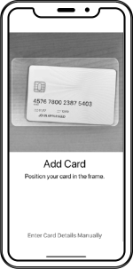](iOS_IAV_01_scan_card_number.png) <br /> 1. Scan or enter card number|<span style={{color: 'green'}}>■</span><span style={{color: 'yellow'}}>■</span>green and yellow paths <br /> [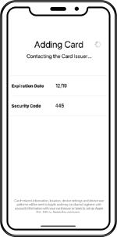](iOS_IAV_02_exp_cvv.png) <br /> 2. Enter expiry date and CVV | <span style={{color: 'green'}}>■</span><span style={{color: 'yellow'}}>■</span>green and yellow paths <br /> [](iOS_IAV_03_read_accept_T&C.png) <br /> 3. Read and accept T&C<sup> [1](./CGU_Apple_Pay.pdf) [2](CGU_Google_Wallet.pdf) [3](CGU_Samsung_Wallet.pdf)</sup>|
|:---|:---|:---|
| <span style={{color: 'yellow'}}>■</span> yellow path only <br /> [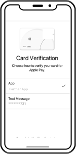](iOS_IAV_04_choose_verification_method.png) <br /> **4. Choose verification method <br /> (call center, in-app, OTP SMS)** | <span style={{color: 'yellow'}}>■</span> yellow path only <br /> [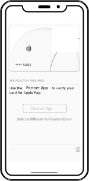](iOS_IAV_05_open_partner_app.png) <br /> **5. Open partner app** | <span style={{color: 'yellow'}}>■</span> yellow path only <br /> [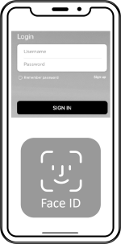](iOS_IAV_06_log_in_partner_app.png) <br /> **6. Log in to the partner app** |
|<span style={{color: 'yellow'}}>■</span> yellow path only <br /> [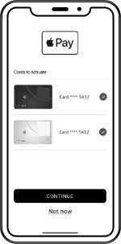](iOS_IAV_07_choose_which_cards_to_activate.png) <br /> **7. Choose which card(s) to verify** |<span style={{color: 'yellow'}}>■</span> yellow path only <br /> [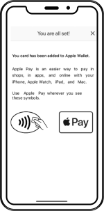](iOS_IAV_08_confirmation_message.png) <br /> **8. X-Pay Enrollment confirmation message** |<span style={{color: 'green'}}>■</span><span style={{color: 'yellow'}}>■</span>green and yellow paths <br /> [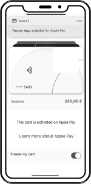](iOS_IAV_09_confirmation_notification.png) <br /> **9. X-Pay Enrollment confirmation notification** |


Please note that step 4. must include in-app and OTP SMS (only applicable if partner wants to allow for Mac Book enrollment. In this case, Partner must integrate webhook 26 and must implement an SMS server).

Please note that step 4. must include in-app and OTP SMS (only applicable if partner wants to allow for Mac Book enrollment. In this case, Partner must integrate webhook 26 and must implement an SMS server).

### Sequence diagram (green path)

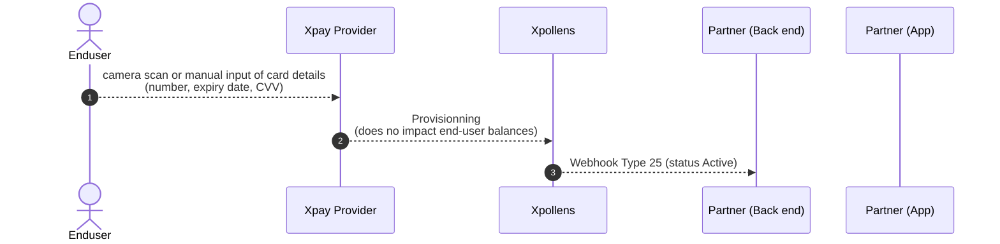

### Sequence diagram (yellow path)

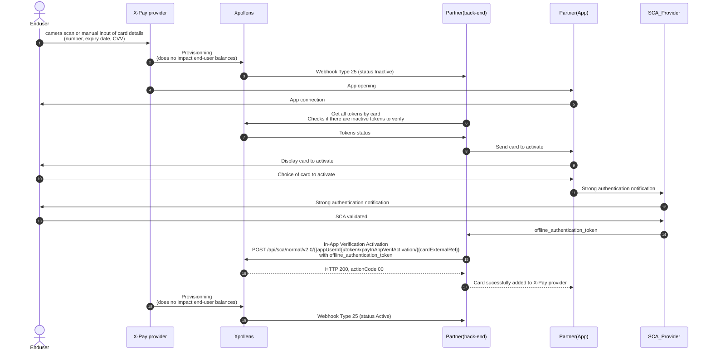


### In-App Verification Activation

This endpoint is useful only for Yellow flow. It must be called by the partner back end only if the user is strongly authenticated and approves the process.

`POST /api/sca/normal/v2.0/{{appUserId}}/token/xpayInAppVerifActivation/{{cardExternalRef}}`

Header

| Field | Format | Required(Y/C/O) | Settings | Description |
| --- | --- | --- | --- | --- |
| offline_authentication_token | string | Y | header | The proof of authentication (or JWS) should be transmitted in the header of the request and described as follows:  <br/>Key = offline_authentication_token  <br/>Value = authentication proof |

Request Body:

```json
{
"tokenReferenceID": "string",
"tokenRequestorID": "string"
}
```

Read more about In-App Verification Activation here: [API Reference - Cards - Xpay](https://docs.xpollens.com/api/xpay/#post-/api/v2.0/token/-cardExternalRef-/xpayInAppVerifActivation)

<br/>

* * *

## Token status diagram

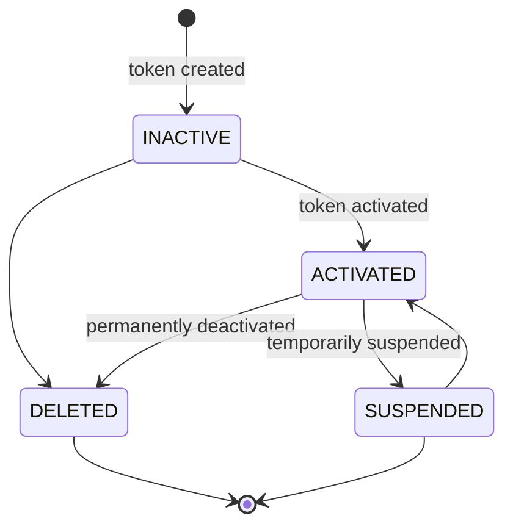

The token status changes to SUSPENDED if:

- the card is temporarily blocked

The token status changes to DELETED if:

- the card is deleted from the wallet
- the card is opposed

<br/>

* * *

## General rules

A card can be added to the wallet as soon as its status is **ACTIVATED**.

If a token is not activated within 30 days of its creation, its status changes to **DELETED**.

During provisioning, VISA creates an authorization on the associated card. This authorization does not impact the user's balance and is not visible to either you or the end user.

In case of multiple tokens to activate, we recommend differentiating them by:
- Displaying the type of device used for enrollment
- Displaying the enrollment date. Note that our endpoint does not return this value. If needed, you have to integrate it when receiving the callback 25 with status "INACTIVE".

 <br/> 

* * *

## Apple pay in app verif

For apple pay, the information needed by Xpollens are:

- the mobile banking app id, which is the team id + the bundle id
- the deeplink which redirect the enduser to the process in app verification (in your app)

 <br/> 

* * *

## Samsung & Google pay in app verif

For Samsung and Google pay, the information needed by Xpollens is the app bundleId.

Then the following actions have to be taken into account:  
1- create the activity a2a in your app 
2- use this activity to redirect the enduser to the in app verif process  
3- redirect the enduser to the wallet

Find more details in these websites:  
https://developer.samsung.com/pay/ID&V/implementing-app2app-id&v.html  
https://developers.google.com/pay/issuers/tsp-integration/app-to-app-idv

 <br/> 

* * *

## How to test

The Xpay can **not** be tested in sandbox.  
As a consequence, first tokenisation are processed in production, on whitelisted PANs.

  
<br/>
<br/>

* * *

## Flow 2: Enrollment from partner app

This flow is also known as **In-App Provisionning** or **Push Provisionning**.

### User journey

This flow starts **from the partner app**. The cardholder clicks on a button and no further interaction is needed from them. Xpollens recommends you implement this method for partners ordering virtual cards.

| [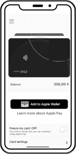](iOS_IAP_01_add_to_apple_wallet.png) <br /> 1. Add card to X-Pay Wallet | [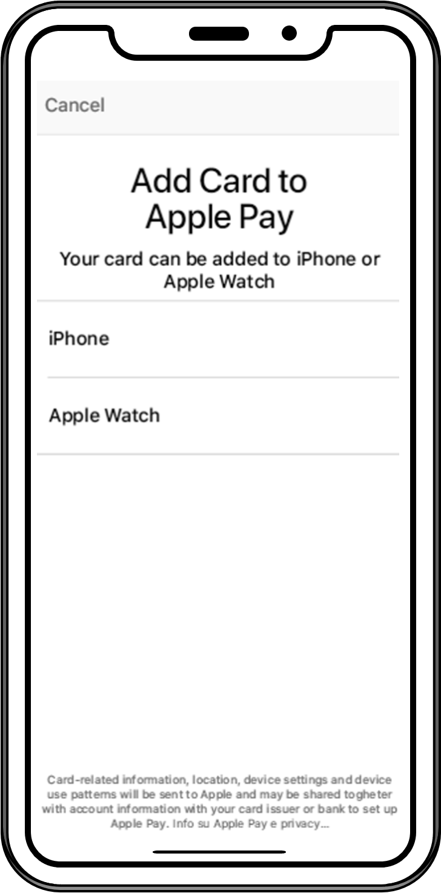](iOS_IAP_02_choose_device_type.png) <br /> 2. Choose device type <br /> (only smartphone and watch support this flow) | [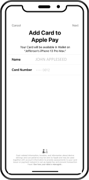](iOS_IAP_03_confirm_add_to_apple_wallet.png) <br /> 3. Confirm add card to X-Pay Wallet | [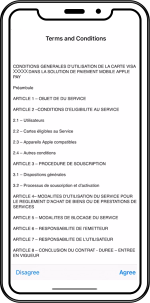](iOS_IAP_04_read_accept_T&C.png) <br /> 4. Read and accept T&C<sup> [1](CGU_Apple_Pay.pdf) [2](CGU_Google_Wallet.pdf) [3](CGU_Samsung_Wallet.pdf)</sup>| [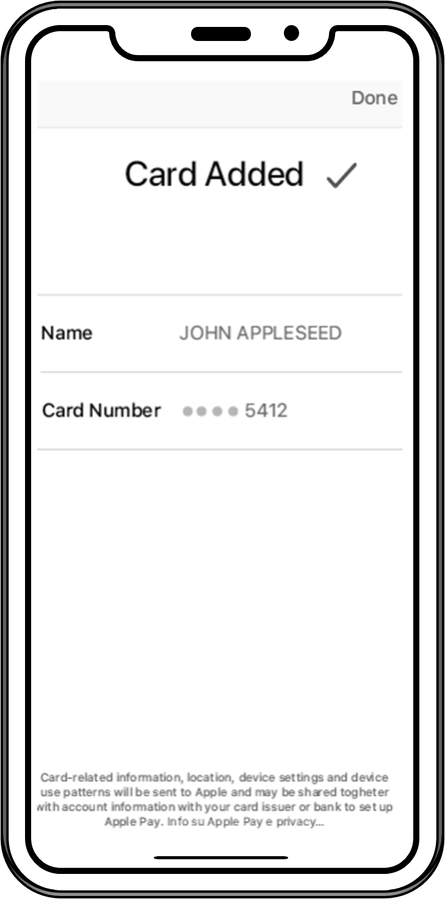](iOS_IAP_05_card_added_to_apple_wallet.png) <br /> 5. Card added to X-Pay Wallet |
|:---|:---|:---|:---|:---|

### Sequence diagram

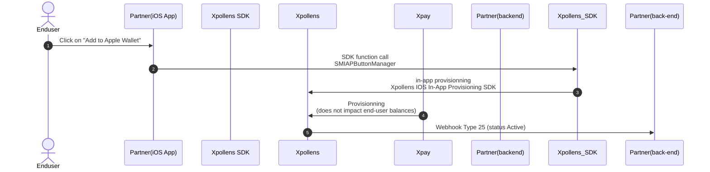

Please note that Step1 is done with an SDK (software Development Kit) provided by Xpollens.

* * *

### Get all tokens by card

This endpoint retrieves the list of tokens for a specific card.

It must be requested in Flow 2 (enrollment from partner app), see sequence diagram above, message number 5.

`GET /api/v2.0/token/card/{cardExternalRef}`

Response Body:

```json
[
    {
        "tokenValue": "4642353030722754",
        "tokenReferenceId": "DNITHE382003555876588856",
        "tokenRequestorId": "40010030273",
        "tokenExpiryDate": "11-2023",
        "tokenState": "ACTIVATED",
        "tokenType": "SECURE_ELEMENT",
        "tokenDeactivationDate": null,
        "tokenUpdateDate": "2020-12-28T16:54:50.6544932",
        "deviceInformation": {
            "secureElementId": null,
            "deviceType": null,
            "deviceNumber": null
        }
    },
    {
        "tokenValue": "4642353030898951",
        "tokenReferenceId": "DNITHE382003555876588857",
        "tokenRequestorId": "40010030273",
        "tokenExpiryDate": "10-2023",
        "tokenState": "INACTIVE",
        "tokenType": "SECURE_ELEMENT",
        "tokenDeactivationDate": null,
        "tokenUpdateDate": "2020-12-28T16:56:46.0778228",
        "deviceInformation": {
            "secureElementId": null,
            "deviceType": null,
            "deviceNumber": null
        }
    }
]
```

Partners should check the response body: for `"tokenState": "ACTIVATED"`.

Then filter out only tokens having `"tokenType": "SECURE_ELEMENT"` (Apple Pay) or `"tokenType": "HCE"` (Samsung Wallet, Google Wallet)

Partners should display the push provisionning button (see below) only if there are no active X-Pay token associated with the card.


More information regarding this endpoint in the [API reference](/api/Xpay)


<Endpoint apiUrl="/v2.0/cardxpay" path="/api/v2.0/token/card/{cardExternalRef]" method="post"/>

<Cta
  context="doc"
  ui="button"
  link="/api/Xpay"
  label="Try it out"
/>

<br/>

## Webhook Type 25

This Webhook is useful for all flows.

Xpollens sends this Webhook to partners in case of a token status change.  
Partners should act upon `"status": "A"` and ignore any other values.

```json
"id": "integer",              // internal Id, e.g. 637877811699419000
"reference": "string",        // card reference, a.k.a cardExternalRef or appCardId
"type": "integer",            // Webhook type, always equals to 25
"secureElementId": "string",  // deviceID, e.g. "44125A3342A80014272043036932204E3F73BB08847E90B"
"tokenValue": "string",       // token value (internal use only), e.g. "4642353030549437"
"tokenReferenceID": "string", // token unique Id, e.g. "DNITHE382003555876588856"
"tokenRequestorID": "string", // indicates the X-Pay provider: 
                              // * "40010030273" (Apple Pay)
                              // * "40010043095" (Samsung Wallet)
                              // * "40010075001" (Google Wallet)
"status": "string",           // token status:
                              // * "I" (Inactive)
                              // * "A" (Active)
                              // * "S" (Suspended)
                              // * "D" (Deleted)
"messageReasonCode": "string",// useless for partners, e.g. null or "1400" (token created)

```


  <br/>
  <br/>

* * *

## FAQ

### FAQ1: Can I tokenise my card on multiple device?
Yes. You have one token per device used.

### FAQ2: If an enduser tokenises its card on multiple device, how can I differ them?
Our application does not saved the type of device used. As a consequence, you must created a link on your own between the device, the deviceInformation and the token.
