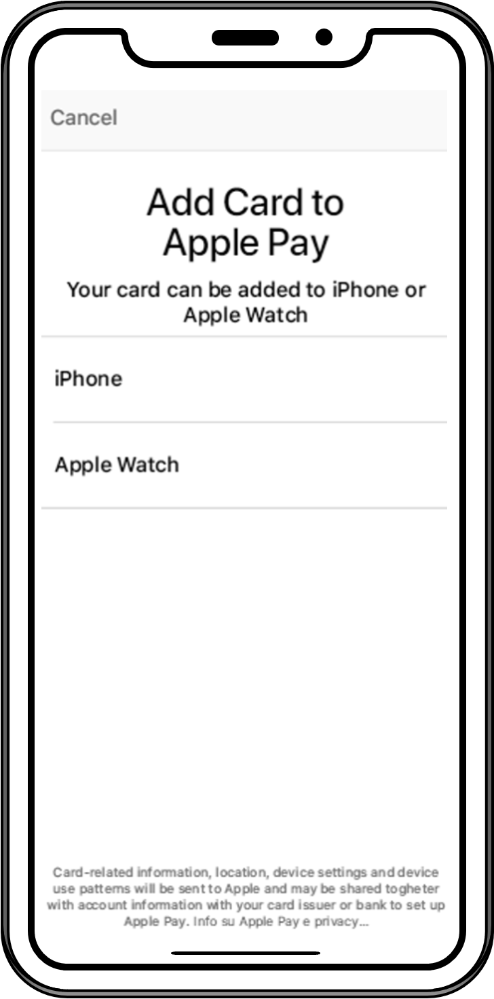

import Image from '@theme/Image';
import Highlight from '@theme/Highlight';
import Endpoint from "@theme/Endpoint"
import Cta from '@theme/Cta'

# In-App Provisionning Xpollens SDK

The first step of In-App Provisionning must be done using an SDK (software Development Kit) provided by Xpollens.
The technical documentation below explains how to download, install and use the SDK.

## Download

Contact your customer integration manager.

## 1.Introduction

This document is intended for app developers on the iOS platform (smartphones and tablets).  
The SDK, which is explained in this document, allows app developers to quickly and easily add card-provisioning feature to their applications.  

## 2.Before you begin

Check that you have the following before you start the implementation:

- Request access from Apple
- The latest version of the Xpollens In-App ProvisioningSDK
- Your iOS app must request an STS Token according to the following sequence: [](https://mermaid.live/edit#pako:eNp9kt1LwzAQwP-VcE8OutGv2S0Pg8FERMRhfRAplNDcXLBNapo669j_btZurjoxD-FyH7-7y90WMsURKFT4VqPMcCHYi2YFaU8i93fJtBGZKJk0ZGlliXpeluc2cR-n8eL23PBUqjxHWaXxY_yPdb68Sa-ZwQ1rEtn5ndINZ7M-hpKHfcGVIRcbYdYkywVKkwruHMUKM41m0HH6oUOLOnEpsSryqF7xr5SHlijhjWSFyFieN6TU6l1w_B148O0X2uvIIhRhklgV0T9K_8YMwIECdcEEtwPZ7qkJmDUWmAC1IscVq3OTQCJ31rUuuUVfcWGUBmp0jQ6w2qi4kdnx3fkcZgp0xfLKau23A93CB1A_Go3DKIqm3sQPJ54bONAA9cbu6DKYRJ7v-mEQRkG0c-BTKUtwR9NJEPre1PeiwHVDb9zinltjlxPbiu66tWq3a_cFZTHJlg)

## 3.Request access from Apple

You will need to submit a request to enable your developer Team ID for the appropriate Apple Pay In-App Provisioning entitlements.  
Note that Enterprise Team IDs are not supported.  
Provide your app name, Team ID, and Adam ID via e-mail to apple-payprovisioning@apple.com.
Once the entitlements have been granted, you’ll need to include the distribution entitlement into a provisioning profile and ensure you are leveraging the same profile to develop the app within Xcode.  

Please follow these steps:

1. Head to the Apple Developer Website and proceed to login
2. Select Certificates, Identifiers & Profiles
3. Select “Distribution” underneath the “Provisioning Profiles” heading on the sidebar  
4. On the right, select the distribution iOS provisioning profile that you'll use to deploy your App to the App Store  
5. Click “edit" and, from the ensuing entitlements drop down, select “Apple Pay In-App Provisioning Distribution” to add the entitlement to the profile.  


6. Once you’ve generated a profile which has been assigned the entitlement for In-App Provisioning, within Xcode, head to the Preferences > Accounts > (Your Account) > View Details pane where you can then find and download the profile you generated. Lastly, in build settings, you can then adjust the Provisioning Profile to the newly generated profile.


## 5.Preliminary steps

There are two preliminary steps that you need to perform to get started with the SDK:

1. Import the SDK into your project
2. Set up the SDK

After you perform these steps, you will be ready to start implementing the core SDK functionality.

## 5.1 Importing the SDK into your project

1. Add the SMInAppProvisioningSDK.xcframework file to your project.

2. Check the build phases of your target.


## 5.2 setting up the SDK

The SDK must be set up and initialize before use all his features.
All SDK features requires a **valid Xpollens access token**.

### 5.2.1 SDK Registration

The SDK must be initialized by calling the method `initWithPartnerAccessToken` of the `SmoneyInAppProvisioning` class.

The **Access Token** must be specified at this point. In the following example, it is configured in the `application:didFinishLaunchingWithOptions:` method of the AppDelegate class.

```objc
#import <SmoneyInAppProvisioning.h> 
…
- (BOOL)application:(UIApplication *)application didFinishLaunchingWithOptions:(NSDictionary *)launchOptions {

[SmoneyInAppProvisioning initWithPartnerAccessToken:@"token"
config:[SMIAPConfiguration defaultConfiguration]];
    return YES;
}
…
```

Note: your back-end must obtain a JWT from Xpollens STS Server (OAuth 2.0 protocol). Replace value `"token"` with the JWT.

### 5.2.2 Enable log

Enable/disable **log**: No sensitive information such as credentials, tokens, etc. should be logged to the Console log facility. All logging code was **disable by default in release version** to ensure that no information is leaked via the logging mechanism or source files.

<u>Method</u>: `setDebugMode:`

Default value: debug mode (enabled) / **release mode (disabled)**

```objc
#import <SmoneyInAppProvisioning.h> 
…
- (BOOL)application:(UIApplication *)application didFinishLaunchingWithOptions:(NSDictionary *)launchOptions { 
[SmoneyInAppProvisioning setDebugMode:YES];
[SmoneyInAppProvisioning initWithPartnerAccessToken:@"token"  config:[SMIAPConfiguration defaultConfiguration]]; 
    return YES;
}
…
```

There are some optional features that are enabled by default.

### 5.2.3 Configure the SDK (optional)

The SDK exposes configuration options to the developer. Additional configuration can be done with the `initWithPartnerAccessToken:config:` method.

Example:

```objc
#import <SmoneyInAppProvisioning.h> 
…
- (BOOL)application:(UIApplication *)application didFinishLaunchingWithOptions:(NSDictionary *)launchOptions {

SMIAPConfiguration *configuration = [SMIAPConfiguration defaultConfiguration]; configuration.enableDebugDetection = YES;

[SmoneyInAppProvisioning initWithPartnerAccessToken:@"token" config: configuration] ;
    return YES;
}
…
```

There are some optional features that are enabled by default.

#### 5.2.3.1 Debug

Enable/disable **debug detection**: Outside of development, releasing apps with **debuggable enabled is discouraged** as it allows connected computers to access and debug the app.

<u>Parameter</u>: `enableDebugDetection`

Default value: debug mode (disabled) / **release mode (disabled)**

#### 5.2.3.2 Security

Enable/Disable **jailbreak detection**: Outside of development, it's unlikely that your app should be running on an emulator as it allows connected computers to access and debug the app.

Parameter: `enableJailbreakDetection`

Default value: debug mode (disabled) / **release mode (enabled)**

Enable/Disable **emulator detection**: Outside of development, it's unlikely that your app should be running on an emulator.  

Parameter: `enableEmulatorDetection`

Default value: debug mode (disabled) / **release mode (enabled)**

## 6. Implementation of the principal SDK functions

This section describes how to configure SMIAPButtonManager with your payment pass information and add your payment pass. Code examples are also provided.

### 6.1 SMIAPBUTTONMANAGER

#### 6.1.1 Initialization

The **SMIAPButtonManager** must be initialized by calling the method

```objc
[initWithCardHolderName: @"" primaryAccountSuffix: @""
            primaryAccountIdentifier: @"" cardID: @"" 
    delegate: delegate sender: delegate]
```

Request parameters - Registration API:

|  Name  | Type  | Description |
|  :---: |  :---:|  :---      |
|cardHolderName | String | The name of the person as shown on the card. **Required** |
| primaryAccountSuffix | String | The last four or five digits of the card’s number. **Required** |
| primaryAccountIdentifier | String | A primary account identifier, used to filter out pass libraries. **Optional** |
| cardID | String | The id of the card to proceed with the enrolment process. **Required** |
| delegate | SMIAPButtonManagerDelegate | Indicates the protocol used to get add pass events. **Required** |
| sender | UIViewController | Indicates the UIViewController used to present the PKAddPaymentPassViewController. **Required** |

Sample code:

```objc
@implementation ViewController … 
SMIAPButtonManager* manager; 

   - (void) onAddPass {
 
        // Initialize manager with pass configuration 
        manager = [[SMIAPButtonManager alloc]
    initWithCardHolderName:@""
primaryAccountSuffix:@""
primaryAccountIdentifier:@""        cardID:@""
delegate:self        sender:self];
[manager addPass];
    }
```

#### 6.1.2 Add payment pass

Once you’ve initialized the SMIAPButtonManager you can then add your payment pass by calling the method `addPass`.

Sample code:

```objc
#import "SMIAPButtonManager.h"

- (void) onAddPass {
  // Initialize manager with pass configuration
… 
// Start add payment pass 
[manager addPass];
```

### 6.2 Front-end

#### 6.2.1 Overview

Once the user taps on **“Add To Apple Wallet”** button the In-App Provisioning interface will prompt. This workflow is out of control of Xpollens In-App provisioning SDK.

Be aware that according to Apple In-App Provisioning Guidelines, the **“Add To Apple Wallet”** button should be displayed only if the card is doesn’t exist on Apple Wallet or Apple Watch. The verification is not handled by the Xpollens In-App provisioning SDK.

Apple also suggests replacing the **“Add To Apple Wallet”** button with text such as **“Added to Apple Wallet”** or **“Available in Apple Wallet”** in case the card already exists in Apple Wallet.

#### 6.2.2 Frontend Workflow

**Device Selection Screen:**

The user must select which device the card will be added in. In case the user has just one available device this screen won’t be presented.



**Confirmation Screen:**

The user must review the information and tap “Next” to proceed.


**Terms and Conditions Screen:**

The user must review the Terms and Conditions and tap on “Agree” button to proceed.


#### 6.2.3 Callbacks

The **SMIAPButtonManager** uses **SMIAPButtonManagerDelegate** methods to convey important events that can occur during the life cycle of the application.

This protocol lets you implement the following methods:

- `didFinishWithSuccess:(PKPaymentPass*)pass:`, called when request has been made successfully.
- `didFinishWithError:(NSError*)error:`, called when an error occurs in the process.

Sample code:

```objc
#import "SMIAPButtonManager.h"
@interface ViewController: UIViewController <SMIAPButtonManagerDelegate>
…
@end
```

```objc
@implementation ViewController
- (void)didFinishWithError:(NSError *) error {
…
}
- (void)didFinishWithSuccess:(PKPaymentPass*) pass {
…
}
@end
```

Error Code description:

| Name  | Type | Description |
| :---: | :---:| :---------- |
|SMIAPAddPaymentPassErrorUnsupported|1|The app cannot add cards to Apple Pay.|
|SMIAPAddPaymentPassErrorUserCancelled|2|The user canceled the request to add a card to Apple Pay.|
|SMIAPAddPaymentPassErrorSystemCancelled|3|The system canceled the request to add a card to Apple Pay.|
|SMIAPErrorCodeUnknwonError|4|Unknown error|
|SMIAPErrorCodeInvalidParameter|5|Invalid parameter used on request.|
|SMIAPErrorCodeCardNotFound|6|The card could not be found.|
|SMIAPErrorCodeCardEnrollmentDenied|7|Enrollment denied|
|SMIAPErrorCodeInvalidToken|8|Invalid token.|
|SMIAPErrorSecurityCheck|9|Did not pass on security error detection.|
|SMIAPErrorMissingResponseProperty|10|Could not find property from enrollment response.|
|SMIAPErrorCouldNotCreateNSData|11|Could not create data from enrollment response.|
|SMIAPErrorCouldNotDecodeValue|12|Could not decode value from enrollment response.|
